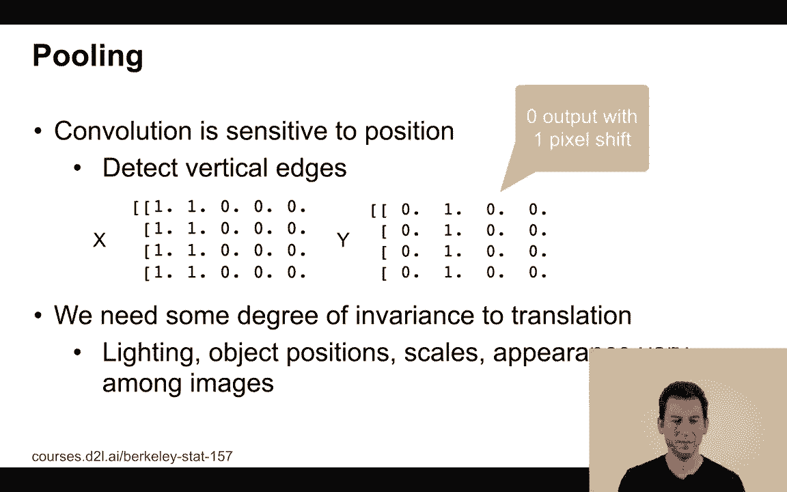
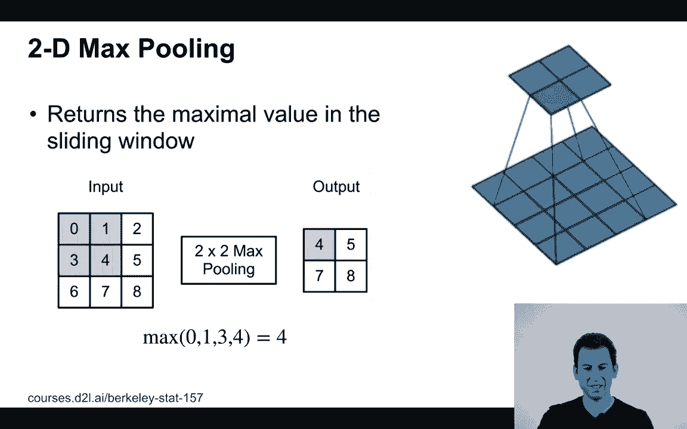

# P59：59. L11_8 池化 - Python小能 - BV1CB4y1U7P6

我们关于卷积层的最后部分是池化层。因此，池化实际上是一个非常简单的操作，可能看起来更容易理解。让我们来看一张图。在这个例子中，确实是一个非常原始的图像。它是一个5 by 4像素的图像，左边两列是1，剩下的部分全是0。

如果我现在应用边缘检测器，我会在第2列找到一个边缘。所以，如果我将图像向左或向右移动1个像素，那么这个边缘也会移动1个像素。这听起来似乎不多，但如果我希望以后能得到一些具有平移不变性的特征，那么显然，如果我的特征都依赖于位置，就无法实现这一点。

它们完全依赖于它们发生的具体位置。因此，我们需要一些机制来提供对平移、光照、物体位置、尺度、外观等的 invariance（不变性）。

这正是池化派上用场的地方。那么我们来看2D最大池化。最大池化的操作如下：它接受一个输入。例如这里是一个2 by 2的小块。我们只取这个小块中的最大值，然后将窗口向右移动一个单元。然后再执行相同的操作，如果我们进行2 by 2的最大池化，我们会得到一个。

将3 by 3的输入转换为2 by 2的输出。因此，尺寸方面的语义与我们之前通过卷积看到的完全相同。不同之处在于，我们不再是进行乘法和加法，而是取最大值。或者，如果我有一张4 by 4的图像，并且在3 by 3的窗口上执行最大池化，那么我将得到一个2 by 2的输出，这正是我们右侧看到的。

所以你可以看到，在前面的例子中，假设我们有一个垂直边缘检测器。我们执行卷积，现在2 by 2的最大池化对1像素的位移变得具有容忍性。

这正是我们想要的。现在，如果你想确保通过池化，输出不会真正改变，或者可能改变得很有定义，那么你可以使用与之前相同的填充和步幅方式。首先，在输入和输出通道方面，它们是相同的，因为你是按通道进行池化的；在步幅方面。

其实，这只是取决于你在应用窗口之前，移动了多少像素。没有可学习的参数，但例如，如果我想保持图像的大小不变，那么我可以使用3 by 3的最大池化，并在两边填充1个像素，这样就能得到相同的输出。好了，如果我这么做。

这是一个3 by 3的池化，事实上，我从中得到了一张更小的图像，因为我使用了2的步幅。所以这是1的填充和2的步幅，这会降低图像的分辨率。

除了最大池化，还有平均池化。平均池化的做法是你简单地在该窗口内对感兴趣区域的像素进行平均。所以这是一个非常常见的操作，大家都知道。例如，如果我用相机拍摄一张高分辨率的图片，然后想要减小。

解析度，我可能会降低图像的分辨率。现在，照片处理软件实际上执行的是平均池化操作，它在更大范围的像素上进行平均。这在90年代早期的卷积网络中被广泛使用，但随着技术发展，逐渐发生了变化。

从平均池化到最大池化的转换可以提高准确性，这也是现在大家普遍使用**平均最大池化**的原因。唯一的例外是在最后一层，当你执行全局平均池化时，你实际上会将它们加在一起。我们将在接下来的讲座中详细讨论这一点。

[BLANK_AUDIO]。
