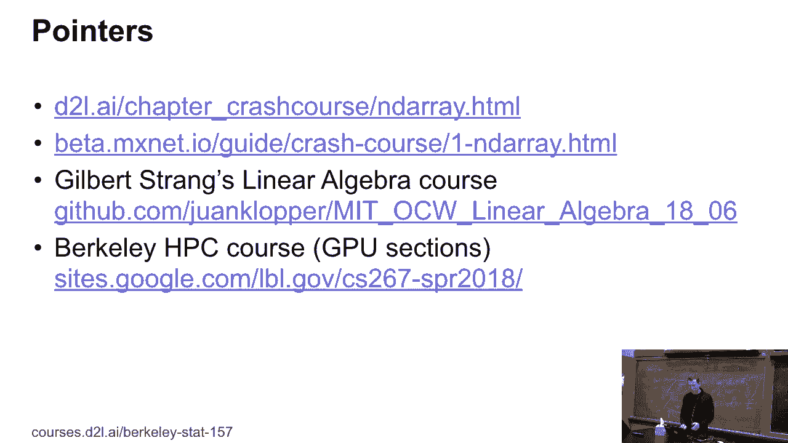
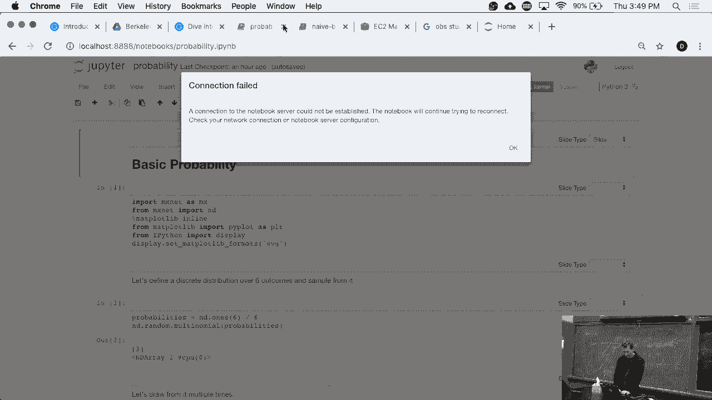
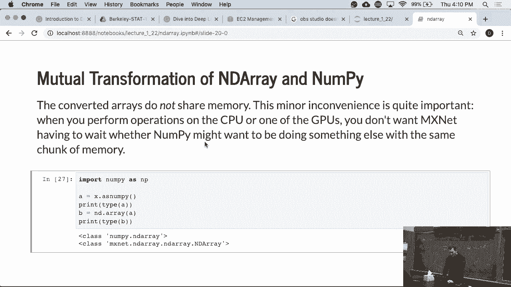

# P6：6. L2_1 NDArrays - Python小能 - BV1CB4y1U7P6

 Okay， so welcome to the second lecture。 Apologies for the delay。 So we wanted to make sure that hopefully this time we。 actually get the proper recording working before that。 It was only the camera and not the slides and that's not very， useful。 We'll fix and update the recording from Tuesday very。 very shortly and we'll get it up probably on the weekend。 But there was ICM， that line yesterday。 so everybody was， a bit busy。 Okay， so two things that we didn't quite cover on Tuesday。 One thing was in the array because some people ask me。

 in a memory allocation and all of this and I'll walk you， through the details for that。 The second thing is， as it turns out， not everybody has an， AWS account just yet。 So I'll walk you a little bit through how to launch。 machines and AWS because I had a couple of people coming。

 in in office hours and asking how to do it and I'll walk。 you through the details of how to launch things。 And yeah， apologies， I've got a bit of cold。 So we did the linear algebra part on Tuesday。 Today we'll dive a little bit more deeply first into how。 those vectors are actually stored in MXNet。 So quick review here。 Well。

 a scale that's just a zero-dimensional array， vectors of one-dimensional。 two-dimensional array might be， rows of features。 So for every observation。 you have a row of attributes。 Now， three dimensions， well， you can get it by having a。 black and white movie or you could have， for instance， a color image。 In that case。

 you have maybe your 1024 by 768 pixels， resolution and then the three color channels， RGB， but you。 could have other color coatings as well。 Before dimensions， well， you could have many of those。 images。 So the fourth dimension would then be the batching order。 And if you want to push it further to five dimensions， well， you get videos。

 So I guess that should be all fairly straightforward and， self-explanatory。 It just gets supremely awkward to display this on slides beyond， five dimensions， so we stop here。 Any questions about tensors and arrays so far？ Just what they are。 So don't get scared if somebody tells you about mass with， tensors。

 They're doing very simple things and making it sound， complicated sometimes。 OK。 What we could do is you could create an array like a， 3 by 4 matrix。 You could fill it with any random entries。 And part of the homework actually will be to create like a。 4096 by 4096 array。 So you can access elements as you would。 I mean。

 this is the exact same thing as you would see in， NumPy。 You can access an element。 You can access a row or column。 You can access a sub-block by indexing appropriately， or。 then you can have index fields appropriately。 So it's very straightforward。 I'll walk you through this in detail。 Couple of things-- so we'll look at that in the。

 Jupyter Notebook。 So first of all， there are actually a couple of， documentations。 First of all。 the NDRA chapter in our book。 Then on the MXNet website， go to beta。amxnet。io。 The search there actually works。 You can look at the crash course for NDRA's。 You can also look at functionality there。 If you're not super sure about linear algebra， dual-but。

 string has a very nice class。 You might want to revisit this。 Unfortunately。 we don't have enough time to cover it in a， lot of detail。 But if you're not quite sure about linear algebra， you， should probably do this anyway。 Some people asked about how our GPUs designed and TPUs， and。

 how they all relate to each other and other accelerators。 This is actually， again。 a little bit beyond the scope of， this class to go into it in a lot of detail。 For now， essentially。 think of GPUs as a device， which， allows you to perform large numbers of linear algebra。 operations very， very cheaply。 And to some extent， the purpose of a deep learning。

 framework like Glueon is to shield you from the， nitty-gritty of actually having the right-cuda code。 That increases your productivity probably by a， factor of 10 to 100。 If you still care about details， there's actually a nice， graduate-level class， an HPC course。 And look at the slides on GPUs。 I think they are quite accessible， even if you're not。

 enrolled in a PhD program just yet。 Lots of pictures。 Actually， very nicely explained。 Go through this。 This might give you a bit of an idea of what makes， GPUs special。 So with that。 let's look at some notebooks to see whether。

 this works。

 OK。 OK。 Just hold。 And he's in the array。

 Let's just run everything。 So the first thing you would do is you would import the。 deep learning framework of your choice in this case here。 It's MXNet。 And we'll import NDRA as ND just because it's supremely， awkward， otherwise to type it all the time。 And the simplest thing you can do and recover that last。

 time already is you can just create a vector of numbers， going from 0 to 11。 So it's the equivalent of the range command just that it's， called a range。 That's a vestige from NumPy。 And you can ask what the shape is。 And if you were to type in x dot shape， you'd get 12。 And if you were to type in x dot size。

 you'd also get 12。 The reason being that x dot size counts the total number of， entries。 X dot shape will give you， for instance， if it's a 3 by 4， matrix， it'll give you 3， 4。 And if it's a 12-dimensional vector， it'll give you 12。 So then you can reshape things。 That's exactly what we did here。 Let's actually just do this。 And there you go。

 If you print now x dot shape， it'll return 3， 4， with that's， exactly the shape that you gave it。 Whereas if I were to execute x dot size， it'll tell you 12， which is what you would expect。 Now。 if you wanted to reshape it into something that has， three dimensions in the first。 and you don't care about the， rest， you'll just write minus 1。

 And just make sure that you don't have to calculate all， the dimensions。 And you basically let the framework do the rest。 So if you do that。 nothing changes because Bluhan is， smart enough to figure out the rest by itself。 OK。 Now。 a couple of things。 If you run indeed dot empty， it'll just effectively do a， malloc。

 It'll grab some part of memory。 And if that memory is uninitialized， there'll be。 whatever there is to it。 So in this case， we got luck。 It's all series。 but you could have arbitrary stuff in there。 So only do that if you really show that this is what you。 want and that you're going to overwrite it with something， sensible right away。

 Do not run indeed empty。 And then just assume that they're all zeros。 This would be a wonderful way of introducing bugs in your， code。 It would be something of a Heisenberg where maybe in your。 debugger you don't even find it because it might actually， give you clean memory or not。

 So really think of this as malloc。 The much more sensible thing is to allocate zeros。 In this case。 you know what it is。 If you wanted to allocate ones， you could do that too， which， is here。 Indeed。 that ones will give you ones。 This is all fairly straightforward。 And if you have a specific array。 it doesn't quite show up， on the screen entirely。 Fix that。

 You can specifically allocate an array by just specifying， what should be in there。 This is how you can call the constructor。 We might want to generate a random entry。 As a matter of fact， that's part of the homework。 So in the random normal， we'll give you a。 normal distribution entries。 Theoremene unit variance。 And 3 by 2， as I said， 3 by 4。

 So if I were to run this again， the entries would look， obviously very different because， well。 it's a random， number generator。 I can do all the usual operations with it， so I can add， subtract。 multiply， and divide。 I could even exponentiate。 So let's do that。 And unless we have something weird， okay， there we go。 This is now x to the power of y。

 That operates on the entire array。 Any questions so far？ Hint。 That operation is something that you'll need for one of， the home works。 The other thing that you'll need is a broadcast operator。 Also， exponentiation can work this way。 sine， cosine， a， lot of other functions。 Now， of course， you can write a dot product。 And so。

 for instance， you have a 3 by 4 matrix， and then you， have another 3 by 4 matrix。 and you take an inner product。 And since you have that transposed， so x dot t is， the transposed。 you'll get a 3 by 3 matrix out of it， which， is very unsurprising。 This is exactly what linear algebra would suggest。 Just again， word of caution。

 only if you invoke dot， you're， going to get matrix or matrix vector of whatever products。 If you just write the star， you're going to get element， wise multiplication。 So this is different from MATLAB。 Be careful。 So our star is the MATLAB dot star。 Our plus is the MATLAB dot plus， and so on。 You can combine multiple India rays。 Well。

 it's very straightforward。 Well， you concatenate them。 And if you do that， well。 you get different objects out of， it， so I should probably be printing this， such that you。 can see the difference。 And that didn't work， because I probably missed with x and y， before。 That's why。 So what I did before is I reshaped x。 So now I'd have to figure out what the shapes of x and y are。

 And see？ Of course， in this case， if I concatenate them since it's， only a one-dimensional vector。 the second thing doesn't make， any sense。 But that's just because I didn't set up a--。 so this will work just fine。 So you can concatenate vectors， which is boring， but you。 can do that for any array。 Any questions so far？ I mean， this should be all be--， yes？

 What's the best way to add a second dimension to make it， 4 by 1， so just 4 of comets？

 I could do this。 I could--， so I could， for instance， have x 4，1。 I think that will work。 Shape equals probably。 Now I would， of course， have to do the same thing for y。 So there we go。 And now if I were to concatenate it along the second dimension。 what do you think we are going to get？ OK， I'll get a 4 by 2 matrix。 No， I actually get an error。

 Oh， yes。 Of course I do。 Yep。 And now if we do this--， yep。 So it turns out it's quite easy to be stupid in front of， your laptop。 OK， good。 So then we can do other things。 We can check for equality。 And this way we get another matrix out of it， which just， checks the entries。

 And if x and y were matrices before， you'd get this。 But since I overrode this before。 I'm not going to， re-execute this code right now。 And if we did this， we'd get probably lots of。 series out of it。 You can use that for indexing and other things。 You can sum over things。 That's fairly straightforward。 You can sum along certain dimensions。 Again， for the very details。

 please also have a look at the， in-the-array documentation on the MXNet website。 So go to beta。amxnet。io。 There's the very specific call signature， but it's， fairly straightforward。 Then the last thing is， of course sometimes you want to， move back to Python land。 So you can just convert things as scalar。 And that turns things into--， so if you were to print--。

 then in one case you'd see in the in-the-array， in the， other case you would see the number。 So it's the same value， but it just in one case it's in， the array。 and in the other case it's just a single number。 OK。 Good。 Now the infamous broadcast mechanism。 Let's say I have a three-by-one matrix， aka vector， and， I have a one-by-two object。

 So that's what they look like。 So if I wanted to multiply or add or do something with them。 then what the broadcast mechanism will do--， and it's important here that the number of。 dimensions are the same。 It'll just replicate things according to the dimensions。 So if I were to combine them， A plus B， I'll get the。

 three-by-two object where the first and the second entry， respectively are repeated。 So the easiest way to think about what that means， it's， like an outer product in linear algebra。 So remember， you have the inner product x transpose y。 But if you have x-- well。 y times x transpose， right， then， rather than a scalar， you get an entire matrix。

 And except that for only multiplications， which is what， you do in linear algebra。 you can do that for a lot of other， operations like addition， exponentiation， or whatever。 This is a very quick way of generating large objects， without a single for loop。 So that makes your life easy。 This is probably the conceptually hardest thing of all， of this。 OK。

 any questions here？ OK， well then， let's move on to the next thing in slicing。 And that does exactly what you want。 It picks out the appropriate rows。 And you can read things。 You can write them， as you would expect， right？ And you can do that for entire rows or columns。 So for instance， here I pick the first two rows， all the， columns， and set them to 12。

 And it does exactly what you would expect it to do。 OK。 Now。 here's where it gets a little bit more interesting。 So suppose I do this。 Then， OK。 so I can look at the--， effectively the point that Python has to y。 And if I write y equals y plus x， then， well， the point is， before and afterwards， are different。

 We could actually print this out， just in case。 You're curious。 And so you'll see that the references are different。 So what's happened is basically Python went。 and in， this case， ImageNet， went and took the memory locations for， x and y。 added the values together， put this into a new， location in memory， and then this was assigned to y。

 and then， of course the risk gets the reference and is gone。 But yeah。 That's not a big deal if you have 5x5 matrices。 It's a huge deal if that matrix uses half of your GPU。 memory because you may run out of memory before you can even， compute this。 OK。 So we need some fix。 So one thing you can do is you can simply say that。

 explicitly you want to assign the outcome x plus y to the， location z。 And while this is kind of a notational convention， but， that's basically what you get。 By z colon。 you say， well， I want that memory location， then， ImageNet will happily write into that location again。 If you do that， well， you get the same pointers。 There's a useful other function。

 It's called zeros like， which basically means create another， object with the same shape as y。 but with all zeros。 And this is often useful if you want to have， for instance， wait-step match。 some data or something like that， and you， automatically want--。 you want to make your code smart such that no matter what， input you throw at it。

 you get the right weight vectors。 You can initialize the weight vectors with zeros like or。 ones like or other tricks like that。 OK。 Now， this is kind of nice， but it's still not quite nice。 Because what it actually does is it allocates memory first to， compute x plus y。 and then it assigns it to z。 So this is still going to use about twice as much memory， as it should。

 We should be able to do all of this directly in place。 So the way how you can do it directly in place is you。 essentially invoke things like elementwise add and so on。 And those operations force--。 it makes it to be very， very memory efficient。 So I'm mentioning this because this will be useful for。

 your homework。 And with that， we are--， almost done。 Last thing is we can use plus equals。 so that makes it， a little bit nicer to use。 So that actually takes care of a lot of these operations。 OK。 Last thing， you may sometimes need to move code from--， or data from NumPy to NDRA and back。 For instance， you might have some data load code， some。

 pre-processing code written in NumPy or a side pi。 And then once you have that data。 you want to push it into， MXNet and process things。 And so it's very simple。 You just execute as NumPy or you invoke the constructor with， the NumPy element there。 Question for the programming languages or Python experts， among you。

 Why can I not invoke simply the NumPy。array of X？ Why can I not say a equals NumPy。array of X？

 Why can I not invoke the constructor with the NDRA， argument？ Yep？ [INAUDIBLE]， Your spot on。 So NumPy has absolutely no idea of what MXNet is。 So why should it have any idea of what to do with an。 NDRA object？ And so our pre-Numpai is completely out of its steps， when it gets a weird object。 So we need to make it easy for NumPy。 And that's why we need to provide that functionality in， NDRA。

 Now， one important detail there。 As you do this， basically the world stops。 Or rather at least。 Python stops。 And nothing else happens while Python is busy moving things。 from MXNet land to NDRA land or vice versa， to NumPy land， and vice versa。 Now。 that's not a big deal if you do this once or twice。 But if you have an entire vector。

 this will slow down， your operations a lot。 In one of your home works， it's going to be to measure。 exactly how horrible this is。 Now， before you think that this is trivial， data point。 somebody who just this year became assistant professor。 at a very nice university essentially made this mistake， a few months ago。

 And then he came to me and asked， why is my code so slow？

 So it's one of those bugs that are obviously in hindsight。 And this is the case not just for MXNet。 but it would run， into similar issues with basically phytorch or TensorFlow， and others。 Because those behave essentially like a foreign world。 to Python and therefore converting data between two。

 different systems like Python and essentially the deep running。 framework will trigger a global interpreter lock， and then you run into trouble。 So you want to minimize that。 Any questions so far？ Yes？ [INAUDIBLE]， No， it's--， [INAUDIBLE]。 So yeah， so basically， indeed。array will actually do the。

 right thing because we added that functionality to， indeed。 Right， so because the indeed。array constructor can take， numpire's arguments。 But the converse would require a modification on the numpai。 end。

 So with that， let's look at something。