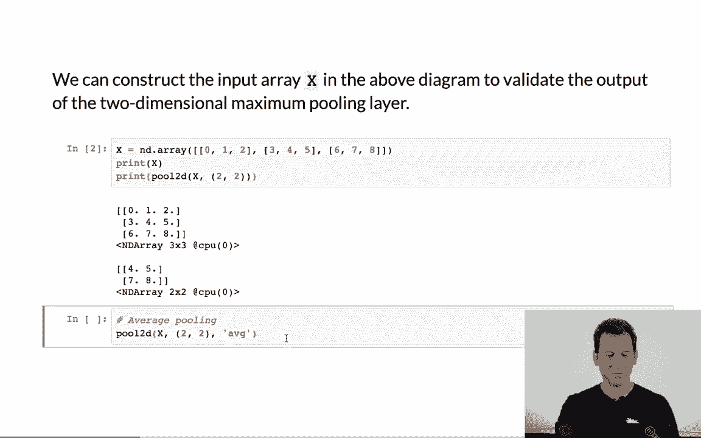
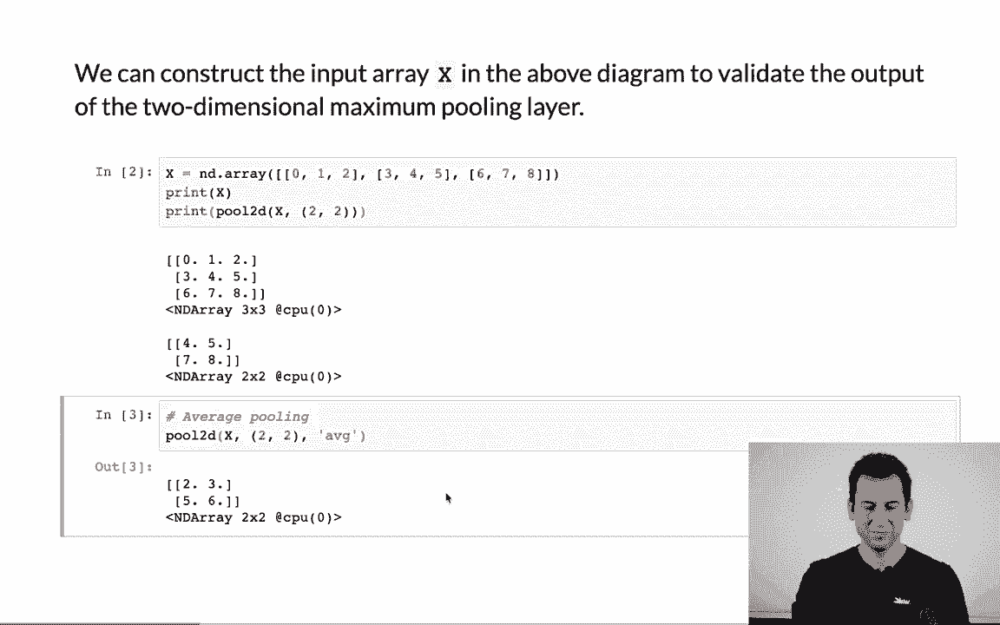
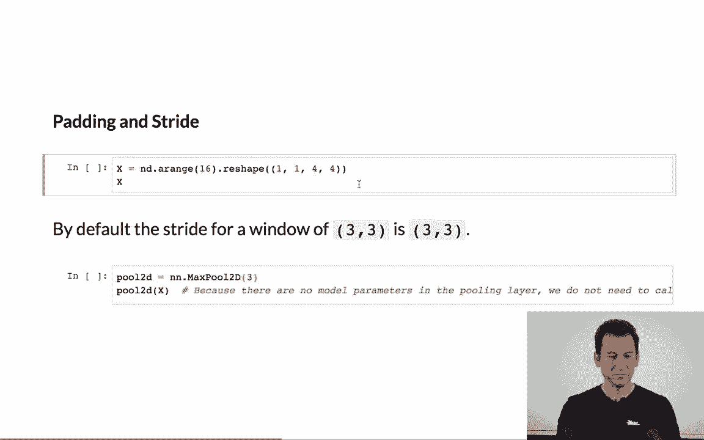
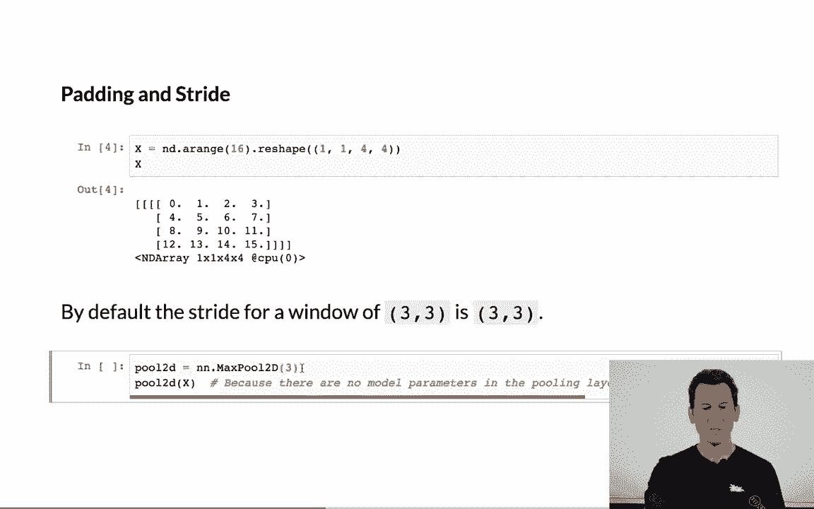
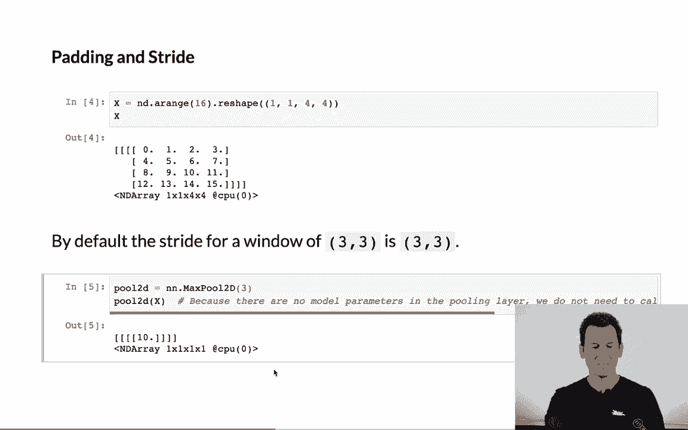
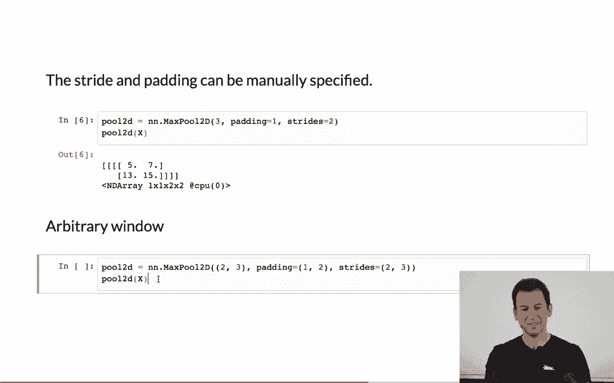

# P60：60. L11_9 Python中的池化 - Python小能 - BV1CB4y1U7P6

让我们看看池化在实践中的效果。所以首先我们需要做的是定义我们的池化函数。这非常简单。好了，我们需要导入MXNet。接下来，我们定义我们的池化函数。重要的参数是池化大小，所以我需要得到高度和宽度。

通过查询池化大小。我将区分最大池化和平均池化。默认情况下是最大池化。首先，我需要做的是分配一些内存。这个内存的大小是通过对输入X进行池化计算得到的。所以我需要的是X的形状减去池化高度再加一，宽度也做相同的处理。

所以它与我们在卷积操作中使用的语义完全相同，只是没有参数。然后我只需遍历输出中的所有像素。因此，对于范围内的i和j，我现在执行以下操作。Yij是这个区域内的最大值。这个区域从i到i加上8倍池化高度，从j到j加上池化宽度。

如果我使用均值池化，那么就是这样。现在这是一个非常糟糕的池化实现，因为它完全忽略了通道，同时也忽略了填充和步幅。但由于这只是为了说明问题，我在这里跳过这些细节。

所以让我们看看会发生什么。我们将对这个包含0到8的矩阵应用2x2最大池化。当然，如果我选择第一个2x2的块，那么最大值就是4，因为它包含了0、1、3和4，依此类推。现在，如果我使用平均池化，那么结果也会非常相似。

所以，对于这个第一个块，0、1、3和4，所有条目的和是8。8除以4是2。如果我取条目1、2、4和5，它们的和是12，所以结果是3。依此类推。这样就可以了。让我们看看如果做一些稍微复杂的操作，结果会怎样。

接下来的事情是我们可能需要考虑填充和步幅。

所以我要创建一个4x4的矩阵，条目从0到15。现在，如果我执行最大池化并使用内置的功能gluon，那么默认情况下，如果使用的是3x3池化，那么步幅也是3。因此，如果我应用这个4x4矩阵，实际上只有第一个3x3的块可以被提取。

所以输出将是1x1。

看，这就是发生的事情。请注意，条目是10，因为在第一个3x3块中，最大值就是10。好的。

现在，假设我想实际改变这个。

好吧，我可以比如说使用填充为1，步幅为2，在这种情况下，因为我把3x3应用到4x4的矩阵上，实际上得到了一个6x6的矩阵。但接着使用步幅为2，这样我就会得到一个2x2的矩阵作为结果。我可以使用任意大小的窗口，宽度和高度不同，填充和步幅也可以不同。

我会把这个留给每个人自己去验证，在他们自己的安静环境中，结果实际上会是一个3x2的矩阵。所以3行，2列。是的，我可以这么做，因此可以以任意方式重塑结果。请注意，输入和输出通道的数量保持不变。

所以我们来做这个吧。我要创建一个矩阵，它有，嗯，3，实际上它有2个通道。

对，所以基本上这是我的4x4矩阵，只不过在一种情况下，我的条目是从0到15，另一种情况下是从1到16。

好的，现在如果我再次应用池化操作，使用填充为1，步幅为2，3x3的池化，我仍然得到2个输出通道。

由于第二个通道的所有条目都像第一个通道一样都为1，因此，我得到了精确的5，7，13和15，然后对于下一个1，6，8，14和16。这正是预期的结果。所以正如你所看到的，池化是一个非常简单的操作。它易于应用，且可以用来操控图像的维度，以根据需要减小它们的大小。

这就结束了我们关于卷积层的讨论。

