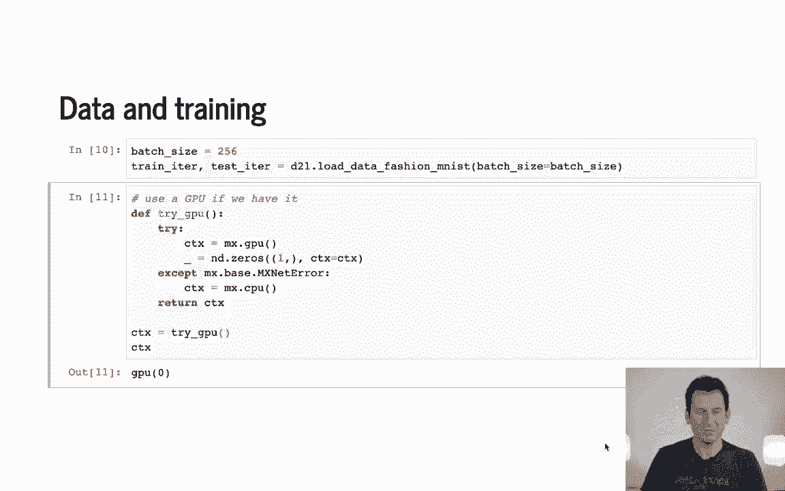
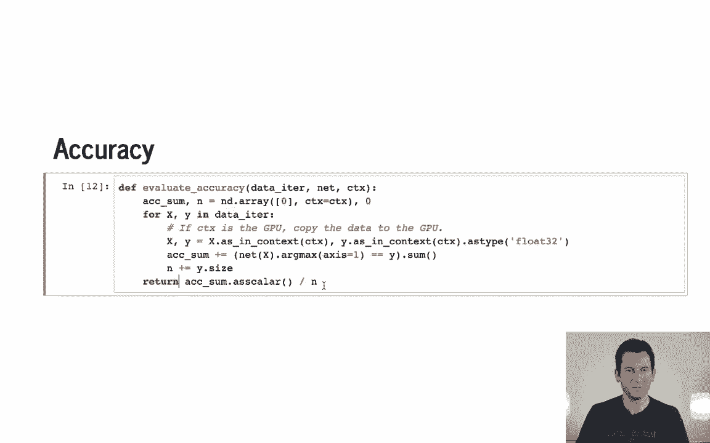
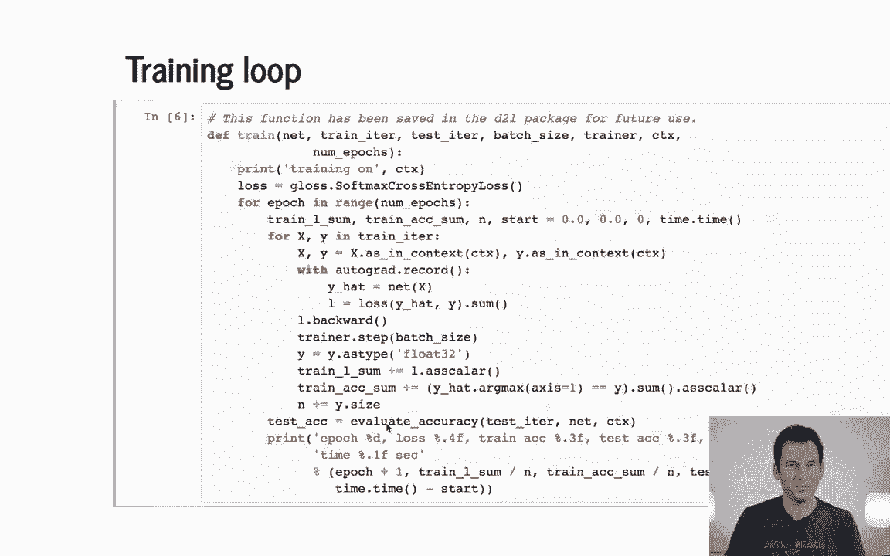
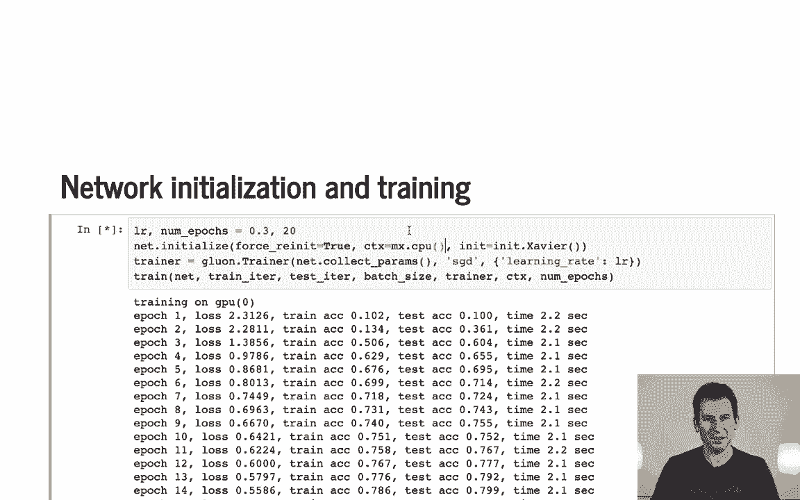
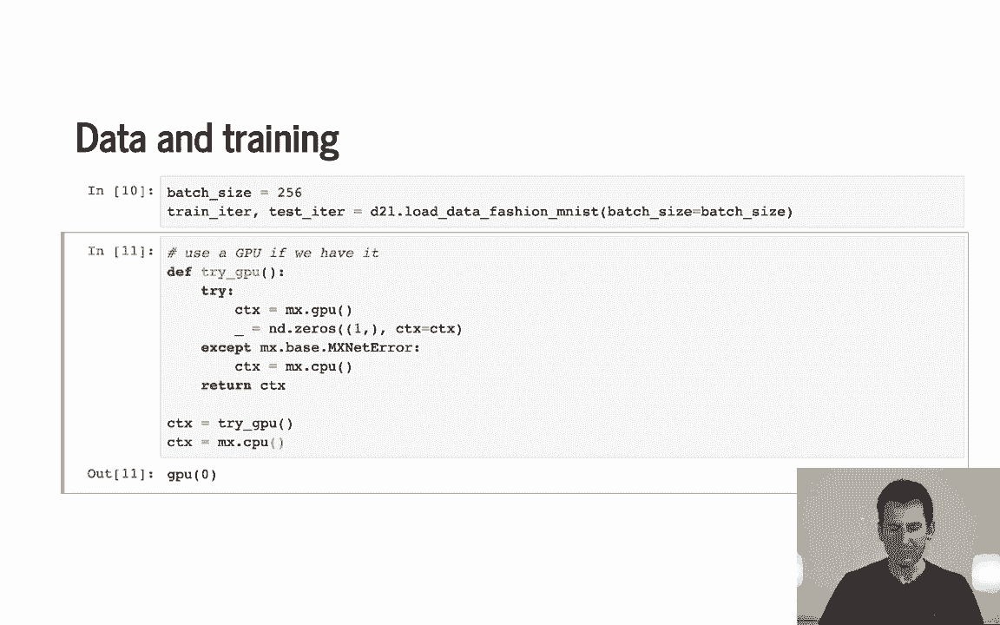
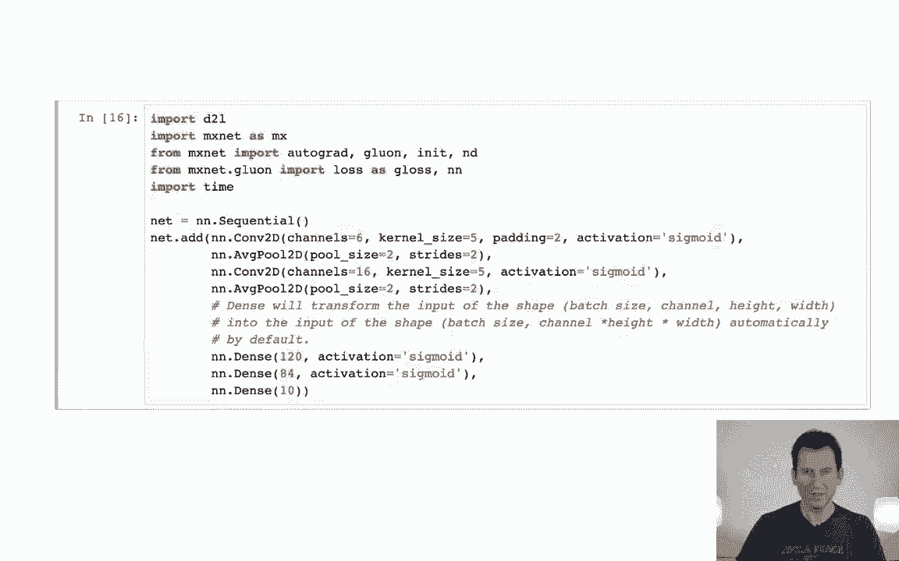
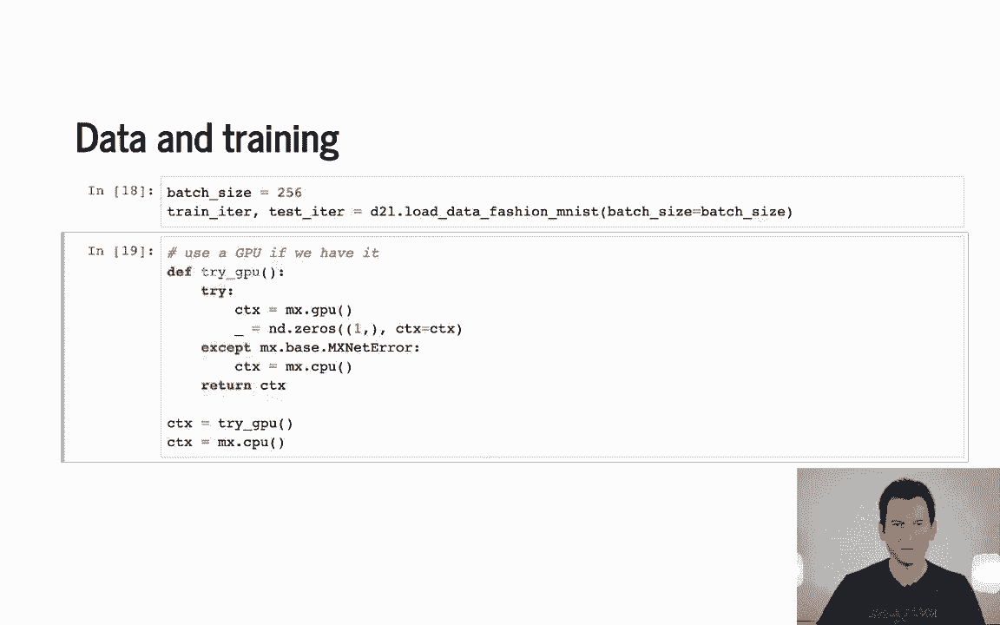
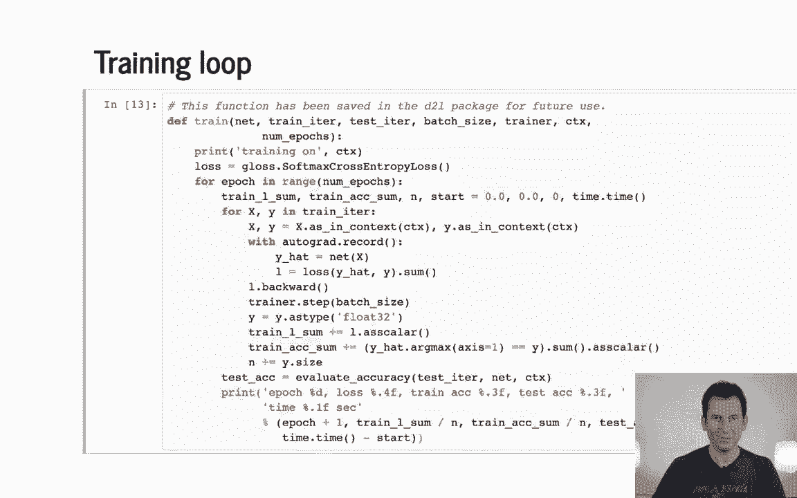
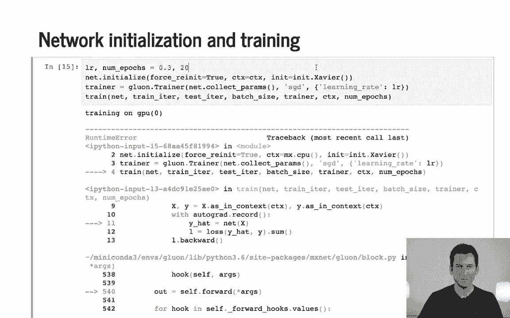

# P62：62. L12_2 LeNet in Python - Python小能 - BV1CB4y1U7P6

让我们来看一下如何实现Lynette。再来复习一下，这就是我们要实现的架构。首先是源图像，卷积，池化，再一个卷积，再一个池化，最后是几个全连接层。我们需要做的第一件事是……

我们需要实际导入MXNet和所有相关的库。然后我们需要定义我们的网络。我们之前在幻灯片中已经看到过这个内容，不过这里再给大家复习一下。所以我们有6个通道的2D卷积，卷积核大小为5x5。平均池化，再一个卷积，再一个平均池化。

而且全连接层实际上会自动识别正确的宽度、高度等等。所以你不需要做任何像是展平（flatten）的操作。所以你有一个全连接层，另一个全连接层，然后最终你会得到一些输出。这就是Lynette的完整定义。那么接下来我们需要定义并观察会发生什么。

实际上，如果我们将一些数据输入到网络中。好了，我们开始吧。所以我们输入一个28x28像素的图像，由于我们有适当的填充（padding），接着我们得到六个28x28的通道。然后我们进行池化，得到14x14。另一个卷积将其减小到10x10。记住，我们有一个5x5的卷积。

然后我们通过池化再次将分辨率减半，接着我们有三个全连接层。这正是我们预期的结果。好了，记住，直到你实际传递一些数据进去，这个过程才会被绑定。所以如果我传递一些看起来不同的数据，比如不是28x28的，那么……

如果这样做的话，结果会看起来非常不同。好了，接下来我们需要一些训练工具。

所以我们需要做的第一件事是需要一些数据迭代器。也就是说，这些迭代器将实际提供数据。所以D2L（Dive into Deep Learning，深度学习入门），加载数据。Fashion MNIST，实际上就是一个方便的函数，用来加载MNIST数据集。我将选择一个相对较大的批量大小，因为图像非常小。

否则我们的池化GPU不知道该怎么办。然后，好的，我们需要检查是否真的有GPU。这样检查很方便，因为如果没有GPU，那么你的代码可能会抛出异常。如果检查代码是否抛出异常，那么这也是确定你是否有GPU的一种方法。

所以这就是为什么你必须使用try，accept，loop，并且在某个地方，你基本上尝试生成一个一维的零矩阵，或者实际上是一个零的数组，只有一个条目。如果这个操作在GPU上成功，我们就知道我们有GPU。如果失败，那么我们就知道，显然我们没有GPU，那么只能是CPU了。然后它就返回一个设备上下文。

对于单个GPU来说，这没问题。

接下来，我们需要一个机制来计算精度。所以评估精度需要三个参数，一个数据迭代器、一个网络和一个上下文。上下文是必需的，因为我需要将数据移到这个上下文中。我们可以看到，它会遍历数据，确保数据在我需要的上下文中是可用的。

所以在上下文中，如果数据不在上下文中，我们将把它移动到上下文中，否则它什么也不做。这里为了方便，我们将所有数据转换为 32 位浮点数。然后我们通过查看网络输出与正确标签匹配的次数来计算精度，并将其求和。

所以，1 减去精度就是误差。然后，当然，你知道，我们还需要递增计数器 n，它统计我们已经看到的观测次数。最后，我们返回精度除以计数值。这是相当直接的。

这就是给我们提供精度估计的方式。

现在我们需要训练循环。它需要网络、数据迭代器、小批量大小、优化算法、设备上下文和训练周期数作为输入。首先，我们告诉它，我们是在 CPU 还是 GPU 上训练。我们需要定义一个损失函数。在这个例子中，你知道，是 softmax。然后我们按我们设置的周期数遍历数据。

我们将一些记录变量设为零，比如训练损失和训练精度。然后我们开心地开始遍历数据集。Y 在训练迭代器中的正确值。所以它遍历训练集。首先，我们将数据移到上下文中。接着我们计算网络的预测值。所以 Y hat 是 net 的 X。然后我们计算对应的损失。

所以那就是损失函数 Y hat 和 Y。我们对其求和。然后我们计算梯度，进行反向传播。接着我们执行一个更新步骤。这是非常直接的。最后，我们会看一下这些标签，Y 值，并查看我们的训练精度，以确保我们也能跟踪它。因此，这做的事情与我们在评估精度时所做的非常相似。

我们在训练集上执行此操作。最后，我们只打印出一些状态信息，显示我们做得如何。所以包括周期数、损失、训练精度和测试精度。就是这样。这是非常通用的代码。

然后你让它运行。所以例如在这里，让我们实际做一下。它的精度大约是 82%，83%。它在 GPU 上运行。你可以看到它相当迅速。现在，这大约需要两秒钟左右来完成一次遍历。如果我想在 CPU 上运行它，其实有个简单的方法可以做到这一点。让我们等它完成。实际上。

我只需写 context 是 mx.CPU。然后看看会发生什么。可能会出现错误，因为网络可能是用其他设备初始化的。

但是我们来看看会发生什么。是的，它的确会抱怨，因为网络是在错误的设备上初始化的。所以，如果我想正确地运行，我就得回去修改我定义设备上下文的地方。

好的。

那我们就从这里开始吧。

然后我们可以再试一次。其实就是为了让大家了解，如果设备不对，处理速度有多慢。

好的，我们找到了这个训练循环。

现在，如果我们运行它，我们会看到在CPU上运行的结果。

这要慢得多。所以记得之前我们花了大约2.3秒来处理数据的一次迭代。即便这个数据集非常非常小，且并没有针对CPU进行优化，它仍然花费了非常长的时间，仅仅一次迭代就需要大约10倍的时间。这应该能让你明白，为什么你更愿意使用GPU而不是CPU。

接下来的步骤是使用一些重量级的YouTube真实网络，如AlexNet。我们将看到对于这些网络，CPU完全无能为力，而GPU才是你真正需要的。

