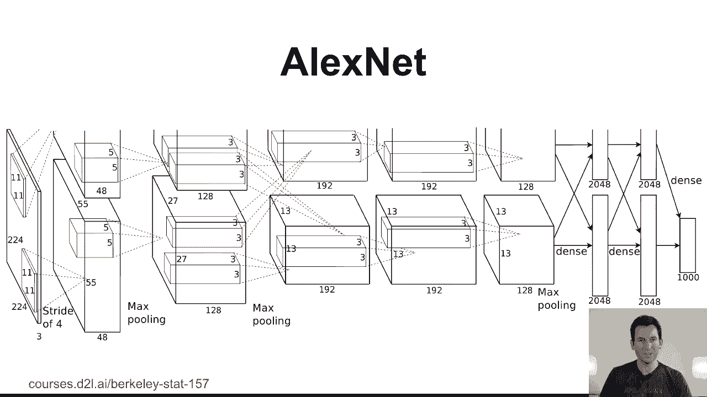
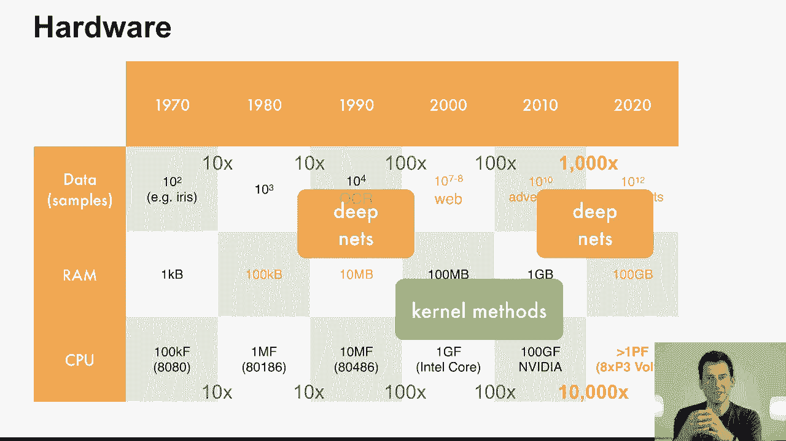
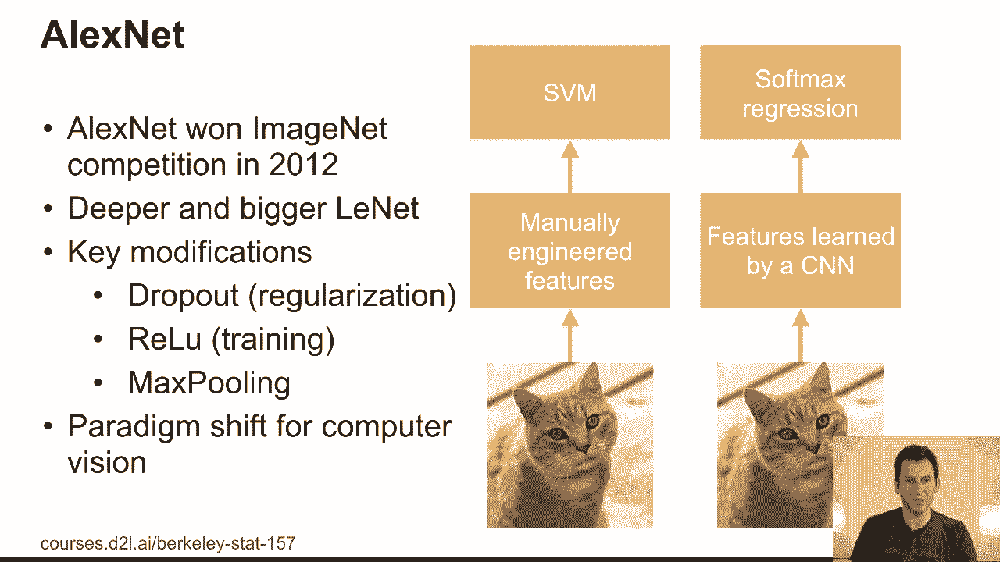

# P63：63. L12_3 AlexNet - Python小能 - BV1CB4y1U7P6

让我们来谈谈AlexNet。AlexNet是以Alex Kreshevsky的名字命名的，这个网络是在2012年提出的。如果你看它，它看起来和LeNet非常相似。事实上，当这个网络第一次发布时，人们并没有真正理解它的内容。毕竟，这就像LeNet，只是大了很多，有更多的卷积层和更多的层次。嗯，仅此而已。

直到AlexNet模型在ImageNet竞赛中大获全胜，人们才开始意识到也许有什么令人兴奋的事情发生了。只有那时，人们才意识到，也许这其中有一些新奇的地方。接下来让我们更详细地探讨一下。

让我们回顾一下历史，具体来说是2001年左右那个时候。所以，核方法是主流。事实上，你可以通过提取特征来设计一个非线性函数类。你会选择你的核函数来计算相似度。然后你会解决一个凸优化问题。接着，你去证明一两个定理，证明事情是最优的、一致的。

生活很美好。计算机视觉也是一样。你可以去设计一个非凸优化问题。他会用相当多的数学来描述一个特定的几何问题如何很好地映射到一个对应的计算机视觉问题中。然后，你解决数学问题，每当现实与你的模型很好地映射时，

数学方法，生活很好，它会奏效。而且，再一次，当你通过凸优化方式解决问题时，这是一个标志性的论文。所以这就是计算机视觉。那时计算机视觉的核心是特征工程，有些人可能会认为，计算机视觉中最有趣的部分是如何设计新的特征。

事实上，如果你设计了一个SIFT或SURF特征提取器，你几乎就成功了。因为这样，你就可以获得终身职位。然后，你要做的就是提取图像中的相关特征点，然后可能对它们进行聚类和合理安排。

然后最终，你知道，你可以通过应用支持向量机来解决这个问题，生活也就顺利了。所以，特征工程是至关重要的，但它也限制了你可以进行的工程化量，因为每当遇到新问题时，你都需要进行额外的特征工程。现在，如果我们回头看，这听起来并不是非常开明。

但是，那个时候人们设计模型的方式有一个简单的原因。让我们来看看不同年代中可用的数据、内存和计算能力的发展。MAF只是将其四舍五入到下一个10的幂次方，因为我们非常关心数量级的差异。因此，数据集的大小直到2000年左右，甚至可能到2010年才开始真正增长。

随着互联网、云计算等的普及，基本上现在可以存储来自大量用户、许多互动和大量实例的数据。这也是为什么数据量从2000年到2010年增加了100倍，从2010年到2020年又增加了1000倍。现在，在内存方面，嗯，事情发生了变化。

没有太大改进，但在计算资源方面，可能在2010年左右取得了突破。当时人们从单核或少数核心的架构转向了大规模多核心架构，如GPU。因此，在此之前，双核或四核架构通常是桌面计算机的标准配置。直到现在，你才开始看到。

能够以合理的价格购买1632核的机器，或者当然，如果你使用云计算，你可以获得最多100个核心，但即便如此，如果你使用GPU，你可能会得到上千个核心。这导致了相应地更高性能的计算。例如，在P3服务器上，你可能会有8个Vulta核心，这样你就能获得超过一千万亿次计算的能力。现在。

有趣的是，深度网络在1990年左右非常流行，当时计算资源虽然存在，但内存非常小，数据集也不大。因此，那时候深度网络在推理时非常有效。然后从2000年到2010年，核方法成为了合适的选择，因为当时的数据集还不是特别大。

可以将核矩阵的非平凡部分存储在内存中。记住，核方法需要一个核矩阵，而这个矩阵的大小通常随着数据量的增加而超线性增长。因此，只要你有足够的内存，并且计算资源不是问题，那么一切都很好。接下来发生的是计算资源的飞跃。所以请记住。

深度网络的第一次成功现代实现是在GPU上完成的，使用了AlexNet。所以那是在2012年。因此，很明显，只有在计算资源可用时，切换到非线性、非凸、计算密集型的设置才变得实际可行。这正是深度网络的特点。现在，让我们来看看数据。于是，ImageNet出现了。

它在2010年发布，当时是一个非常大的数据集，包含120万条示例，1000个类别。与MNIST的6万个观测数据和10个类别相比。此外，分辨率也大大提高，可能提高了1000倍。所以，图像的尺寸从28×28变成了469×384，且图像使用了三个颜色通道，分别是红色、绿色和蓝色，而在此之前我们。

具有巨大的规模。因此，这改变了很多事情。直到2012年左右，当AlexNet赢得ImageNet竞赛时，解决计算机视觉问题的默认策略是选择手动设计的特征。然后你会应用一个SVM。最终，这种方法被自动学习的特征替代，之后再进行。

使用 softmax。但是，AlexNet 不仅仅是更大更好的 Lynette。还有其他几个关键的变化。其中之一是 dropout 正则化，它让人们能够设计更深的网络。随着网络的加深，当然，仅仅对输入进行正则化帮助不大，你还需要对。

网络的内部结构。所以这基本上是应用正则化到网络的所有层，或者至少在多处使用 dropout 时应用，而如果不使用 dropout，你会只是对输入进行平滑处理。第二项是 ReLU，即修正线性单元。换句话说，你用 ReLU 替换了 sigmoid。

非线性进行正则化，通过仅仅使用 x 和 0 之间的最大值，这导致了梯度不再消失，因为至少有一个半空间，其中函数是恒等的。最后一项变化是最大池化，取代了平均池化。这样，结果就是特征变得更加对平移不变，因为你。

现在你可以稍微移动你的特征，最大池化依然能提取相关的特征。这样就导致了计算机视觉中的范式转变，之后，计算机视觉领域发展起来了，紧接着人们开始转向语音识别、自然语言处理、文本生成等领域，深度网络在这些领域之后也证明了其重要性。但是。

它起源于计算机视觉。所以让我们看看架构。在 AlexNet 中，你可以已经看到，输入的方式就很不一样了。所以图像更大，我的意思是，比 32x32 像素还要大，这些只是28x28，外面加了零填充。你有 224x224 的尺寸，R，G 和 B，红色、绿色和蓝色作为通道。接下来是。

使用了卷积，且通道数量大幅增加，从 6 增加到 96。然后，当然。

你知道，池化操作。所以如果你看看网络的主体，再次，你。会看到更多的通道，256与16。所以这是16倍之多。然后你会看到更多的卷积操作。那些卷积确保了你在网络中移动时，能够拥有更强的非线性表达能力。当然，这也让你。

能够识别更多的类别。看看网络的末端，嗯，你处理的是 4096 个隐藏单元，而不是 120 个。那些非线性是必要的，以便拥有足够的信息来处理 1,000 个输出类别，而不是 10 个。所以你可能会好奇，为什么他们选择了 4096，而不是 8000 或 3000。好吧，想法是。

我猜想，如果最终有1000个类别，你需要超过1000个维度来很好地描述它们。而上限自然也受到GPU的大小限制。所以请记住，Alex Net最初实际上必须在两个GPU之间进行拆分，因为单个GPU的内存空间不足。为了实现这一点，做了很多工程工作。

当时，Alex Net的工作是编写代码来同步这两个GPU。现在。

还有一些其他的技巧。其中最重要的一点确实是数据增强。我们来看这张躺着的猫的图片。好吧，Qcat。如果我们裁剪掉其中的一部分，我们依然能够识别出这是一只猫，至少人类是能识别出来的。所以想法是，与你其原始图片进行训练相比，你可以使用这些裁剪出来的部分进行训练。

裁剪后的部分可以用来推断类别。另一个方法是进行亮度、色彩空间等方面的变换。这些方法都能提高对训练和测试图片之间变化的鲁棒性。

现在，总结一下，如果你看一下这些网络的复杂性，嗯，Alex Net要复杂得多。从计算量上讲，它是原来的250倍，而从参数数量上讲只是多了10倍。这是另一个关键变化，计算和内存之间的权衡发生了很大变化。Alex Net实际上也因其。

在内存使用方面相当极端。所以如今，这个比例可能会更多地偏向于计算，因为计算设备变得更快，因此人们更倾向于利用这一点。这实际上是当前正在发生的权衡，因为内存随硅的量扩展，而计算仍然随着硅的量扩展。

计算单元的配置。如果你有更多的计算单元，你就可以从单核扩展到多核，这就是GPU所做的事情，甚至例如可以扩展到阵列处理器，你现在可以在TPU等定制芯片上看到这种结构。这也解释了从Lynette到Alex Net的演变，后者是卷积神经网络的一个更为复杂的版本。

接下来我们将看到如何使这些网络表现得更好，达到更高的准确度，以及如何解决通过简单扩展Lynette所产生的一些问题。

