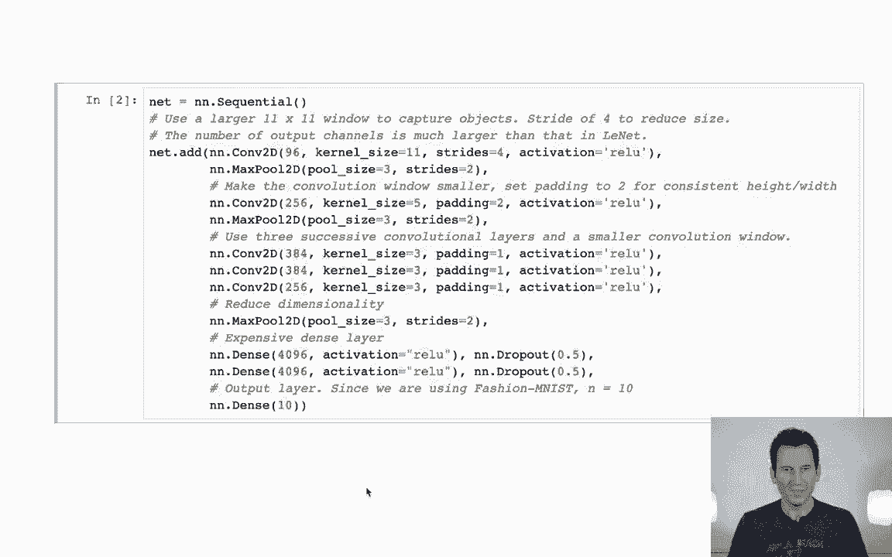
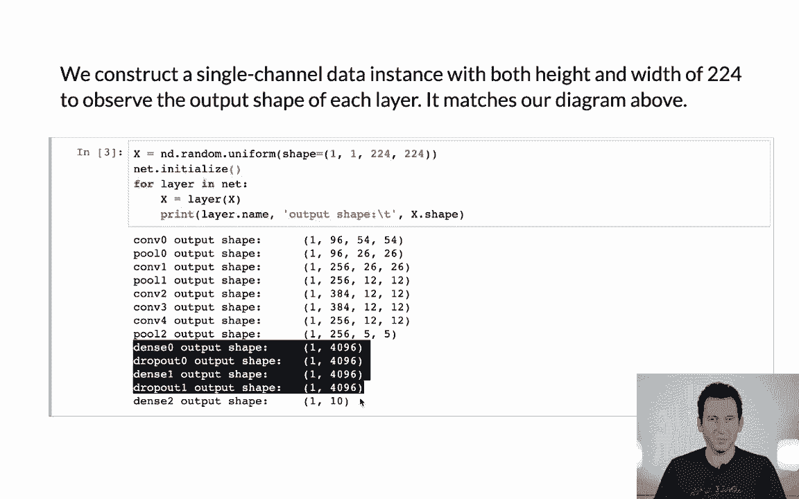
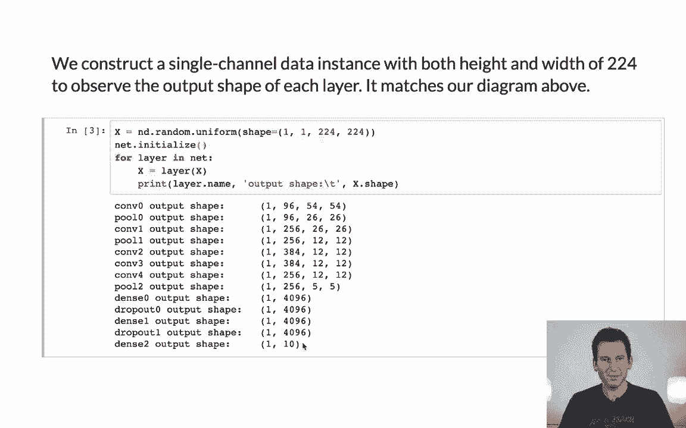

# P64：64. L12_4 AlexNet in Python - Python小能 - BV1CB4y1U7P6

 Now that we looked at the net， let's have a look at AlexNet， which is a considerably。

 more advanced network， and to see how well it works in practice。

 First thing we need is to import the network， all the MXNet tools and so on。 Okay。

 so that's exactly the same as before。 We just get the import blue on and DRA losses， data iterators。

 and then some other convenience， routines。

 Okay， and then we need to define the network itself。 So here's again a simple sequential network。

 We add convolutions， max pooling and other convolutions under the max pooling， then three。

 successive convolutions， then something to reduce the dimensionality again and again with pooling。

 And then the infamous two dense layers and the last dense layer to map it to the ten dimensions。

 because we're not using ImageNet but just Fashion。

 So let's have a look at what this looks like in practice。

 So I'm going to send some data that's of 221 by 224 pixels size。

 I'm going to send it to the network。 And lo and behold。

 I get for the first layer 54 by 54 dimensions， 96 channels， then I get， 26 by 26， 256。

 then I perform max pooling again， so I reduce things， and then come the。

 conv layers， then I have another pooling operation here which reduces it to 5 by 5 and then I。

 have my dense layers。

 So this is what will lead to a fairly significant amount of parameters which then need to be。

 stored and computed over， then the end I get 10 classes。

 So that's AlexNet but in the flavor of 10 outputs。

 First thing that I need， then is my data iterator and that data iterator looks a little。

 bit different from what we saw before because we want to actually resize the images to 224。

 by 224 pixels。 So for that， I need to use data transformers。

 So these are different from the transformers as a layer but they are just transformers for。

 the iterator。 So what I do is I use data by basically gluon data vision transformers。

 So one of the operations they offer is to resize。 I can do another crop in other operations but this resizes it to。

 in this case 224 by 224， then I turn it into a tensor such that I can actually apply any operations to it and for。

 efficiency I compose it。 Now I need to define my data sources。

 That's just the fashion in this training and test of iterators。

 And then I start composing my now multithreaded so number of workers is zero if it's on windows。

 otherwise we need four threads because windows doesn't like multithreading in this case quite。

 so much。 And so now I have basically the MNIST training data。

 I transform that first and then I need to pick a mini batch size and tell it to shuffle， things。

 And that's basically what my data loader does。 So that's that。

 I get exactly the same thing for test data so I have to test the iterator and in the end。

 well I basically return my iterators。

 That's what gets me the data。 Now the trading scripts are exactly identical to what we saw before for Lynette。

 I've just pulled it up here again for reference。 In the Lynette case we saw it in detail but basically to compute the accuracy you move。

 the data onto the GPU as in context right。 And then you check on that device whether the largest value of the output whether that。

 coordinate matches the coordinate you would like and you just aggregate。

 Now for training you do a very similar thing as before。

 You just iterate for a number of epochs over the data set。

 You then go and reset some bookkeeping because you do that initially and then as you go over。

 the training data you go and compute the output of the loss。

 So that's network the output of the loss function。 You then compute the gradient， L。

 backward and you take an update step。 So that's very straightforward。

 Now then in the end you just convert things into scalar and you report it。

 So this is very straightforward。 Note that as we iterate over the data set we compute the training error ongoing as we。

 pass through。 Whereas for the test set we compute the test accuracy after we've done that pass through。

 the data set。

 That'll actually become interesting and relevant as we go along。

 So let's see how that works。 And now it takes a little bit longer。

 So remember before that it was like two and a half seconds to go over the data on Lynette。

 and just for reference on my laptop this would take around one hour to take one pass。

 through the data set。 On the GPU well now it takes about 18 seconds to do one pass through the data set and if。

 we have five seconds so we have to wait for about a minute or so until we see all the results。

 One fairly important detail here。 So the learning rate now is 0。01。

 So that's considerably smaller than what we have before。

 That's due to the fact that as we have a more complex network the learning rate needs to。

 be smaller in order to iterate through the data nicely and to make sure that we don't， average。

 The other interesting thing is that our training error was rather a training accuracy here。

 That accuracy is lower than our test accuracy。 Quite systematically。 And that seems odd right。

 You would expect that the training error is larger than the test error and it's the other。

 way around。 That's due to the fact as mentioned that we compute the training accuracy as we pass through。

 the data set。 So as our classifier gets better well of course you would expect also the training accuracy。

 to get better but since we averaged over the entire pass through the data set and that's。

 a non-trivial part of the accuracy calculation where the test accuracy only computed at the。

 end of one phase you get that the training accuracy is an underestimate for the accuracy。

 that you'll see later。 And okay after five passes we get an error of around 30%。

 So that's not too bad。 In order to do better we'll need considerably more advanced network architectures and we'll。

 do that in the following。

