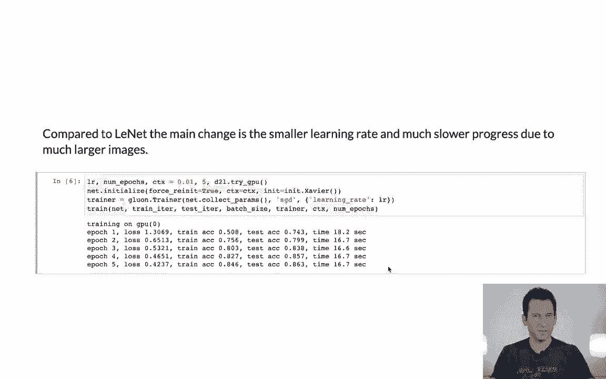
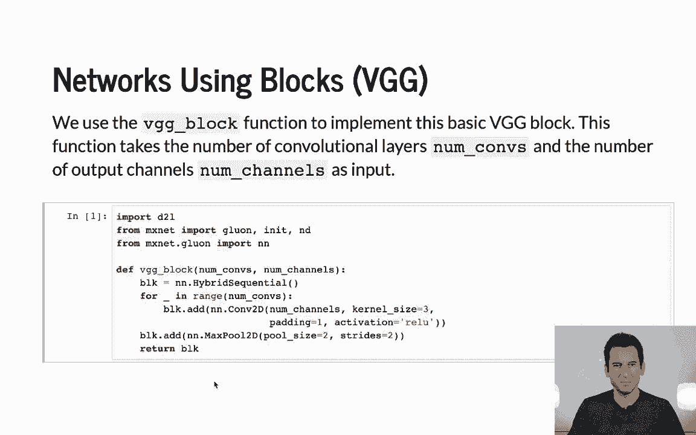
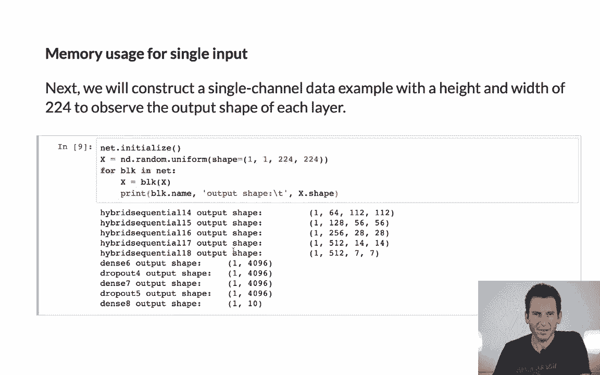
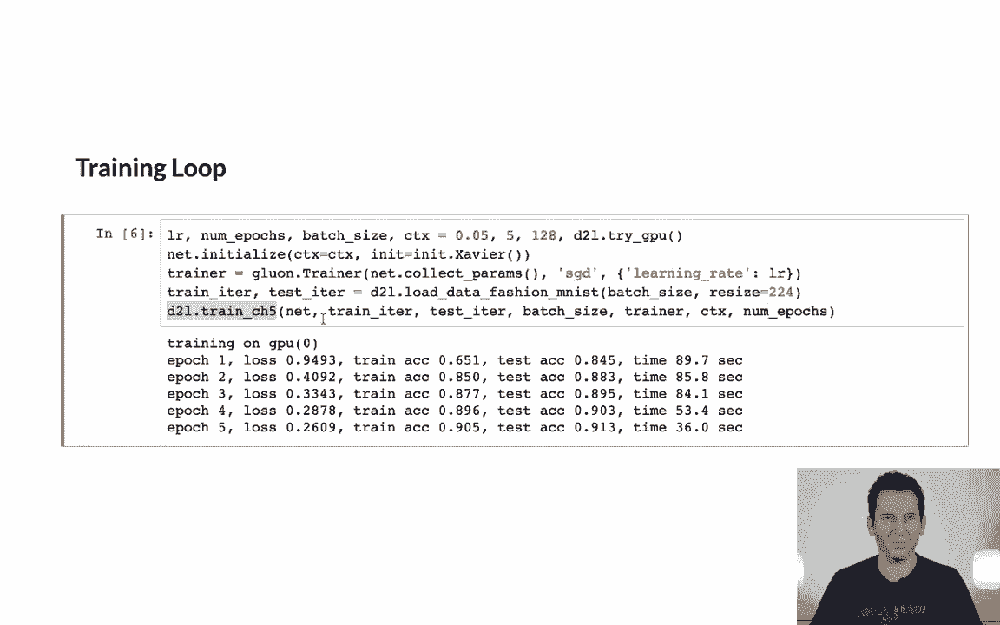
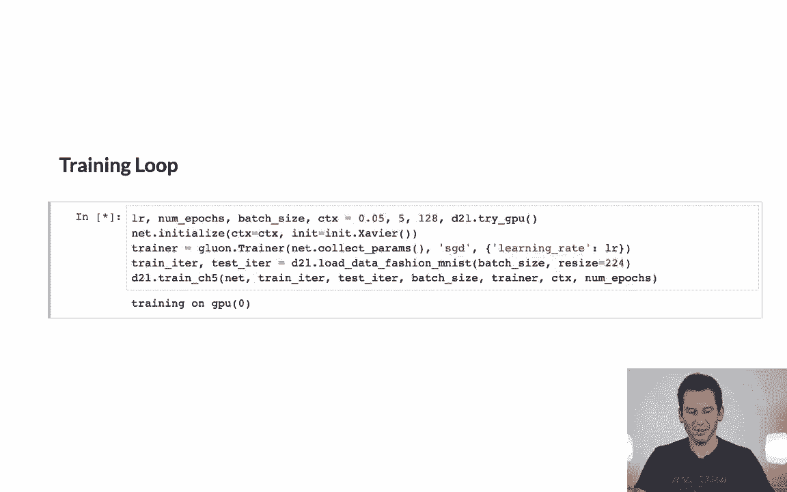

# P65：65. L12_6 VGG 在 Python 中 - Python小能 - BV1CB4y1U7P6

让我们来看看使用块的网络。

所以这是 VGG 在概念上第一次做出显著区别的部分。也就是人们开始思考网络设计的方式，换句话说，思考的是如何设计块而不是单个层，然后通过组合这些块来构建网络。好的，因此我们首先需要一个 VGG 块。

所以 VGG 块除了实际接受一系列卷积和通道数量作为参数外，并没有做什么特别的事情。然后它做的是顺序组合。在这种情况下，我启用了混合顺序模式，因为我要使用我的 JIT 编译器。

为了让这个过程更快一点，我只是一个接一个地添加卷积。最终，我只是执行最大池化。这样返回的就是一个块。所以，我不使用顺序方式，而是使用混合顺序，这就是现在所需要的，目的是激活 JIT 编译器。或者至少告诉 JIT 编译器这是可以使用的。

好的。那么让我们回顾一下 VGG 架构，我们在最后有几个这样的块，接着是三个全连接层。

好的。所以我将要使用的架构是，首先有64个通道和一个卷积，接着是128个通道和一个卷积，然后是256个通道和两个卷积，再接着是512个通道和两个卷积。所以现在，这就是好事，基本上我的网络看起来像是一个非常简单的 for 循环。对吧？

所以我再次从混合顺序开始，因为整个块是可以混合的，我在这个网络中添加了各个块。因此，我们添加一个包含卷积数量和通道数量的 VGG 块，它添加的是一个完整的块，而不仅仅是一个层。然后最后，我添加了三个全连接层，就是这样。非常简洁，对吧？然后就是这样，嗯。

我只需执行 `VGG` 和 `convarch`。所以这就是架构。如果我想选择其他的，我可以例如省略一层或添加一层。

只需要再加一个或再加一个块。这非常简单明了。

那么让我们看看它使用了多少内存。我们有112，512，64通道，128通道，256通道，512，512。所以这些正是我们在这里选择的，没错吧。

所以这里的第一行，`convarch` 准确地定义了我们得到的内容。

现在，瞧，这就是我们在这里得到的结果。

然后最终，像你预期的那样，庞大的全连接层。

好的。

所以，既然我们想训练它，并且希望在合理的时间内训练，我们实际上会让我们的网络稍微小一些。所以我们做的事情是，简单地将所有的大小和比例除以四，这样可以确保一切都变得更加简洁，从而我们能够实际操作。

运行这个低效的时间。现在，我从我小型的架构中生成网络并进行混合。混合化现在告诉网络，好吧，第一次执行时，查看所有你拥有的参数。然后，之后，不再需要麻烦Python了。只需在后台直接使用框架来进行计算。

好的。所以，然后我们就开始训练。事实上，如果你这么做，你需要大约每次训练等待一分半钟。所以我现在不打算做这个，或者至少先让我们看一下结果。你基本上会有一个学习率，仍然相当小，经过五次迭代，小批量大小。

128，当然，还有你的随机GPU。这和我们之前在前两个案例中看到的代码完全相同。然后你只需要对数据进行迭代。由于这是我们书中的内容，第五章的训练器，它只是根据第五章的分数进行训练。

如果我现在调用这个，你会看到它需要很长时间，而且经过五个训练周期后，你的误差大约是八点五到九个百分比。如果你想让它稍微好一些，可能需要使用更多的训练周期。但关于使用VGG训练时在fashion MNIST上的基本知识，就这些。

[BLANK_AUDIO]。
