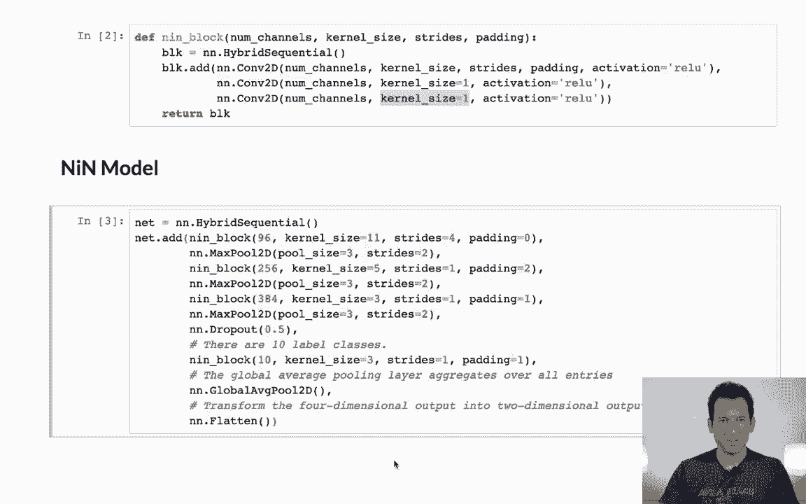
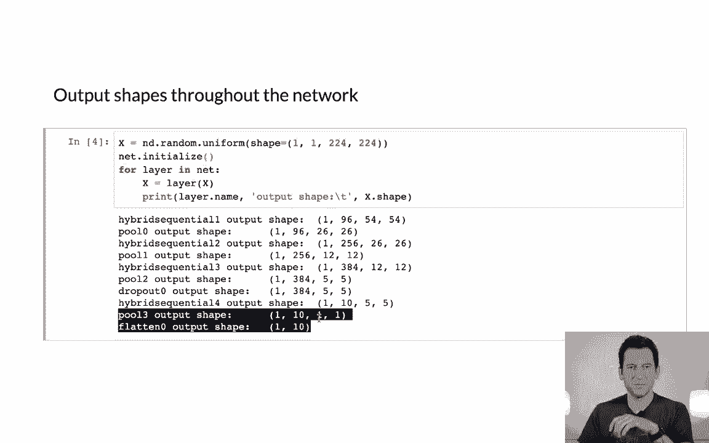

# P67：67. L12_8 Network in Network (NiN) in Python - Python小能 - BV1CB4y1U7P6

 Let's have a look at networks and networks。 So for recollection on the left-hand side。 we have the VGG network where we have， basically those convolutions in relu blocks。 and on the right-hand side we have， the nimblox which are basically a convolution。 followed by two 1 by 1 convolutions with max pooling， and then the n global average pooling。

 So we get going， well， let's start by importing things。 So this is just MX net and glo on。

 and then we need to define a nimblock。 The nimblock is quite straightforward。 It takes as its argument number of channels， kernel size， strides and padding。 Then， okay。 we hybridize just to make it go fast again， and we go and add a convolution with relu。 and with the appropriate strides， and then two 1 by 1 convolutions。

 They don't really need to define any padding， which the size doesn't really change。 And then， okay。 here we need to have the actual model。 So this model does nothing particularly fancy。 It just uses a nimblock followed by max pooling， and it does that three times。 In the end， well。 we apply dropout。 Then we apply one last nimblock。 No more dropout here， no more max pooling there。

 but just global average pooling。 In the end， we just flatten this， and that's it。 So the key difference is that here we didn't need， any dense layer anymore， right？

 Because effectively within the nimblock， the 1 by 1 convolutions。 So these guys here serve the same role， as a multi-layer perceptron。 but now applied on a per channel basis。 Okay。 So let's see what this looks like in practice。

 So there's a network， and if I go and apply it to 224， by 224 images， right。 I get out of it at first 54 by 54， then 26 by 26， then 12 by 12， and that's basically。 if you look at pooling， hybrid sequential， pooling hybrid sequential， then the end I apply dropout。 And then I go to a 5 by 5 with 10 dimensional output。

 So this is already setting things up for the number of classes， that you need in the end。 Then I have another pooling， that's the global pooling， and then I'm done。 So this is how you can completely avoid any dense layers， whatsoever。

 So let's look at how this looks like in practice。 So training， and I'm going to run this afterwards。 in a moment， but basically we can use a slightly larger learning。 because the architecture is a bit simpler， and we use a mini batch of size 128。 And so we iterate over the data。 The one thing that actually， as you can see。

 is the network doesn't work so well。 This is one of the reasons why people didn't really。 pay so much attention to networks and networks initially， but they just， it was just like， well。 there's another weird network， and you can't really get rid of the dense layer anyway。 However。 they play an important role in then leading up， to the inception and resnet architectures。

 which took very significant advantage of this removal。 of the dense layer to get rid of a lot of parameters。 So this concludes today's lecture on network architectures。 Next week we'll cover considerably more advanced architectures， that are actually state of the art。

 Thanks for your attention and have a good weekend。

