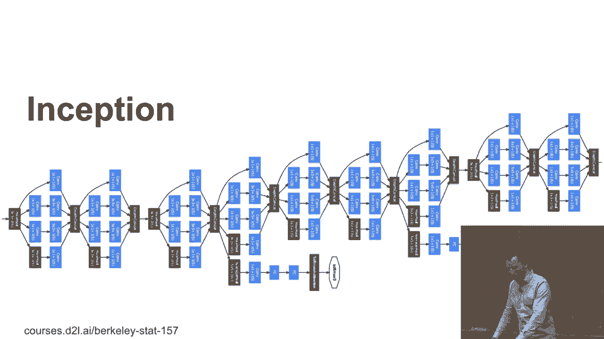
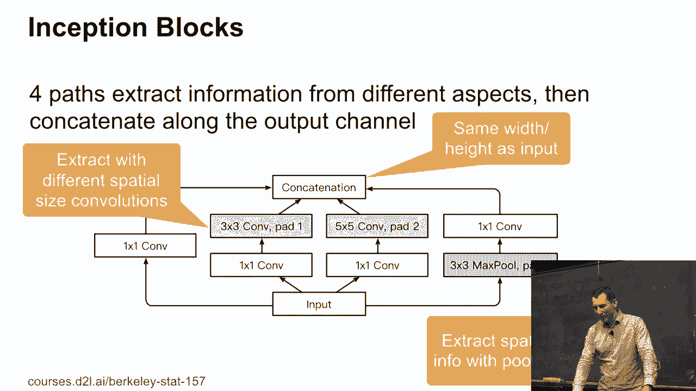
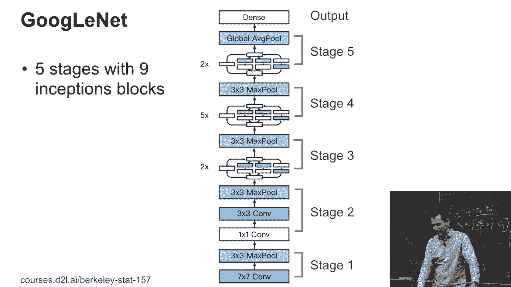
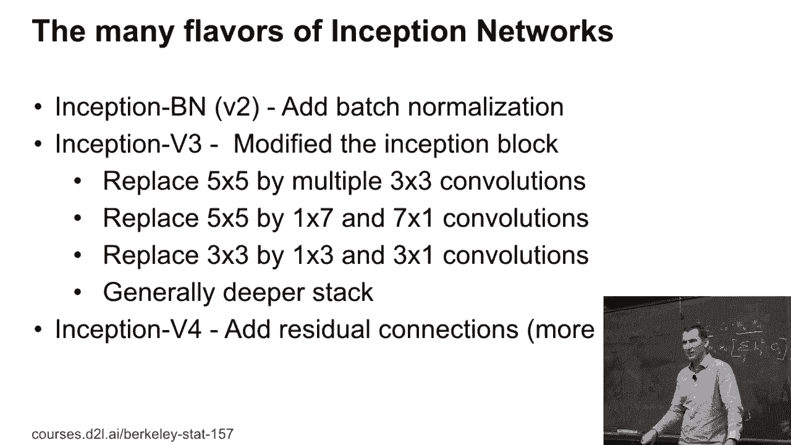
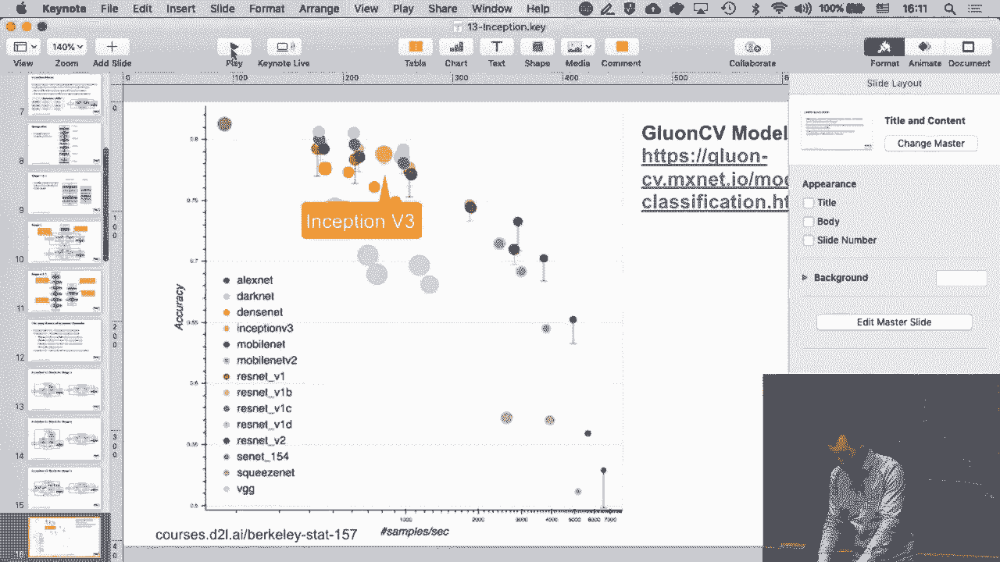

# P68：68. L13_1 Inception (GoogLeNet) - Python小能 - BV1CB4y1U7P6

欢迎来到卷积网络的第二部分，Zoo。今天我们将深入探讨一些卷积神经网络，这些网络将带领我们达到最前沿的技术。我们将从 1995 年开始，回顾上周的内容，一直到 2018 年。我们将会介绍几个网络。我不确定我们是否能在这一周内覆盖所有内容。

我们可能需要将一些事情推迟到下周。但我们有一个相当有雄心的计划等待着我们。

那么我们从一个非常简单的开始。嗯，虽然看起来不那么简单，但这仍然是其中一个简单的网络——Inception。让我们回顾一下我们到目前为止做了什么。

所以我们有 Lynette，Lynette 使用了 5x5 的卷积。然后 AlexNet 使用了 11x11，3x3 和 5x5 的卷积。然后 VGG 使用了其他一些组合。接着 NIN 主要使用了 1x1 的卷积。嗯，简直一团乱。那你应该用哪个卷积呢？是 1x1，3x3，5x5，还是最大池化？或者多个 1x1 的卷积。嗯，我是说你根本没法决定，对吧？

所以这基本上是他们在试图构建一个好的卷积块时面临的难题。问题在于，如果你选择 5x5 的卷积，你最终会有大量的参数。你最终得做很多乘法和加法。这两者都非常麻烦，对吧？而且它们需要大量的参数。

它们非常慢。大量的参数通常意味着它的泛化能力不太好。但另一方面，它非常有表现力。另一方面，如果你选择一对一的卷积，那么它控制得非常好，不需要太多的内存。但同时，嗯，它可能不太好用。那么你该怎么办？

所以接下来，为什么不就不决定呢？这就是 Google Net 论文中的一个精彩想法。它也被称为 Inception 论文或 Inception 网络。电影名一样，像我们需要更深入。那实际上就是他们起这个名字的动机。所以这是 Inception 块。

这实际上就是，嗯，我们不知道该做什么，所以我们什么都做。它有一对一的卷积，因为，嗯，为什么不呢？

它有一对一的卷积，后面跟着三对三的卷积。它有一对一的卷积，后面跟着五对五的卷积。它有最大池化，后面跟着一对一的卷积。对吧？

然后你把这一切结合起来，希望的是，嗯，你知道的，如果把这些都扔到墙上，肯定会有东西粘住。好吧。现在，为了确保这一切有相同的维度，你需要使用合适的填充。因此，三对三的卷积使用了 1 的填充，五对五的卷积使用了 2 的填充。这样，至少从尺寸上看，输入和输出的大小是相同的。

然后你把它们全部堆叠在一起。所以现在你就有了一个真正的大杂烩，你知道吗？不同的通道在做不同的事情。希望是，这些通道中的某一个能适用于猫，另一个能适用于，我不知道，鸣禽。对，这就是 inception 块。

现在你可能会想，为什么这个特定的块是个好主意？嗯，他们大概试了四五种，这个效果最好。我们稍后会再回到这个问题，但现在先假设它是，嗯，我们尝试了很多东西，最后这个效果最好的情况。好吧。

所以，例如，如果你看第一个 inception 块，嗯，它使用了，嗯，64 个通道用于 1x1 卷积，128 个用于 3x3 卷积，32 个用于 5x5 卷积，因为它们本来就有很多参数，对吧？所以它是，嗯，25 乘以 32。在另一个情况下，它是 9 乘以 128，对吧？

然后你只需要加入一些其他的，嗯，最大池化维度，因为，嗯，你希望所有这些加起来是 256。这其实就是它的核心，对吧？

所以这里并没有什么特别深奥的东西。输入的维度其实并不重要。输入的通道数并不特别关键。它只是，嗯，你知道，特征输入，对吧，通道输入，然后你会得到一些合适数量的通道输出。但它做的事情是，你现在在整体上有了参数数量和浮点运算量。

那实际上并不比做一些更简单的事情要高。

所以这实际上就是它的主要好处。如果你做参数计数，并且如果你说，嗯，如果我想要，嗯，256 个输出，有，嗯，256 个输出通道。那么通过 inception，你只需要 160,000 个参数，花费 128 百万次浮点运算。那就有一个 3x3 卷积，这会花费你，大约是那个数的三倍，还有一个 5x5 卷积。

你知道，大约是那个数的八倍。就浮点运算而言，它也相应地增加。所以假设依然是，嗯，如果我能用更少的参数做同样的事，那么，嗯，它们会更好。是的，这基本上就是促使 inception 块产生的动机。对吧？

[听不清]，那么为什么它会更简单呢？嗯，这是个很好的问题。我们就看一下代数公式，对吧？对于某一层，假设我有 k 乘以 k。因为它们是 3x3 或者 5x5，无论怎样，我就写成 k²。乘以输入通道数，再乘以输出通道数，然后我基本上有 m h 乘以 m w。好吧，这个是固定的。

这个是固定的。嗯，那个在某种程度上我可以调整。所以现在你得到的是，你知道，c i 乘以 m h 乘以 m w，再乘以，接着是对你知道的各种路径 j，k j 的平方求和。乘以 c out j。所以通过巧妙地将计算分配给不同的通道，不同数量的通道，针对不同的卷积核宽度。

你最终可能会处于比均匀选择更好的位置。但这是一个非常好的问题。还有其他问题吗？再次强调，做这个的原因是什么？嗯，因为也许有一些你知道的更长距离的信息，一个五乘五的卷积核能够捕捉到，而三乘三的卷积核捕捉不到。所以因此，拥有这些特征是有用的。

但也许我不需要太多的它们。也许在很多情况下我可以仅仅通过做一乘一的操作就能解决问题。所以好吧，我就做一乘一的操作。这就是动机。好的。

所以这是整个网络的完整结构。比起原始论文，这个更容易理解。这实际上是那个 Google Net 或 Inception 网络的五个阶段。所以第一阶段，我们稍后会更详细地讲解这个，但让我先带你看一下这里的各个部分。

所以第一阶段的表现与很多其他的卷积神经网络非常相似。它从一个相对较宽的卷积和池化开始。让我们确保我有一些基本的，你知道的，平移不变性，并且我能够合理快速地降低维度，尽早做到这一点。

所以最大池化使我的分辨率减半。然后第二阶段再次非常努力地试图获得，你知道的，整体空间相关性，然后在最后做一些池化操作。所以相较于我们到目前为止看到的所有其他网络来说，这个算是比较基础的，接下来我们将看到的其他网络也是如此。

现在所有有趣的事情开始发生了，因为我们现在有了那些，你知道的，Inception 模块。两个模块，然后是最大池化，这再次降低了分辨率。所以每次三乘三的最大池化操作都会使我的分辨率减半。所以我在做的事是我在缩小分辨率，但同时也在增加通道的数量。

因为现在虽然我有更少的像素，但它们拥有更多、更高阶的信息，之后我将会用到。然后我有这个，你知道的，包含五个连续的 Inception 模块的主干网络。这里是大多数有趣的非线性操作发生的地方，然后我再次缩小。

然后我再挑选另外两个。为什么他们做了二、五、二的拆分？嗯，他们可能尝试了很多不同的网络，这是他们能想到的最好的方案。有一些后续的论文，比如 Mibonet，它是在 Google Net 版本四之后的。

它们基本上使用遗传算法随机尝试各种东西。如果你有大量计算资源，并且我猜成本不成问题，无论是为达到这个目标，还是在之后运行计算，那么你就能得到非常好的准确率。反正，你可以尝试各种方法。

我倾向于支持架构上的变动，因为它们能为你提供长期的优势，而不仅仅是针对某个具体的任务。但如果你想要在基准测试中获胜，你可能需要做两者兼顾。

那么，让我们直接看一下第一阶段和第二阶段。在AlexNet中，嗯，它基本上是一个非常宽的卷积，11x11，而这个则稍微小一点，只有7x7。你有1x1的卷积，然后是3x3和池化。因此，它和AlexNet并不太不同，唯一的区别是你有更多的通道，分辨率更高。

所以在AlexNet中，最后你会得到一个12x12的输出。这是28x28，所以它仍然保留了你原本会有的大部分信息。

第三阶段，嗯，已经有相当多的事情在发生了，因此，即使在第一块和第二块之间，通道的分配也有所不同。所以你可以看到，在第一块中，你有256个特征，抱歉，通道；而在第二块中，你有480个，只有在这之后你才会减少分辨率。

所以你从28x28开始，然后得到14x14。好吧，到目前为止有问题吗？

这些网络的不同版本通常是由于不同的尺寸权衡，和你是否使用，嗯，两个、三个、四个或五个阶段或块。因此，本质上是架构上的多样性。所以我们会在ResNet中看到这一点。我们会看最简单的ResNet，也就是ResNet 18。但并没有像ResNet 150那样的版本。在某个时刻，你的计算预算就会用尽，这时你就会停止。

好的，第四和第五阶段看起来非常相似。所以再次强调，你增加了通道数到512，甚至到832。为什么这么做？在最大池化之前，因为最大池化会缩小分辨率，所以我们最好尽可能地在每个通道上存储尽量多的信息。对吧？然后最终，你会得到基本上1024个通道，这恰好和你在其他地方会得到的结果一样。

你知道，你想要预测的类别数量。然后，你只需执行全局平均池化。现在，单纯在7x7上做全局平均池化是个好主意吗？嗯，你可以对此进行辩论，或许是一个有趣的测试项目。如果它有效的话。

这绝对是一篇论文，或者也许有人已经写了这篇论文。它是对 7 乘 7 进行注意力池化。好吧。如果还没有人做过，或者没有发布，那就意味着它可能不起作用。因为人们并不总是发布结果。嘿。

我尝试了这五种方法，但没有一种有效。如果还没有人做过，嗯，那就好吧。这就像周末写的一篇论文。好吧，这就是 Google net。

到目前为止有问题吗？好吧，问题是当然不仅仅是 Google net。还有 Google net V2、V3 和 V4。而这些不同的变体实际上是对整体架构模式的改进。因此，V2 增加了一种叫做批量归一化（batch normalization）的东西，我们稍后会讲到。然后 V3 添加了不同形状的卷积。所以这实际上是在卷积上进行更疯狂的尝试。

我们需要三乘三、一乘一或五乘五吗？

你还可以加入一乘五、五乘一、一乘七或其他形状。总体而言，令每个模块更深。正是因为如此，如果你尝试更多的东西，你可能最终会得到类似 Meebonet 的东西，它有很多不同的设计。

Inception V4 然后从 ResNet 复制并基本上将 ResNet 的理念引入到 Inception 中。但它仍然不如直接使用 ResNet 那样有效。

那么让我们看看发生了什么变化。左侧是第三阶段的版本三。如果你仔细看，比较左右两边，你会看到，右边替换了五乘五的卷积。五乘五的卷积被两个三乘三卷积所替代。所以这实际上是你所期望的结果。所以如果你记得纸上的系统。

记得 Semionian 论文中的系统吗？他们研究了宽而浅的网络与深而窄的网络哪个更好，最终是深而窄的更好。所以他们就在那里将五乘五替换成了两个三乘三的卷积。就这些。

所以这是一个相对温和的变化。现在我们来看第四阶段，这就是他们疯狂创新的地方。再次强调，五乘五被替换掉了，它们被一乘七和七乘一替代。如果你看看发生了什么，对吧？这是人们第一次真正使用不对称卷积形状。这是三乘三。七乘一是相当狭窄的，对吧？

但这只需要七个参数。而这个每个通道需要九个参数。所以实际上做这个比做那个更便宜。因此，增加了计算预算。如果你看五乘五，那是 25 个参数。这四层七乘一和一乘七卷积交替的总成本是 28 个参数。

所以成本非常相似。你有非常相似的模型类别，在参数数量上也是如此，但它的表达能力更强。问题？为什么我需要将一维7与7×1卷积结合使用？

为什么我不能简单地只使用1×7卷积，这样就好了？为什么我需要两者结合？是的？ >> [无法听清]， >> 正确。这正是发生的情况。所以，1×7卷积可能做这个，而7×1卷积会做那个。如果我只有7×1卷积，我只能提取在某种方式下垂直相邻的特征。

而这个则只能捕捉在某种方式下水平相邻的特征。所以，如果我只包括这个，我将得到一个特别适合某种特征的网络，但对于另一种特征却非常糟糕。通常情况下，我并不想要这样，除非这恰好是我在网络设计中的目标，也就是说，我知道自己会看到某种类型的特征，并且这种特征出现的频率很高。

好的，回答得不错。还有关于这个网络的其他问题吗？有一件事需要记住。所以，当他们写这段代码时，这使用的不是TensorFlow，而是一个前身叫做disbelief。而用disbelief写网络并不是一件愉快的事情。所以你必须非常清楚地知道所有输入和输出的维度。

基本上是大量的手动代码生成。所以基本上，表示方式比我们现在理所当然的要不简洁得多。好的，阶段五变得更加疯狂。所以不再使用3×3卷积，而是使用了1×3和3×1卷积。同样，另一部分也是如此。好的。

所以我想你可以看到修改步骤的大致模式。

现在我们已经接近当前的最先进技术了。所以，如果你看，这是一个准确率与吞吐量的关系图，涵盖了相当多的模型。这是来自Gluon模型库的。你看到的是，很多架构在相同的方式下实现并训练。点的大小对应于执行特定模型所需的内存占用。

所以小点是非常高效的模型，比如这个叫做MobileNet和MobileNet V2的东西。而且它们的模型实际上相对较小，这有些令人失望。MobileNet版本二整体上比MobileNet版本一差。现在你可能会问，为什么他们要发布MobileNet版本二呢？嗯。

你会看到右侧那些绿色的点。这是你知道的，这个漂亮的Perita曲线。其实这些点下方有一条垂直线。那条垂直线表示发布结果和我们用相同架构得到的结果之间的差异。换句话说，很多MobileNet二报告的提升。

至少相对于已发布的内容，这些改进归因于更好的训练。好的。所以同一架构的更好的训练算法可以带来相当大的差异。Inception V3 实际上表现得非常好。它比已发布的结果略好。最好的模型是那些你知道的，比如残差网络（ResNet），然后是之后的StandNet。

所以我压缩了一个激活网（ExciteNet）。我们会在讲解过程中讨论这些。是的。而且，本质上，如果你想做得好，你希望把论文发表出去。你希望你的点落在凸包的右侧某个地方。对吧？

为什么是凸包而不是单独的点？

如何才能在那个凸包内得到任何东西？记住，这是准确度与吞吐量之间的曲线。为什么我可以得到那条曲线上的任何点，即使它不是一个特别明确的架构？作为工程师，我该如何做到这一点？好了，让我给你一个提示。假设我有两个网络。网络A和网络B。

网络B是第一个网络。网络A是准确的那个，对吧？

我希望有一个位于这里的网络C。如何从网络AMP中构建出网络C？

所以这是准确度。这是速度。那么，我可以做的就是，你知道的，假设这个点C在中间，对吧？

我将一半的点送到网络A，一半的点送到网络B。这是我在AMP之间的新混合网络。好了？

现在这个混合网络有一个很好的特性，就是准确率会是你知道的，来自这里的一半准确率，来自那里的另一半准确率。所以这给了我这个截距。而且由于所需的时间，处理过程也会是这里的一半时间，那里的一半时间。嗯，运行时间就在那儿。现在，有一些方法可以让我将这条曲线进一步推向右边。

这差不多保持相同的准确度，但速度大大提升。我可以通过例如减少位精度来实现这一点。通过从32位降到16位，或者降到8位。如果我的硬件支持并且特别擅长这一点，我可以获得显著的加速。比如，如果你看看Nvidia的图灵GPU，如果我使用它，基本上我需要……

要使用GPU中的一种，RTX系列，而不是GTX系列，基本上是指那些具有张量核心的GPU。它们在进行int 8计算时是FP16的两倍速度，在进行FP16计算时是FP32的5到6倍速度。所以如果我从32位转换到16位，我可以使其右移5倍。

如果我改用8位，那我可以再次将其右移2倍。实际上并不是那么简单，因为你需要考虑累积和其他细节。所以还有一点工作需要做，但大体上就是这个思路。对吧？[听不清]。好了，我不知道我们是否有时间在这节课里详细讲解这个内容。

这可能是一个更高级的话题。但现在你们使用的所有模型都是使用单精度浮点数。所以基本上是常规的浮点数，32位的数值。你们已经看到，即使是32位，也会出现数值不稳定、溢出等问题，对吧？你们可能都记得，比如说。

对于逻辑回归，log X 是一个非常糟糕的组合，你需要做一些处理确保它不会变得太糟糕。你可以做的是将32位转换为16位。当然，如果你这样做，你就不再有足够的可用空间来表示更大的指数。这也是 FP16 和 BP16 之间的区别。

所以 BP16 是谷歌曾经宣传的新型浮点格式。它们所做的是采取了正确的做法，即没有选择最适合电脑游戏的格式——FP16 就是在此定义的格式。相反，它们选择了使用16位中的更多位数来表示指数的格式。通过这种方式，可以在牺牲精度的前提下覆盖更大的动态范围。

但这稍微改善了流程等问题。如果你没有这个，就必须更加小心。降到 Int 8 时，基本上是一个字节大小的权重、参数和激活值等。你需要做很多中间步骤。所以，如果仅仅依赖分辨率，你不会得到性能的翻倍。

但是你可以非常接近这个目标。你必须小心避免丧失精度。所以，如果你构建一个嵌入式设备，想在手机上运行，或者在云端进行高吞吐量的计算，Int 8 就是你的朋友。你会在你很确定这是你想要的模型上使用它。到目前为止有其他问题吗？好的。

这是著名的 Inception 网络。现在让我们实际看看这在实践中是什么样子的。

[BLANK_AUDIO]。

