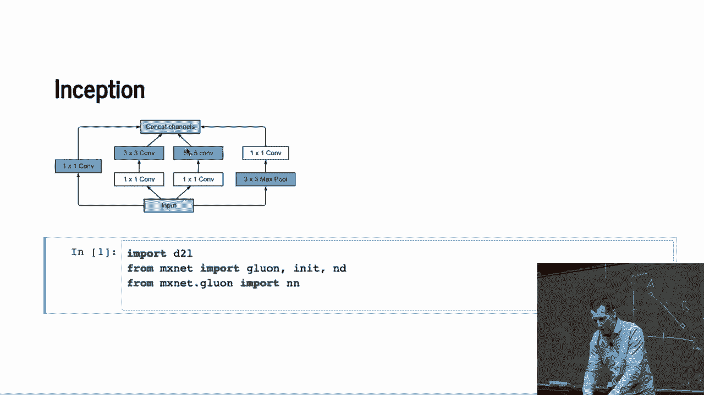
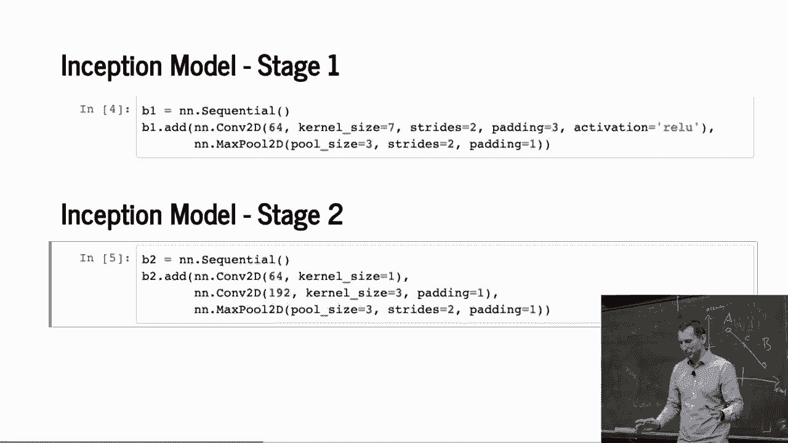
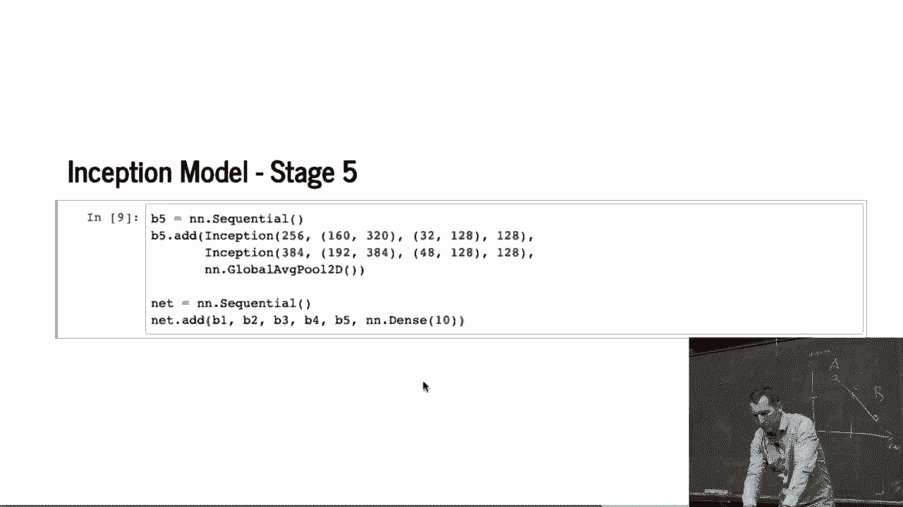

# P69：69. L13_2 Python中的Inception - Python小能 - BV1CB4y1U7P6

好的，现在这是我的笔记本在GPU上运行。

它是p3中的一部分，指向大型服务器。现在让我们实际去实现一个Inception网络并运行它。所以我首先要做的当然是导入所有适当的库，而我之前已经做过这个，所以可以跳过。但这是基础的Inception块。因此，这是写出来的基础Inception块代码。

在这里我们第一次遇到的是各种路径的并行组合。所以现在我们不再只是简单地添加一个块，添加一个块，添加一个块。而是实际上需要做一些工作来实例化它。我需要做的第一件事是初始化这些组件。所以我需要为路径一初始化它。

卷积的大小是1×1。对于路径二，我需要一个1×1和一个3×3的卷积。对于路径三，我需要一个1×1和一个5×5的卷积，并且再次需要适当的填充。对于路径四，我需要一个最大池化和一个1×1的卷积。所以这些都是上面提到的部分，是我首先需要定义的。现在我有了一些参数，分别是c1、c2、c3和c4。

这些是控制尺寸的参数，基本上是通道数量的参数，适用于不同的路径。所以如果你回到前面，这些就是完整的路径，跨越了一个、二、三和四。

就是这样。接下来我做的就是编码，然后我做的是p1，即输入的路径一。p2是p2中的p2，p1的x。因为我实际上是拼接了这两部分，对吧？

所以我首先应用一个1×1卷积，然后是一个3×3卷积。对于路径三，我对1×1和5×5卷积做相同的处理。所以我需要添加四个最大池化和卷积。现在，我已经分别得到了这四条路径。接下来我可以将它们拼接起来。所以在维度1上拼接p1、p2、p3、p4，就把它们全部堆叠在一起。

所以我需要将该层的输出添加进去。所以从这个角度来看，实际上是相当简单的。如果我想修改该Inception块的架构，那也会非常容易。所以记住，这将返回一个带有这些参数的块，对吧？基本上是c1、c2、c3和c4，还有一些其他的参数，可能是我自己定义的。

现在我们需要定义不同的块。所以块一只是一个顺序的组合，我知道原因，因为我并没有真正运行这个。

所以我必须执行它。我看到他们之前运行过。结果发现他们并没有运行。

好的。那么，标准流程就是卷积和最大池化。第二阶段是几个卷积和另一个最大池化。这样再次减少了维度。所以现在我正在分别定义每个块，还没有将它们全部组合起来。

好的。第三阶段。那么现在是两个Inception块，接着是最大池化。第四阶段。更多的处理，现在我们来看一下实际的数字。

所以这些最后的数字是每个路径输出通道的维度，对吧？

你可以看到它们是如何增加的。另一件事是这些不同堆叠之间的比例随着时间变化。所以首先，这些1x1的维度实际上增加了很多。而且1x1、接着是3x3、再是1x1、5x5的堆叠变化就不那么明显了。1x1的变化也不大。最后变化最大。

好吧，我得到了一个产生相当大维度的输出。然后，我减少了分辨率。

好的。现在我需要最后一个块。这就意味着再加上两个Inception阶段，最后是全局平均池化。现在我有了一个可以通过五个块创建的网络，最后只是一个输出维度为10的全连接层。好的。

就是这样。

好的。那么，让我们看看如果我在中间插入一些东西会发生什么。为了简化，我选择了96x96像素，因为如果我选择一个维度太高的图像，即使是在一个小的数据集上，处理起来也会很慢。我这里只使用一个维度，和这个事实有关，这涉及到时尚。

Emmy图像是黑白的。如果我用的是cfire，它们会是彩色的。所以在第一个块后，我得到了24x24，第二个块后是12x12，接着是6x6、3x3、1x1，最后是10个维度。所以你可以看到的是，实际上我们一开始的维度。

一开始的高分辨率，随后是低分辨率的输入。我们最后只有96x96，最终只有3x3。记住，在幻灯片上我们实际上有一个7x7。好的。现在我们有了这个，我们可以开始运行了。

好的。结果出来了，我们有了GPU，现在每个路径大约需要20秒左右的时间来通过。在这期间，我们来回顾一下发生了什么。所以，首先要初始化网络的前提。在运行之前必须这么做。

现在强制重新初始化，仅仅是因为在此之前我们已经发送了一些随机垃圾数据通过它，而且我们将其初始化为随机的，所以我们只是想确保一切正常。一个重要的陷阱是，强制重新初始化会重新初始化这些参数的值。它没有做的事情，经过我亲自吃过亏后发现，是它不会重置维度。

所以，一旦你将网络绑定到特定的输入大小，你就无法再改变它。我是说，你可以将网络的一部分重新排列，做一些有趣的事情，但是最终，如果你曾经绑定到，比如64x64的分辨率图像，强制重新初始化将不允许你之后改变它。

自动适应128x128的图像。为此，你需要从头开始设计架构。事后看来，这个原因其实很简单。也就是说，如果你重置了参数，由于网络不知道哪些维度是已知的。

由用户定义的维度和那些自动推断出来的维度，它无法自动重新推断并重新实例化。这就是主要原因。所以这是一个小陷阱，或者说需要留意的地方。无论如何，这是一个开始，结果我们得到了一个相当不错的模型。

可接受的准确度大约是0.88，也就是大约12%的错误率，针对时尚图像。这还不错。好的，有什么问题吗？好吧，我想现在应该变得有些常规了，如何训练你最喜欢的架构。因为这段代码其实和我们之前用过的代码完全相同。

看看，嗯，我们有了一个不同的架构。[BLANK_AUDIO]。

