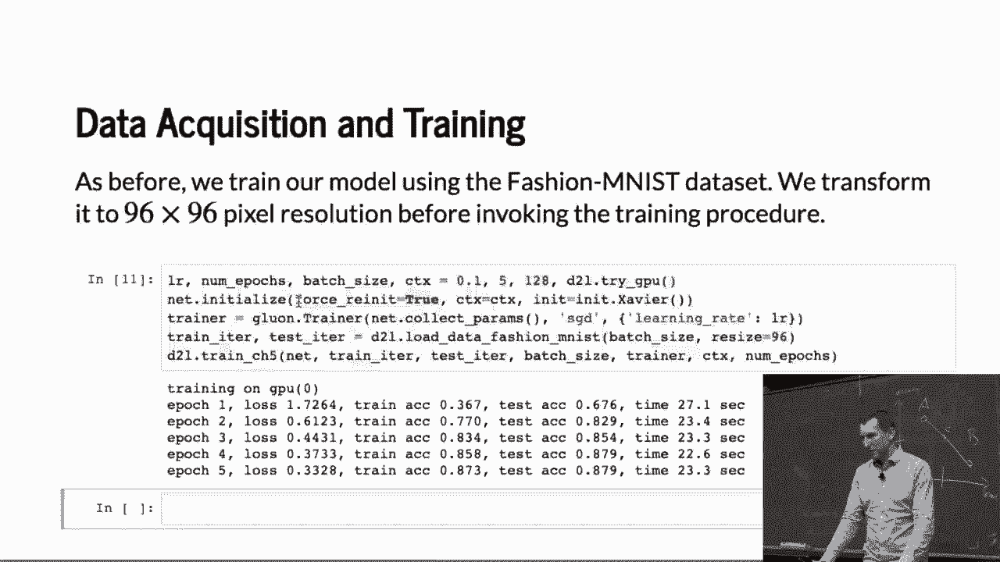
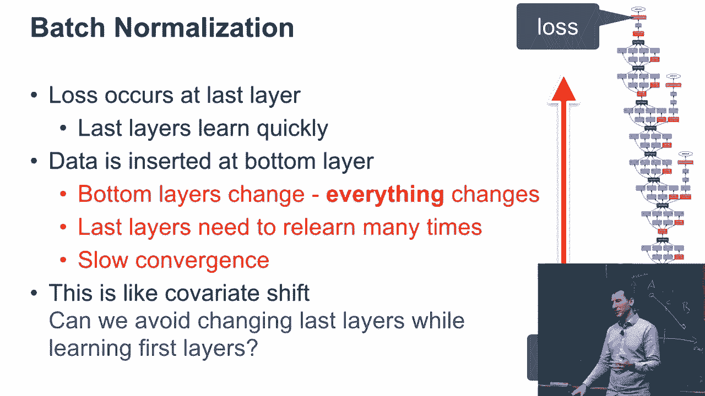
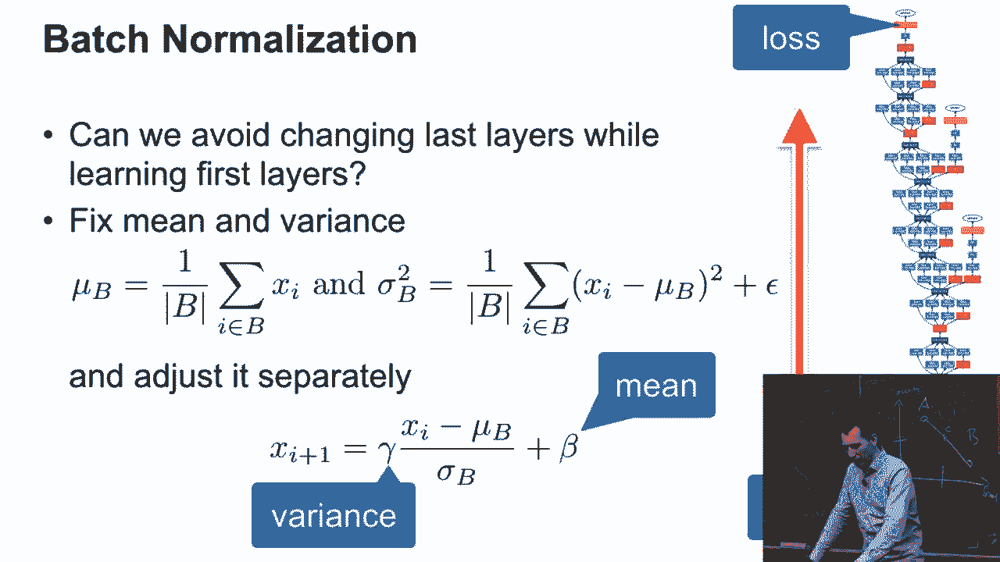
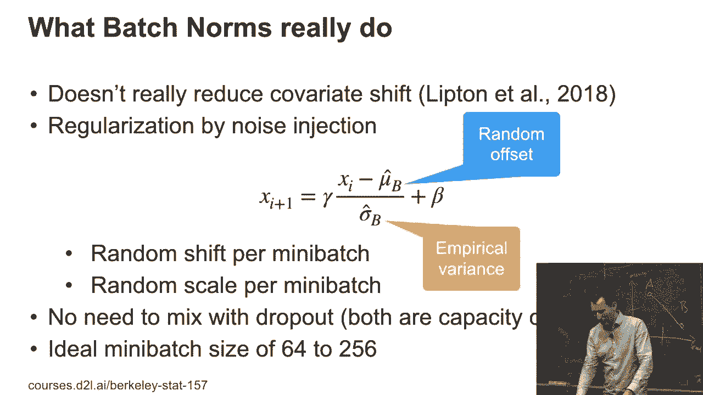

# P70：70. L13_3 批量归一化 - Python小能 - BV1CB4y1U7P6

让我们来看看批量归一化。

所以这是批量归一化最初的想法。如果你看一下Inception网络，它是一个非常庞大的网络，非常深。它有许多额外的部分，以确保你可以帮助网络更好地收敛。无论如何，基本上，想法如下。至少这就是直觉。

它是如何发明的呢？嗯，在我训练网络时，你知道，我的梯度是从上到下传播的。因此，最后几层将开始适应。它们会适应标签。然后下一层也会开始适应。接着下一层也会适应。所以我得到了一个不断适应的级联过程。

问题是，当我从上到下进行调整时，当然，返回上的特征会发生变化。所以现在，对于最后一层，它其实已经适应得相当不错了，但必须重新适应它所得到的新输入。因此，这需要很长时间，至少在那个时候是这样的。

当时的推理是，为了训练信号能够引导到一个收敛良好的网络。好的，听起来有道理，对吧？所以这有点像我们之前做过的变异处理，对吧？

所以问题是，你知道，这看起来有点像变异处理。也许我们可以修正它们。我们可以通过选择一个给定的均值和方差来修正它们，至少在训练时进行修正。你不想完全修正这些层，但至少你可以说，好吧，我将它们修正到一个仿射变换。

我要单独学习的变换。仿射变换意味着乘法和加法。

好吗？所以我们假设选取一个均值和方差，对吧？你知道，均值（mu）和方差（sigma平方），然后我们重新归一化数据。我们将xi减去均值除以方差，或者实际上是标准差。然后我允许一个单独的系数gamma和一个单独的系数。

偏移量beta来处理这些问题。这就是批量归一化。现在，批量归一化的原因是我为每个批次计算单独的均值和单独的方差。这已经是你应该开始提问的部分。凭借事后的眼光，回头看，总是能发现。

问题是，是否这种协变量偏移的修正，真的是这个方法诞生的全部原因，是否真的是它能够奏效的原因。但目前为止，关于原理和概念有任何问题吗？好的。那么，正如我之前提到的，这是。

原本的动机，但实际上结果并不是这样。

真正减少协变量偏移。因此，Lipnidal做过一篇论文，他们去衡量这一点，结果发现这实际上使问题变得更糟。好吧，这就是最初动机的部分。所谓的修复方法并没有起到作用，但它确实有效，之后我们会看到。实际上，这表明通过噪声注入实现了正则化。

你在一个小批量上计算均值和方差。假设一个小批量有6428个观察值。因此，你实际在做的是从一些经验均值中减去噪声，然后用一些经验标准差来除以噪声，基本上你每个小批量都会得到一个随机的偏移和缩放。

这也是为什么如果你使用批量归一化，你真的不需要附近的丢弃层，因为它们在容量控制方面做的事情是相似的。所以，这也是为什么批量归一化对小批量大小特别敏感的原因。如果你选择的小批量太大。

如果你没有注入足够的噪声，那么你就没有做足够的正则化。如果你选择的批量太小，那么基本上噪声会变得太高，导致收敛效果不佳。对于单个GPU训练来说，这不太重要，但一旦使用多GPU训练，它就变得非常重要。

当你转到多GPU时，这个问题变得非常重要。例如，你可能想将小批量分配给每个GPU，然后再共同处理剩余的部分。目前为止有任何问题吗？第一次看到这些可能会感觉比较抽象。是吗？

那么为什么我们会有一个随机偏移呢？如果你想想看，`mu hat B`是给定层内所有`xi`在一个小批量中的均值。因此，这个值当然接近真实均值，但它仅仅是基于一个小批量，样本量是6428。所以每次我选择不同的小批量时，`mu hat B`都会不同。所以这实际上相当于在每个小批量中添加噪声。

在每个小批量周围适当地调整激活函数。因为每个`xi`并不会对它最终进入哪个小批量有太多影响。所以最后我们会对这些数据进行洗牌。因此，是否在均值上加或减一点完全由随机决定。同样地，对于缩放也是如此。

我的方差估计也会有噪声。这正是为什么它对小批量大小敏感的原因。因为如果我选一个非常小的小批量，那么均值和方差的噪声就会非常大。如果小批量很大，那么它就会非常稳定，而且不会像那样进行正则化。

还有其他问题吗？是吗？

很好的问题。测试时你应该怎么做？

那么在测试时你所做的是固定这个值。

本质上，记住那些参数，gamma 和 beta。它们是学习得到的，所以它们基本上是一个学习的缩放因子和偏移量。我会固定它们。至于均值和方差，我实际上会使用运行平均值，并且你知道使用一个大的样本量均值。

然后我们会在 Python 中看到更多细节，我们将从零开始实现批次号。这是一个很好的问题。还有其他问题吗？好的，酷。那么大家准备好开始了吗？

是的，所以最后一个小细节。基本上，如果你有一个全连接层，那么你只需要对所有激活使用一个归一化。如果你有卷积层，那么你需要对每个通道使用一个归一化。是的，所以这其实挺简单的。

现在这个。
