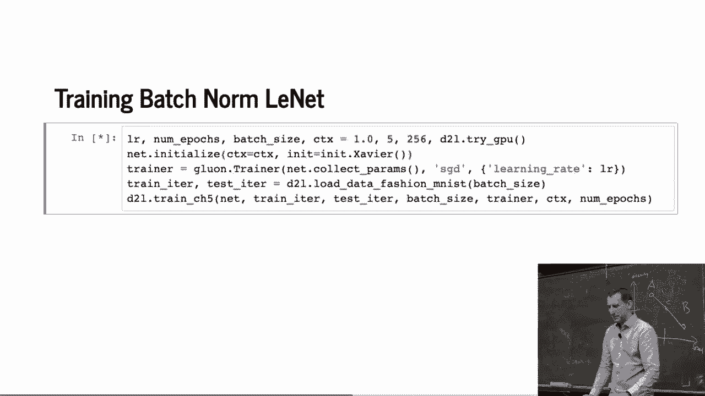
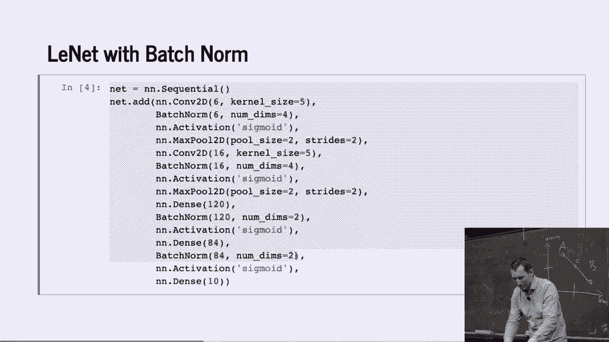

# P71：71. L13_4 Python中的批量归一化 - Python小能 - BV1CB4y1U7P6

那么我们直接开始吧。

这是批量归一化的定义。所以它的神经网络实现其实就是一个导入操作。那么关于我们是否在训练的问题，答案很简单，检查是否启用了autograd就知道了。

因为我只会在训练期间使用autograd。所以，检查网络中是否启用了autograd，其实就能告诉我我们是否在训练。所以如果我们在训练时，如果不在训练，那么我做的就是从移动均值中减去，然后按移动方差重新缩放。然后之后。

我们实际上会在这里执行适当的更新。所以在处理完测试集上的几个观察值之后，事情基本稳定了。那么现在假设我们不在训练。那么一种好的方法是通过检查x的形状来确定我们是否使用了卷积。因为如果我们在使用卷积神经网络，那么。

那么我会有按通道的顺序。也就是说我有通道，宽度和高度。那是2D卷积的情况。而如果我只有一个MLP，那么我只有一个特征数量。所以我可能会有两个或四个维度。额外的那个维度来自于批量大小，对吧？来自小批量。

对于一个MLP，形状会是小批量大小乘以隐藏神经元的数量，或者是小批量大小乘以通道数、宽度和高度。所以我们检查是否有两个或四个维度。所以如果我们有两个维度，我就去计算均值和方差，然后重新缩放。

这是多层感知器的批量归一化。如果我们有卷积层，那么，嗯。我需要在保持其他轴不变的情况下计算均值，也就是轴0，2和3。我保留其他部分。所以基本上，在此之前我们只有轴0。现在我们有了轴0、2和3。然后我就去做适当的归一化。

所以那就是x减去均值除以方差的平方根，再加上epsilon。所以这和我们之前的表达式一样。只不过这不是移动平均，而是另一个。最后，我们输出gamma乘以x再加上beta。就这样。然后我们就输出y。移动均值和移动方差，因为，嗯。

我们想把这个存储在某个地方。好吧。大家都同意吗？很好。那么我们继续吧。因为一旦我们有了这个。

其他部分都很简单。所以现在我们需要将其转化为一个层的定义。

对不起，有人紧急找我。我实在没有时间。关于批量归一化层的初始化，首先它会检查维度的数量。然后分配相应的缩放参数。

并为均值不变性分配参数。所以记得当Mu讲解如何定义块和层以及参数时，这正是我们需要的。现在我们将把它们充分利用。然后，你需要引入一个前向函数。这个前向函数现在什么都不做，只是应用批量归一化。所以它首先做的事情是它。

确保数据被传送到正确的设备。这就是全部。只需要把参数复制到数据所在的位置。这个操作只会发生一次，然后就结束了。因为它现在重新分配了，对吧？然后，它只是应用了批量归一化。就是这样。那就是我们从头实现批量归一化所需要的一切。到目前为止有问题吗？

那么我们看看。现在——哦，因为我之前实际上没有执行批量归一化。现在我们可以做了。这样就是Lynette，但加上了批量归一化。

所以我基本上在做的事是，在激活函数之前——也就是在sigmoid或relu之前，我只是加上批量归一化。没有这一点，它将是一个完全通用的Lynette。但现在它是一个带有批量归一化的Lynette。所以我可以这么做。

然后我可以训练它。 这将需要几秒钟。

然后我们看看它的表现。它相当准确。即使如此，它也可以开始工作。嗯。考虑到它是一个如此简单的网络，它运行得相当好。事实上，让我们对比看看它的效果。

就像我没有批量归一化的情况一样。所以我现在要做的是直接加上——。

是的，也许我得先快速退出，或者——实际上让我缩小视图。所以我要删除所有批量归一化。好的。我们做这个。现在，我只需要做的是，我直接。

更改所有出现Lynette的地方。我现在已经改为Lynette。添加批量归一化训练器。Lynette。好了。记得之前我们的准确率是0.869。现在，花了大约3.6秒。我们来看看到底会发生什么。好的。所以它运行得更快了，因为它没有调用批量归一化。这在某种程度上是因为我们手动运行了批量归一化。而且效果变差了。好的。

所以批量归一化对你有好处。但当然，你不会想从头实现它。来吧——好吧。让我们看看。当然，你不能很好地查看参数，因为我们刚刚重新初始化了网络。所以你只能相信我，这就是你应该得到的结果。

如果我们之前查看了参数，可能会得到这些结果。但我说真的，它们只是对应的偏移量。现在，让我们实际在Glue中做这整个过程。唯一的区别是，现在我不是调用批量归一化。我只是直接在批量归一化中调用它。我实际上不需要给它任何其他参数。

因为它足够智能，能够从上下文中推断出相应的尺寸。因此这需要多写一点代码。但从概念上来看，实际上并没有改变任何东西。好的，那么我们运行一下吧。

所以记住，在那之前，没有批量归一化时，代码每次循环大约需要2.3秒。现在大约需要2.4秒。所以它可能慢了约5%。在那之前，速度大约慢了50%。你可以看到它给我们的准确度和我们手动实现的结果一样，只不过开销小了很多。

所以开销大约是使用 Python 时的1/10。对于实验来说已经足够好了，但现在你可以更轻松地完成工作。这也将我们带到了批量归一化的结束。

