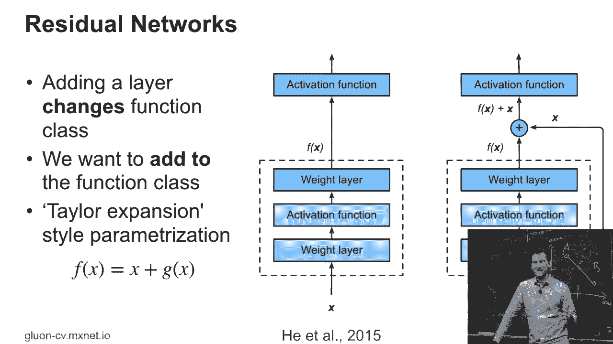
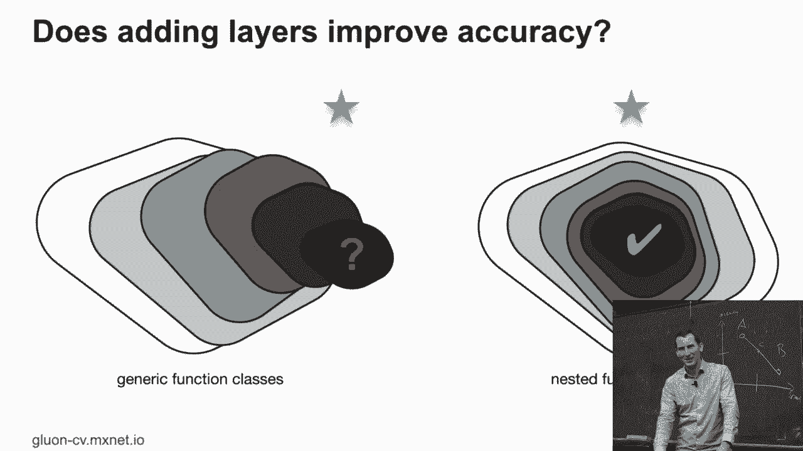
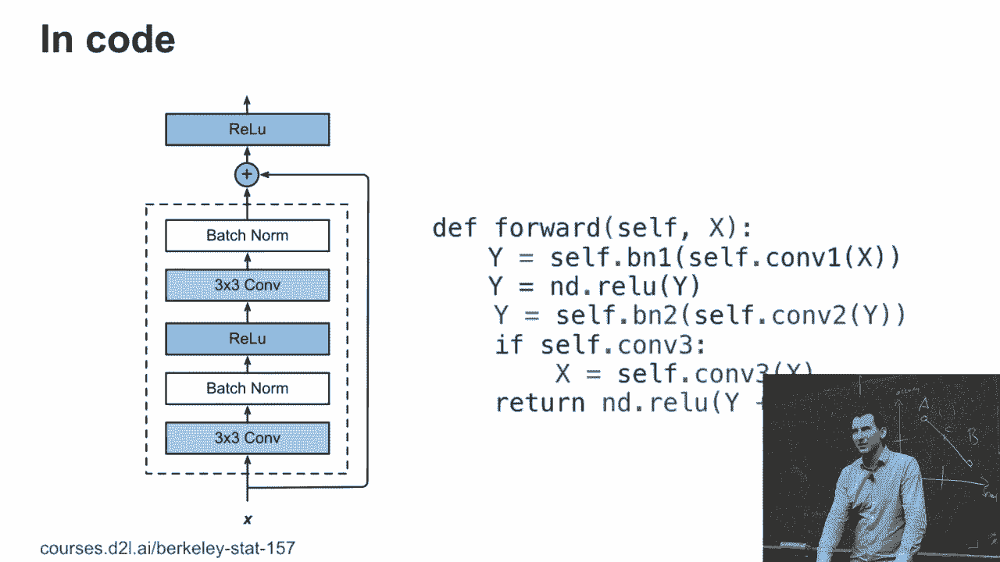
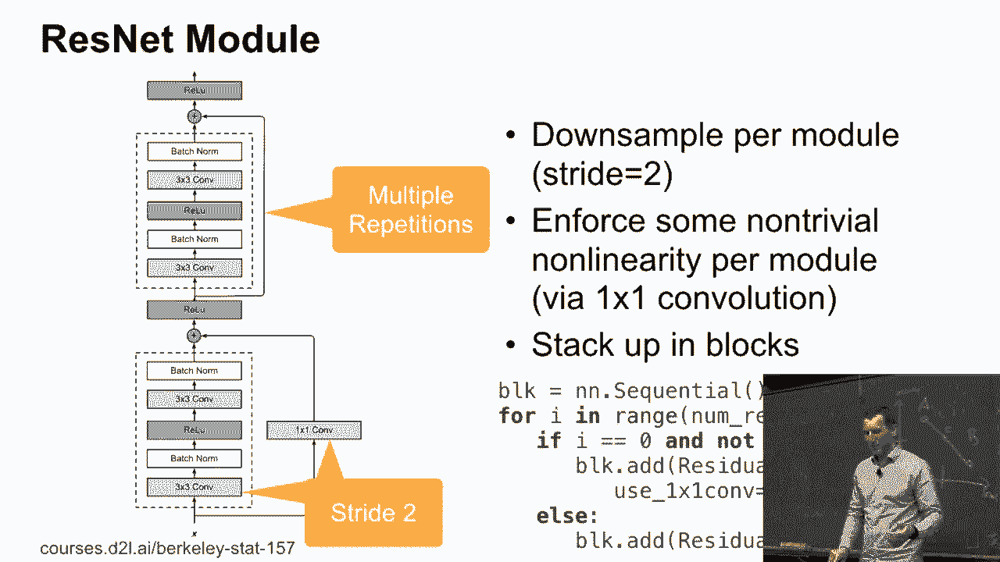
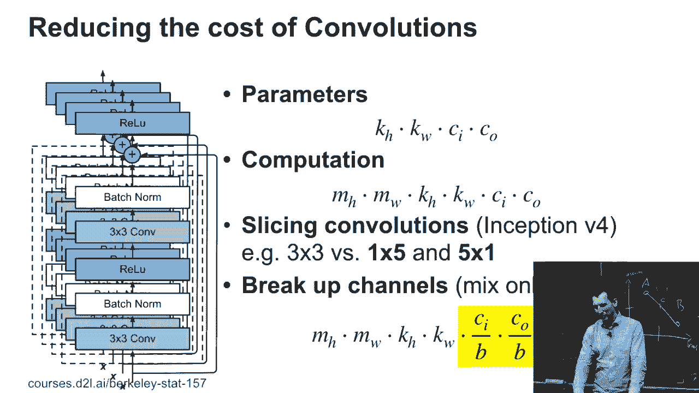

# P72：72. L13_5 ResNet（残差网络）- Python小能 - BV1CB4y1U7P6

现在我们来谈谈ResNet。所以，如果你现在不得不选择一个无需担忧的现成网络，我可能会推荐你选择一个ResNet或ResNet。

而且有一个原因说明它们工作得明显更好。再说一次，最初的动机有点奇怪，因为梯度无法通过整个堆栈之类的原因。这里发生的事情才是真正的原因。所以假设我有一个深度网络，对吧？然后我决定再让它更深一些。

所以我们可以通过添加另一层来使其更深。而添加另一层后，我得到一个稍微不同的函数类。如果我再加一层，得到的函数类还是稍微不同。而且，当然，我有更多的参数，所以我可以做更多有趣、多样且强大的事情。

基本上，我的函数类你知道会变得更大、更强大，但它们也会有所不同。所以如果你看左边的图片，你可以看到一组函数类，每个都比前一个稍微大一点，因此也稍微更强大，但它们之间都有些许不同。现在假设真相就在那儿，对吧？这颗蓝色的星星就是事实，而我想要近似那个事实。

如你所见，当你开始添加层数时，层数会越来越多，你会越来越接近那个蓝色的星星。当你到达大约第三个网络，从黑色到深灰色，你就能最接近那个蓝色的星星。

然后，当你开始进一步增加函数类时，你会再次开始远离它。这是非常不理想的，你也不能保证你最终不会再回到原点。毕竟，我的意思是，你不知道如果再加一层会发生什么。你不知道那颗蓝色的星星在哪里。这很尴尬，因为这让人很难以有意义的工程方式推理出应该选择多少层。

我的函数类应该有多复杂？另一方面，如果你看右边的图片，情况就要好得多。通常，如果你阅读很多关于统计学习理论的论文，它们几乎都假设你有一个嵌套的函数类。

所以，如果你去统计系上任何一门非参数统计学课程，我敢打赌，几乎所有的情况，除非它们附带特定的规则，都会是这种情况。假设你有右边的情况。不幸的是，对于深度网络来说，你拥有的是左边的情况。那么，如何才能让它更接近右边的情况呢？

在右侧，函数类仍然变得更大。事实上，我画出右侧的图是通过将左侧的图像缩小并居中得到的。这就是函数类的强大之处，它们是嵌套的。所以当我从一个函数类过渡到另一个时，它们变得更强大，更具表现力，我可以触及到一个更大的函数类。

所以现在，当我继续添加时，我逐渐接近我的蓝色星星。它们不一定是凸的，但这就是实际情况。那么我如何才能达到右侧的情形呢？

这是2015年这里的一个巧妙构思。也就是说，与其围绕函数f(x)=0进行参数化，认为它是最简单的函数（实际上所有权重都为零），我选择围绕函数f(x)=x进行参数化。因为你知道，如果所有的参数和其他东西都是零。

如果我将输入加到输出中，那么我得到的就是恒等函数作为最简单的函数。这非常聪明。所以这就像是神经网络的泰勒展开，至少在某种程度上类似。因此，随着参数的增加，你开始偏离恒等函数。所以现在我不再需要学习那个对我的数据没有任何影响的恒等函数。

所以它本质上假设了一个不同的归纳偏置。这也意味着，当我添加另一个层时，恒等函数仍然可以通过。而且它仍然会让前一层的输出保持不变。只是现在我可以对输出做额外的处理。当然，这并不完全是它的工作原理。

我并没有完全实现那些嵌套的函数类。

但是它做了些非常接近那个的事情。

所以这就是ResNet块的详细样子。你有一个卷积层，一个批量归一化（batch norm）。这是我们之前提到的批量归一化。一个整流线性单元（ReLU），另一个卷积层，再一个批量归一化。然后你将输入加到输出上，或者你对输入进行一次1x1卷积，并将其加到输出中。

但至少，你使得网络在不改变任何东西时相对容易。毕竟如果不改变任何东西是最好的选择。那么这是代码。代码相对直接。现在跳过了许多设置变量的细节。这只是一个前向函数。我得到的是y是批量归一化，卷积1，x的输出。

然后我应用 ReLU，再应用另一层批量归一化，两个卷积操作，然后如果我处于右边的路径中，我就将卷积操作应用于 `x`，并将两个结果相加。当然，我需要选择合适的卷积方式，以确保维度匹配。

但我们已经看到过如何做到这一点。现在我们可以将其应用于批量归一化。基本上，想要得到一个基本的 ReLU 模块。这里有任何问题吗？

这实际上是 ResNet 工作原理的核心。

现在你可能会认为这很简单。其实人们尝试过所有这些不同的批量归一化方式。他们尝试了如何放置批量归一化和加法操作。因此在一些论文中，他们在加法后使用了批量归一化。在一些情况下，他们把加法操作放在最后。在某些情况下，他们调整了 ReLU、卷积和批量归一化的顺序。

他们尝试了这三种不同的排列方式。模块之间的顺序是相同的，只是顺序被改变了。是的，所有这些都有相关的论文。在某些组合和某些情况下，这些方法在某些设置下效果更好。

现在听起来似乎完全不令人满意，但这不幸地是深度学习训练的“CD底层”问题。但在某些情况下，你确实需要尝试不同的方法。然后在某个时刻，会有人做出这个尝试，弄清楚这是一个好的架构，然后大家就基本上会坚持使用它。

好的，下面是 ResNet 模块。这看起来和我们之前看到的非常相似。只不过现在使用的是 ResNet 模块，而不是 Inception 模块。所以你可能会有一个这样的模块，它进行下采样，步幅为二。然后你会有一些其他的 ResNet 模块。这样就能很好地工作。

这是整个网络的完整图示。这个是 ResNet 18，一直到 ResNet 150，也就是150层。底部看起来，嗯，和我们之前看到的非常相似。宽卷积、批量归一化、池化。然后你会有一大堆不同大小的 ResNet 模块。然后你就可以训练它。

我们将在下周训练它，而不是今天。

这最终会得到上面的这个结果。这就是现在的 ResNet 152，几乎是最先进的技术。它的速度较慢，但准确率更高。实际上，它的计算量比我们之前看到的 Inception 网络还要小。那个网络对应的是右侧的橙色圆圈。

我将总结一下你认为可以进一步发展的内容，也就是ResNext。它有一个巧妙的想法。对，来到这里是其中一个联合主持人。基本上它依赖于以下观察。如果这是我们的ResNet块，对吧。我们有一个1x1卷积，接着是一个3x3卷积，然后再是一个1x1卷积。

所以我们有64个通道，64个通道，然后是256个通道，对吧？或者你知道，像这样的一些尝试。那么你可能会问自己，嗯，这真的是一个好主意吗？

结果证明，你可以通过仅仅将事情分割开来做得更好，这样我的通道间交互现在只发生在每组四个通道之间。所以我做的基本上是将左边的网络切成16组。

或者在这种情况下，你知道，更多的网络，它们只是有四个通道，或者你知道，每个有大量通道。然后最终我把所有东西都堆叠在一起。所以这。当然，意味着如果我们看看那个，最初我们有，你知道。

高度乘以宽度乘以输入通道乘以输出通道，你知道，参数。计算是，你知道，当然，输出高度和宽度乘以你知道的卷积核的对应高度和宽度，再加上输入通道乘以输入通道乘以输出通道。我们可以通过你知道的1x3、1x5和5x1来分解它们。

这就是我们之前看到的Inception结构。或者我们可以拆分通道。所以如果我把它拆成B组，那么输入的C_i就会分到B组中，输出的C_o也会分到B组中，乘以B，因为那时我就有B组了。换句话说，我通过B的一个因子来减少运算量。结果就是。

我可以使用更多的维度，我的状态很好。

这就是全部内容。所以这非常容易添加到你可能有的任何代码中。基本上，你只需在二维卷积中设置变量`groups`为你需要的任何组数。就这样。现在，如果你比较Ristner和Ristnext，它们的计算预算非常非常接近。好吧。参数数量是这样的。

它们之间的差距在几乎几个百分点之内。浮点运算的数量非常接近。但它稍微表现得更好。接下来，我要总结一下，因为时间差不多了。那么，有什么问题吗？好的。那么，下周我们将讨论不同的网络，以及代码中的一些方式。还有一件事，就是有个叫做考试的东西，对吧？对。

所以接下来的几点。

