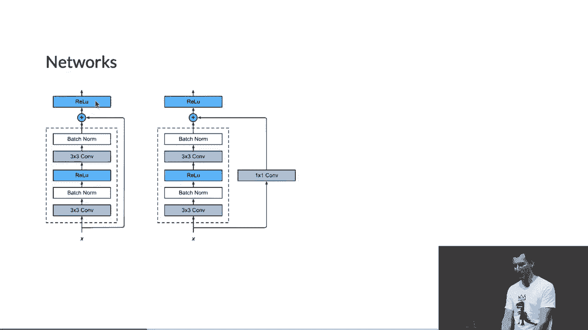
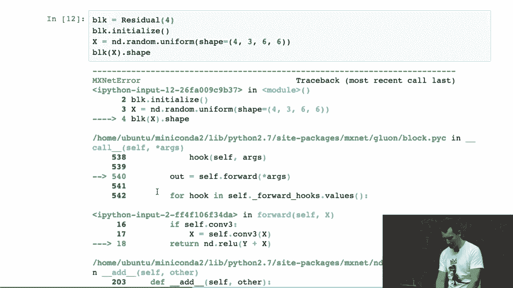
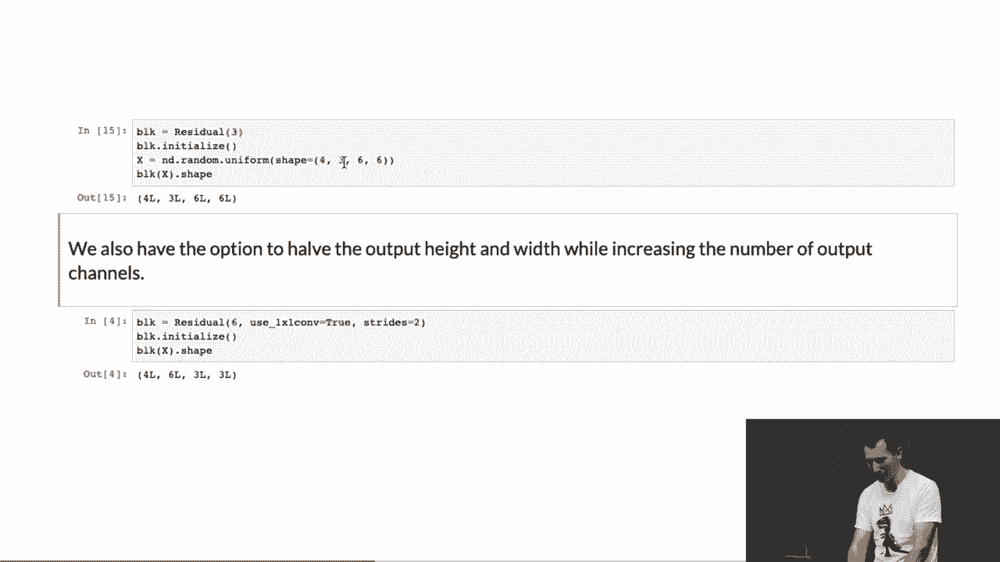
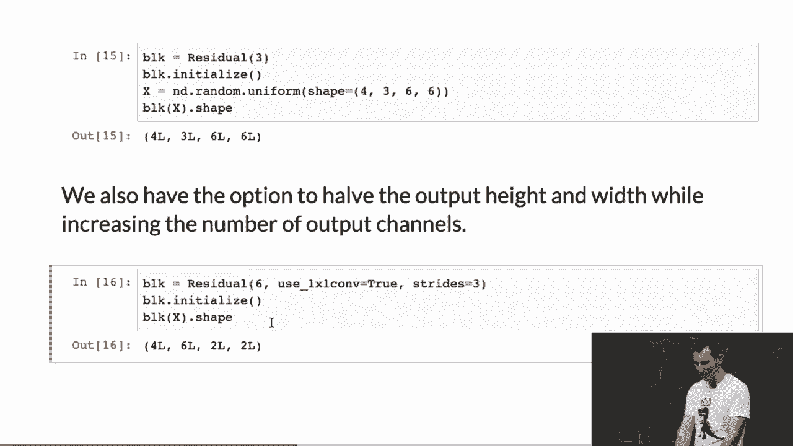

# P73：73. L13_6 ResNet in Python - Python小能 - BV1CB4y1U7P6

好的，所以下周四我们没来得及讨论的内容是，如何实际实现ResNet？为了提醒大家，图中展示的是ResNet的核心单元。所以你有一个权重层，一个激活层，可能还有另一个权重层。

实际上，你会在中间加入批量归一化和其他东西。但这是整体的框架。第一步是导入所有相关的库。

现在出现了著名的残差块。这是从我们上周看到的图中逐字转录的。让我带你走一遍。事实上，我们上周在幻灯片中看到了那段代码，只不过是第二部分，命名为前向函数。所以我需要做的第一步是实例化两个或可能是三个卷积层。

如果我在侧面使用一维卷积，那么就有三个卷积层，如果不使用的话，就只有两个。第一个卷积块是3x3的卷积，且填充为1。换句话说，图像的大小不变。第二个卷积块也具有相同的属性。而输出的通道数是我将传递给构造函数的参数。

如果构造函数中也包含了一维卷积，那么好的，我也需要它。然后我需要两个批量归一化层，因为我在合适的位置放置了批量归一化。好的，所以这只是实例化几个层。然后前向函数除了应用卷积、批量归一化和重叠操作之外什么都不做。好的。第二层，第二步，正是这部分。

这和之前一样，只不过现在我将把重叠操作应用于y的和输入x。所以这里就是这样。显然，如果我决定要对那个二级路径使用一维卷积，那么我会更新x，并将x自卷积三次，然后将它们加在一起。这样做的效果就是在通道内混合数据，然后我将所有这些输入到重叠操作中。

大家都明白了吗？好的。

所以这是网络的结构图。所以基本上，如果它说使用一维卷积，那么我就有这部分。如果没有，那么我就只有这一部分。这里是卷积批量规范，重叠操作，卷积批量规范，重叠操作。

这正是这里的代码。好的，它很方便，因为它让生活变得简单。

好的，现在如果我定义一个残差块，假设是三个通道，然后进行初始化。我现在将一些数据输入进去，比如6x6的尺寸。然后我有三个输入通道，以及等效的小批量大小。我将x应用到它上面。那么实际上发生的事情是它们会产生相同的输出。这其实非常方便。

现在假设，比如我这里用了4。

然后，哇。

我可能没有定义这个。是的。

哇。

看看。好的。有意思。是的。

因为输入在这里没有工作。好的。好的。现在，如果我在这一侧使用1x1的卷积，那结果也是一样的。

除非我使用步幅为2，这样它会下采样为3x3。如果我使用步幅为3，我会得到2x2。好的。

这就很方便了。我们回到之前的第一个参数看看发生了什么。

其他通道，没错。

好的。现在我们有了这些，我们实际上可以将它们组合成相应的块。

所以第一阶段和GoogleNet很相似。你只需要添加一个7x7的卷积核，一个ReLU，然后是一个3x3的卷积。所以在GoogleNet的第一个阶段，它要小一点。然后我们需要一个resnip块。这个resnip块做的事情很简单。它就是一个接一个地添加残差网络，通道数是适当的。

它的作用是，如果这是整个堆叠中的第一个resnip，它会将所有内容下采样一倍。所以下采样发生在开始时，而不是最后。而显然，第一个块就不需要这么做了。这很简单，因为你不想过度下采样。

一开始是这样，对吧。所以这就是为什么第一部分是那样的。好的。是的，差不多就是这个网络的功能了。好的，到目前为止有问题吗？好的。

好的。那么现在我们有了这些块，我们可以将它们组合在一起。所以记得我们之前有这个残差单元。我们将其中一些堆叠起来。我们得到了resnip块。现在我们将多个resnip块加起来，构成整个网络。所以我们有了，两个残差单元组成一个resnip块，具有64个通道。

128、256和512。所以你可以看到我们不断地加倍通道数。在卷积网络中，通道数通常是会增加的。如果没有增加，那就有问题了，对吧？所以你需要在代码中检查这一点。同时，我们也进行了下采样。所以你通常不希望出现这样的情况：一开始就只有20个通道。

然后是10个通道，正确吗？这可能是你代码中的一个bug。所以最后，你就像在Google网中一样使用全局平均池化，就是这样。当然，由于我们只有10个输出，因为我们正在做时尚MNIST，你知道，最后的层和结尾是10，如果是更多的类别，那么你会有更多的输出。

好的。这个是我们刚刚构建的完整Resnip，Resnip 18，因为它有18层。记住，这基本上是两个残差块在这里，然后是两个在这里，然后，你知道，重复这个，三次，总共再来三次，所以基本上就是其他的，抱歉。这里两个，然后基本上是总共八个这样的堆叠。

这是输入，最后你有平均池化。这是最简单的Resnip。Resnip 50比较流行，然后你可以向上到Resnip 1到52。这是人们感到无聊的地方，而且准确性和速度之间有权衡。实际上有更好的方法来获得高准确率，而不是单纯让网络更深。有什么问题吗？好的。

现在，如果你把数据通过它运行，你实际上会看到维度。

已经改变。

对吗？所以最初，我们基本上只是将224x224的图像通过网络。它只有一个颜色通道，且批量大小为1。所以经过第一层，你知道，经过基本的64个通道，112x112。然后，批量号实际上没有改变任何东西，不，这是实际的节点，不，这是池化。

所以这都是完全详细的。基本上就是第一个块，对吧？

然后我们有这些Resnip块。

我们有四个这样的机器，对吧？记得，我们从64个通道到128到256到512个通道，维度保持不变。

在每一步都在减半。所以接下来，我执行池化，全局平均池化。然后是一个全连接层。这正是我们之前构建的。

然后，你可以运行它，这个是在一台稍慢的机器上。所以你可以看到每次传递大约需要一分钟左右，这也是为什么我现在不会展示这个给你看。但这是在另一台机器上，因为接下来我会展示更详细的多GPU训练。为了这个，你需要一台有几个GPU的机器。

所以，它用了些个别GPU，虽然它们有点慢，但运行起来更便宜。但它的行为和以前完全一样，你可以看到准确率相当稳定。到目前为止有什么问题吗？是的？ >> 有没有理由不使用卷积核正则化器？

>> 为什么我们没有使用任何正则化器？嗯，实际上这里使用的正则化器数量不多，最重要的一个正则化器就是批量归一化。所以，在卷积网络的背景下，批量归一化几乎取代了丢弃法，因为它的效果更加准确。

所以它实际上做的是，不是完全去除单独的坐标，而是添加一点噪声，并稍微改变尺度。所以这基本上就是中心化和标准化所做的事情。由于这些是随机变量，它们会加噪声。它们基本上执行一个带噪声的仿射变换，使均值为零，方差为一。

这是一种很好的添加噪声的方式，它是根据输出的大小来校准的。所以这是一个非常重要的事情。如果我的激活值是其他情况下的100倍，正则化将产生完全相同的效果，因为它对尺度是不可变的。实际上，这是一个非常好的特性。事实上也是如此。

这也确保了事情能够更好地收敛，因为你将一切都拉回到一个合理且定义明确的尺度。所以，简单回顾一下我们在正则化方面可以做的事情，我们本来可以使用一些权重衰减。并且根据你使用的优化器，结果可能有所不同。

也许实际上已经有某种机制内建了，或者没有。我们本来可以使用丢弃法。我们本来也可以通过注入噪声直接向训练中加入噪声，或者可以使用批量归一化。或者例如，我们也可以使用提前停止。是吗？

[听不清]，是的。[听不清]，好的。问题基本上是为什么我们不用那个？嗯，实际上这里并没有很多全连接层，对吧？

唯一的全连接层就是最后一层，从512维到10维。我可能本来可以在这里使用正则化器。我不确定这是否会有很大的区别。你们不妨之后试试看，下载笔记本，自己试一试？它可能会有些微的不同。

我认为这不会是一个显著的变化。不过，这是你可以尝试的一件事。但通常来说，如果你使用了批量归一化，它会处理很多你本来需要控制的容量问题。这可能是更复杂的正则化方式。你也可以要求稀疏性，但这有时会让优化过程变得有些不那么愉快。

如果你做得不对，可能收敛得不好等等。所以，控制它并不容易。你也可以尝试量化参数，这有时也会起到正则化的作用。所以有很多不同的策略。它们在某种程度上是互补的，使用哪种方法取决于你想要的结果。没问题吧？是吗？

[听不清楚]，残差网络（ResNets）可以应用于回归问题吗？可以。如果你有回归问题，对吧？我的意思是，这取决于输入。如果你在处理图像回归，嗯，我认为这会很好地工作。如果你在做更一般的多层感知器回归，实际上，你也可以使用残差连接。所以，图像并不是残差网络唯一应用的地方。

基本上，人们随后把这个想法应用到几乎所有人们为其设计网络的地方，完全是因为它提供了这种非常好的参数化方式，偏离的是恒等函数，而不是偏离零函数。这是一个非常有用的概念。我们大部分时间会讨论它在图像上的应用。

但它也适用于其他领域。所以例如，对于序列模型，它们是一种非常流行的修改。好问题。还有其他问题吗？好。

