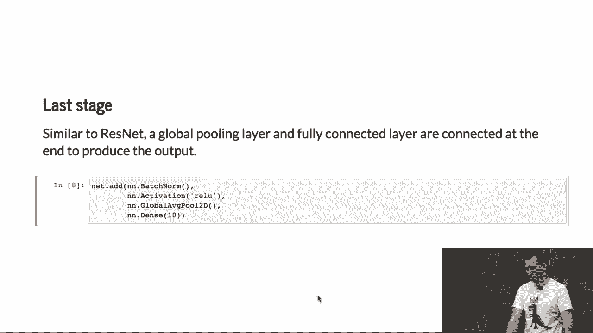
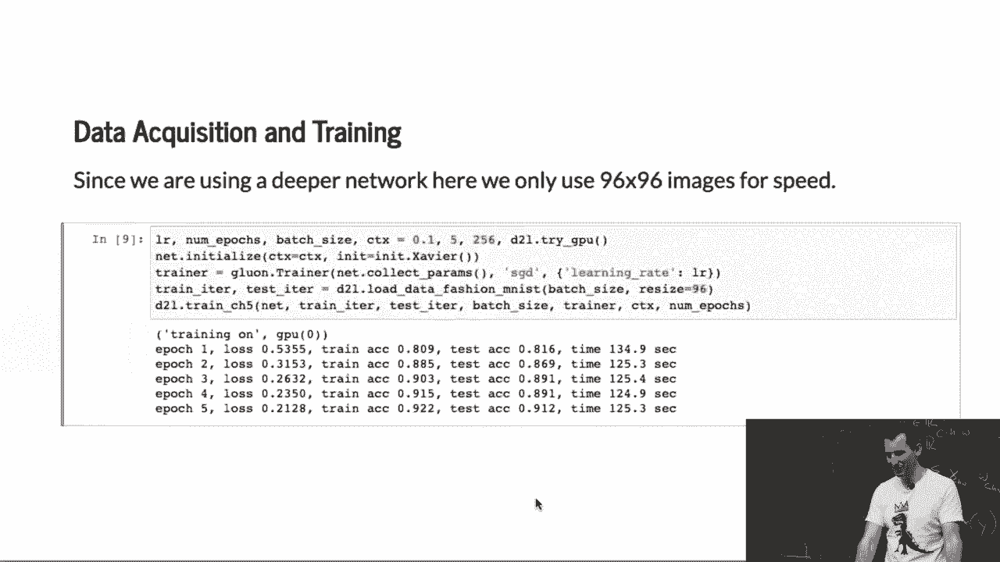

# P75：75. L13_8 DenseNet在Python中的实现 - Python小能 - BV1CB4y1U7P6

让我们来看一下实际中的例子。记住，这本质上是这个函数展开，X。F1(X)，F2(X)，F1(X)，F3(X)，F1(X)，F2(X)，F1(X)，等等等等。所以这是图示。现在让我们看看如何在Python中实际编写代码来实现这个。

所以我有一个卷积块。我的做法是，这是一个简单的块，仅仅加入了批量归一化激活和2D卷积。所以这只是一个简单的对象。接下来我们需要一个密集块。

所以它基本上增加并构建了几个卷积块，具有不同数量的通道。所以现在我做的事情是，我说，好吧，我正在将原始块与我前一个网络的输出进行连接。所以我得到的堆叠会越来越长。这就是我的密集块。

你可以看到，随着我继续这样做，计算的高阶项会有更多的参数，因为输入更大。所以如果我们用数据来测试这个，嗯，我们会得到，如果我有这个密集块的话。

具有10个特征和两次迭代。所以我选择三个通道作为输入。然后我添加两次10个通道。结果，我将得到23个通道。从构建上来看，这很直接。到目前为止有什么问题吗？

所以现在，当然，如果我一直这样做下去的话。

尽管维度会无限增加，所以我需要将其压缩回去。一种压缩的方式就是执行另一个2D卷积。我们方便地通过减少维度来实现这一点。所以我基本上有这样一个阶段，我的嵌入在通道数上爆炸。

然后，我将其压缩回更易处理的东西，同时也在降低分辨率。这是正确的做法，因为你几乎不想先降低分辨率，再构建特征，否则你就已经丢失了所有相关的部分。

对了，你可以看到，如果我看一下输入之前，我有23个维度，然后之后，嗯，如果我有一个过渡块将其减少到10，那么我就得到了10个通道，且是4x4。简单的批量归一化，ReLU，然后一个减少通道数的卷积。接着，我在这种情况下使用了平均池化。

但对了，也可以使用不同的池化方法。

现在来看我们的Dense-Step模型。好吧，最初，我们就像任何其他优秀的网络一样，从几次卷积和池化开始。然后我基本上就有了这些通道数的增长速率，对吧？在这个模块内的卷积数，我们有这些。接下来我加了一个密集块，对吧？

然后我使用了一个过渡块。为了这个，我需要弄清楚在那之后需要多少通道。所以我使用了一个习惯性的通道数。就是这样。所以这基本上就是一个DenseNet的设计。

最后阶段就像你知道的，全局平均。所以你可以看到，这种方式变得相对可预测和乏味，因为所有这些网络都共享很多共同的设计模式。这样做是好事，因为至少现在大家都有一个共同的设计模式，知道该如何构建对象识别器。

然后你进行训练。它表现得相当不错，但不一定比ResNet或ResNEXT更好。所以，它确实需要很长时间。这个非常长的时间很大程度上与中间表示可能变得非常庞大有关，因为我们不断堆叠通道。换句话说，前向传递的计算并不比反向传递便宜多少。

与标准ResNet相比，你会发现，标准ResNet能够更好地控制参数数量。但就这些了。是的。更大的中间表示对于迁移学习有好处吗？

它对迁移学习有益吗？不一定是这个。我们还没讨论迁移学习的部分。穆会讲解其中的一些内容。嗯，可能是在星期四或者下周，但别担心，考试时你不需要了解这个。所以迁移学习基本上是这样：假设我在一个数据集上训练一个人脸识别器。

然后我想将它用于不同的数据集。请注意，迁移学习通常有效，但并非总是如此。例如，如果我在英语数据上进行迁移学习，然后想要应用到克林贡语上，可能不会太成功。好吧，大家都知道这一点。

我们通过痛苦的经验发现，如果你在ImageNet上进行训练，然后想将其应用于卫星图像，效果也不好。这比克林贡语的例子不那么显而易见。是的，有问题吗？为什么你要对那个词这么做？当然，那个词不是。因为它实际上在生成特征表示方面效率并不高。

ResNet已经包含了大部分与身份相关的扩展，这也是它相对于Inception的大优势。去使用更高阶的项并不会带来太多好处。实际上，训练起来可能会稍微不那么愉快。这也是为什么可能没有人花太多时间调优它的原因。它实在是太昂贵了。

所以总体来说，如果你有一个固定的计算预算，可能会更明智地将你的固定计算预算用于像ShuffleNet、ResNet之类的东西。ResNet可以对通道进行划分。有没有可能有一些奇特的组合，能够将这些方法结合起来使用呢？

可能是的。例如，有一种叫做Amoebanet的东西，谷歌的一些人使用遗传算法来基本上掷骰子，烧掉大量TPU，以此来设计一个非常、非常复杂的网络。而这个非常复杂的网络在某一个特定问题上表现得非常好。问题在于，从中你并没有真正学到很多关于这个问题的东西。

不再是结构化的了。这就像，嗯，它不完全是一个二进制块，但它像是一个网络块。是的，只需使用它，事情就会顺利进行。结构上的改进，尤其是当你关心效率时，可能会更好。是吗？

>> 就是人们尝试连接多个以前使用过的层，而不是所有之前的循环。 >> 所以ResNet，抱歉，DensNet实际上连接了多个以前的层，对吧？

你不断堆叠表示，是吧？从这个角度来看，答案是肯定的。这就是DensNet的做法。现在，有几篇后续论文讨论了这种方法的一些缺点。例如，你可以尝试构建一个网络，在早期就决定是否应该投入额外的计算努力。

假设我想识别一只猫，且它显然就是一只猫，那么我其实并不需要做太多工作。我可能可以更早地进行截断。从理论上讲，这样做确实可以简化问题，但在实际操作中——问题就在这里。如果我给你100张猫的图片，哪一张会容易呢？如果你事先知道这个问题，情况就会不一样。

那么，生活将变得非常简单。所以你基本上需要做的是，进行某种形式的动态批处理，你可以在第一阶段后丢弃所有容易识别的猫，然后在第二阶段后再进行一些计算，依此类推。所有这些额外的开销可能完全抵消你认为使用低flops计数的方案可能带来的好处。

所以并不是每一个理论上的改进都能在实践中有效。我自己在某些情况下也吃过这个亏。在一个非常不幸的情况下，某人使用了一个更高复杂度的算法，在实践中击败了我们。因为CPU非常适合这种情况，而我们的方法却不行。

所以这是你在提出一个新的网络时，通常需要探索的权衡。否则，这只会成为一篇论文，之后没人再使用它。还有其他问题吗？好，谢谢大家。

