# P78：78. L14_3 Hybridization in Python - Python小能 - BV1CB4y1U7P6

 So let's start with， let me do， to min a little bit。

 So let's start with how to define imperative programming in Python。 So here we define function called add， given a and a b， we just return a plus b。 And some fancy function that given a， a， b， c， d inputs， and just to do three ads and return g。 If it causes function given data， one， two， three， four， we're going to get the results。

 That's as normal as what we have before。

 You may be don't know that in Python you can actually use in symbolic programming。 That is。 we first define function， it do add， but doesn't actually compute that。 There returns a stream function which is doing the thing， which is going to do the work for you。 Similar thing， for the fancy function we just return a string of the function which you do the workload。

 The program here is that we get add definition， get the fancy function definition。 and then we print the evaluation here。 So far， until this moment we didn't get anything wrong。 we just defined function。

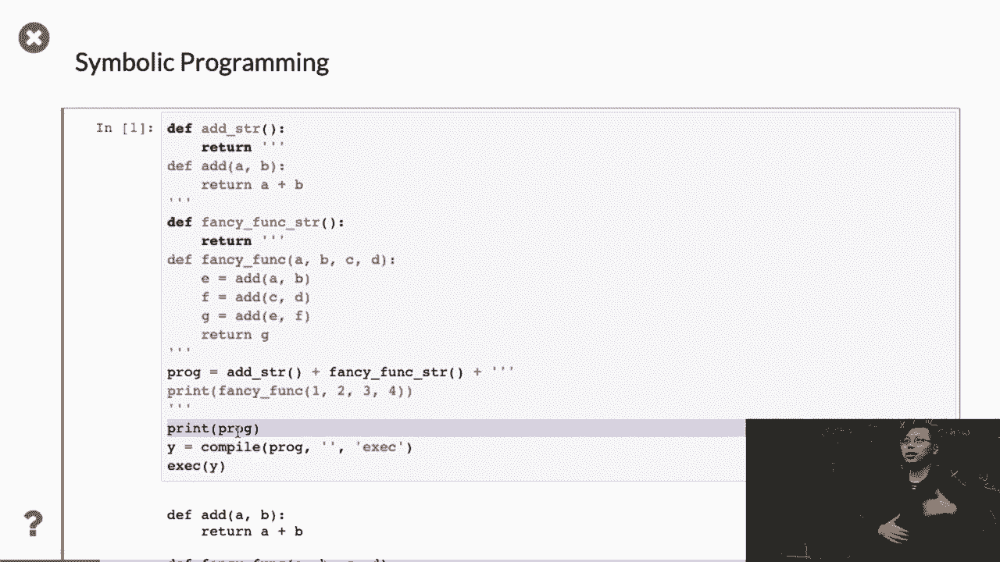

 So we know that if we print this one we cannot get a bunch of definition here。 Then we compile this function， this string function， to get as good for y。

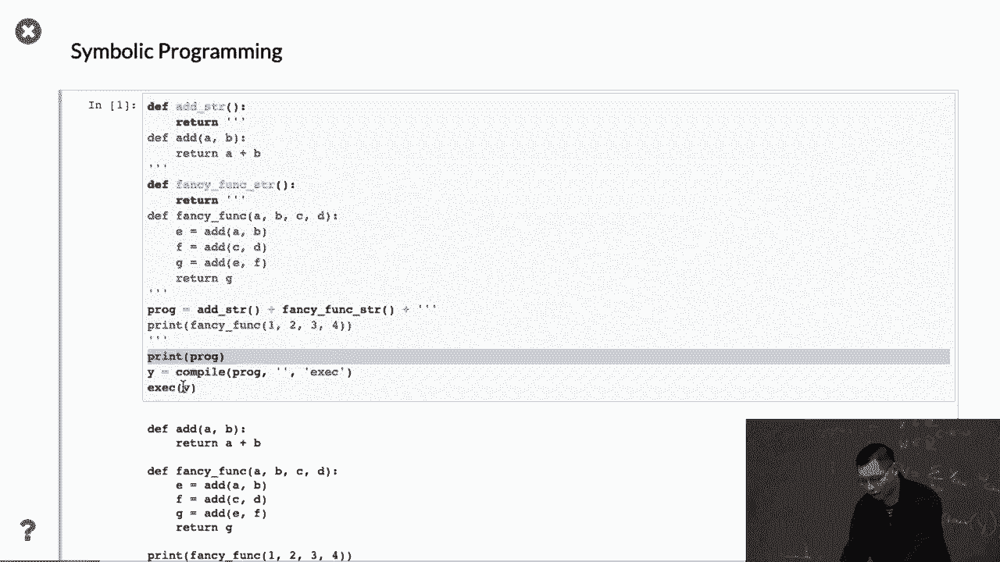

 And this is， this Python's， uh， as good to run the function。

 And then finally we cannot get the final result， let me do it。 You find out we get the results 10 here。 Okay， so this is symbolic programming in Python。 You may be never used that before， it's so hard to use。

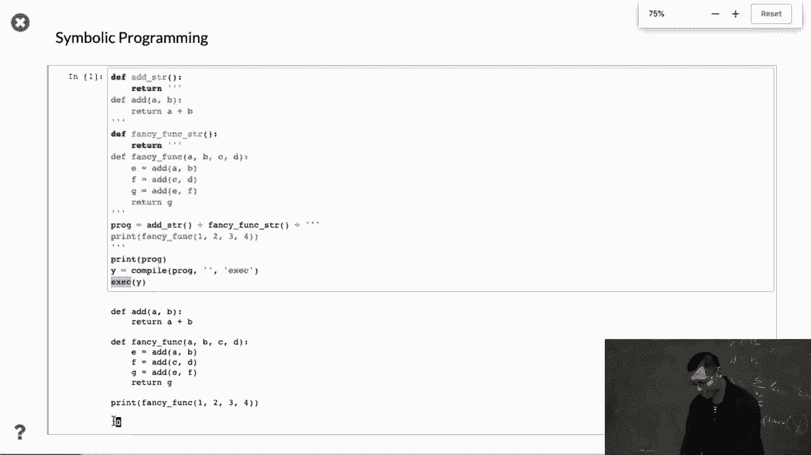

 Okay， so then， in M's net， let's show example how to use a hybrid sequential。 Let's import library and the only difference here is to， from。 undors sequential to undors hybrid sequential。 That's the only difference we have。 The following string lines we just add three dense layers， it's as same as before。

 And then we initialize the network， return the network。 Next we create a random variable x and get the network and feed x into net， work， get the results。 That is what we had before。 Okay， so this one， it's， uh， executed in the imperative model。

 Now we can call net for hybridize。 We have， for the back end。 we're going to switch to this symbolic execution。 Um， so， but nothing have changed on the front。 You feed the same x， we get the same results。 Like， as here， the results should be similar to here。

 Nothing have been changed in terms of the results。

 Okay， so that's using net or hybridize， we can switch to the hybridize model。

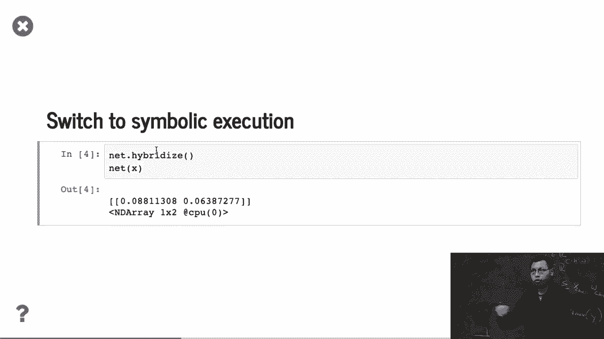

 We can benchmark the performance here。 So we define benchmark function。 which can run the forward pass by 1000 times。 And then wait。 we're going to show why we have a wait all here， but wait all the。 competition have been finished and the printed time。 First。

 we create a network and a right benchmark it without hybridizing。 Then we call hybridize a benchmark again。 You can see that， like without hybridizing， take about 0。2 seconds。 With hybridizing， it can be a two-time speed up here。 Okay。 the reason is because we explained before， after hybridizing。

 we just compiled code one and run for the back end。 So we can get rid of the Python overhead here。 And because the network itself is pretty simple and we run thousands of， network and in 0。1 seconds。 which means the network workload is pretty small， the Python overhead is a relative large component to the workload。 In this case， you can think about like at least 0。1， 3 seconds is due to the Python overhead。

 Question。 >> So in this example before hybridizing， when you call net， events。 are you seeing like in the forward function， it has to step through each line。 >> So yes。 we can uncover that in detail in a little bit later。 >> Yeah。 >> Can I cover how it works？

 >> And when you hybridize it， what do you compile it to like C， C++ or something？ >> Yes。 we're going to do。 Yeah。 Another question？ >> What are the 30 cases in which a line that does hybridize。 takes a very long time？ >> You mean the cases after hybridizing take a long time？ >> Yeah。 >> The operation of hybridizing the network leaves a lot。

 >> Usually hybridizing is always faster than the imperative model。 >> And then what happens in hybridize？ Just taking the network in hybridize。 So the line that does hybridize about time and a long time。 >> Well。 we probably will not dive into so much deep how hybridize works。

 but usually you don't need differences like hybridizing。 Maybe you don't give too much benefit。 but usually at most you， don't worth your computation。 That's all。 But the compiler itself is pretty fast。 It's like you can ignore that。 Okay。

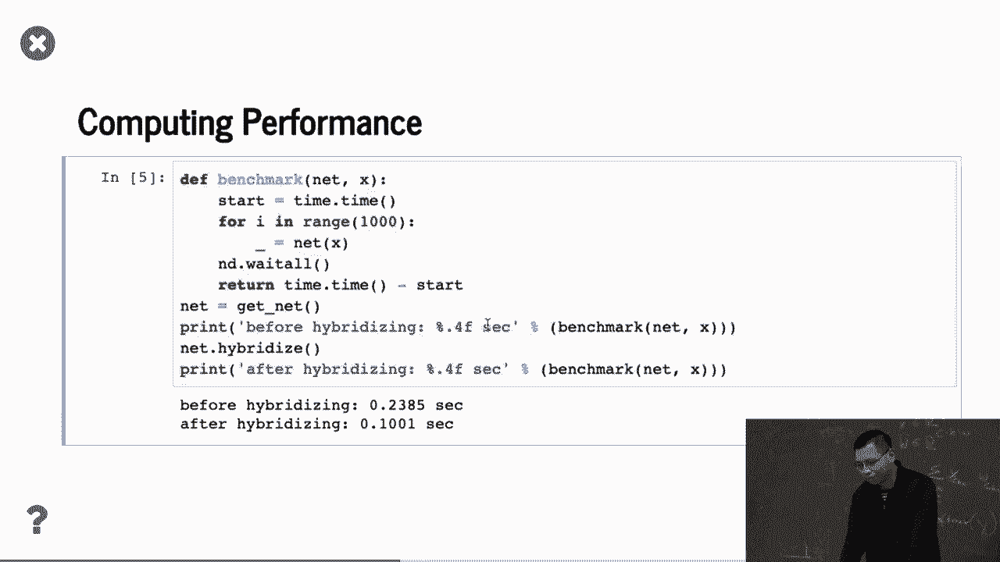

 So then once you hybridize that， you can export this one， the。 network definition into intermediate representation。 When you do that。 it is going to save into the name of your workload。 and dash symbol with a symbolic representation and a JSON fire。 We print the first 20 lines for the code。 You can see that this is a bunch of nodes。 This is a computation graph actually。 Define the network。 So this fire， let's own， is a JSON fire。 It's independent of Python。 Let's load back into C++ or Java back end or you can load back into。 Python as well。 Which means it's portable。 You can get this JSON fire and deploy into mobile phone。

 Okay。 Question。 >> Are there Java fun ends for nx？ >> Yes。 So we have Java and Scala front end。 You may have a Java script。 That's a joke。

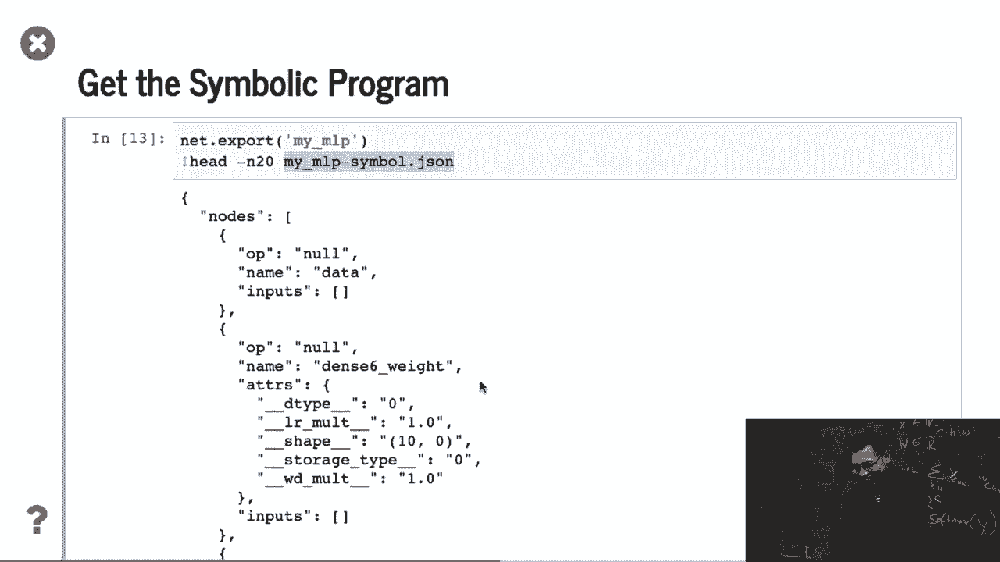

 Let me go through a little bit how hybridize works。 The other way we can do the un。habit block here。 The in-the function is not defined to before。 We defined two dense layers here。 The only thing here happens here。 We don't define a forward function。 We do a hybrid forward function。 And one change here we add in F here。 Before we don't have F。

 F is a function of space。 In the imperative model， F is just an indian space。 When in the symbolic model， F is just symbol module。 It's another net space。 We can show you a letter。 We can print what is F and input X， send thing， give X to the。 hidden layer and the value here。 Note that the value can form the function space F。

 So in normal it's just an d。 Then we print the output of the hidden layer and put into the。 output layer and return the result。 That's as normal as before。 But we're just adding three print here。

 Let's do that。 Define the output， initialize it， get X and run the forward， function here。 You can see that firstly， F is just an m send and d array。 We print X。 The input X is just an d array。 The hint of the output is not an array as normal。 We see that before and we get output here。 That's normal。 How you debugging things。

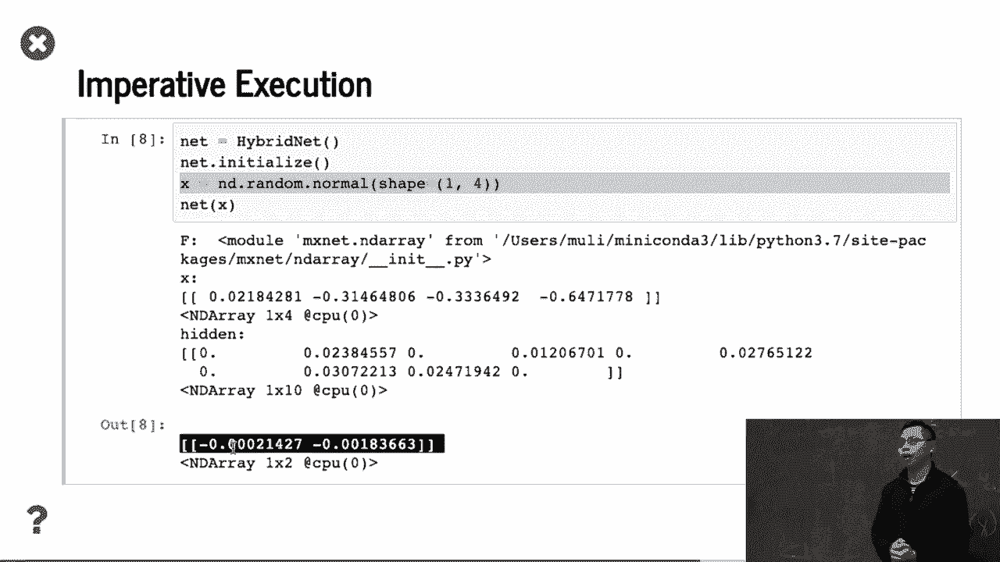

 We can write the game， send results。 Def is the d array， input X。 the output of the hidden layer and。

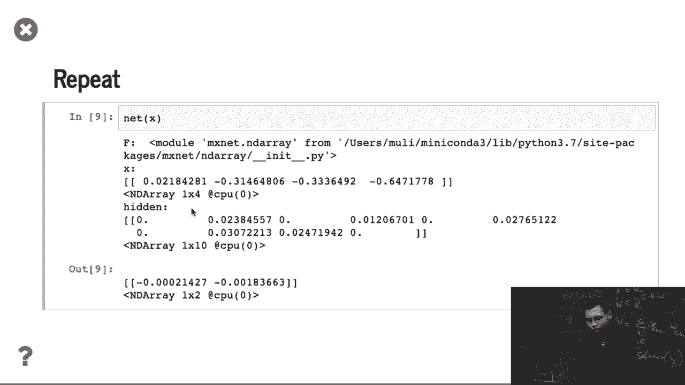

 output layer。 Next time， here's the interesting thing。

 We can hybridize switch to the symbolic mode。 Then we run another game。 You can see that F has been changed to the symbol module。 You can think it's almost identical to the undi， but it's， in the symbolic presentation。 Any function available in the undi namespace is also available， in the symbol namespace。 What is X？

 X is not an d array anymore。 X is a symbol。 It's called data。 The length data。 The hint of output。 the hint of the layer is not an d array anymore。 It's just a symbol。 It's a symbol symbolic of the variable。 But at the end， we still get output here。 Nothing changed at the end。 What we actually do here is that -- let's go back to the。

 definition here -- remember what impiles how we do is， symbolic programming。 So this function。 again， will not run the real workload。 It just construct the symbolic expression as we defined the。 program stream before。 Here， X is a symbol input。 F is a symbol named space。 Then up here。 we just construct the symbolic program。 After that， the system we compile this program and feed it。

 with the data you actually put here and run the results。 So it has an additional construct and new network， compiled and run the results。

 So what happens if you're going to run after hybridize， you're going to run the game。 Right again。 you only get the results。

 You will not see all the intermediate things。

 That is because we only construct the graph once。

 So which means this function can only be run to once。 The first time you write。 we construct a graph， compile it， and cache in the back end。 The next time you're going to write。 I'm not going to run， all the Python code so it can reduce the time。 No matter how low the program you have， I don't need to execute。

 one by one so I can reduce all this overhead。 So this benefit from performance。 but the problem here， yes， again， print doesn't work anymore because you don't get。 the data yet at this point。 At this point， at only run once。 Only the first time time you get the print results。 The second time you will not get any results。

 So to debug this program， you need to add the print function。 provided by the underlying space to get the fancy to get it wrong。 Question。 >> You said they'll print it the first time， but not after that。 >> Yeah。 >> The first time you need to run the program to construct a， computation graph。

 When the graph is done compiled， we are not going to run this， function anymore。 Next time。 just to call the compiled objects here。

 >> So when you call it that equals hybridized dance。

 >> Yeah。 >> Hybridized， yeah。 >> So after you call it that hybridized， the computation graph。 is constructed？ >> No。 This one can hint the back end and not switch the symbolic， execution。 If you can't run the fourth pass here， which is net x， we can。

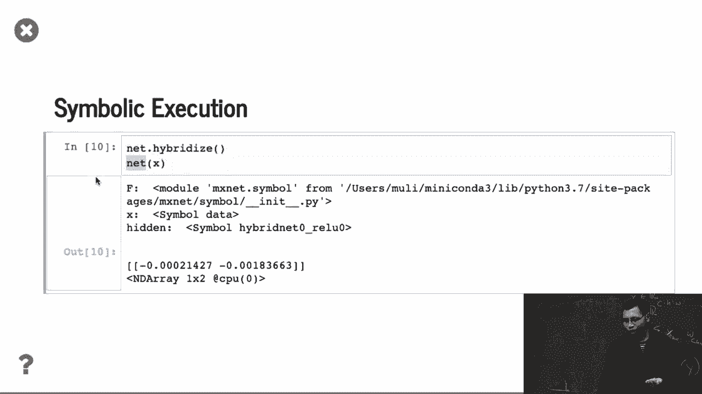

 run this function， which is going to run this function hybrid， of forward。

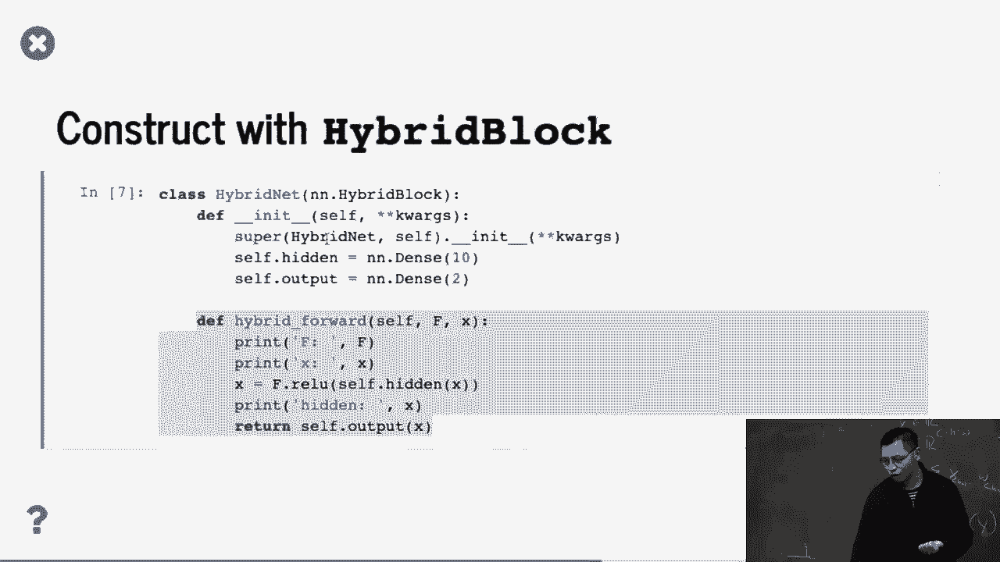

 The first time you run it， you can construct a graph and do， the thing。

 Similar to what we had the beginning。 So similar thing to here， you first run the fourth function。

 and actually just give the string of the program。 And then the system will automatically insert these three。 things， compile it， use things at the end。 But the second I run it， I just run the s-cut。 It's good。 why？ And without running anything here。 >> So even though it's an end hybrid block。 it's not symbolic， until you call net。 >> Yes。 >> It's still imperative on net。 >> Yes。

 >> So because symbolic is so hard to use， we don't encourage。

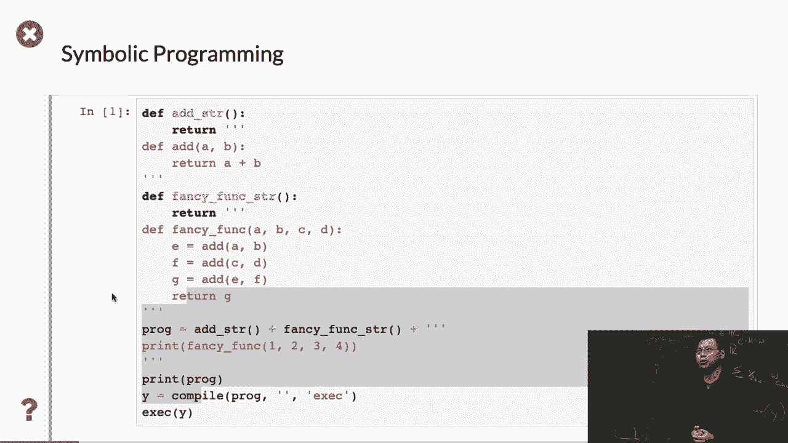

 people to use it at the beginning。 So in practice， what we do here， just using normal imperative。 work to debug， to write a code and to test anything。 At the end， you think everything is normal。 Now I can run a large dataset， switch to the hybrid model and， run the experiments。 And also you're going to train the model， you're going to， deploy into your mobile phones。

 you can use hybrid model。 That's only thing you're going to use it。 But before you debug。 everything just to keep it imperative。 Okay， so that's the end of this。

