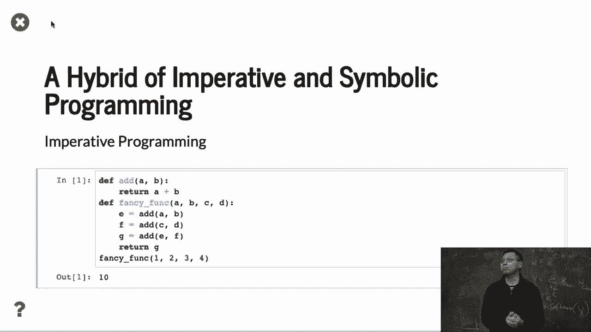
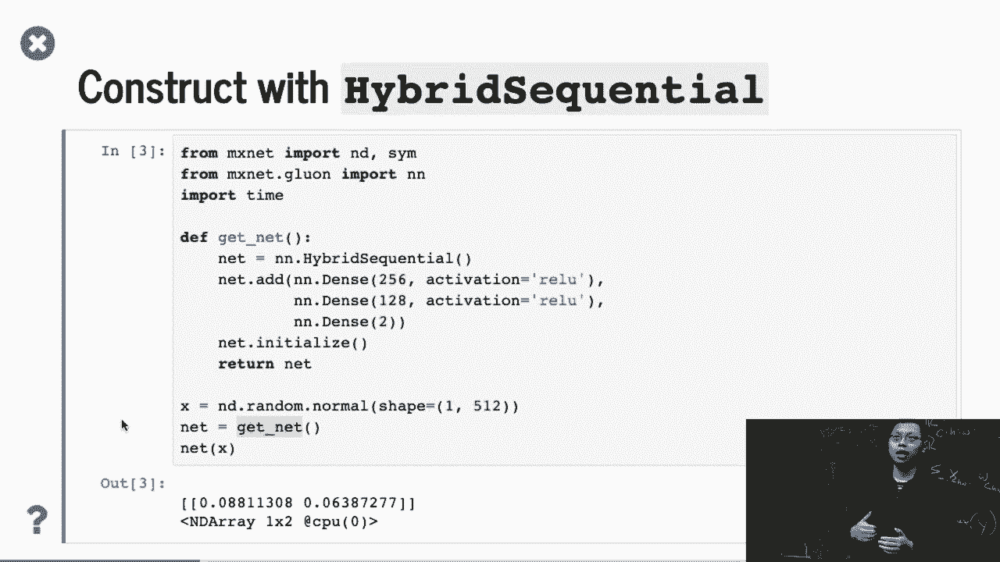
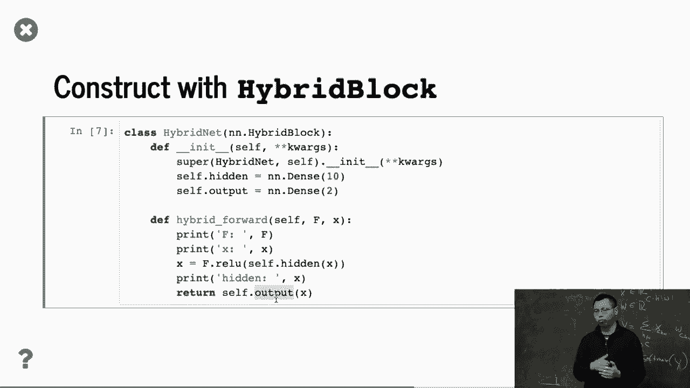
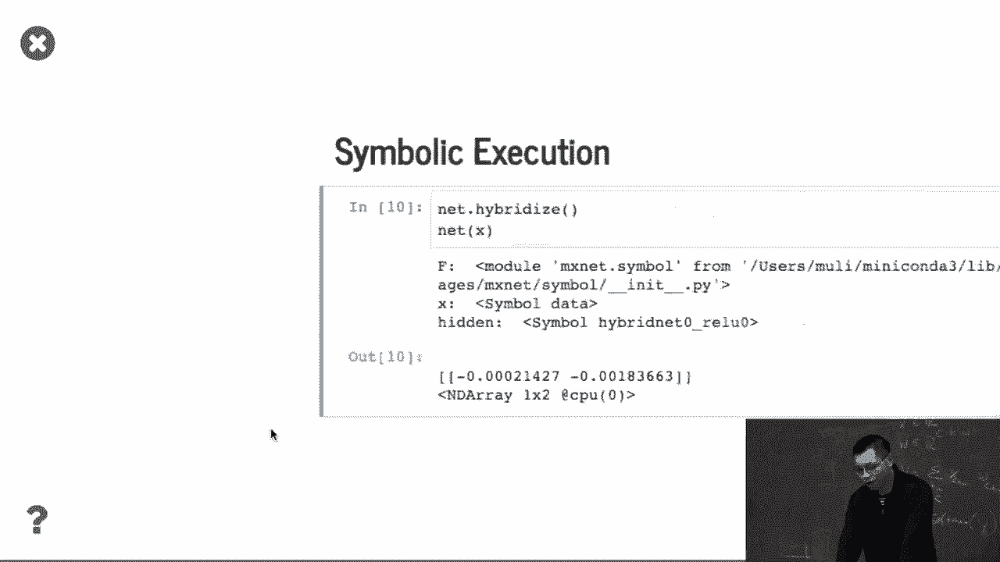
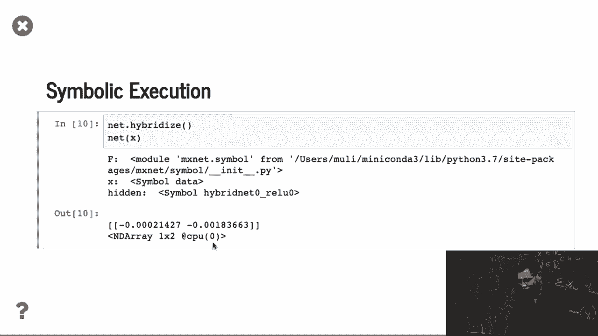
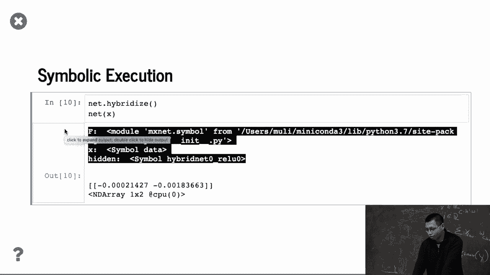
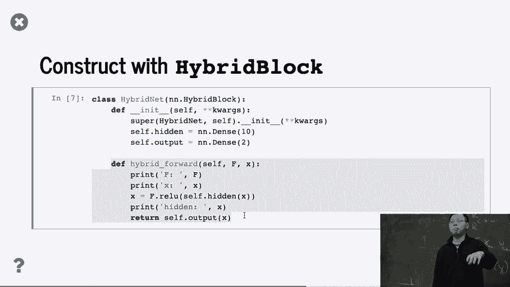
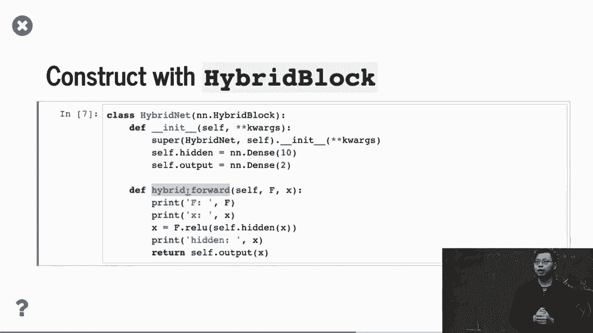
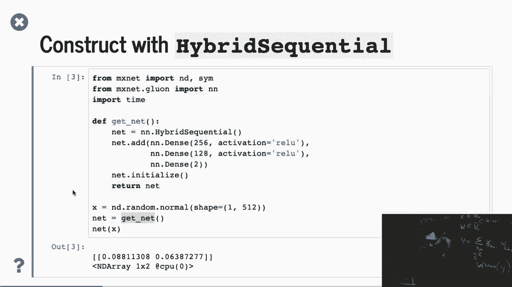

# P78：78. L14_3 Python 中的混合化 - Python 小能 - BV1CB4y1U7P6

所以让我们开始吧，稍微做一点调整。

所以让我们开始吧，看看如何在 Python 中定义命令式编程。这里我们定义一个叫做 add 的函数，给定 a 和 b，我们返回 a 加 b。然后是一个 fancy 函数，给定 a、b、c、d 作为输入，做三个加法运算并返回 g。如果它是一个函数，给定数据 1、2、3、4，我们将得到结果。

这和我们之前做的一样正常。

你可能不知道，在 Python 中，你实际上可以使用符号编程。那就是，我们首先定义一个函数，它做加法，但实际上并不计算它。它返回一个流式函数，正在为你做事，完成工作。类似地，对于 fancy 函数，我们只是返回一个字符串函数，它处理工作负载。

这里的程序是，我们获取加法的定义，获取 fancy 函数的定义，然后我们在这里打印评估结果。到目前为止，我们没有出现任何错误。我们只是定义了函数。

所以我们知道，如果我们打印这个，我们将无法得到一堆定义。然后我们编译这个函数，这个字符串函数，得到 y 的结果。

这就是 Python 的，嗯，执行函数的方式。

然后最后我们无法得到最终结果， 让我来做吧。你会发现我们得到了这里的结果 10。好的，这就是 Python 中的符号编程。你可能以前从未使用过，使用起来非常困难。

好的，那么在 M 的网络中，让我们展示如何使用混合顺序。让我们导入库，唯一的区别是，从 `undors sequential` 改为 `undors hybrid sequential`。这就是唯一的区别。接下来的几行代码，我们只是添加了三个全连接层，和之前一样。

然后我们初始化网络，返回网络。接下来我们创建一个随机变量 x，获取网络并将 x 输入到 net，进行计算，得到结果。这就是我们之前所做的。好的，这个是以命令式模型执行的。

现在我们可以调用 `net.hybridize()`。对于后端，我们将切换到这个符号执行模式。嗯，所以前端没有任何变化。你输入相同的 x，我们得到相同的结果。就像这里一样，结果应该与这里类似。

结果没有发生任何变化。

好的，使用 `net.hybridize()`，我们可以切换到 hybridize 模式。

我们可以在这里基准测试性能。所以我们定义了基准函数，能够运行1000次前向传播。然后等待。我们将展示为什么在这里我们使用了`wait all`，但所有竞争任务已经完成，并打印了时间。首先。

我们创建了一个网络并进行了基准测试，但没有进行混合化。然后我们再次调用混合化进行基准测试。你可以看到，没有混合化时大约需要0.2秒。进行了混合化后，速度提高了两倍。好的。原因如我们之前所解释，混合化后。

我们只是编译了代码并在后端运行。所以我们可以消除Python的开销。因为网络本身非常简单，我们在0.1秒内运行了成千上万次网络，这意味着网络工作负载非常小，Python的开销是工作负载中的相对大部分。在这种情况下，你可以认为至少0.1到0.3秒是由于Python的开销。

问题。>> 那么在这个例子中，在混合化之前，当你调用net，事件时，你看到在前向函数中，它必须逐行执行吗？ >> 是的。我们稍后会详细展开讲解。 >> 是的。 >> 我可以介绍它是如何工作的？

>> 当你混合化时，你是将其编译成C、C++还是其他什么？ >> 是的，我们会这么做。好的。还有其他问题吗？ >> 有哪些情况是混合化处理的时间特别长？ >> 你是指混合化后花很长时间的情况吗？ >> 是的。 >> 混合化网络操作会消耗很多时间。

>> 通常来说，混合化总是比命令式模型更快。 >> 那么在混合化中发生了什么？仅仅是将网络进行混合化。那么混合化处理需要很长时间的情况呢？ >> 嗯，我们可能不会深入探讨混合化如何工作。

但通常你不需要像混合化那样的差异化。也许它不会带来太大的好处。但通常最多你，不值得为了计算而做混合化。就这些。不过编译器本身相当快，可以忽略不计。好的。

一旦你完成混合化，你可以将网络定义导出为中间表示。当你这样做时，它会保存为你的工作负载名称，后面加上符号表示和一个JSON文件。我们打印了代码的前20行。你可以看到这是一堆节点。这实际上是一个计算图。定义了网络。所以这个文件，实际上是一个JSON文件。它与Python无关。你可以加载回C++或Java后端，或者也可以加载回Python。这意味着它是可移植的。你可以获取这个JSON文件并部署到手机上。

好的。问题。>> 是否有用于nx的Java前端？ >> 是的。我们有Java和Scala前端。你可能有JavaScript。这是个玩笑。

让我简要介绍一下混合化是如何工作的。我们可以在这里做另一种方法。功能块之前没有定义。我们在这里定义了两个密集层。这里唯一发生的事情是我们没有定义前向函数。我们做了一个混合前向函数。并且在这里的一个变化是我们在 F 中加入了内容。之前我们没有 F。

F 是空间的一个函数。在命令式模型中，F 只是一个 indii 空间。而在符号模型中，F 只是符号模块。它是另一个网络空间。我们可以给你展示一个字母。我们可以打印 F 是什么，输入 X，发送东西，给 X 到隐层，并获取这里的值。注意，值可以形成函数空间 F。

所以在正常情况下它只是一个 d。然后我们打印隐层的输出并将其输入到输出层，返回结果。这和之前的操作一样正常。但我们这里只是加了三个打印。

让我们做一下这个。定义输出，初始化它，获取 X 并运行这里的前向函数。你可以看到，首先 F 只是一个 m 发送和 d 数组。我们打印 X。输入的 X 只是一个 d 数组。输出的提示不像正常情况那样是数组。我们看到之前，并在这里得到输出。那很正常。这是你调试的方式。

我们可以编写游戏，发送结果。Def 是 d 数组，输入 X。隐层的输出和。

输出层。接下来，这里有一个有趣的内容。

我们可以切换到符号模式。然后我们运行另一个游戏。你可以看到 F 已经变成了符号模块。你可以认为它几乎和 undi 相同，但它是在符号表示中。undii 命名空间中的任何函数在符号命名空间中也可用。X 是什么？

X 不再是一个 d 数组了。X 是一个符号。它叫做数据。长度数据。输出的提示。层的提示不再是一个 d 数组了。它只是一个符号。它是变量的符号。但最终，我们仍然在这里得到输出。结果没有改变。我们实际做的是 —— 让我们回到。

这里的定义 —— 记住我们做的是符号编程。所以这个函数，再次强调，不会执行真实的工作负载。它只是构造我们之前定义的符号表达式。程序流在这里，X 是一个符号输入。F 是一个符号命名空间。然后在这里，我们只构造符号程序。之后，系统会编译这个程序并提供给它。

使用你在这里实际放入的数据并运行结果。所以它有一个附加的构建和新的网络，编译并运行结果。

那么如果你在混合后运行游戏会发生什么？对，重新运行。你只能得到结果。

你不会看到所有的中间过程。

这是因为我们只构建了图一次。

这意味着这个功能只能运行一次。第一次你写时，我们构建图，编译并在后台缓存。下次你写时，我不会运行所有的 Python 代码，这样可以减少时间。无论你的程序多低效，我都不需要执行。

一个一个地进行，这样我可以减少所有的开销。这有助于提升性能。但是这里的问题是，是的，打印不再起作用，因为你在这个阶段还没有获得数据。此时，只会运行一次。只有第一次你会得到打印结果。第二次你将不会得到任何结果。

所以为了调试这个程序，你需要添加由底层空间提供的打印函数，以便获取出错信息。问题是：>> 你说第一次它会打印，但之后不会。 >> 是的。 >> 第一次你需要运行程序来构建计算图。

当图完成编译后，我们将不再运行这个功能。下次只需要在这里调用编译后的对象。

>> 所以当你调用它时，就会进行混合化的处理。

>> 是的。 >> 混合化，是的。 >> 那么在你调用混合化之后，计算图就会构建吗？ >> 不会。这只会提示后端，但不会切换到符号执行。如果你不能在这里运行第四次传递，也就是网格 x，我们可以。

运行这个函数，它将运行混合的前向函数。

第一次运行时，你可以构建图并执行相关操作。

类似于我们开始时的做法。所以在这里，首先运行第四个函数。

实际上，只是给出程序的字符串，然后系统会自动插入这三个东西，进行编译并最终使用。但是第二次运行时，我只运行了 s-cut。很好，为什么？因为这里没有运行任何东西。>> 所以即使这是一个结束混合块，它不是符号执行，直到你调用网格。 >> 是的。 >> 它仍然是命令式的在网格上。 >> 是的。

>> 所以因为符号执行非常难用，我们不推荐使用。

在开始时，大家会用它。所以实际上，我们在这里做的，只是使用普通的命令式工作来调试、编写代码并进行测试。最终，你会认为一切都很正常。现在我可以运行一个大数据集，切换到混合模型并运行实验。你还将训练模型，并将其部署到你的手机上。

你可以使用混合模型。那是你唯一会用到的东西。但是在你调试之前，所有的事情都要保持命令式。好了，这就是全部内容。

