# P79：79. L14_6 Python 中的多 GPU 训练 - Python小能 - BV1CB4y1U7P6

对于多 GPU，你需要确保你有多个 GPU。所以你可以在这里运行这个过程。例如，我这里确实有两块 GPU。

有一个比较慢的 GPU 是 M60。它大约是三、四年前的 GPU，但它非常便宜。我这里有两块 GPU。

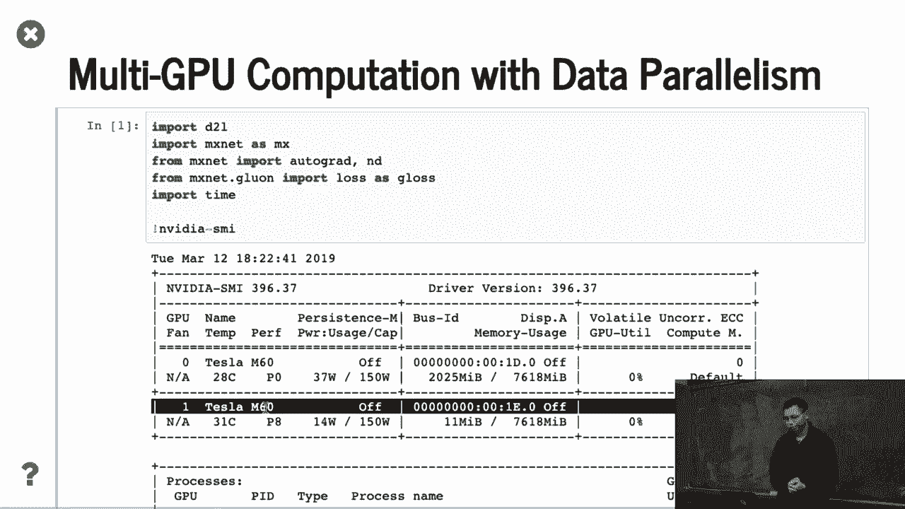

好吧。然后我们从零开始使用 Lillat。我们可以像这样做很多这部分内容。我们定义参数。我们定义单子（monad）并完成相关操作。这里有一点。

参数本身是在 CPU 上。所以我们需要将它们复制到不同的 GPU 上。我们在这里做的是，我们定义一个函数。获取参数，给出 CPU 上的参数，并给出上下文，这个上下文是一个 GPU。我们在这里做的事情是，对于每个参数，我们不能复制到这些上下文中，得到新的参数。

然后触及梯度，因为我们要计算梯度。举个例子。我们可以展示，如果我们复制到 GPU 零，我们可以看到第一个权重已经在 GPU 零上，并且偏差也在 GPU 零上。好吧？

第二件事是我们需要对不同 GPU 之间的梯度进行交叉计算。同时，我们在这里只复制梯度回去。那么我们在这里做的是什么呢？数据只是一个跨不同 GPU 的数据列表。我们可以找到所有的梯度——这里的一些值，并复制回去。那么我们做的是一种非常简单的方式来完成这件事。

对于每个数据，除了第一个，我们只是将数据复制到 GPU 上，然后对 GPU 和第一个数据的结果进行乘积。然后将其加到数据零上。所以我们在不同设备之间对数据进行求和。然后我们只需要复制回求和后的数据。将其复制回每个数据 I，除了第一个。所以这就是所有的内容。跨不同 GPU。

例如，这里，我们创建了一个示例。在 GPU 零上，一个，在 GPU 一上。都是二，然后在所有的减少之后，我们将它们加在一起，GPU 零和一都得到三。好吧？我们展示的另一个事情是我们需要进行分解。

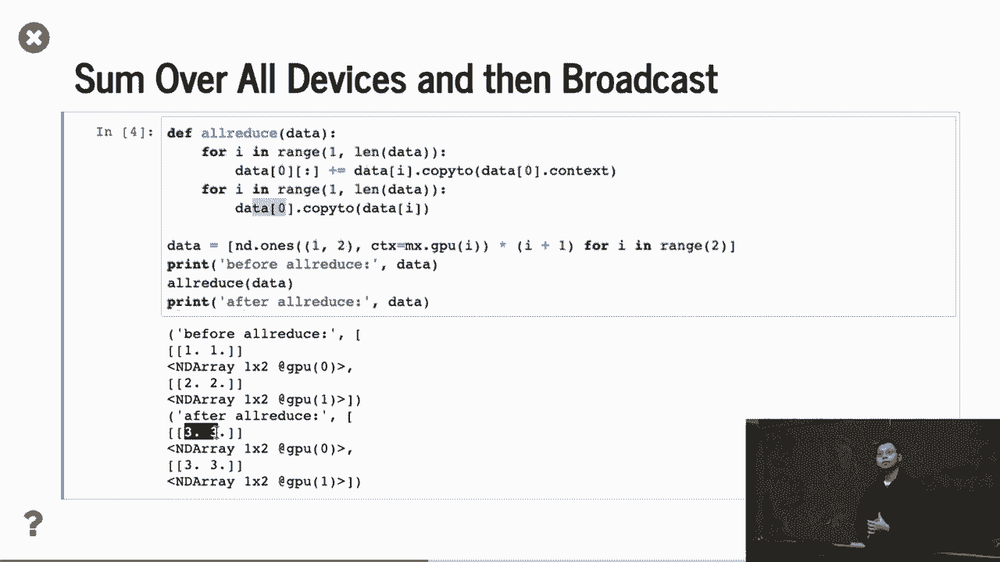

将批处理大小分成多个部分，然后发送到不同的 GPU。所以很快，数据是一个数据批次。我们有上下文，一个上下文列表。我们在这里做什么？

假设我们有 K 个 GPU 和数据中的示例。我们可以假设简单的情况是可以被分割的。也就是说，每个 GPU 上有 m 个示例。总共有 K 个 GPU，每个 GPU 获取 m 个示例。我们可以进行双重检查。这就像一个简单的例子。然后对于每个部分，我们将每个部分切分并返回作为联系，作为 IC GPU 和保留的部分。

我们可以返回批次的列表，每个批次在每个 GPU 上。所以这里，举个例子。如果输入在 CPU 上，它有多少个？一，二，三，四，五，六。我们在 CPU 上有六个示例，我们想要加载到两个 GPU 上。

GPU。你可以看到前面三行被分配到GPU零，底部三行被复制到GPU一。好的。这就是数据集的划分并复制到不同的GPU中。明白了吗？那么这里是关键。

如何在单一批次中实现这些操作。

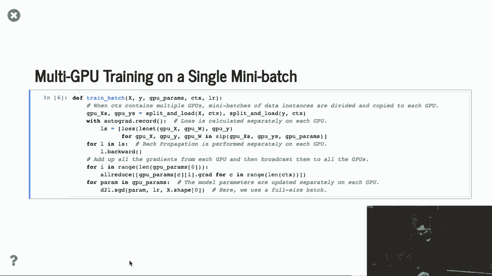

因为所有这些并行化的结果都在批次大小范围内。所以这里的X和Y是一个批次。这是GPU参数的列表，和需要生成的编解码器列表。我们首先做的是，给定批次，我们可以将其拆分并加载到不同的GPU中，X和Y都一样。所以这是一部分X，而Y是一个Y的列表。然后在自动梯度的范围内。

我们将运行，给定部分数据，所以这是事情的关键。我们遍历每个GPU。这是一个GPU的X，一个GPU的Y和一个GPU上的参数。对于每个GPU，我们运行第四次传递，给定网络X和W并计算损失。计算损失在这里。所以这是我们单个GPU的情况。因为我们有四个循环，我们遍历多个GPU。

所以这里的损失就是列表。如果你有四个GPU，你就有四个损失。然后对于每个损失，我们将进行反向传播，这意味着每个GPU将并行进行反向传播。所以当梯度完成后，我们已经使用了梯度。看这里的梯度，一些梯度已经合并，然后将一些梯度复制回每个GPU。最后。

对于每个GPU，我们在每个GPU上运行X，G，D。好的，所以我们按顺序运行这些东西。通过自动并行化，系统会为你并行运行所有这些。所有的数据复制和计算都会并行执行。到目前为止有任何问题吗？好的，很简单。好的。

所以训练函数与我们之前使用的其他函数没有太大区别。就像这里一样，我们创建了一个包含GPU数量的联系列表。然后我们需要将参数复制到不同的GPU中。接着我们运行四个数据epoch。然后在这里，对于每次，我们读取批次并在多个GPU上运行该批次。

在这里我们加入了权重，所有这些仅仅是为了基准测试目的，并不是为了其他任何目的。然后我们打印一些东西。好的，就这些。

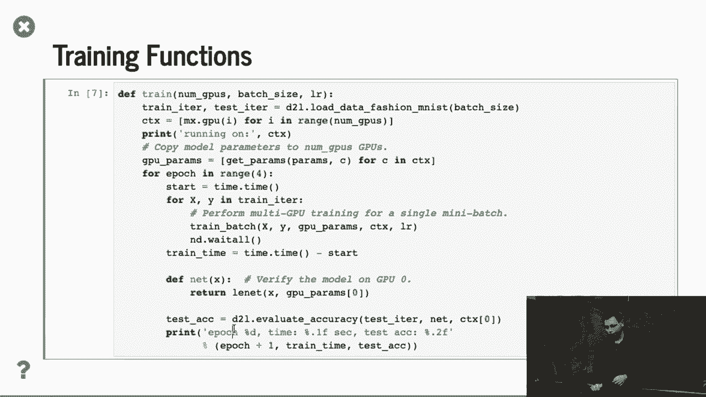

现在我们可以在这里尝试一些结果。所以首先，我们将使用单个GPU。批次大小为256，分子等于0.2。你可以看到这里每个epoch花费了2.2秒。准确率也有所提高。然后我们将GPU数量改为2。因为我们固定了批次大小，固定了分子，所以没有任何变化。

只需要改变GPU的数量，你将获得几乎与之前相同的准确率。所以你可以首先检查准确率，它非常相似。因为我们随机化了初始值，结果有一点不同，但准确率变化不大。但是我们希望它能更快。

但你可以看到，使用两个GPU并没有让速度更快。一个GPU是0.2秒，两个GPU也还是2.3秒。没有太大的差别。原因是，现在我们有两个GPU，每个GPU每次只处理28个批量大小。这意味着每分钟批量减少，从而影响性能。

同时，我们也有一些通信开销。而且非增量部分非常小。我们可以稍后展示ResNet。然后，通信开销稍微大于计算本身。实际上这里并没有带来太多额外的开销。我们能做的是确保每个GPU都得到相同的批量大小。这意味着两个GPU。

我们将总批量大小加倍，变为5到5。因为我们加倍了批量大小，我们也可以稍微增加线性度。稍后也许我们无法解释为什么我们不能增加线性度。这里有很多因素。所以你可以添加到列表中。你会看到尽管时间减少了，但并没有完美地加速两倍，因为正常情况太简单了。但仍然可以得到一些改进。

然后检查准确性。实际上，它的表现比之前更差了。因为这个批量大小，或者说线性度也不太好。因为我们更改了优化方法。好吧，到目前为止有问题吗？有问题吗？

>> 如果你是第一个喜欢这种数据批量大小，并且，从左到右，你也可以减少时间，或者看看你能做什么。 >> 这倒是真的。那么问题是，嗯。你总是可以改成5，12。我这里不会运行。也许我可以尝试一下。

让我尝试一下，看我是否能运行这个ticker libio wire。

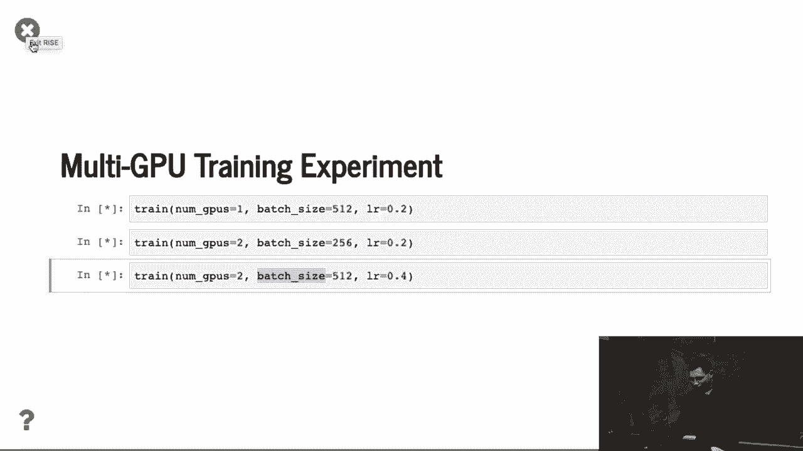

>> 是的。

如果我们改变更大的批量，你可以把时间从0.4秒减少到。

少于两秒钟。那么这个就太慢了。

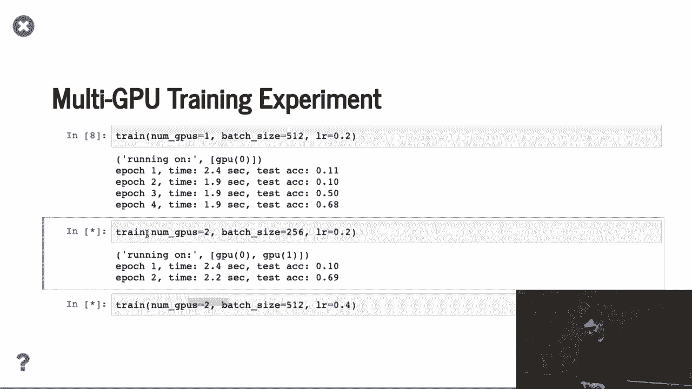

让我停一下，让我完成它。如果你能增加批量大小，我也可以增加批量大小。让我来试试。你看到了吗？问题是，像None这样的小批量，通常受限于GPU内存。例如，如果你要训练ResNet，最大批量大小是32。不能更多，因为需要大量的内存。

GPU内存，训练内存是与批量大小成线性关系的。因此，给定单个GPU，你有一个上限。如果是多个GPU，我可以选择最多256。但同样，显示出这个大批量大小会使收敛变得更慢。

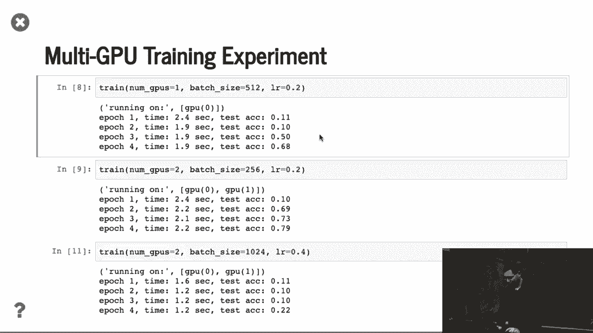

让我们展示如何使用一个更大的批量，类似的做法。

这里唯一不同的是我们可以使用ResNet18作为例子。因为None批量太小了。

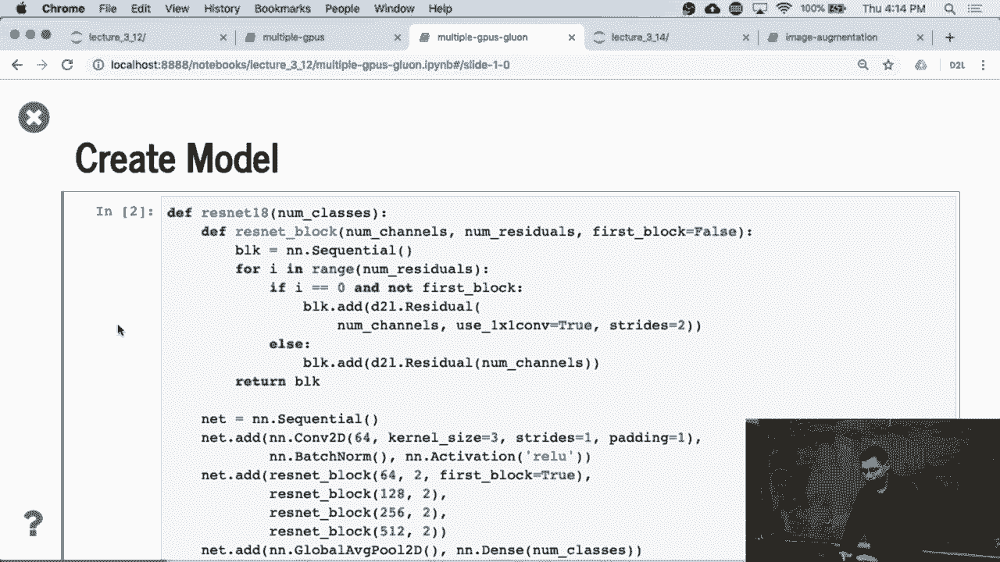

你可以忽略如何在ResNet中进行。我想你已经知道该怎么做了。而且我们在这里使用的是两块GPU。唯一需要注意的是，当你初始化参数时，我可以指定一组GPU。因此，计算将自动为你完成。所以不管是单一上下文还是一组上下文，我们都会处理。

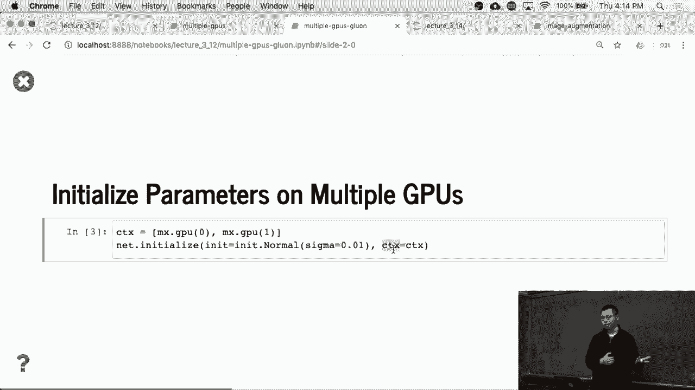

那么，如果我们只初始化我们多个的GPU。

产品方面，我们会把参数复制到多个GPU中。所以这里，计算已经有拆分和加载功能。我们不需要再次实现这一点。

所以记住，我们最初需要等待多次操作。现在让我们看看它是如何工作的。首先，我们在CPU上进行了初始化。如果我们想获取权重和核心数据，你会遇到运行时错误，因为它并没有在CPU上初始化。默认情况下，你会将数据复制到CPU。但我们可以这么做。对于数据。

我们可以将上下文传递给它，以获取参数，并在特定设备上初始化。因此你可以看到，当我们传递上下文0时，数据会在GPU0上初始化，权重在数据上下文1中，权重初始化在GPU1上。好吧。

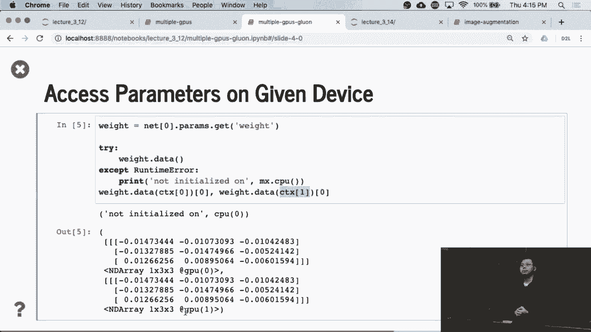

让我先进入。训练函数与之前没有不同。唯一的区别是，使用的是上下文，即在多个GPU上初始化的上下文列表。除此之外，我们在这里使用了拆分加载功能。还有，像GPU一样迭代多个GPU，计算前向传递，反向传递和步骤。因此，当你将参数传递给训练器时。

训练器会查看我们有多少设备，它会自动为你做这些事。你不需要担心这些。因此你不需要做这些复制操作和其他所有事情。好吧。那么，与单设备训练相比，你在这里该做什么？

在这里你不需要做什么，但即使是单GPU训练，你也需要指定上下文。唯一要做的事情是自动拆分数据。因为我们需要拆分数据，因为你可能有两块不同的GPU，一个比较快，一个比较慢，或者你有一块CPU和一块GPU。例如，你有100个样本在批处理中。

你可以给更快的GPU分配80个样本，给较慢的一个CPU，或者可能较慢的GPU只分配20个样本。你可以手动平衡工作负载。好吧。

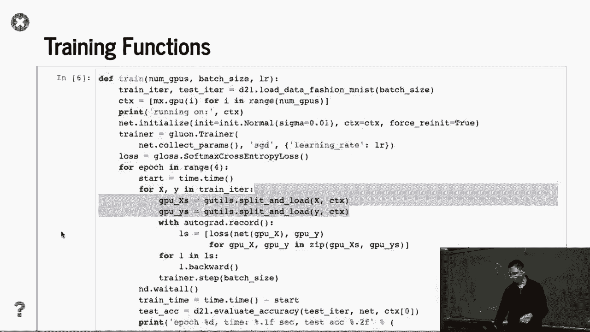

嗯，实际上我并没有运行这个，抱歉。嗯，这可能需要一根线才能运行这个笔记本。所以到目前为止我们有一些问题。

