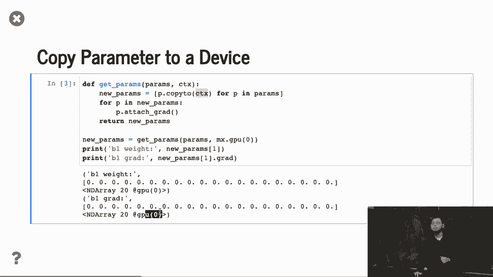
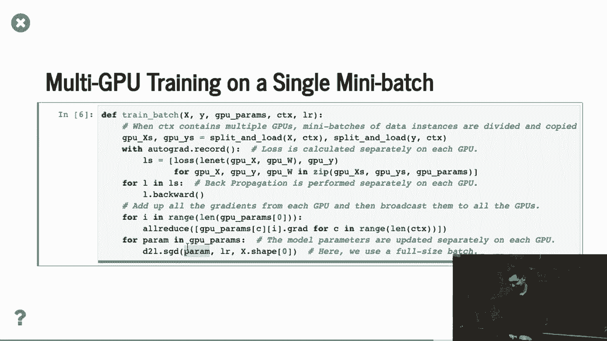
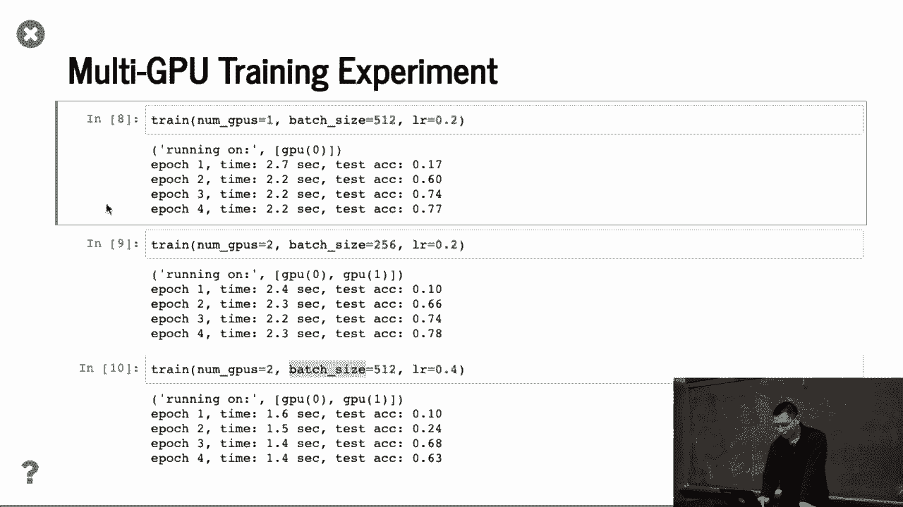
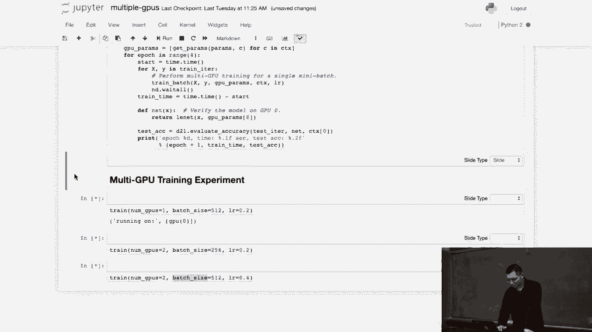
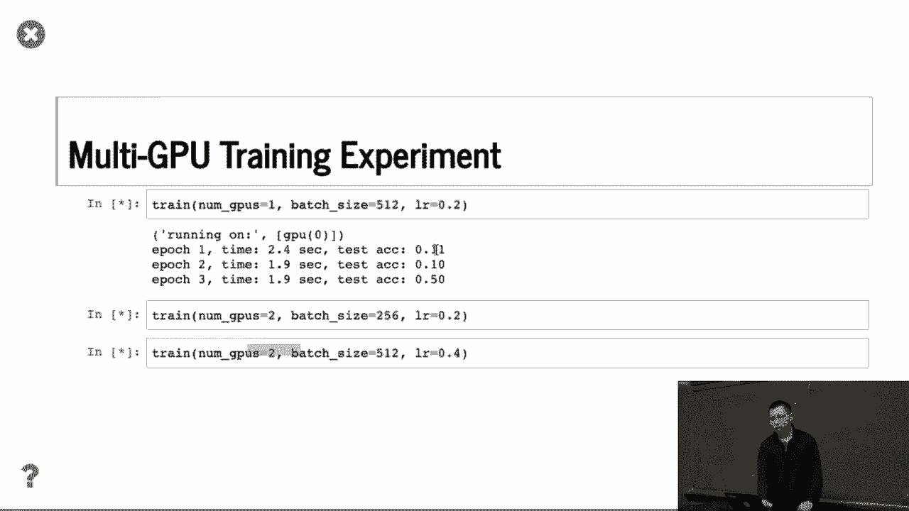
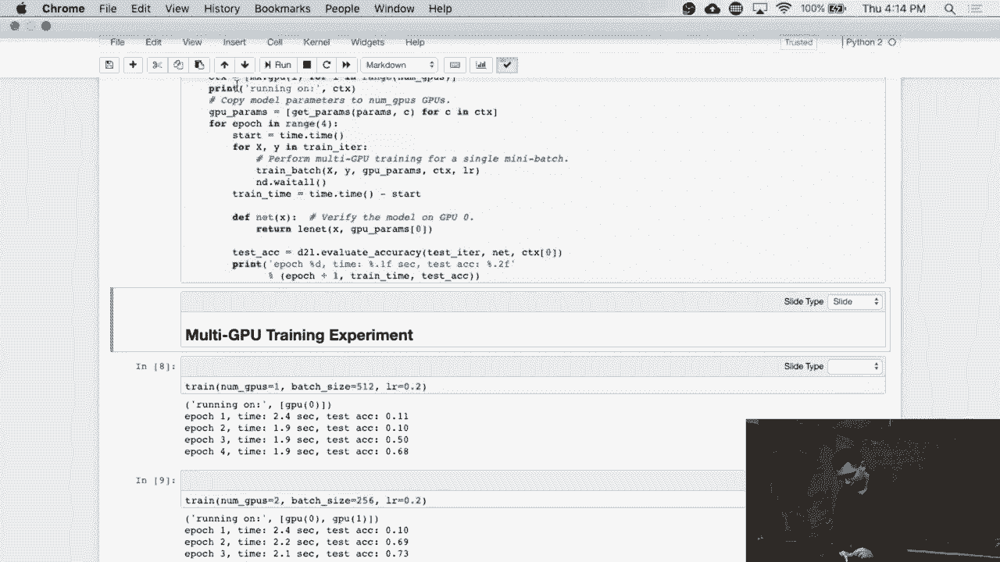
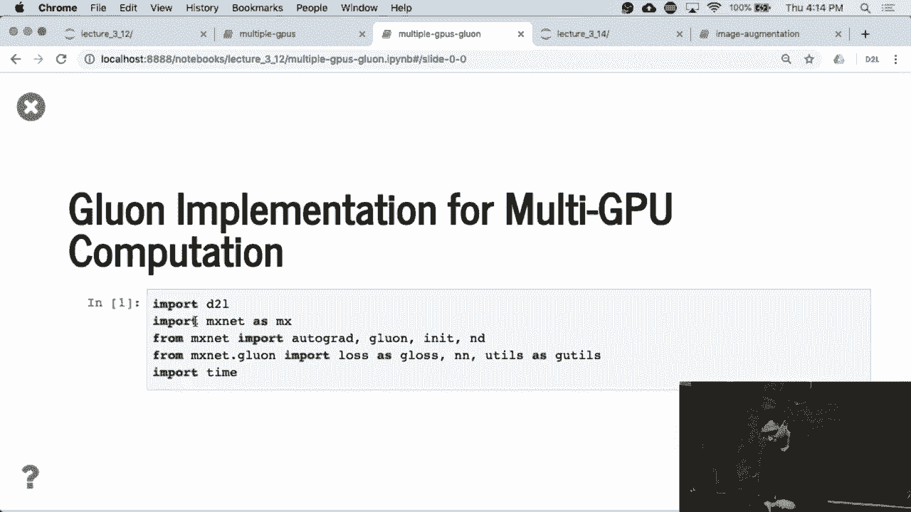

# P79：79. L14_6 Multi-GPU Training in Python - Python小能 - BV1CB4y1U7P6

 For multi-GPU， you need to guarantee that you have multiple GPUs。 So you can run things here。 For example， I do have two GPUs here。

 One is pretty slow GPUs is M60。 It's like three years ago， four years ago GPUs。 but it's pretty cheap。 And I have two GPUs here。

 Okay。 Then we use Lillat just from scratch。 We can like a lot of this part。 We define the parameters。 We define the monad and do the things。 One thing here is that。

 the parameters itself is on CPU。 So we need a copy to different --。 we need a copy to the parameters to GPUs。 What we do here is that we， define a function。 get the parameters， give the parameters on， CPU and give them a context， which is a GPU。 What we do here， for every parameter here， we cannot copy to these contexts， get the new parameters。

 and then touch gradients because we're going， to compute the gradient。 So， for example。 we can show that， if we copy to GPU zero， we can show that the first weight is。 already on GPU zero and also the bias is on GPU zero。 Okay？

 The second thing is that we need some over the gradients cross， different GPUs。 And also here we copy just copy the gradient back。 So what we do here。 the data is just a list of data cross， different GPUs。 We can find all the gradients --。 some of the values here and the copy back。 So what we do is a very， simple way to do things。

 For every data except for the first， one， we just the data I， we copy to the GPUs and the。 GPUs and the products of the first data。 And then adding to， data zero。 So we sum this data cross different devices。 And then we just copy back the sum data。 copy back to every data I， except for the first one。 So that's all。 The cross different， GPUs。

 For example， here， we create an example here。 On GPU zero， one， on GPU one。 it's all two and then after all reduced， we sum this together and both GPU zero and one get three。 Okay？ The other thing that we show that we need a break down。

 the batch size into multiple parts and then send two different， GPUs。 So soon data is a data batch。 We have contacts， a list of contacts。 What do we do here？

 Assume we have K GPUs and examples in the data。 We can assume that the simple case can be divisable。 That is every GPU we get m examples here。 And in total K GPUs， every GPU get m。 So we can double check。 It's like an easy one。 And then for each part。 we slice each part and returns as contact， as the IC GPU and the retained。

 We can return the list of batches， and each batch on each GPU。 So here， take an example here。 If the input is on CPU， it is how many？ One， two， three， four， five， six。 We have six examples on the CPU and we want to load into two。

 GPUs。 You can see that the first three lines break into GPU zero。 and the bottom three lines is copied into GPU one。 Okay。 That is partition the dataset and copy two different， GPUs。 Okay？ So then here's the key thing。

 How to implement things in a single made batch。

 Because all these parallelization results within the batch size。 Within the batch。 So here X and Y is a batch。 And this is a list of GPU parameters and list of codecs has to。 generate。 The first thing we do， given the batch， we can split and load into different GPUs for both X and Y。 So this is a list of X， a part of X and Y is a list of Y as well。 Then within the autograss scope。

 we're going to run， given the part， so here's the thing。 We iterate over every GPU。 And this is the X for one GPU， Y for one GPU and the parameters， on the one GPU。 And for each GPU。 we run the fourth pass， given the net X and the W and the computer loss。 Computer loss here。 So this is our single GPU。 Because we have four loop， we iterate over the multiple GPUs。

 So the loss here is just the list。 If you have four GPUs， you have four losses。 Then for each loss。 we're going to run the backward， which means each， GPU is going to run the backward in parallel。 So when the gradient are done， we already use the gradients。 See the grading here。 which are some of the gradients together， and then copy some gradient back to each GPU。 Finally。

 for each GPU， we run the X， G， D there on each GPU。 Okay， so we run the things just by sequential。 by auto-palization， the system we run all this in parallel for you。 All the data copy。 computation is going to run in parallel。 Any questions so far？ Okay， it's simple。 Okay。

 So the training function is not so different to the others we have。 Like here。 we create a list of contacts， number of GPUs we have。 And then we need to copy the parameters into different GPUs。 And then we run four data epochs。 And for here， for each， every time we read the batch and run the， batch on multi-gpues。

 Here we add in weight all here just for benchmark purpose。 Not just for nothing else。 And then we print something there。 Okay。 That's all。

 Now we can try some results here。 So firstly， we'll use a single GPU。 The batch size is 256。 and the numerator equals 0。2。 You can see here every epoch takes 2。2 seconds。 The accuracy is like increased as well。 Then we change to GPU number of GPU equals 2。 Because we fix the batch size， fix the numerator， nothing， has been changed。

 Only change the number of GPUs you get to send almost the， fan accuracy as before。 So you can first check the accuracy pretty similar。 That because we randomize the initial things is a little bit， different。 but you will not change the accuracy too much。 But we hope that we can make it faster。

 But you can see that you didn't make it faster on two GPUs。 One GPU is 0。2。2。 Two GPUs also 2。3。 Not too much。 The reason is because now we have two GPUs。 Every GPU only gets one 28 batch size every time。 Which means every minute batch。 the workload decreases， which impact the performance。

 And also we have a little bit of communication overhead。 And the non-add is pretty small。 We can show rest in that letter。 And then the communication overhead is a little bit larger。 than the computation itself。 Actually not paid too much here。 What we can do here is that we guarantee every GPU get the same， batch size。 Which means two GPUs。

 we double the total batch size to 5 to， 5。 And because we double the batch size。 we can also increase the， linearity a little bit。 We can not explain later maybe why we cannot increase the linearity。 That's a lot of things there。 So you can add the list。 You can see that while the time reduced。 It's not perfect two times speed up because normal is so easy。 But still like get something there。

 And check the accuracy。 Well actually it's performed to be worse compared to before。 Because this batch size or maybe linearity is not fine too。 Because we change the optimisation method。 Okay。 Any questions so far？ Question？

 >> If you are the first to like with the data batch size and， the left to the right。 you also reduce the time or see what you can do。 >> That's true。 So the question that， well。 you can always change to 5， 12。 I will not run here。 Maybe I can try that。

 Let me try that if I can run the ticker libio wire。

 >> Yes。

 If we change the large one， you can reduce the time from 0。4 to。

 less than two seconds。 Then this one is too slow。

 Let me stop it and let me finish it。 Then if you can increase the batch size。 I can increase the batch size as well。 Let me do that。 You see？ The thing is like none is too small。 Usually GPL limited memory。 For example， you are going to train the rest of the net。 The max batch size you can choose is 32。 Not too much。 Because you need so many memories。

 the GPL memory， the training memory is linear to the， batch size。 So given a single GPL。 you have upper bound。 It's a multi GPL that I can choose to maybe 256。 But again。 show that this large batch size you can make the convergence much， slower。

 Let's show how to use a grown pretty similar。

 The only thing different here we can use the rest net， 18 as an example。 Because none is too small。

 You can ignore how to do in rest net。 I think you already have to do that。 Also。 we are using two GPUs here。 The only thing here， when you initialize the parameters。 I can specify a list of， GPUs。 So grown will be automatically for you。 So no matter。 it's just a single context or a list of contacts， we are going to do。

 that。 So if we just initialize our multiples of our。

 products， we are going to copy the parameters into multiple GPUs。 So here。 the grown have split and load function here。 We don't need to really implement that again。

 So remember that we initially had to wait multiple things。 Now let's see how it works。 So firstly。 we did an initialize on CPUs。 If we're going to get the weight and the core data。 you're going to get the， runtime error because it's not the initialize on CPU。 In default。 you're going to copy the data on CPU。 But we can do that。 For data。

 we can pass the context to that to fetch the parameters， and initialize on a particular device。 So you can see that pass context zero。 We got the data initialized on GPU zero and the weight on data context one。 the， weight initialize on GPU one。 Okay。

 Let me first go in。 And the training function is not different to before。 The only thing here。 the context， the list of context， initialize on multiple GPUs。 And what else we have here here。 we are using the split load function here。 And also like for GPU iterate on multiple GPUs compute the forward pass。 backward pass and step。 So the trainer， when you pass the parameter to a trainer。

 the trainer see how many devices we have， it's going to automatically do that for you。 You don't need to worry about that。 So you don't need to do all this copy and all the things。 all the things。 Okay。 So compared to a single device training， what do you do here？

 Here you don't need to do， but even for single GPU training you also need to， specify the context。 The only thing here you want to do automatically split the data。 Because we want to do split data because kind of you have two different GPUs。 One is faster。 one is slower， or you have a CPU and a GPU。 For example you have 100 examples in the batch。

 You can give the faster GPU 80 examples， the slower one CPU， or maybe a slow GPU just 20 examples。 You can manually balance the workload。 Okay。

 So， well， I did not run that， sorry for that。 That's， well， it may take a wire to run this notebook。 So we'll question so far。

