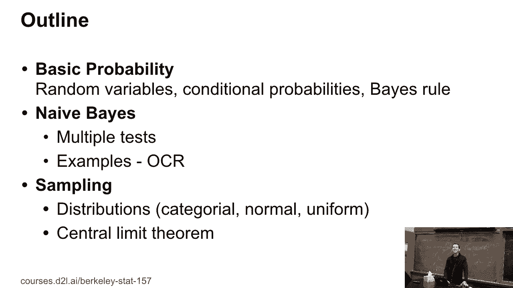
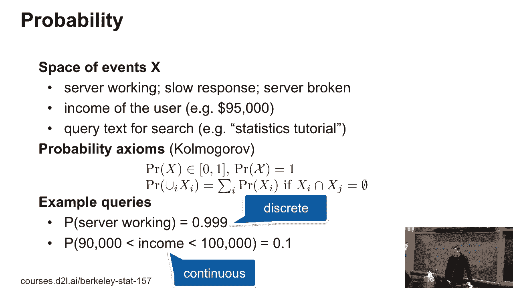
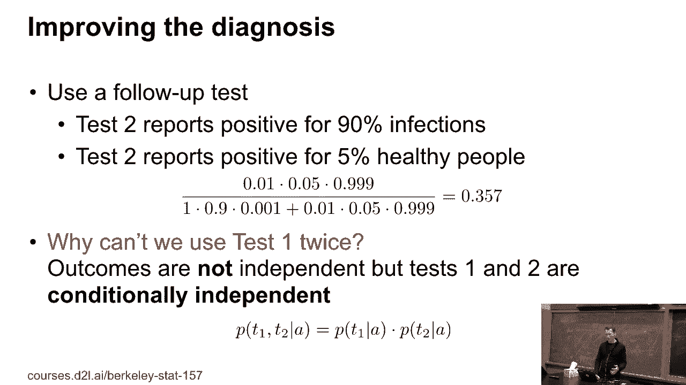

# P8：8. L2_3 Basic Probability - Python小能 - BV1CB4y1U7P6

 OK。 So what we're going to do today， and probably on Monday， is we'll look at basic statistics。 Who's taking a stats class before？ Awesome。 But after all， this is stats department。 so you will expect it。 But still， we'll do a few things， fairly basic ones， like naive Bayes。 and it will sample， and so on。 Who knows what the central limit theorem is？ OK。

 Who's tested it in practice？

 OK， we'll do that today or on Tuesday。 There's a couple of lines of Python。 That's actually the nice thing about it。 So I guess that's the obvious trike joke。

 But OK， fine。 So we can go fairly quickly over this space of events。 and you might have so a working or whatever。 You have the usual Kolmogorov-Faxiums。 I guess everybody knows them。 So the probability of some event is somewhere between 0 and 1。 Can't be larger than 1， and cannot be negative。 The probability that something happens is 1。 OK。

 duh。 And if the various events are destroyed， then the sum of the corresponding probabilities。 is the sum of the probability of the union of events。 And then the obvious thing that I can have discrete， and continuous things， so probably if a server。 not working， it might be 99。9%。 But asking me what's the probability of my income being $91，000。

 and 5 cents， while that probability， is essentially negligible。 But a question asking whether my salary is between $90，000， and $100，000， well。 that's now a more reasonable question。 And let's say， for instance， the probability might be 10%。 Well， don't worry， Amazon pays better than that。 But this is for illustration purposes。

 Here's the mandatory event diagram。 If I have three events， probability， for both things happening。 That's not the intersection of this。 OK， it's all straightforward。 And so therefore。 the probability of the union， is the probability of one and the probability of the other。 minus the probability of the intersection。 So this is all fairly nice sets and measures and so on。

 And you could take an entire measure theory class， and do this for real。

 But this is a deep learning course。 So we don't need to go into a lot of detail here。 A couple of useful things， independence。 So for instance， the log-in behavior of two users。 is approximately independent。 This crash in different colors is approximately independent。 Might not entirely be independent， depending on， you know。

 what-- let's say you get a bad batch of disks。 And then they all fail at the same time。 But then。 conditioned on this being a bad batch， they would be independent again。 So but if we have something that's independent， we can just write。 P of x and y is P of x times P of y。 It's nice， but it's also very boring。 Dependent events， emails。

 hopefully， might reply to your question on discuss or on Google Groups。 And by the way。 is that email is working now。 There was a slightly cautious， basically， Google Group。 setting before that made all the emails bounce that's fixed。 But hopefully。 my reply to your question， should not be independent of your question， at least。

 if I do a decent job。 Search queries on the web might be dependent， like， well。 how to create an AWS account， how to launch a deep learning， army， how to install NVIDIA drivers。 how to open Drupal， so you might Google search all of that。 I hope that you won't have to。 because I explained some things， before， but， yeah， new streams， I am communication。 Obviously。

 also， Russian Roulette。 If you fire and you survive， the next event is not independent。 of the first one。 OK。 Suppose somebody forces me to play Russian Roulette twice。 What do I need to do before I pull the trigger the second time， assuming I survived the first one。 to increase my chances， of survival？ Any suggestions？ OK。 [INAUDIBLE]， OK， so you spin the revolve。

 And so why is this a good idea？ Because if you have a 1。5 chance of effectively--， Yes。 --the first time， and then you spin it， you have a 1。6 chance。 Exactly。 So the first time you have a 1。6 chance， because the first time you pull the trigger。 I mean the revolve is in arbitrary position。 But now， yeah， there are only five left。 And， well。

 at the latest after six times pulling the trigger， you're dead， no matter what。 Whereas if you spin the trigger again， then， again， it's 1 out of 6。 This is an example of where making things independent， changes things。 There's a nice other problem called the Monty Hall problem。 At some point， Google searched that。

 So it's very nicely explained about conditional probability， and so on。 And you can wonderfully stump anybody who， doesn't know statistics。 In any case。 what this means is that p of x and y， is not p of x times p of y。 And that's pretty much everywhere。 That's actually awesome， because that makes our life easy。 Yes。 [INAUDIBLE]， Fun？ [INAUDIBLE]， Oh。

 this is just different locations for where servers are。 They're called colos sometimes。 Frince comes from co-locating various servers。 So， for instance， telephone companies。 might have a big switchboard and they have lots of wires。 And then they tell you， hey。 you can put your servers， into our location。 And then they tell another company the same thing。

 So multiple servers are co-located， hence a colo。 Yes， sorry。 This is jargon from servers。 Sorry。 Now， let's do something very simple， right？ Everybody knows what a cat and a dog looks like。 OK。 [LAUGHTER]， OK， so which one's the cat？ Which one's the dog？ Top one's the cat。 OK。 you saw the slice， right？ OK， so--， well， right now it's like a case。 You know， it's anybody's case。

 right？

 OK。 Yeah， it took me a while to find the white dog that， looks very cat-like。 [LAUGHTER]。 And this cat looks very unnatural， but in any case--， [LAUGHTER]， Yeah。

 So what happened here， right？ Well， what happened is that there are really。 two different ways of what can happen。 So right， I could just be very uncertain about things。 like the coin flip or a lottery。 Or it could be that due to conditioning， well。 I can actually tighten down those probabilities。 So I just had more context。

 And that more side information helped me narrow down， the probability to a point where， hey。 anybody can say， hey， this cat is a dog， right？ Now， why do we care？ Well。 because we're going to use that to build， you know， classifies regressors， other estimators。 And that's the entire point of this course， right？ In information theory。

 this is called the information， never hurts principle。 So it's a nice result about conditional entropy and so on。 So if you take an information theory course， this is going to be one of the first things。 to help to recover。 But we're not going to go into detail here， but this really helps。 Now。

 base rule， I guess everybody knows it。 So let's do a quick refresher。 And the way how you would derive it， is， of course， p of x and y is p of x given y times p of y。 And by symmetry， it also has to be p of y given x times p of x。 All right。 OK。 so then you just solve for p of x given y。 And lo and behold。

 you get that this is p of y given x times， p of x divided by p of y。 OK。 Sounds pretty boring。 right？ I can use that for-- I promise this testing， or reverse conditioning。 And let's actually use this。 So let's take-- let's look at an eight test， right？

 So let's assume that about maybe 0。1% of the population， are infected。 Well。 the numbers in the United States are lower， but let's just assume that because the math looks。 a bit nicer。 And whereas in sub-Saharan Africa， the numbers would be a lot higher。 And let's assume I have a test that really detects， all the infections。

 But it has a false positive rate， where for 1% of all healthy people it detects。 it says that they have AIDS。 So what are the chances that somebody actually has AIDS。 if the test comes back positive？ OK。 Why don't you try working that out on a piece of paper。 in a minute？ It's fairly straightforward。 [VIDEO PLAYBACK]， So fun side story。

 Medical professionals aren't very good at this。 So at the university where I used to be once。 so the doctor there would recommend people， not to take an AIDS test。 Because well， they said， well。 if it comes back positive， you'll have a horrible week。 So OK。 So this got the answer。 Let's look at it。 So the probability of AIDS， given that the outcome of the test。

 is the probability of test outcome given， whether that person has AIDS times the probability。 that they have AIDS， divided by the probability， that that specific test outcome happens。 It's then a base rule。 So we know the numerator。 As we know that p of t equals 1。 given that a is equals 1， that's 1。 And we know the probability of AIDS。 That's 0。001。 OK。

 We don't know the denominator。 So now we need to expand this into all the cases。 where the person had AIDS。 And the test came back positive。 In all the cases where the person didn't have AIDS， then the test came back positive。 So the first term is again 0。001。 It's basically that's all people who are infected。

 And then the 99。9%， for them I get the 1% chance， that the test comes back positive。 So the chances that the person actually has AIDS， is about 9%。 This is supremely counterintuitive。 Suppose this happens。 Now what's the doctor going to do next？ He's going to order another test。 right？ So let's do that。 So test 2 isn't quite so good， right？

 Before it's positive for 90% of infections， 5% for healthy people。 And if you work the numbers again， and you get that now it's the chance。 that you actually infected is around 36%。 For even after two tests， things still look pretty decent。 Question。 Why can't I use test 1 twice？ After all， test 1 is a really good test， right？

 It detects all diseases as a very low， false positive rate relative to this one。 So why can't I use test 1 twice？ Any ideas？ Exactly。 You just spot on。 So the running test 1 twice will just give me the same answer， as many times as I want， right？

 And that's not what I want， right？ Because I want to make sure that it。 may get a second independent result。 Well， actually， I don't really care about independence。 I care about conditional independence。 I care about a conditional on whether their person has。 a disease or not。 The outcomes are independent。 But if the test 2 was completely independent of everything。

 else， then while it would be just some random number， right？ So this is conditional independence。 It was about as deep as we'll ever delve into this probability， here in this course。 But just as I heads up， there are some minor details。 that can force you to design your estimators reasonably。

 well and your objective functions and so on。

 So basically， be careful what you're doing。 And before we use this， let's--。