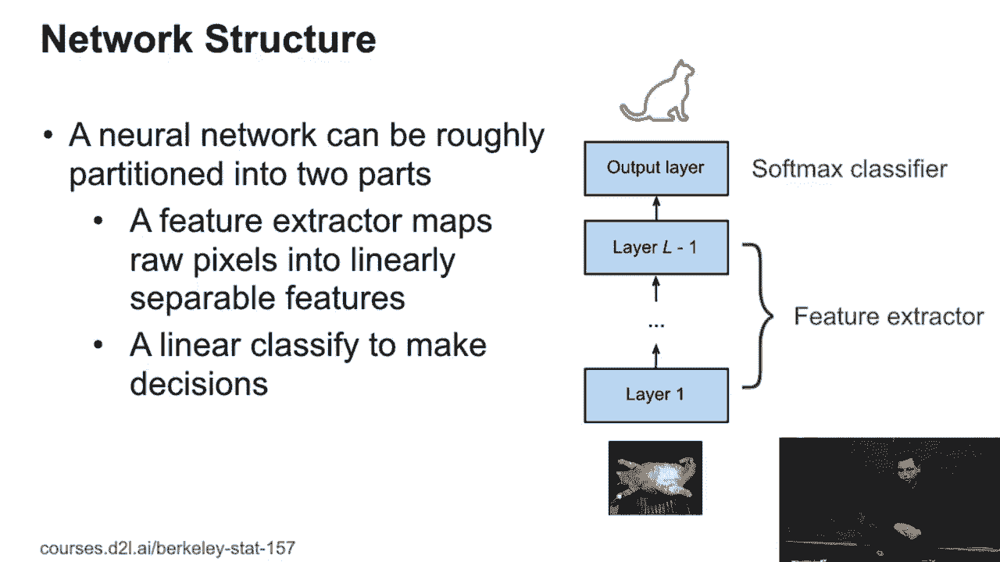
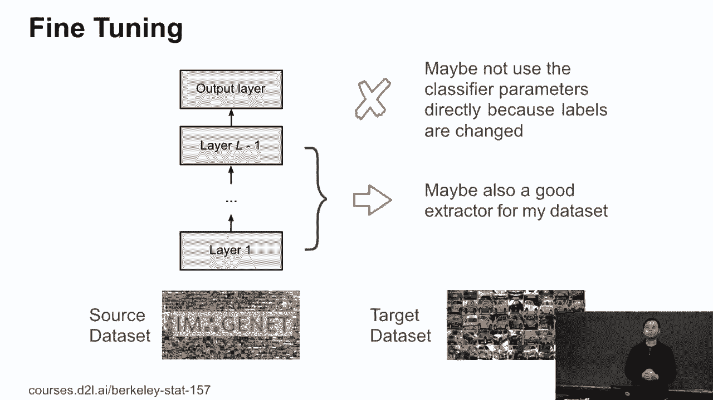
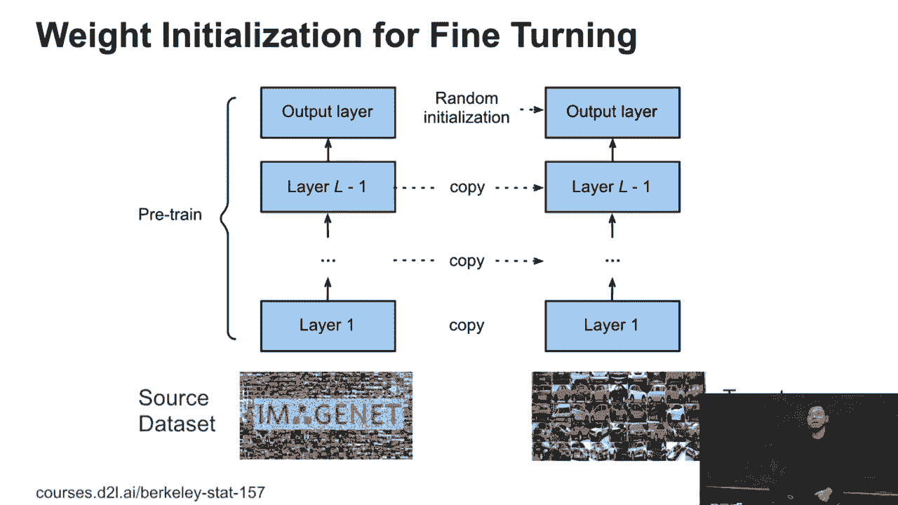

# P82：82. L15_2 Fine Tuning - Python小能 - BV1CB4y1U7P6

我们将首先完成微调部分。微调可能是计算机视觉中最重要的部分。也就是说，在大多数情况下，你将使用微调。

如果你正在使用计算机视觉应用。这里我们讨论了两个数据集，一个是 M-NIST，一个是 ImageNet。M-NIST 有 10 个类别，每个类别大约有 6000 张图片。所以它相当小。30 年前，这是一个较大的数据集，但现在它已经是一个非常小的数据集。十年前的最前沿技术叫做 ImageNet。

但至今，ImageNet 仍然是一个较大的数据集。它包含 120 万张图片和 1000 个类别。如果你想用计算机视觉来构建产品，你可能会连接你自己的数据集。我的数据集会处于其中。例如，我打算构建一个数据集来识别所有这些汽车，可能是。

我会连接 100 种车型。每种车，我们将连接 500 张图片。对于每种车，这意味着数据集是 ImageNet 的 10 倍小，但仍然大于 M-NIST。所以这是一个你可以连接的现实数据集。通常情况下，这个数据集，你会用 Google 来爬取，或者如果你在公司工作，爬取公司的数据库。然后你尝试标注这 5 个。

你可以自己做的事情，通常需要一周。如果你非常高效，可能每秒标注一张图片，也就是每小时 3000 张图片，这意味着标注整个数据集大约需要 10 到 20 小时。如果你自己标注，模型最多只能匹配你的能力。然后你可以尝试做，好的。

我有五个人来标注 ImageNet 数据集，我可以稍微改进它。但问题是，和你不同，不能一开始就标注整个 ImageNet 数据集，因为这需要花费大量时间和金钱。你不能对你的经理说，“好吧，我可以连接一个数据集，模拟 ImageNet，给我六个月时间，再给我一百万美元。”

我可以，因为我可以雇人帮你做标注。经过六个月后，我可以训练一个模型，告诉你我的模型是否有效。嗯，可能六个月后，你可能会考虑转向另一个产品。所以现在你需要从中等规模的数据集开始。但问题是，我们讨论的所有这些模型，都是为 ImageNet 设计的。

这意味着不幸的是，仅仅是对 ImageNet 的过拟合。所有这些不同类型的共振 inception，我们根据 ImageNet 的结果来设计网络。所以，如果你将其应用到另一个数据集上，可能无法奏效。而且可能过于复杂，例如，因为你的数据集比 ImageNet 小了 10 倍，这就是为什么它的共振复杂度也比 ImageNet 高出 10 倍。

比你的数据集还要大。

所以我们希望对此有一个解决方案。这里有一个想法。我们之前在 AlexNet 中提到过卷积，你不会在这里进行卷积。你将输入原始像素，然后一层一层地进行卷积，进行特征构建。最后，除了最后一层，我们完成特征指令。

现在我们希望将所有这些特征映射到原始像素上。我们将原始像素映射到特征，这在一个线性空间中非常容易分离。最后一层是一个全连接层。我们给出一个线性分类器以获得非常好的结果。所以我们可以将网络分为两个部分，一个是映射原始像素的特征结构。

将其转换为高度可分离的特征。最后一层只是一个分类器，用来获得你想要的标签。

所以如果我确实有一个网络，尝试使用现在的 ImageNet。这是蓝色的部分。如果我想将其应用到我自己的数据集。我现在尝试使用 ImageNet，我称其为源数据集。我的数据集，我称之为目标数据集。所以也许网络在 ImageNet 上训练过，特征结构也适用于我自己的数据集。它们只是图像。

所以内容可能不同，但它们是像素。所以可能 ImageNet 的特征结构依然有效，能够直接应用到我的数据集上。依然可以得到合理的特征指令特征表示。可能不是很好，但仍然可以使用。最后一层，这与 ImageNet 的标签非常相关，可能无法应用。

因为最后一层只是一个线性层。如果你有 1,000 个类别，那么你有 1,000 个输出，这意味着 1,000 个向量。每个向量表示一个类别。如果我的汽车数据集没有所有 ImageNet 的标签，我可能无法直接使用最后的分类器。但至少……

我可以重用我们大部分的结果。如果网络有 100 层，我可以重用 99 层。

然后对于微调，想法是，尝试我自己的数据集时，我可以。获取一个已经在 ImageNet 上预训练过的模型。也就是说，我不修改整个网络结构。然后初始化我的模型，我会复制 ImageNet 预训练模型中所有层的权重。

除了最后一层。这意味着我复制所有这些参数，从特征构建器到初始化我的权重。对于最后一层，我不能重用它。我只是随机初始化它。所以这就是微调。这意味着我获取一个预训练模型，并复制大部分参数来初始化我的模型。问题是……

如果你只是打乱了 ImageNet 的标签，性能会发生什么变化？

也许它会改变你能够做的一切——第九个例子，标签是3。好的。你想要改变你在 ImageNet 上的标签，你想要——我在问的是，如果你在输出层周围进行常规初始化，不能保证它能很好地迁移。好的。所以是否可以尝试不同的可关联图像。

在你复制参数以尝试获得更好的性能后，没错，我们将会在几张幻灯片后讨论这个问题。但基本的想法是，你随机初始化分类器。我们当然也可以讨论如何转换标签。

然后，训练会有所不同，因为我们不是从随机点开始，而是从一个非常好的点开始。在正常情况下，我们可以像正常训练一样进行训练。但是我们可以在这里进行标签化处理。因为ImageNet预训练模型可能对你自己的数据集仍然过于复杂。

我们希望在这里加大正则化，以避免过拟合。例如，我们可以使用稍微小一点的学习率，因为它已经非常接近最终结果了。我们不需要每次都进行很长时间的训练。另外，我们可以使用更少的epoch，这意味着我们可能只迭代10次，而不是100次。所以在实践中就是这样。

如果源数据集比你自己的数据集更复杂，通常微调会比从零开始在你自己的数据集上训练获得更好的结果。而且，它的收敛速度也更快，因为我们从一个好的初始化开始。所以如果你尝试自己的数据集，强烈推荐使用这种方法。

这就是微调的基本概念。

是的，我们可以在这里做很多事情。例如，即使是汽车，ImageNet也有一类叫做赛车的标签。因为如果源数据集包含了目标数据集的标签，我们可以根据微调模型的特征权重进行复制。这样就很容易理解了。但是通常，你并不是每天都这么幸运。

因为ImageNet包含了很多不同种类的动物，比如100种不同的狗，100种不同的猫。实际上，你并不在乎你有哪些种类的小型狗。另外，ImageNet还有很多你在附近从未见过的动物，这些都是非常自然的图像。所以即使你不知道如何命名这些动物，你也许并不关心它们。

但实际上，你总是需要弄清楚，源数据集的标签集是否部分包含在目标数据集中，这可以让你的收敛速度更快。

另一方面，我们仍然训练所有这些层，但在训练过程中我们可以固定其中一些层。所以，在这里，通常，如果你训练一个深度卷积神经网络，你会发现底层试图找出局部特征，比如年龄、形状、颜色和局部颜色。而底层则尝试寻找更多的全局特征。

例如，这里有一只狗，一些全球性的模式，还有人类。也许右下角是。我不知道，像是我，或者其他什么，也许是我。底层特征，就是最底层。也许是通用的，这意味着你自己的数据集可能也关注形状、本地形状、本地颜色和本地模式。高层特征则更接近于你拥有的对象类别。

你可能需要稍微调整一下。所以这里的想法是，在训练过程中你可以固定底层的参数，这意味着如果你有一个50层的ResNet，你可以固定底部的10层。实际上，你只是尝试40层的ResNet，这样你就减少了模型的容量。

这样，你就不太可能出现过拟合。所以这就是这个想法。问题？[听不清]，哦，这是一个可视化尝试，给出图像并查看输出。像是这里的激活模式。所以不仅仅是绘制我们拥有的激活。实际上，你做了一些小调整来可视化这些模式。

但那是——每个图像都是一个通道的输出。它是一个拾取，一个层的拾取，一个通道，并尝试可视化这个通道试图识别的内容。[听不清]。它的输出不是一个卷积核。好的，让我——。

