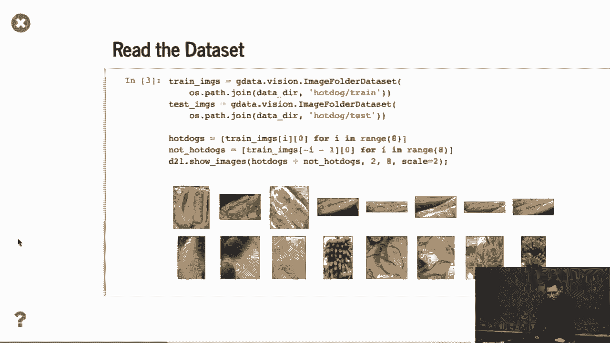
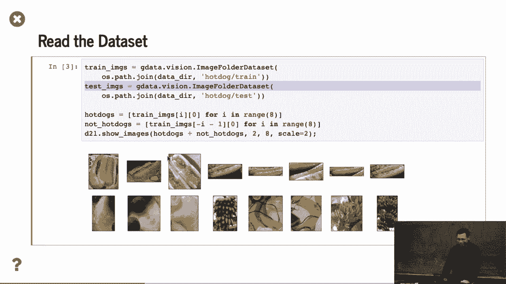
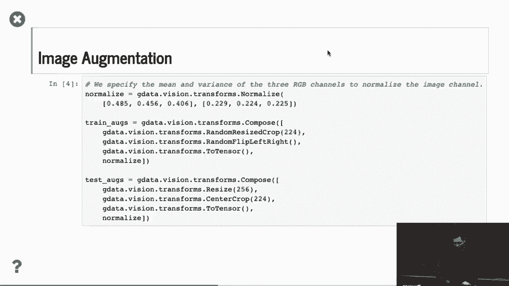
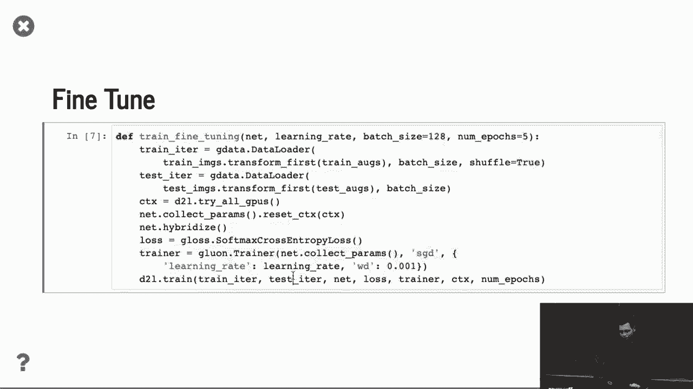

# P83：83. L15_3 Python中的微调 - Python小能 - BV1CB4y1U7P6

好的，这里我们展示了如何实际进行微调。这很重要，因为下一个作业，在春假之后才截止，你将会在假期时玩得开心，作业会在春假后处理。但重点是微调。因为这是一个非常关键的部分。

你将用于通信的比例。好了，首先，导入库。然后我们准备了一个小数据集。它叫做Harddog识别。嗯，你可以看到它在网上。我们在这里做的，就是用Google搜索Harddog，和Google其他一些类似Harddog的东西，并展示出来。

只需要花一个下午就可以获得数据集。所以你可以看到我们下载了数据集，提取了所有这些图像。你可以看到文件夹包含一个训练文件夹和一个测试文件夹。训练文件夹有两个子文件夹，一个是harddog，另一个是not harddog。测试文件夹也包含一堆JPEG图像和类似的测试数据集。

然后，嗯，我们可以在这里做什么。

我们可以训练图像，我们已经知道了通过harddog的图像文件夹数据集。训练并测试图像，所有的东西都可以可视化。所以你可以看到，第一行是harddogs，第二行是not harddogs，十分相似。香蕉。（笑声）嗯，其他一些东西，像你也一样。

但是相似的事情。好了，接下来是图像增强。

我们之前已经讨论过了。首先，我们标准化RGB通道。所以我们知道RGB通道的含义和RGB的值。这些值来自ImageNet。大约在80年前，人们就开始使用这些值了。我们从未验证过这些值，但这里只是复制过来。

因为预训练的模型是用这些值训练的，所以你不想改变它。这就是问题所在。不过我从ImageNet那里听说过这个，但我并不确切知道。然后，进行变换。它们做的事情是，你随机调整大小，因为它是较大的图像——4.2.4.4。这是我们与ImageNet一起训练的默认设置。还会做很多翻转操作，并且转换为两个张量。

转换到卷积神经网络层1/2，并将其标准化为RGB通道。对于测试数据集，我们只是调整到一个合理的形状。256也像来自ImageNet一样。在最初的那一天，Alex说，Alex做的事情是这样的——他们首先将图像调整为这个形状。所以我们在这里就保持这个值。

做一个中心裁剪，这意味着我们不做随机裁剪。我们只是裁剪中心区域来获取验证数据。原因是因为我们不想在这里做任何随机化，以便获得可靠的结果。然后，最后，将图像转换为张量并标准化输出。所以，好的，问题。

那么假设热狗在中心，它们被画出来了吗？是的。那么问题是，如果热狗不在中心，而是在角落，会发生什么？嗯，这就不是一个图像分类问题了。接下来我们要谈的是目标检测，可能会在大约10分钟后讲解。所以图像分类中，我们假设。

图像包含了主要物体在中心的位置。可能不完全在中心，但它只包含了主要的物体。是的，我的意思是，在文档中，你应该像这样标注。如果热狗在角落，你裁剪掉它，那么像船只这样的目标应该像螺栓一样处理。好的，原因是，随机缩放裁剪可以。

可以保证你不会选择太小的区域。即使裁剪的区域不是很幸运，裁剪后没有浓缩成一个物体，你可以把它当作随机噪声。它会给网络一个假的训练图像。这只是噪声。通常神经网络足够强大，可以处理你输入的所有噪声。

即使是图像识别（image net），我也不知道图像识别的错误率是多少，因为标签是由人工标注的。通常会有很多错误。图像识别做得相当不错。至于其他数据，可能包含很多错误。原因是因为你将图像发送给一个连接器，一个傻瓜，然后让另一个人帮你标注。

它们通常只是闭上眼睛去标注。原因是，因为你是按标注的图像数量付费的。很难保证标注的质量。所以这是我们的工作。我们关心应用的质量保证。如果我们没做得好，数据中就会有很多噪声。

我记得他们做了基准测试，数据集中有10%到5%的错误标注。这是很正常的。那么，事情就是这样。

我们从模型库下载了预训练模型。所以，模型库视觉。ResNet是ResNet的第二版，18。我们指定预训练等于2，2，这样就可以获得网络并从网上下载预训练的权重。因此，这一部分包含了模型定义和所有预训练的权重。

所以你可以看到，预训练的权重有一个输出层，那是最后一层。你还可以看到特征层，它是主干特征提取器。那么我们在这里做的事情是，因为这是一个硬分类问题。

我们只有两个类别。所以，我们再次从模型库抓取相同的模型，但不包含所有这些预训练权重，指定类别数为2，这样就保留了相同的特征提取器，只是最后一层的大小变成了2。然后我们所做的是，将特征的权重复制到新的模型中。

也就是说，除了最后一层，所有这些层都应用于我微调的网络。然后对于最后的分类器，我们只是随机初始化它。它是通过随机初始化器初始化的获取层。你可能会做一件事，如果你愿意的话也可以跳过。问题在于，最后一层。

我们将线性度乘数设置为10，这意味着如果我们给网络施加0.0的线性度，那么最后一层将以10倍更大的线性度进行训练。这是什么？你知道为什么吗？问题是，为什么我们要为最后一层设置更大的线性度？

因为前面的层已经训练得很好。你希望最后一层有更大的步长。它会快速更新。你想要有更大的线性度，能够快速优化。是的，因为特征提取器已经处于良好的状态。

它已经非常接近最终位置。但最后一层是随机初始化的。你希望它离得更远。

你希望在最后阶段更快地收敛。好的。

然后微调，与之前没有什么不同。我们获取数据加载器，获取上下文，尝试使用所有GPU。就是这一点。我们讨论使用所有GPU。我们对所有GPU进行了设置，因为我们从CPU初始化了参数，并将其混合以提高速度，获取损失函数，获取训练器。

所以这没有什么特别新的内容。

我们可以在这里指定线性度。

我很快展示了结果。对于微调，我们从一个非常小的线性度0.01开始。你可以看到它收敛得很好。嗯，很难说是快还是慢。但让我们看看从零开始的变化。所以这是从零开始的网络。我们只是抓取了网络，所有参数都进行了随机初始化，并且趋势是用较大的线性度0.1。

所以你可以看到，与训练准确率相比，这是0.9，0.9，而这是0.8。尤其是这里，测试准确率明显更高，测试准确率甚至超过了训练准确率。因为训练时，我们有很多数据限制，这会降低准确度。而在这里，差距是0.1。也有。

即使我们使用较小的线性度，它实际上比从零开始训练更快地收敛。因为我们已经处于原始形状。收敛要容易得多。好的，有什么问题吗？很好。对于作业，我们将尝试。获取ImageNet，训练100个点，类似于ImageNet的一个子集。[BLANK_AUDIO]。

