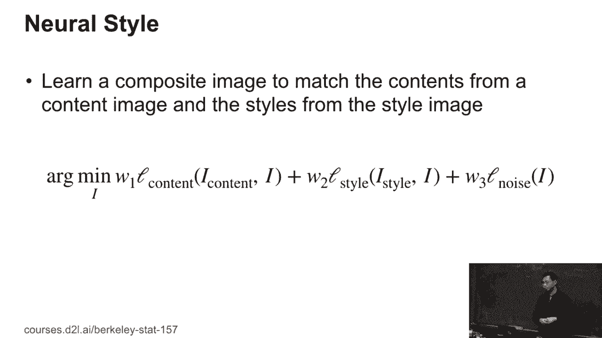

# P84：84. L15_4 风格迁移 - Python小能 - BV1CB4y1U7P6

好吧，风格迁移。基本的想法是，我给你一张内容图像。内容图像。这是左上方的那一张，然后给你一张风格图像，风格就像是一种滤镜。我想生成一张合成图像，保持内容图像的内容，同时也具备风格图像的风格。所以你可以看到，好的。

嗯，这真是太漂亮了。如果我现在改变风格图像，我可以换成另一种风格。好吧，也可以换成另一种风格，另一张风格图像。好吧，关键是，嗯，如果你使用Photoshop，你知道这里有很多滤镜。但好的一点是，你不需要知道滤镜是什么样子的。

你总是可以找到风格图像。我喜欢这种风格，我可以应用到我自己的内容图像上。好了，就是这个应用。还有一个，像，好的，另一个。好吧，这是数学公式。这里我有i的图像编码。如果i是内容图像，我有i的风格。这是风格图像。所以我要学习一个合成图像，叫做i。

我们要最小化这三件事。第一件事是内容损失。与我的合成图像相比，要学习我所拥有的内容图像。我管理内容损失，w1是权重。然后加上w2。这是风格图像和我学习的图像之间的损失。最后一个。

通常我们有很多噪声，所以我们想让图像看起来漂亮，漂亮，没有。要有良好的噪声与信号比，损失与信号比。

所以让我们一个一个地看看每个损失函数。像我们有的内容损失，那么我们在这里做什么？

我们有内容图像，我们有学习到的图像，输入到同一个网络中。所以这里我们有三层卷积层。然后我们不会将这种合成图像和当前图像本身结合在一起。就像如果你自己学习，嗯。我们只是逐像素学习，我们不想那样做。

我们想在这里学习一些高阶的信息。所以我们选择中间层，就像我们选择中间卷积层的输出，然后加上一个L2损失，比较这两者的输出。所以我在这里做的，我想学习图像，得到几乎相同的结果，用于第二卷积层的输出。

与内容图像进行比较。如果你选择底层卷积层，底层卷积层尝试。你知道卷积层，底层卷积层试图找到局部信息。因为它就像我们有一个个窗口。顶层，我们有很多窗口，拥有一点全局信息。所以底层是用来匹配细节的。

在极端情况下，只比较原始像素，你就像素对像素地进行对比，保留一切。顶部层大致匹配全局内容，比如全局形状和全局物体。所以这里，我们选择中间层。我们不想太接近内容图像，或者我们也不希望它与内容图像过于明确地对应。

好的，选择中间层。对于风格，类似的事情。嗯，这里是关于内容的。我可以始终逐个匹配，就像L2损失一样。那么，什么是风格呢？风格，嗯。这个有点难以解释，但大家认为这个方法有效。风格被称为Gram矩阵。所以首先，它是风格。你可以把风格看作RGB，给定一张图像。

如果RGB是三个通道，那么计算机是一个。如果我有两张图像，它们在RGB通道上有相同的历史，那么这两张图像很可能有非常相似的颜色。所以你可以认为每个通道，RGB通道是匹配的，你可以认为每个像素是一个随机值，每个通道是一个变量。像RGB通道，实际上有三个变量。

每个像素生成一种随机值。那么对于两张图像，我可以匹配每个通道的像素概率，我可以想，好的。我在这里匹配所有这些风格。为了匹配概率，你可以做，比如我可以匹配最小值。我可以匹配数值，我可以匹配三阶统计量。

所以这里的Gram矩阵只是第二阶，它是通道的方差。好的。然后，我们不想做RGB通道，因为那是原始像素。我们该怎么做呢？

我们只考虑卷积层，具有多个通道。每个通道是一个变量。我们试图匹配每个通道的方差，用于风格图像和学习图像。好的。所以如果是底层，我们可以匹配局部的风格。如果是全局的风格，我们可以匹配全局的风格。这里是关于风格的。

我们可以使用多层。例如，我们使用底层，底层应该尝试匹配局部的风格，而顶部层尝试匹配全局的风格。

好的。我们有两个风格损失。最后一个是噪声损失。像是一个组合，我们有一个叫做总变差的东西。变差就是每个像素的xi和j，i，j是i行和j列。它只是减去下面一行和旁边一列的像素值。然后我将其与像素进行比较。

然后比较伪值并将其结合起来。基本上，这就是每个像素非常接近标签像素的效果。所以例如，你做了一个原始图像，你在这里添加了一堆噪声。去噪后的图像也能平滑所有这些像素。所以这就是。

你可以认为这像是高阶频率噪声，我们可以平滑所有这些内容。好的。那么最后一件事是。

我们有三条定律结合在一起，还有伦敦图像。就像我们把三条定律放在一起。我们在这里做的，就是从随机的，类似随机的图像开始，然后学习另一个。

只需要最小化我们拥有的三条定律。例如，我们要展示的，像这是我四年前在卡内基梅隆大学办公室拍的照片。就像你可以再次，像从随机开始，然后通过迭代逐渐学习图像。好吧。[BLANK_AUDIO]。
