# P85：85. L15_5 风格迁移在Python中 - Python小能 - BV1CB4y1U7P6

好的，所以在Python中使用neo-star。

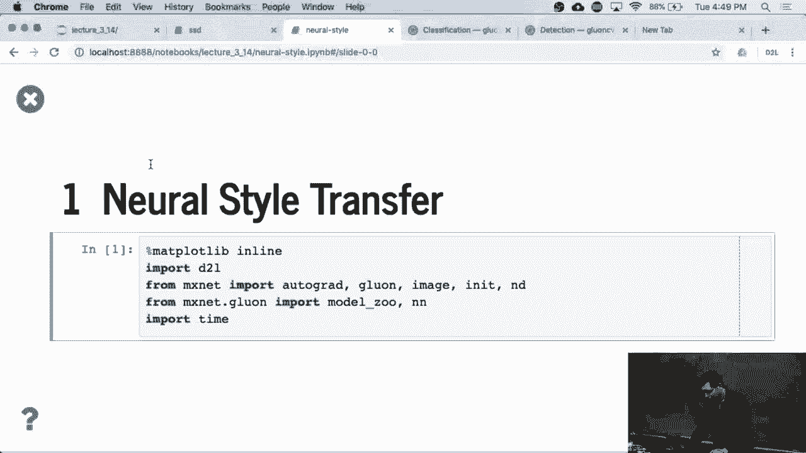

就像我可以读取角落图像，星形图像一样。

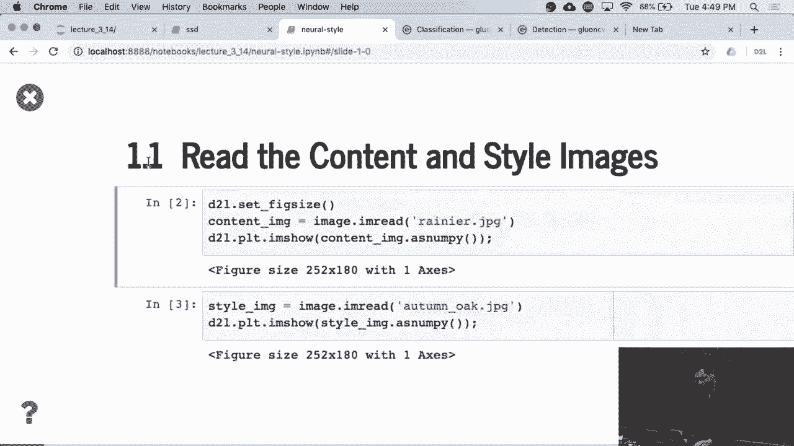

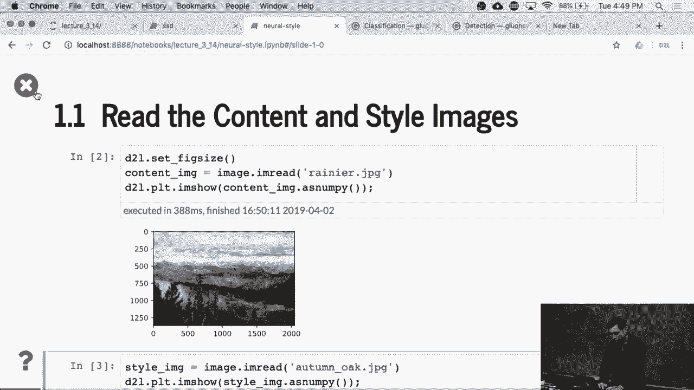

好吧，角落图像，星形图像。

预处理，就像，我们只是处理成0和1。比如，减去最小值并除以标准差。这是非常常见的预处理和后处理。就是这样。

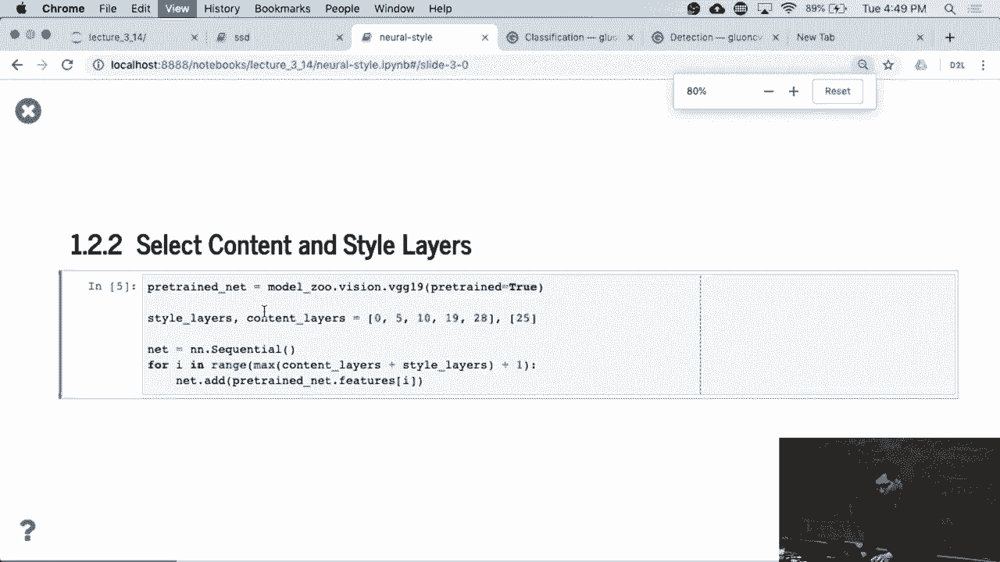

我们正在使用预训练的VGG90作为基础网络。所以我们知道VGG有五个块。所以星层是每个块的第一层。我们有五个块。我将选择每个块的第一层，并将其与这里的四种风格进行匹配。我们刚才选择的内容是——。

最后一块，应该是第四块，最后一层。大约是从90到28之间的第25层。好吧，接着我们就添加——我们只是。获取这些预训练权重。因为我们不需要——这里我们不需要尝试网络，仅仅是为了特征提取。

所以对于特征提取，我们该怎么做呢？给定层的数量，角落层，星层，我们逐层运行并获取输出。然后将其放入处理数组的列表中。这就是风格。所以对于每一层的x。只是1对1的值，如果它在星层，我们就将其放入风格。如果它在角落层。

我们只是把内容放进去，真的返回它。基本上，我们可以给出下一个。我们可以进行特征提取。

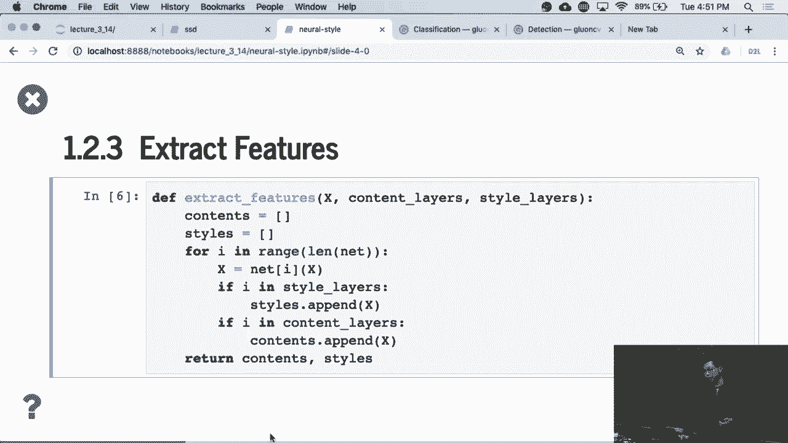

好的，所以我们就像是获取内容——我给一个内容图像，预处理它。并获取特征，这些是内容特征。同时给定风格图像，预处理后的风格图像，并且获取风格特征。我们返回风格和x以及y。

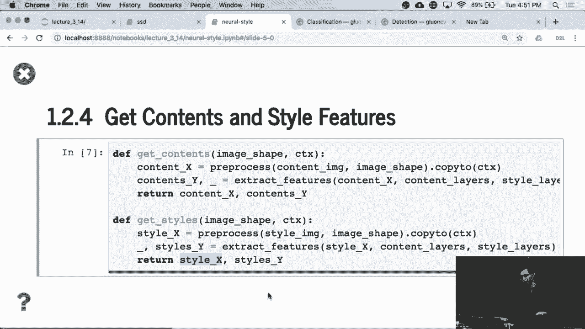

内容的损失函数，我们只是，用于长时间的损失函数，减去平方和域。

对于风格损失，我们该怎么做呢？所以给定x，这是通道的数量。剩下的部分，批量大小始终为1。所以n就是宽度乘以高度，你拥有的像素数。然后我们将其重新调整为通道数和宽度乘以高度。

这是我们拥有的变量数量，每个变量有n个样本。所以对于大矩阵，我们做x乘以x点积，再乘以x转置，进行处理。所以我们有这个随机矩阵的协方差矩阵。假设最小值为零。所以我们只——这种方式就像是二阶。

随机矩阵的状态。然后给定 y hat 的风格损失。假设这个已经有了目标矩阵，只是，减去目标矩阵和两个输入之间的 L2 长度。 所以这是风格损失。TV 损失就像，啊，挺简单的。我每次都减去 1 行向下，1 列向左。

然后做绝对值并求最小值。所以这就是 TV 损失。

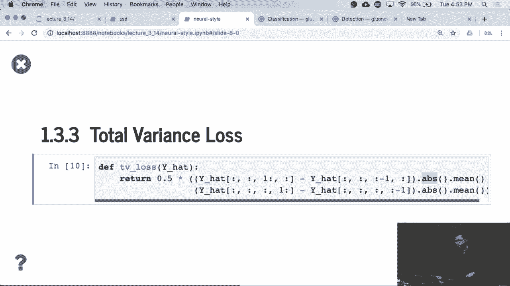

现在我们有了三个损失。我们现在有了权重。手动设置，这是对比权重，风格权重，以及 TV 损失权重。然后我们做一点归一化。所以这个函数可以跳过。我只是给定三个损失，给定不同的权重。我把这些损失和我们之前在 SSD 中做的类似的事情一起编译起来。

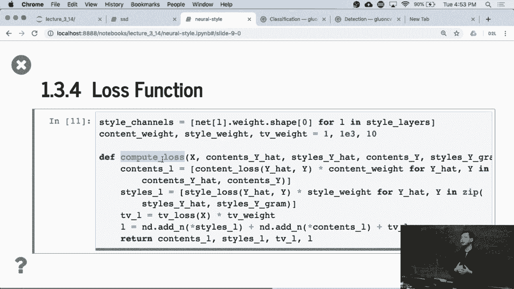

最后，你需要生成图像。你可以做到这一点。你可以从随机开始。但哇，你可以——，所以给定图像。因为——所以这里唯一的不同是，之前我们是学习网络的参数。

现在这里不一样，我们需要学习输入图像的梯度。因为我们需要从随机的初始点更新输入图像，最终得到学习到的图像。所以在这里，我们将其放入一个块中并进行处理——。权重基本上就是我们拥有的图像，这样我们就能。

接下来会计算输入图像的梯度。所以对于第四个函数，你什么也不做。只返回图像。

所以关于我们需要获取图像的梯度。初始化函数。初始化我可以跳过的所有内容。

所以在这里进行训练。我们为训练做什么？首先，x 是学习到的图像。我们正在尝试学习的东西。首先，我们获取风格特征，然后，给定这些特征，我们根据风格图像和风格内容图像计算损失。然后我们运行反向传播函数。所以这里唯一的事情是，训练器——。

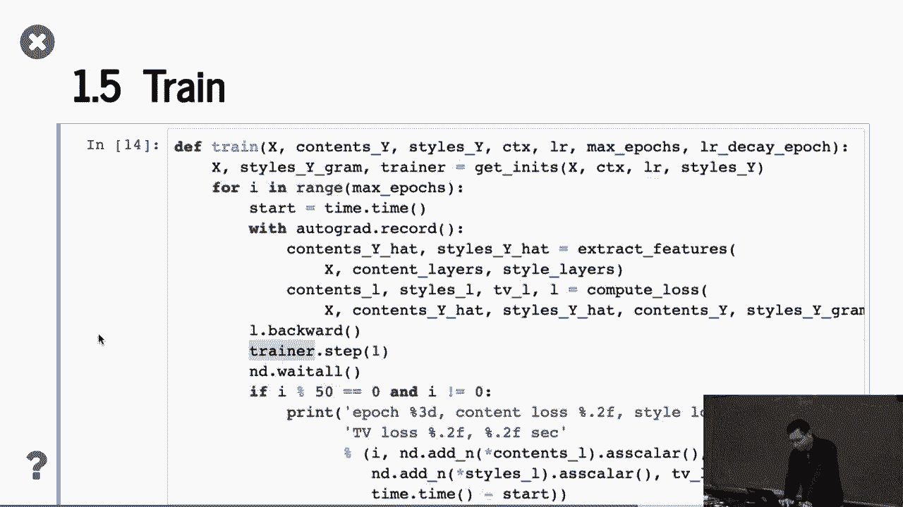

让我看看训练器。训练器，我们——这是输入图像。参数就是它本身。训练器需要在这里更新学习到的图像。所以这是唯一的不同。但其他的事情类似于 SSE，我们需要计算 a。

一堆输出并计算我们拥有的损失函数。我们唯一会打印的就是某些东西。

然后我快速展示一下这里的图像。

这里有个技巧，你首先训练一张小图像。你训练一张 300 x 200 的小图像。你可以看到有内容损失、风格损失，以及最低的损失。你可以看到每个损失都稍微减小了一点。最终，学习到的图像是 300 x 200。但是，通常如果图像太小，你会丢失很多局部信息。

所以这里的蓝色比较浓。

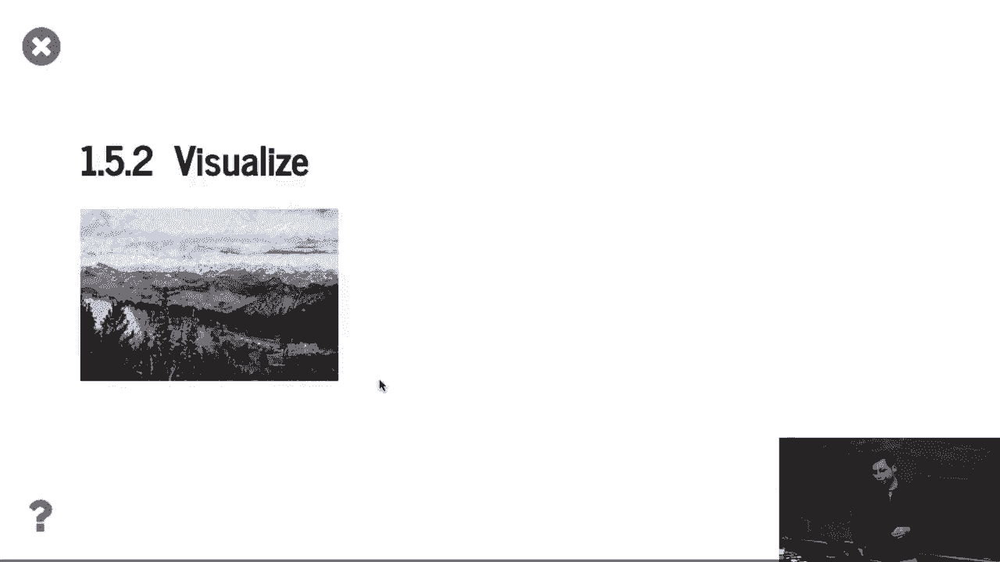

那么你可以做的事情是，你可以训练一个稍微大一点的图像。你可以做 1,020 x 800 的尺寸。这里的窍门是，你可以选择从小尺寸的学习图像作为大图像的初始化。你只需要将其调整为大尺寸，使其成为起始点。

这样，你可以使训练过程更快。

所以，这种情况是，你学习了一个更深、更大的图像。它仍然有点模糊。因为，这仍然太小了。如果你真的想做得很好，嗯，这是有点——如果你有足够的内存，你可以做一个非常大的尺度。这几乎是千倍。所以你可以看到，如果你给一个非常大的图像，你可以学到很多东西。

让我给你看一下原始图像。所以这是一个学习得到的图像。而这是原始图像。原始图像是来自马丁·雷尼尔的照片。

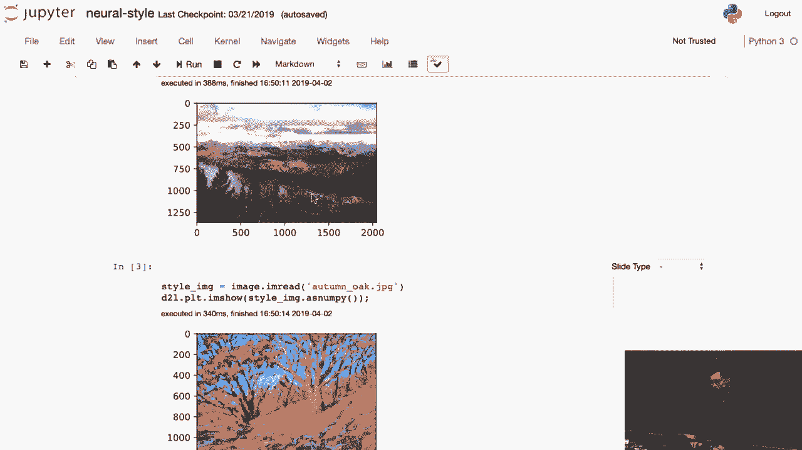

西雅图。

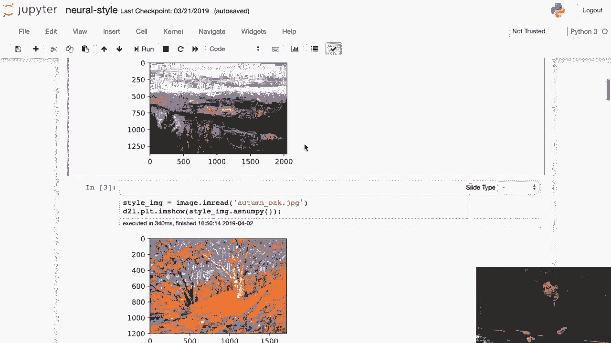

这就是风格图像。你可以看到这是学习得到的图像。它保留了一些来自风格图像的风格。但通常，如果你想玩得开心，你可以改变颜色图像，改变风格图像，尝试两种不同的组合。就这样。[BLANK_AUDIO]。
