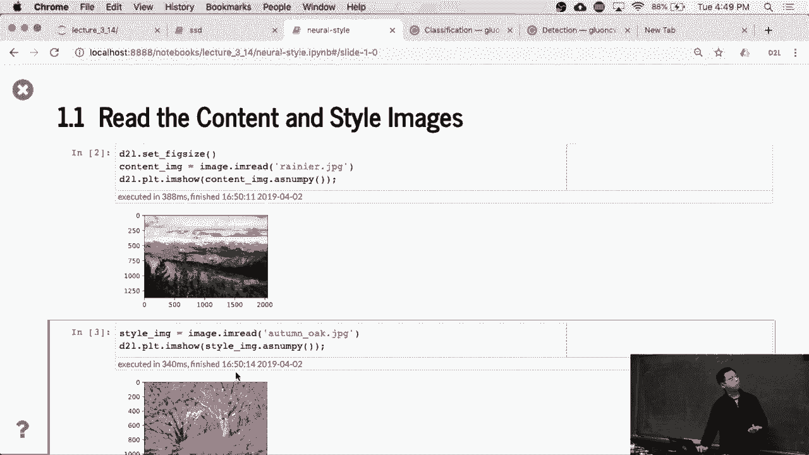
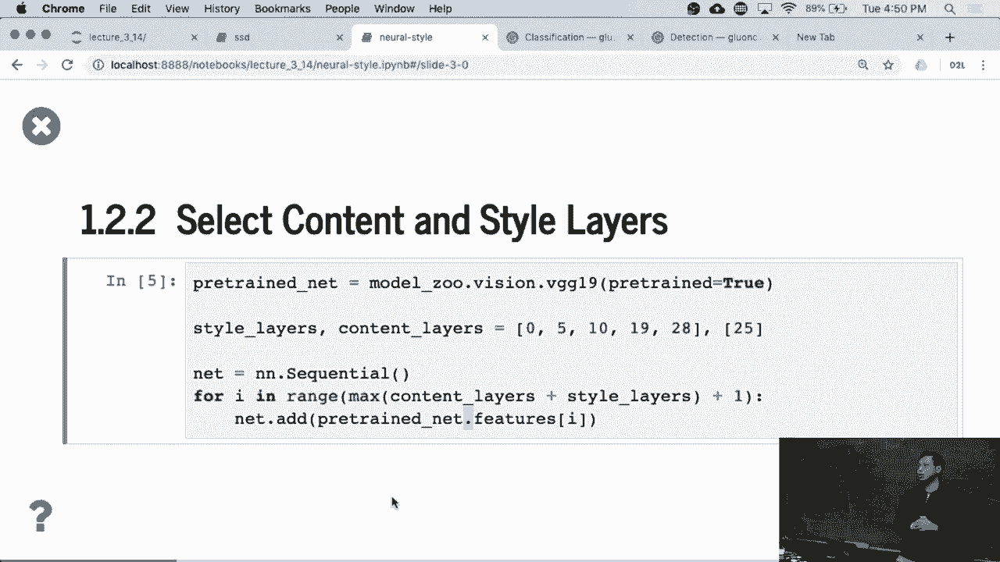
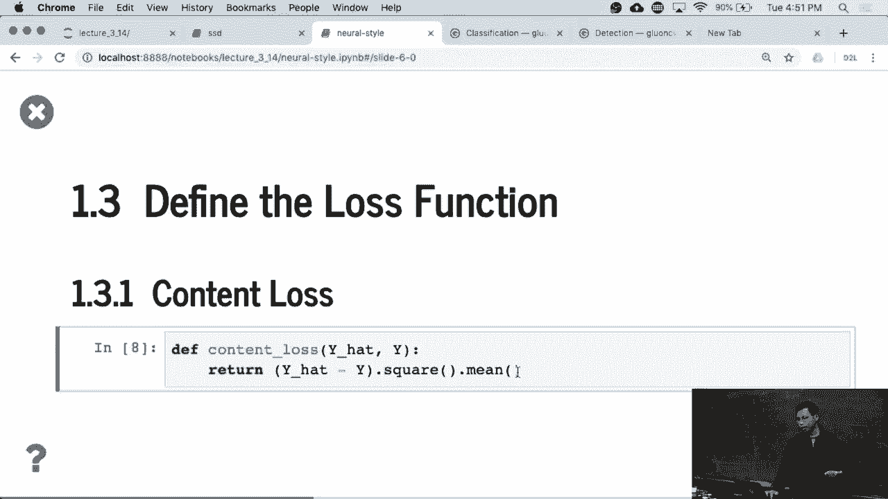
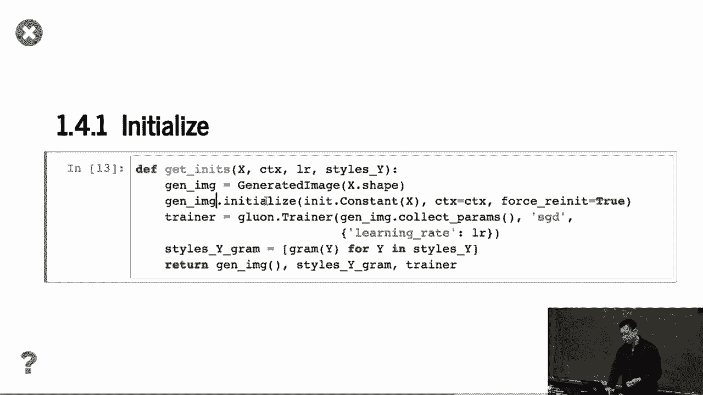
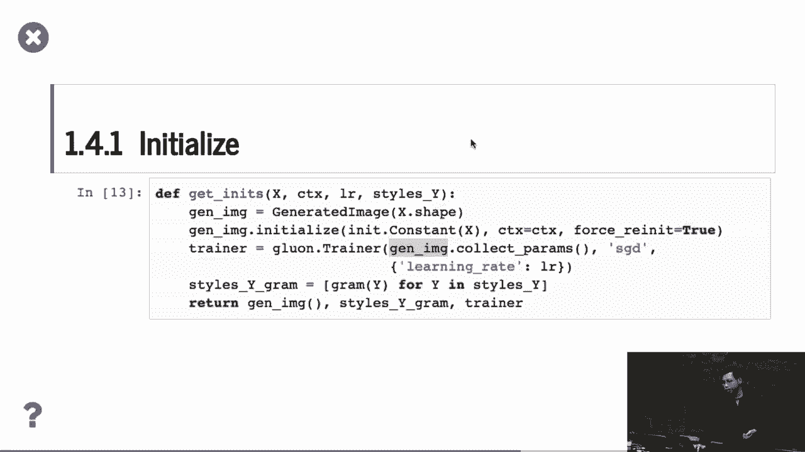
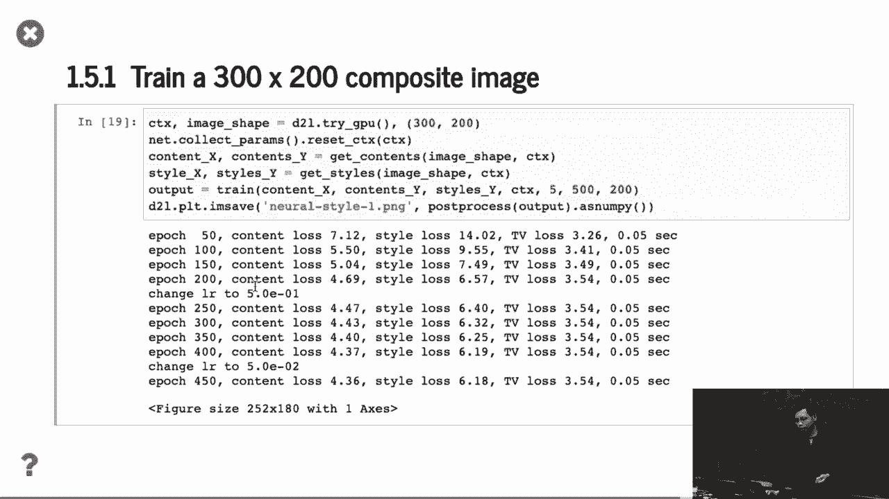

# P85：85. L15_5 Style Transfer in Python - Python小能 - BV1CB4y1U7P6

 OK， so neo-star in Python。

 Like I can read the corner image， the star image。

 Well， the corner image， the star image。

 The pre-processing， like， we just managed to make it 0 and 1。 Like。 minus the min and make divided by the stad deviation。 This is a pretty normal pre-processing and post-processing。 So here's the thing。

 We are using the pre-trained VGG90 to the base network。 So we know that the VGG have like five blocks。 So the star layer is kind of the first layer for each block。 And we have five blocks。 I'll pick up the first layer for each block。 and get to match the four styles here。 The content that we just pick up the--。

 kind of the last block， I think is the fourth block， by the last layer。 kind of the 25th between 90 and 28。 OK， so then we just adding-- we just。 get this was pre-trained weight。 Because this we don't want-- here we don't need。 to try the network， just for feature instructions。

 So for feature instruction， what do we do here？ Given the number of layers， the corner layers。 number of star， layers， we just run layer by layer and get the output。 and just put into the list of a deal arrays。 So this is the style。 So given x for each layer。 just a value 1 by 1， if it's on star layers， we just put into styles。 If it's on corner layers。

 we just put in the content， really return it。 Basically， we can give a next。 we can feature instructions。

 OK， so we're like going to get the contents--， I give a content image， a pre-process it。 and get the features， this content features， and also give style image， given the style image。 a pre-processed style image， and also， get the style features we have。 We return the style and I x and the y。

 The loss function for content， we just， a to long for loss function， minus square and domain。

 For the style loss， what do we do here？ So given x， this is the number of channels， we have。 and this kind of the rest of it， the batch size is always equal to 1。 So n is just the width times the height， the number of pixels， you have。 So then we reshape it to number of channels， and the width times height。

 So this is the number of variables we have， and n samples from each variable。 So for grand matrix。 we just do x times x dot， x transport， post， and do the thing。 So we have covariance matrix for this random kind， of random matrix here。 So we assume the min is zero。 So we just-- this one kind of like the second order。

 status for this random matrix。 Then the style loss， given the y hat。 assume this already have the grand matrix， just， the minus the L2 long between the grand matrix of its two。 input。 So this is the style loss。 The TV loss is like， ah， it's easy。 I just every time 1 minus the 1 row down at one column left。

 and do the absolute value and do the min。 So that's the TV loss。

 So now we have three loss。 We now have weight。 Hands off， this is the counterweight， style weight。 and TV， loss weight。 And we do a little bit of normalize。 So this is like， can skip this function。 I just given three loss， given different weight。 I just compiled this loss together with a similar thing we。 did at the SSD before。

 So at the last， you need a generate image。 You can do it right。 You can do it from a random。 but wow， you can--， so given image。 Because-- so here， the only difference here。 is that before we learned the parameter for the network。

 Now here， differently， we need to learn the gradient of the， input image。 Because we need to update the input image for a random， maybe。 from the initial point to the learned image at the end。 So here， we put into a block and make--。 the weight is basically the image we have so that we're。

 going to compute the gradients of the input image。 So for the fourth function， you just do nothing。 Just return the image。

 So about we need to get the gradient of the image。 So the init function。 init all the things I can escape。

 So here for training。 What do we do for training？ So firstly， so x is the learned image。 the thing we're， trying to learn。 So firstly， we get the style， the style features， and then。 given these features， we compute the loss according to， the style image and the style content image。 Then we run the backward function。 So the only thing here， the trainer--。

 let me see the trainer。 The trainer， we-- this is the input image。 The parameter is the itself。 The trainer need to update the learned image here。 So this is the only difference。 But the other thing is similar to SSE， we have compute a。

 bunch of outputs and compute the loss functions we have。 The only thing we will print is something。

 And then I quickly show the image here。

 One trick here， you first train a small image。 You train a small 300 by 200 image。 You can see that there's a content loss， style loss， and， the lowest loss。 You can everyone decrease by a little bit。 Finally， this kind of the learned image。 300 by 200。 And then， but usually if the image is too small， you lose， a lot of local information there。

 So it's pretty blue here。

 Then what you can do， you can train a little bit of a， large image。 You can do 1，020 by 800。 The trick here is that you can choose the learned image from。 small size as the input as the initialization of the large， one。 You just resize to the large one to make it， a starting point。

 So then you can make the training much faster。

 So this kind of， well， you learned a deeper， larger one。 It's still a little bit blurred。 Because。 well， this is still too small。 If you really want to do good， well， this is kind of--。 if you have a lot of memory， you can do a very large scale。 This is a thousand times。 a thousand almost。 So you can see if you give a large， very large ones， you， can learn things a lot。

 Let me show you the original image。 So this is a learned one。 And this is the original one。 The original one is the picture from Martin Rainier at。

 Seattle。

 And this is kind of the style image。 You can see that this is the learned one。 Kind of keeps some style from the style image。 But usually， if you want to have fun。 you can change the， color image， change the style image， and try two， different combinations。 So that's it。 [BLANK_AUDIO]。