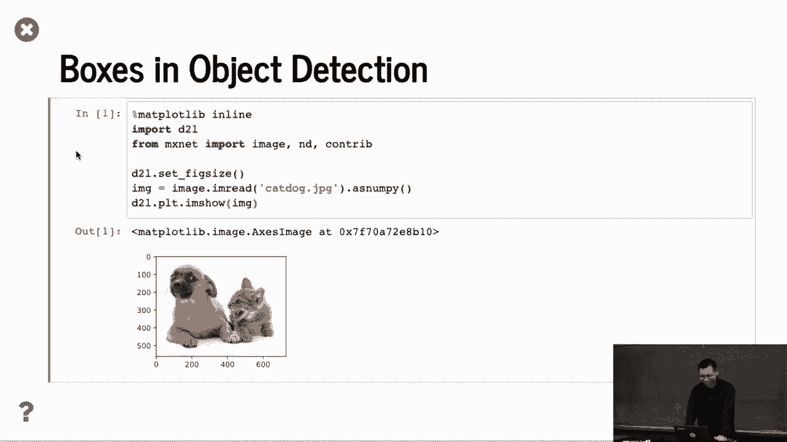
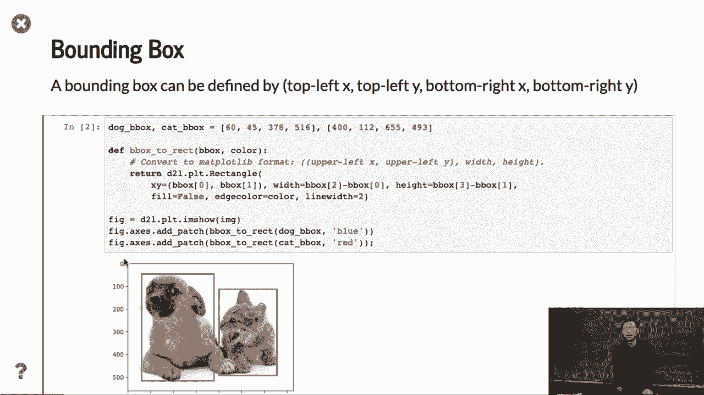
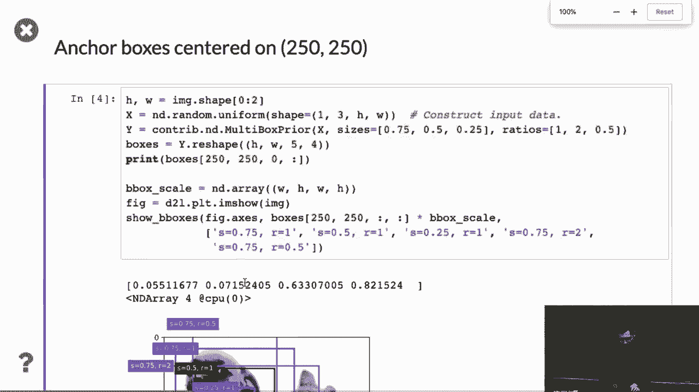
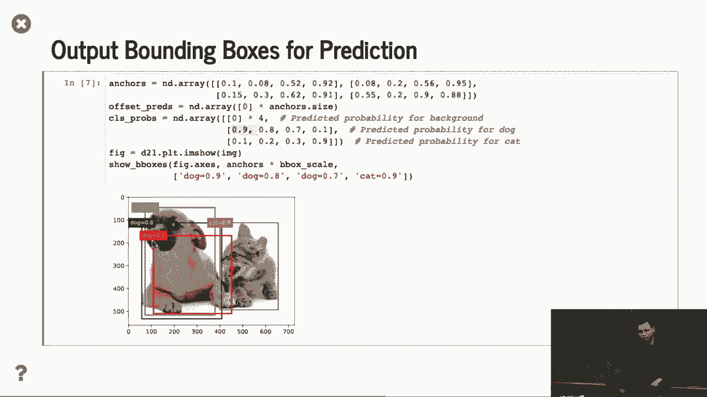
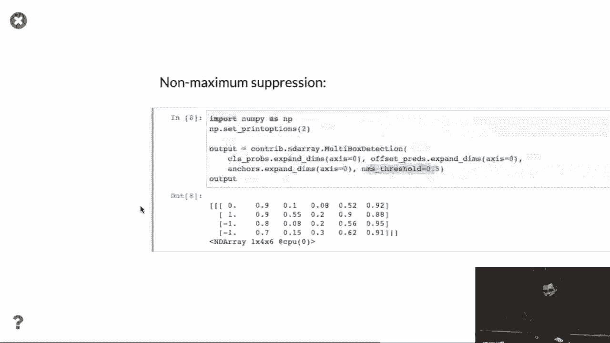
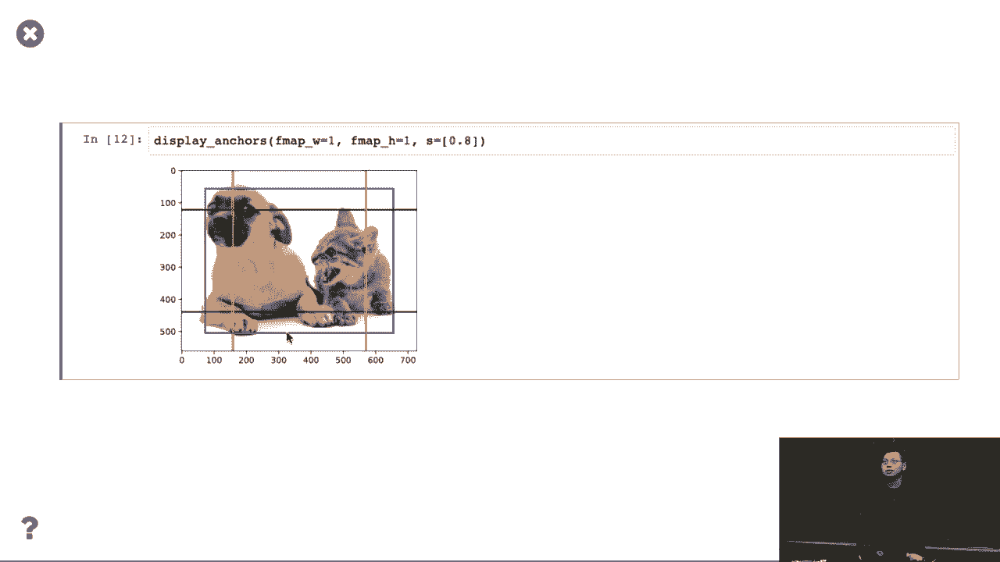

# P87：87. L16_2 边界框和锚框 - Python小能 - BV1CB4y1U7P6

好吧，让我们看看一个捆绑框是如何工作的。因为这是一个关键概念。我们想知道如何处理所有的框。所以在这里。我们导入库，这就是我们之前在幻灯片中展示过的目录图像。事实上，我花了10美元买了这一张。否则的话。

找到可以使用的图片而不付费是相当困难的。所以它是相当安全的。我为这本书买的唯一一张图片就是这张。

好吧。你可以看到，捆绑框可以通过四个数字来定义。这是一个黑色的捆绑框。BB框叫做捆绑框。然后是猫的BB框。我喜欢它的常用名称，我在检测中使用过它。然后这是猫。接着我可以在这里展示一个函数。我不能说它只是一个绘图。东西。

我可以在这里退出代码。

你可以看到，嗯，这是黑色的。这是一只猫。好吧。还有，类似的东西。这是x轴和y轴的零点。

然后是另一个函数，用来显示多个框，我可以逃避所有的事情。这只是一个绘制多个捆绑框。唯一需要注意的是，捆绑框的列表，如果你有标签，或者没有标签，并且你想选择颜色。

所以这就是你想知道的唯一事情。好的。所以这是事情的真相。

所以我们，我们将要生成，所以下一个函数，它在贡献中被称为。多框优先。你要做什么呢？给定图片。所以这里给出一张图片。图片的高度和宽度。然后我只是做了一些假的东西。我不关心图片的内容。我只关心图片的形状。

那么我们在这里做的这个边界框，对于每个像素，我可以生成。所以你可以以这个像素为中心，生成多个锚框。所以你可以控制大小，这相对于原始图像而言。0.5意味着我可以生成一个边界框，其大小为原始图像的50%。

比例是高度与宽度的比率。零。一个表示正方形，两个和0.5。所以我可以生成一堆具有不同大小、不同比率的锚框。好吧。然后你会看到，你将生成大量的边界框，因为对于每个像素，你将生成多个锚框。所以我要返回一些东西。

我要重塑并打印出所有这些锚框，中心位于250，250。

现在我可以看到，给你展示一下。好的，让我，这就是我们在幻灯片中展示的图片。

所有这些完整的锚框都以这个像素为中心，并且有不同的大小。这里获取的是原始图像的四分之一、二分之一和不同的比例。这里的半分之一是绿色的，另一个是三分之一和不同的比例。好吧，这就是如何生成的，你可以决定，好吗？

你将尝试不同的大小，尝试不同的比例来生成大量的边界框，锚框。

然后是另一个，如果我已经有了真实框，这是边界框。零表示分类标签，这是该边界框的标签，我们有一堆锚框。这里我们有多少个？1，2，3，4，5，五个。然后我们可以可视化所有的内容，黑色的表示真实框。

黑色的猫，颜色框只是锚框，我们展示了标签1，2，3，4，5。然后我们将锚框标注为真实框。

我们做的是，我跳过了定义，如何准确实现这一点。实际上，你可以在多框目标中使用，给定我们已有的锚框，给定我们拥有的真实框，你可以忽略这一部分，但我们可以，因为我们是单批次，所以我们可以扩展维度，使x等于零来获取批次的版本。

所以它会返回三个东西。最后一个是标签。我们为每个锚框分配标签。因此，这里我们有五个锚框和两个对象，我们给零表示背景，给这个一个标记为doc，给这个标记为猫。第一个标记为背景，第二个标记为猫。我们来看看。

所以零是背景， 一是猫。

一是doc，看看。

然后是两个，二是猫，三是背景，三是背景，四实际上是猫。你有不同的方式来生成这些东西。之所以将这个标记为doc，是因为这里的锚框不够好。所以即使这个被标记为doc，它仍然不完全准确地对应实际的边界框。

对于猫，四是最好的。

其余部分是一种掩膜，表示每个值对于边界框、盒子的质量。零表示背景，表示这是背景；一表示这实际上是锚框的一部分。盒子被分配给对象。因此，我们将使用掩膜字母来定义损失函数。最后是偏移量，如何将锚框映射到实际的边界框。

如果是背景，我们不需要映射。如果是其他的，我们就给出一些值。这是一个真实值。你可以看到。好，问题？好，接下来是如何输出。

这里我们假设我们有多个预测结果。在我们将标签映射到锚框之前，现在我们假设算法已经为每个锚框生成了预测结果。所以这里是类似的格式。第一个元素是预测得分，是置信度，用来判断对象的存在。抱歉，这实际上是框，而不是得分。这个实际上是框。

不设置，我只是将其设为零，简化处理，成本概率是一个softmax输出，我们将为每个锚框预测每个成本，得到它的置信度评分。然后我们打印所有内容，你可以看到，狗有三个几乎相似的结果。

预测值为一。那么我们在这里做什么？我们使用多个检测结果，考虑成本概率、偏移量和锚点，所以这里是MMS阈值。我们选择了0.5。所以，如果两个框的重叠小于0.5，我们很可能会去除它们。所以你可以看到，输出为零意味着它实际上是类，1意味着。

这是类，-1意味着我们已将其移除。

所以你可以看到，猫、狗，我们有猫，其他狗我们就移除了。

为了可视化它，我们遍历所有结果，如果是-1，我们就移除它。

保留其余的，打印出来，你可以看到我们打印了结果，去除了重复项。好，问题？好，另一件事是，我们可能关心不同的。

尺度。所以这里的框，我们实际上不关心实际大图像的大小，我们告诉算法图像仅包含四个像素的宽度和四个像素的高度。所以对于算法本身，我们认为，好的，我只有四个像素，1、2、3、4，还有四行四列，对于每个像素，我可以为它生成一个框。

你可以，但你不能获得更小的尺度，因为这里的形状是你给算法提供的一个假形状。所以给一个更小的形状，这样它实际上可以生成更小的框。保持相同的事物，保持相同的大小和比例，我不改变它，我只是告诉它。

算法会生成输入像素，其中有两个像素代表宽度和两个像素代表高度，它实际上生成了更大的框。所以这里的想法是，我不需要改变所有的大小和比例，我只是改变预测。

输入大小，我可以告诉算法生成不同尺寸比率的边框框。所以这是有用的，像我们可能会在明年或者后年谈到的那样，好的。

还有，比如假设图像只有非常少的像素，因为你有一个很大的边框框，好的。关于边框框的部分，你有问题吗？那在预测标签时，和锚框是怎么处理的？

它是不是像在锚框上进行目标检测一样？

就是图像分类，好的，可能我们有时间今天和你们聊聊。那初始的锚框是如何生成的，是随机的吗？

所以不同的算法有不同的方式来生成锚框。还有其他问题吗？

在我们谈下一个话题之前。

