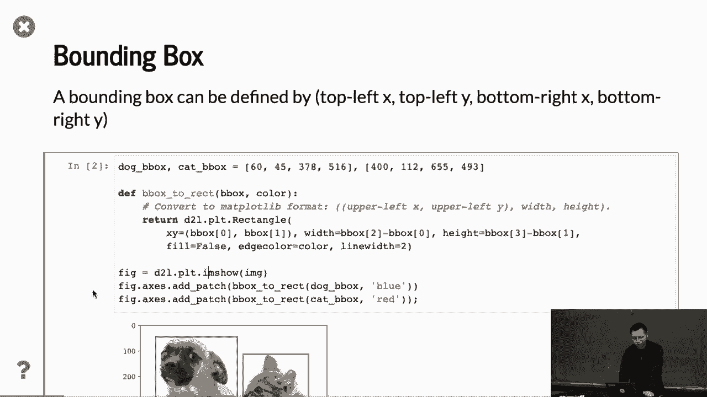
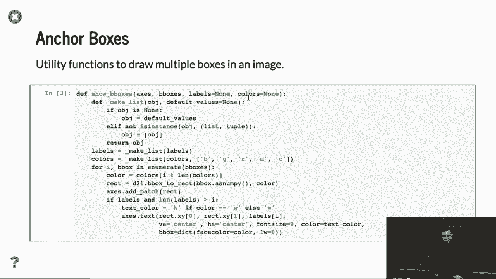
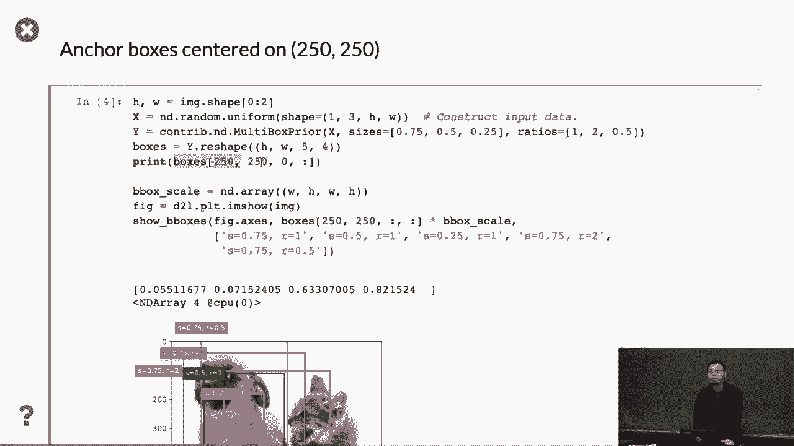
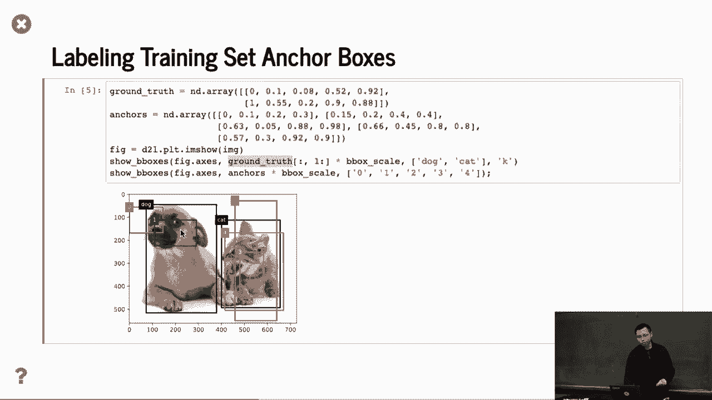
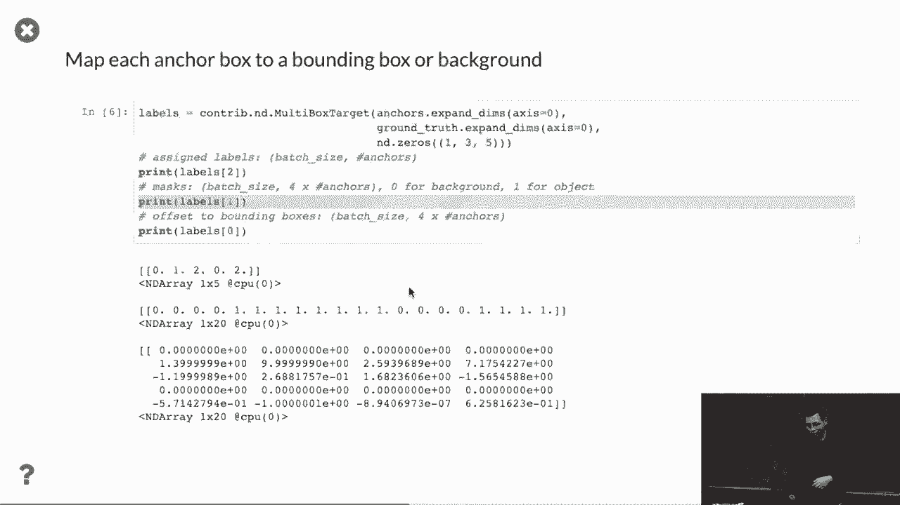
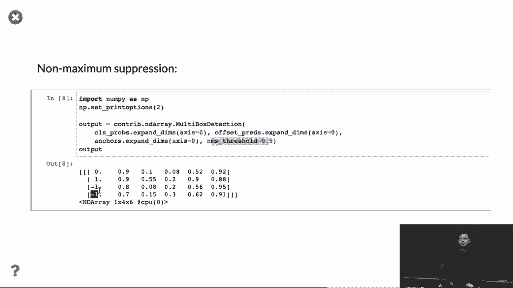
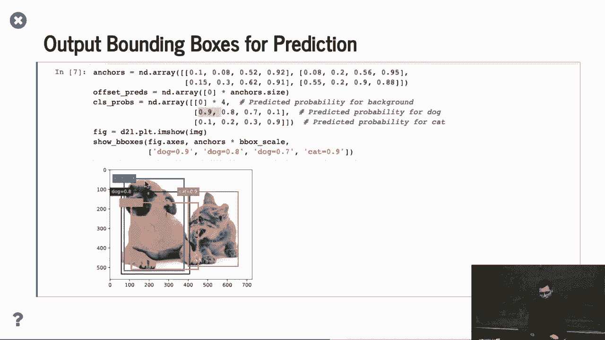
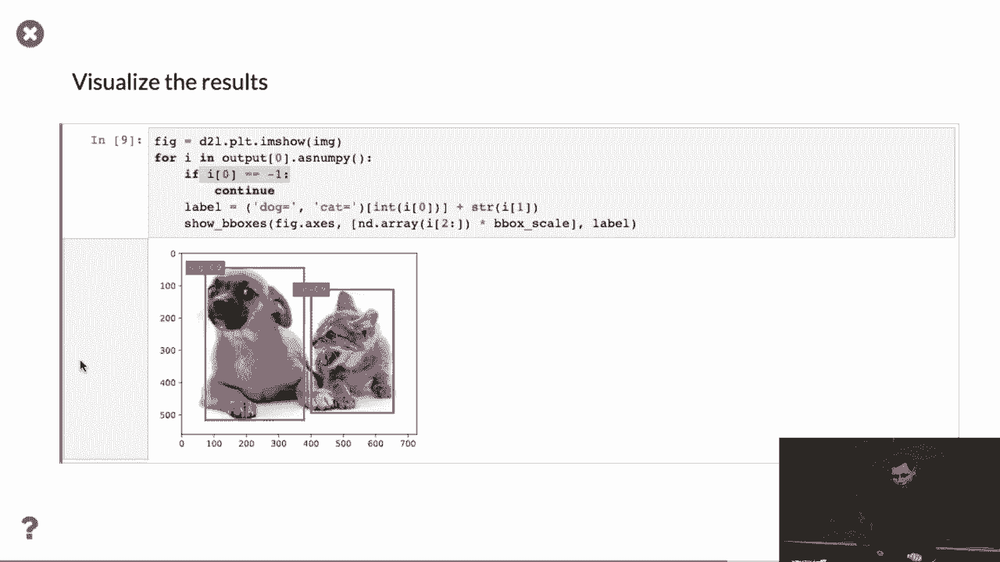
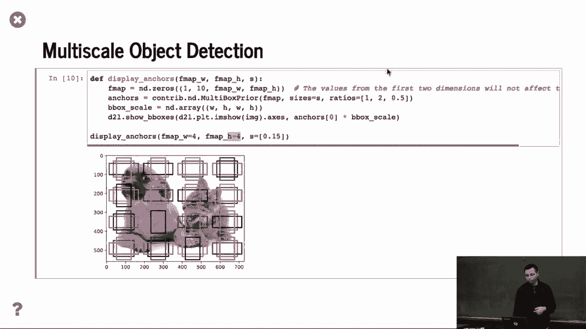

# P87：87. L16_2 Bounding and Anchor Boxes - Python小能 - BV1CB4y1U7P6

 Okay， let's look at exactly how a bundle box works。 Because this is a key concept。 we want to know the idea how to deal with all the boxes。 So here。 we import the library and so this is a catalog images we had shown in the slides， before。 And actually， I bought this one for $10。 Otherwise。

 it's pretty hard to find the image you can use without pay that。 So it's pretty safe。 The only image I bought for this book is this one。

 Well， okay。 So you can see that the bundle box can be defined by things， like by four numbers。 This is a dark bundle box。 The BB box is called a bundle box。 And the cat BB box。 I like it's common name for， I used it in detections。 Then this is a cat。 Then I can show a function here。 I can not say it's like just a plot。 The thing。

 I can go out the code here。

 You can see that， well， this is the dark。 This is a cat。 Okay。 And also， similar thing。 this is zero for the x and the y axis。

 And then another function to show multiple boxes， I can escape all the things。 This is just a plot multiple bundle boxes。 The only thing that the， the， the， the， the。 the list of bundle boxes， if you have labels， or not， and you want to pick up the color。

 So that's the only thing you want to know。 Okay。 So here's the thing。

 So we， so we're going to generate， so this function， it's on the contributes called the。 multi box prior。 What are you going to do here？ Given the image。 So give an image here。 The height and the width is for the image。 And I just fake something here。 I don't care about the image content。 I only care about the shape of the image。

 So what this bounding box we do here， for each pixel， I can generate。 So you can center with this pixel， I can generate multiple anchor boxes。 So you can control the size， which is relative to the original image。 The point five means I can generate the bound box， have 50% of the size of the original image。

 The ratio is the height to， is that width and to height ratio。 Zero。 one means the square and the two and the 0。5。 So then I can generate a bunch of anchor boxes with different size。 different ratios。 Okay。 Then you see that you're going to generate a large number of bound boxes because for each。 pixel you're going to generate multiple anchor boxes。 So I'm going to return something。

 I'm going to reshape and print all these anchor boxes， centered at 250， 250。

 And now I can see， show you that。 Okay， let me， this is the image we showed in the slides。

 So all this full anchor boxes are centered at this pixel and have different size。 This is the only get a quarter of the original image， half of the original image and a not。 half half。 Half is here， half is the green one and this one's three quarter and also different ratios。 for the image。 Okay。 So this is how to generate， you can， you can decide， okay。

 what different size you're， going to try， different ratios you're going to try to generate a large number of bound。 boxes， anchor boxes。

 Then the other one that if I already have the ground choose which is a bound box， the。 zero means the， the cast label and this is the bound box of this， the， the number of。 this bound box and we have a bunch of anchor boxes。 Here we have how many of them is one， two。 three， four， five， five of them。 Then we can visualize all the things， the black ones of one truth。

 the dark cat， the， color ones just the anchor boxes and we show the label it one， two， three， four。 five。 Then we're going to label the anchor box to the ground choose。

 What we do， I'm going to skip the definition， how exactly to implement that。 Actually。 you can use in the multi box target to given the anchors we have， given the ground， choose we have。 you can ignore this one but we can， because we single batch， we can expand。 the dimension that x is equal to zero to get the batch， a batch the version。

 So it's going to return three things。 The last one is called the label。 We assign labels to each anchor boxes。 So here we have five anchor boxes and two。 two objects and we give zero to background and， this one assign to doc， this one assign to cat。 the first one assign to background and this， one to cat。 Let's see that。

 So zero is a background。 One is actually a cat。

 One is a doc and let me see。

 Then two， well two is a cat， three is a background， three is a background and four is actually。 a cat。 You have different flavors how to general the things。 The reason this one is cans of label as doc because it's not better anchor boxes here。 So even this one is cans of label as doc。 It's not very accurate to the actual bond box that we have。

 For cat， so four is much better。

 And the rest of it is a kind of a mask which means the masses for each values for the bond， box。 zero means it's background， one means this is actually this is a part of the anchor。 boxes assigned to objects。 So we're going to use the mask letter to define the loss function。 The final thing is the offset how to map the anchor boxes to the real bond boxes。

 Zero if it's just a background we don't need to map。 If otherwise we give some values here。 So this is a real value。 You can see that。 Okay。 Questions？ Okay。 So the other one that where how to output。

 So here we have assume we have multiple predictions here。 So before we map labels to anchor box。 Now here we assume the algorithm already have predictions for each anchor boxes。 So here similar format。 The first element is the predicting score is a confidence how we can tense the object。 and sorry this is actually the bond box is not a score。 This is actually the bond box。

 Don't set I just make it a zero for simplicity and also the cost probabilities is a soft max。 output we're going to predict for each anchor box we're going to predict for each cost we。 have what is the confidence score。 And we print all the things here you can see that the dog have three almost I think similar。

 predictions that had one。 So what do we do here we're using multiple detections given the cost probability given。 the offset given the anchors and so here's the MMS thresholding。 So we choose 0。5 here。 So we gonna if two bond boxes overlapping less than 0。5 we are most likely to just remove， them。 So you can see that the output will be zero means is actually have the class one means。

 is the class minus one means we just removed。

 So you can see that the cat the dog we have the cat we have but the other dogs we just。

 removed to visualize it we just we iterate all the results if equal to minus one we just。

 keep otherwise just print you can see that we print the result removal of the duplications。 Okay questions。 Okay， the other thing here is that well we want to have we maybe care about different。

 scales。 So here the bond box we actually don't care about how large the actual large images we。 have for here we tell the algorithm that the image only have four pixels for the。 width and four pixels for height。 So for the algorithm itself we think okay I only have four pixels one two three four。 and four rows for columns and for each one I can generate a bundle box for that and so。

 you can you can't get get scales much smaller because the shape here is kind of you give。 a fake shape to the algorithm。 So give a smaller one so it can actually generate small bond boxes。 Keep the same thing keep the same size and the ratio I don't change it I just tell the。

 algorithms that okay the input pixels have two pixels two for the width and two for the。 height it actually generated even larger bond boxes。 So the idea here that I don't need to change all the size and the ratios I just change the。

 input size so I can tell the algorithms to generate different ratio bond boxes。 So that is well that is useful for like the you know we gonna talk about in the maybe。 next next year and next next year okay。

 Also like given assume the image only have think pixel because you have a very large。 bond boxes here okay。 That's all for the bond box you have questions question。 So on the prediction the labels with the anchor boxes how does that go？

 Does it just do like object detection on the anchor boxes？

 Just image classification okay kind of kind of show maybe we maybe have time to talk to。 you about today。 And the initial anchor boxes how are they generated to this random？

 So the algorithm different algorithms have different way to generate the anchor boxes。 And other questions？

 Before we talk another one。

