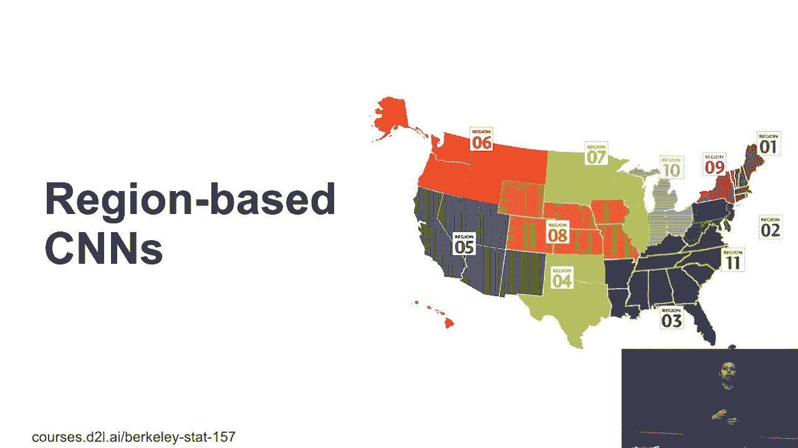
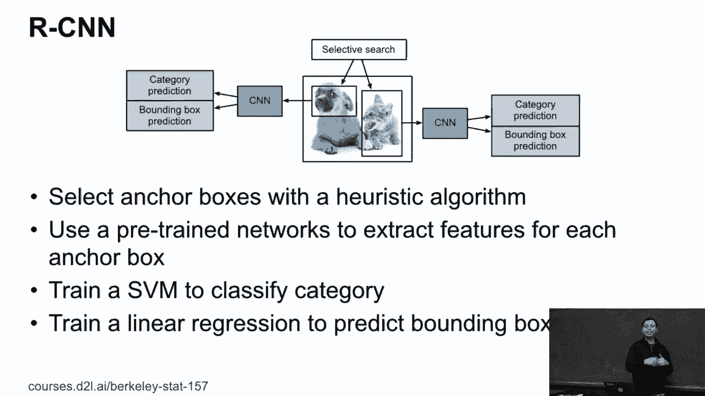
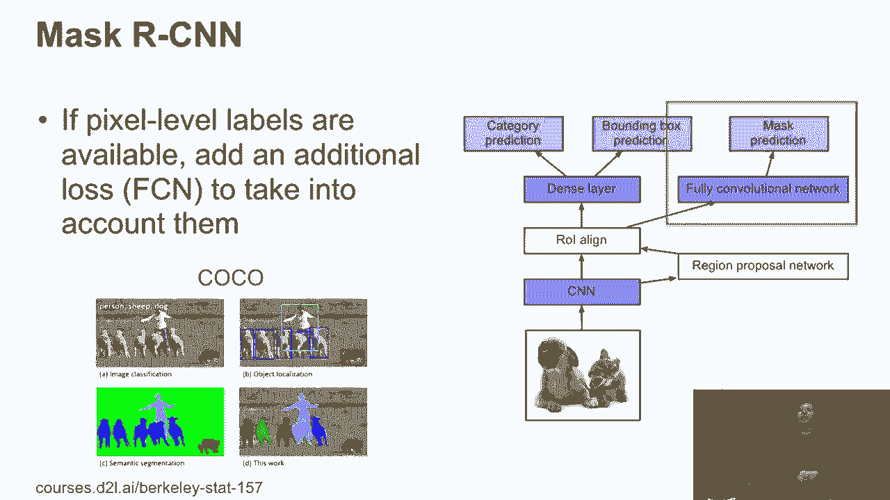
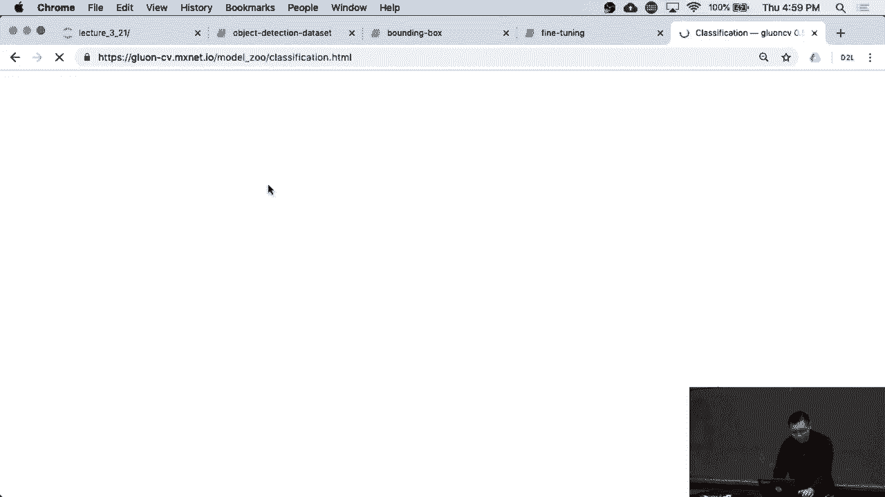
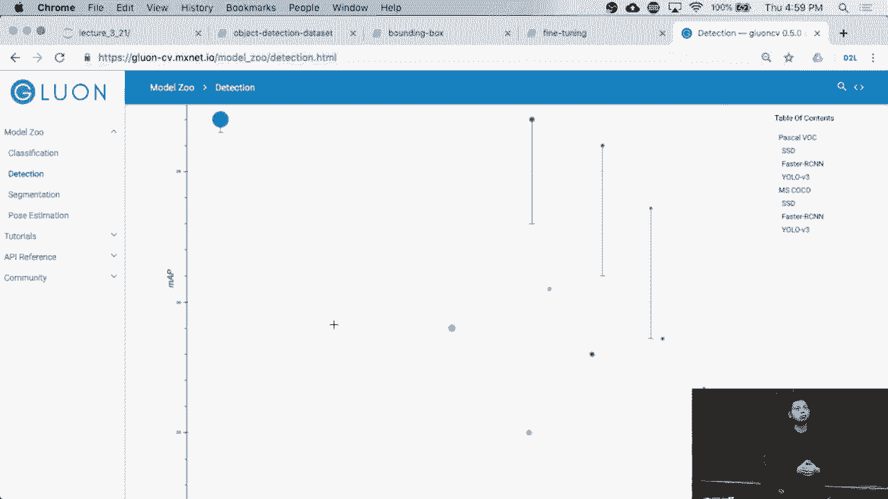

# P89：89. L16_4 基于区域的CNN - Python小能 - BV1CB4y1U7P6

所以，R3N几乎是最早的检测家族。它可能是基于深度学习的检测算法中的第一次成功。你有多个模型。我们在这里快速概述一下。

首先，他们称之为R，CN。它是一个区域，CN。这个思想非常简单。所以，给定图片，给定狗和猫，我们将这张图片放在这里。我们在这里做的事情是，我们首先生成一堆锚框。最初的RCL使用了一种启发式算法。它相当复杂，基于原始的非深度学习算法家族。所以。

很多启发式方法，用来观察图片，观察很多小细节。所以，很多细节在里面。但你可以把它看作是一个黑箱。给定一张图片，它可以输出很多锚框候选框。然后，对于每个锚框，它们在这里做的事情是，我们只需裁剪图片并将其作为训练样本。所以，接下来对于这张图片。

我们做的事情是，我们只生成两张新图片，第一张可能有狗帽，第二张可能有猫。然后，对于每个区域或每个锚框，我们首先使用一个预训练的网络。在那个时候，我认为是使用预训练的VGG或其他任何东西，来获取每个锚框的特征。

一旦我们得到特征，我们就训练SVN来分类图片中的物体。然后，我们训练线性回归来预测边框偏移量。就是这些。所以，我们在这里做的事情是，给定一张图片，选择一些锚框，并在CRN中使用它们来获取每个锚框的特征。所以，可能每个锚框得到一千维的特征。

所以，这就是——我们还没有训练。我们只是做了预处理。然后，我们训练SVN来获取物体，训练线性回归来获得边框。训练是在最后阶段。问题。>> 使用SPC分类器更快吗？比在第三阶段使用多级子产品更快吗？>> 嗯。

它是——我不记得颜色是否是VN线性，但关键在于特征结构。所以，如果——想象每张图片，如果我能为你挑选一千张图片，你将运行一千张图片的特征结构。这意味着，假设我有——如果我的数据集有一千张——不，一千张。

一百万张图片，每张图片我们生成，可能只有一百个锚框。最终我们得到一千万张图片。我们需要运行这些一千万张图片的四个路径。这是非常昂贵的。这意味着你需要通过十次图像网进行处理。那——那——那——那——那——那——

这个算法可能已经有六年，或者至少六年了，这意味着你需要一个小的GPU，花费很长时间才能完成这件事。那么，人们在这里做了什么呢？

我——我给它们——给它们数据集。我做——我——我获取特征并将其保存到磁盘。然后我可以稍后使用这些特征。所以，甚至保存到磁盘要比尝试实时生成要容易得多——快得多。好吗？其他问题？好的。所以，这个原始家庭，放低一点。然后我们有一个——叫做快速EN的东西。

在我们讨论更快的版本之前，先看看这里有一个概念叫做I/O/I池化。感兴趣区域池化。这里的想法是——给定一个特征图和一个给定的框，给定锚框。所以，这就是我们有的那个框，是锚框的颜色。所以，如果我们要执行一个二乘二的I/O/I池化，意味着对于每个锚框。

我们将其切分为二乘二的区域，甚至在Kotlin中也是如此。但是这是三，不能除以二。所以，第一个区域——我们有二乘二。然后第二个区域就是一个。好吗？然后对于每个区域，我们用不同的颜色展示。在这里，我，无法使它的最大值。所以，在那时——对于每个锚框，我们不能得到。

二乘二的输出。所以，通常，如果我对每个锚框执行N乘M的I/O/I池化，我们不能从这个锚框中得到N乘M的元素。那么，这有什么好处呢？好的地方在于，无论锚框的形状如何，我都可以始终得到锚框的固定长度特征表示。所以。

我可以有不同——不同大小的锚框，适配到——I/O/I池化中。然后对于每一个，我得到——固定形状的每个框的特征。好吗？所以。这是关键点。想想我们以前是怎么做的。

这里，每个锚框的形状不同，但我将其输入到CNN中，调整为相同的形状。输入到CNN中，得到相同大小的结果。

我可以做其他分类。所以，在这里，我可以实现ROI池化，得到相同大小的结果。

每个锚框。好吗？所以，这里是第一个RCN。嗯。它只改变我刚刚在黄色框中标出的内容。首先，我把它输入到CNN中以获取特征。我不会把每个锚框都单独输入到CNN中。我只是将原始图像输入到CNN中。然后，仍然。

就像我从原始图像中选择锚框，我提出多个锚框。然后，我将锚框应用到这里CNN的输出。所以，在这里，你做特征提取并应用锚框。这里，你需要稍微调整一下，因为原始图像中的锚框更大，容易处理。

CNN的输出可能会稍小，但你仍然可以相应地调整锚框的大小，并将其适配到ROI池化中以获得输出。所以，在ROI池化的最后，你会为每个锚框得到固定长度的特征。然后，我们可以将其输入到全连接层进行预测。

这里的边界框和之前类似。但首先，RCN从SVN变为软最大线性回归。所以，那样更容易合并在一起。但最重要的是，我们减少了复杂度，因为我们只运行一次CNN。我们没有根据锚框的数量和约束运行。

这可能让你快10倍。好么，有问题吗？好的，所以，嗯，这就是RCN一年后的进展。它更快了，但实际上还是不够快。

然后，我们有一个叫做更快的RCN的东西。嗯，原因是因为选择性搜索选择了一些。

锚框不够好。如果你想得到好的覆盖率，你需要选择很多锚框。而且，算法本身也相当慢。我想提高锚框的质量。

所以，在这里，我将尝试一个小型网络，叫做区域提议网络（RPN），用来选择锚框。所以，我们在这里做的其实是运行一个小的检测算法，但你不——你较少关心准确度。那么，你在这里做什么？

我只需将特征指令适配到结论神经网络，并提出一些更便宜的——大量的随机锚框。然后，你有一个小型分类器来分类它是否包含一个对象？如果没有，我就丢弃它。如果有，我就预测偏移量。所以，然后，我就使用包含对象的锚框加上。

偏移量和RMS用于去除重复项，并适应训练。好吧，总体来说，我们在这里运行一个小型检测算法，生成高——不是边界框预测，并将其用作高质量的锚框。在这里。为什么我们可以加速？因为我们可以在一个小的输入尺度上运行一个非常小的卷积神经网络。所以，我们可以让它更快。

最后——所以，这里的主干，我们可以得到更少的锚框，而且质量也更高。这意味着我们也大大提高了准确性。好么？有问题吗？问题？

>> 你能提一下区域性能在这个工作中的表现吗？ >> 嗯，它也有标签。它被合在一起。所以，这个地方，你提出锚框时，也有标签一起用于训练。你将它们合并——合并。合并，告诉我。好吗？RCM系列的其他工作叫做主控。

RCM。嗯，除了如果你谈论代码数据集，我们不仅有边界框外，没什么变化。我们确实有像素级的标注信息。所以，在这里，你可以看到我可以标注每个像素它是背景还是映射到一个真实对象。所以，绑定变得更加清晰。所以，我们有更多的信息。嗯。

那你在这里做什么？如果我确实有掩码，它叫做掩码，比如说，它是放置在图像上的掩码，如果我们有像素级的标签信息。我可以在我的网络中加入一个单独的损失函数，来帮助预测边框。所以，黄色的那个叫做全卷积神经网络。

它实际上在循环神经网络中被使用。你可以在这里加入一个单独的损失函数。所以，如果你有额外的特征信息，我会使用另一个损失函数来帮助进行检测。所以，主CACN实际上会帮助提高边框的准确度。所以，以上就是全部。实际上它们获得了CEPR的最佳论文奖。所有这些RCM家族的模型在CEPR上获得了很多最佳论文。

必要的。有什么问题吗？有问题吗？>> 我想做一个RCM的训练测试。 >> 好吧。更快的RCM其实是相当慢的，我可能需要几天时间来做这个测试。你应该可能花上一周时间来做测试。

所以，最后，我将展示给你们的模型，x轴是每秒图像的数量。它是以帧为单位的。所以，它是对数刻度。就像是，如何通过这个小刻度来看待。y轴是M-A-P。你可以理解为准确度。你可以看到我们这里有三个模型。我们会讨论这三个模型。我们先说第一个RCM，这里是蓝色噪声。

黄色的那个叫做SSD。绿色的那个叫做黄色V3。你可以看到第一个RCM，即使更快，仍然是网络中最慢的。网络无法进行讨论。而且它是对数刻度，这意味着与第二个最慢的模型相比，最慢的黄色或者SSD，快速的ACM大约是慢速模型的8到10倍。

但通常它具有高准确度。好吧？但如果我们实际上提高电池，可能就不完全如此。所以，虽然它是最慢的，但却拥有最高的准确度。所以，这就是一些自动驾驶公司大量使用的情况，使用了很多快速RCM。所以，拥有一定的资金来购买它们。

选择一个昂贵的算法比选择一个加热器，实际上比选择一个人要好。所以，这就是为什么我需要支付的原因。但在实际应用中，快速RCM，嗯，太小了。如果你真的在意准确度，你可以选择更大的快速RCM。如果你有额外的标签。但在实践中，如果你不太在意，你更关心的是……

成本方面，在这个阶段你应该选择可能是黄色V3。而且像SSD也是如此。SSD可能不再是选择了。但黄色V3是一个不错的选择。你可以在这些方面做平衡。但事情变化很大。这个检测算法是一个非常难的主题。每年我们都有新的准确度发布，可能，比如说，和……相比。

你可以检查。

在计算机视觉中表现不错。

按照分类来说，这里有很多模型。

分类，现在这是数百个模型的分类。我们谈论的至少有十种不同的新网络，至少有八种。但检测只有更少。所以这里只有三大家族。但研究这几天非常热门。我们拥有更少模型的原因是因为训练难度更大，发明一个新的模型更难。

想象一下，我需要几个小时来训练。我需要几天来训练。这就是为什么研究社区这里的模型较少，但依然如此。

这些天我可以改变很多东西。
