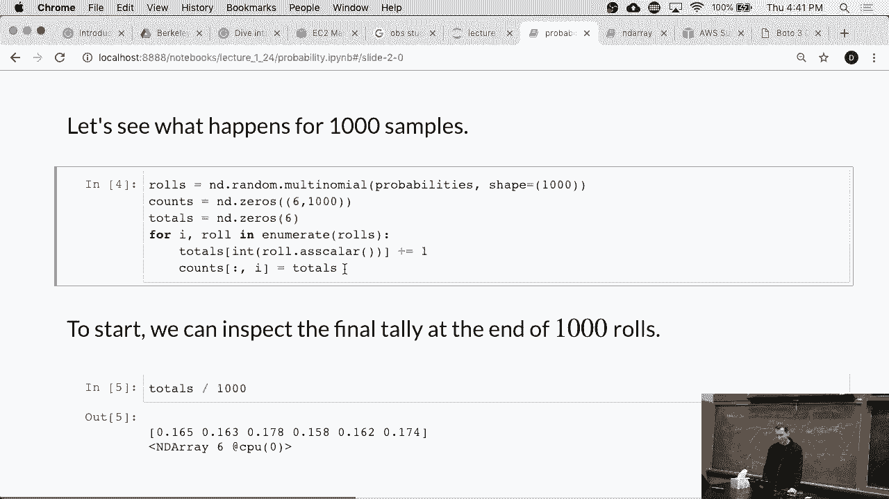
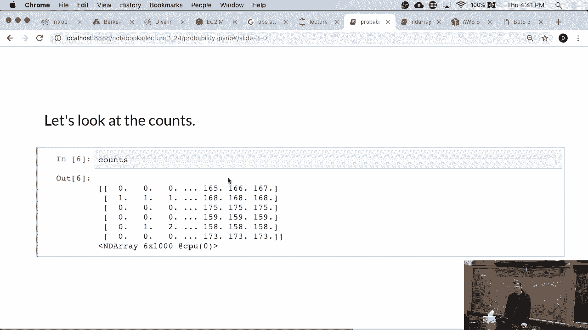

# P9：9. L2_4 基本概率 Jupyter - Python小能 - BV1CB4y1U7P6

好的。所以我们可以，像往常一样，导入MXNet。

这其实只是为了玩一下随机数生成器，看看它能做些什么。所有这些绘图例程只是为了确保图表看起来漂亮。现在，如果我有一组给定的概率，在这个例子中，我只是选了六个结果，它们都有相等的概率，即六分之一。那么。

然后我可以做的是，我可以从中进行抽样，这样我就会得到某个结果，在这种情况下是三。好了。

不知道为什么它总是给我三次，实际上不应该是这样。现在，我可能想做的是，我可能想从中多抽几次。所以你看，我可以从一个十维向量或者五乘十的矩阵中抽取一些东西。然后它会给我那个对象。这些都在里面。好了，这个过程其实很简单。

那么让我们实际看看，如果我们，抱歉，掷骰子一千次会发生什么。如果我们这么做，看看数字。好了，我们得到了些不完全是六分之一的概率。有些稍大一些，有些稍小一些。

这是你会预期的结果。那么现在有趣的问题是，这个过程到底有多快收敛？

所以这些只是计数，对吧？

只是对所有计数执行累积和。这就是我们之前计算的结果。

这是一种非常繁琐且不优雅的总结方式。

不管怎样，我们做了这个。这里是计数结果。

现在让我们进行归一化。你可以看到，在零次、一百次或一百次投掷之后，数字仍然差得很远。好了。

神秘的深度，你可以看到，随着我们等待越来越长的时间，所有这些平均值将会很好的收敛到正确的概率。所以经验平均值将会收敛到期望值。如果你上过任何稍微有趣的统计学课程。

你可能已经看过尾界。你可能已经看过，比如说，切比雪夫、切尔诺夫，或者其他不等式，它们告诉你如何快速收敛到那个数字。有一些非常漂亮的定理来指导形状的变化，我们一会儿会讨论到这些内容。可能实际是在星期二。

好的。
