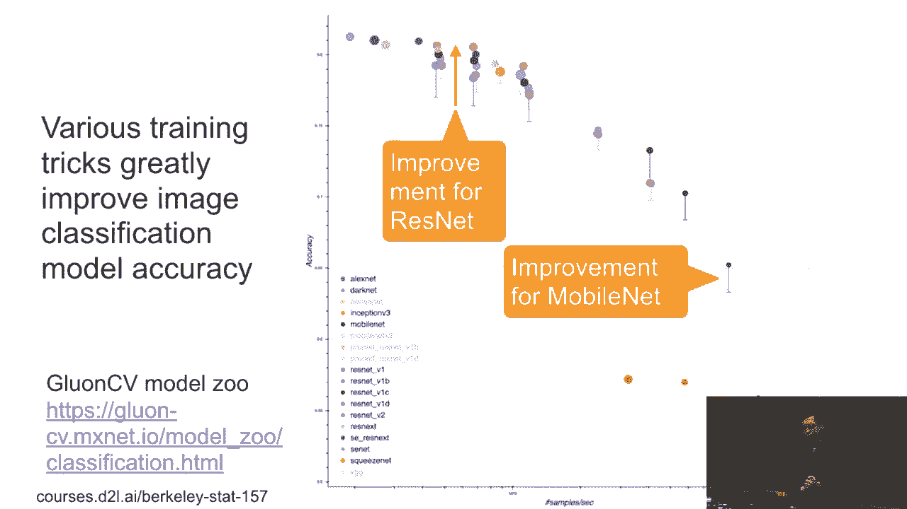
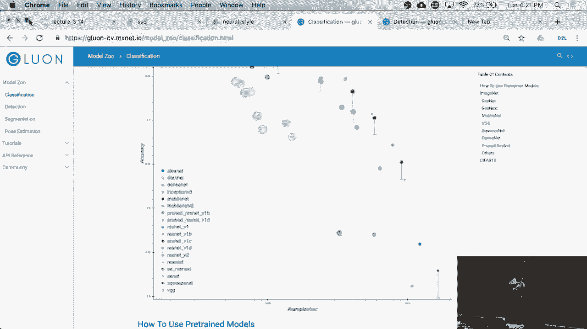
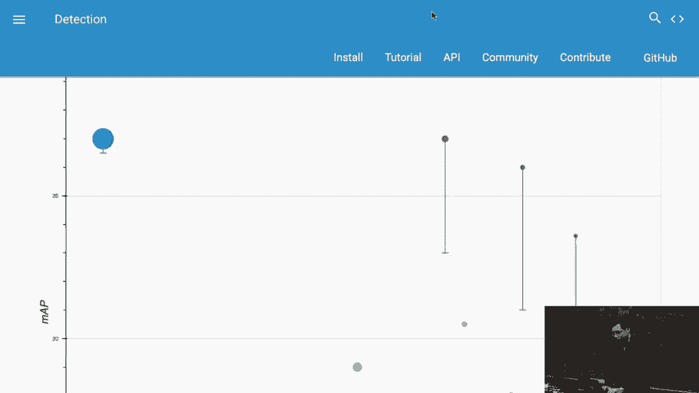
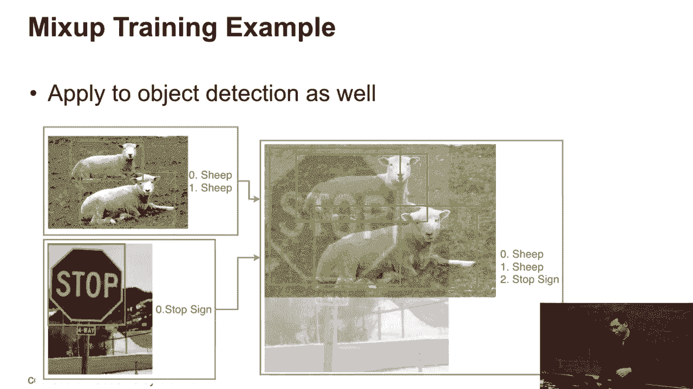
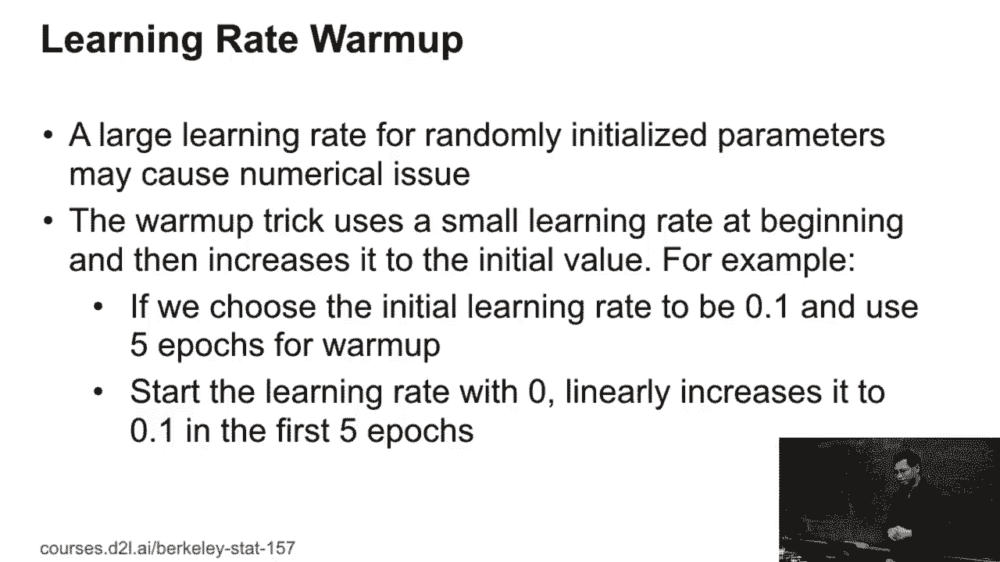
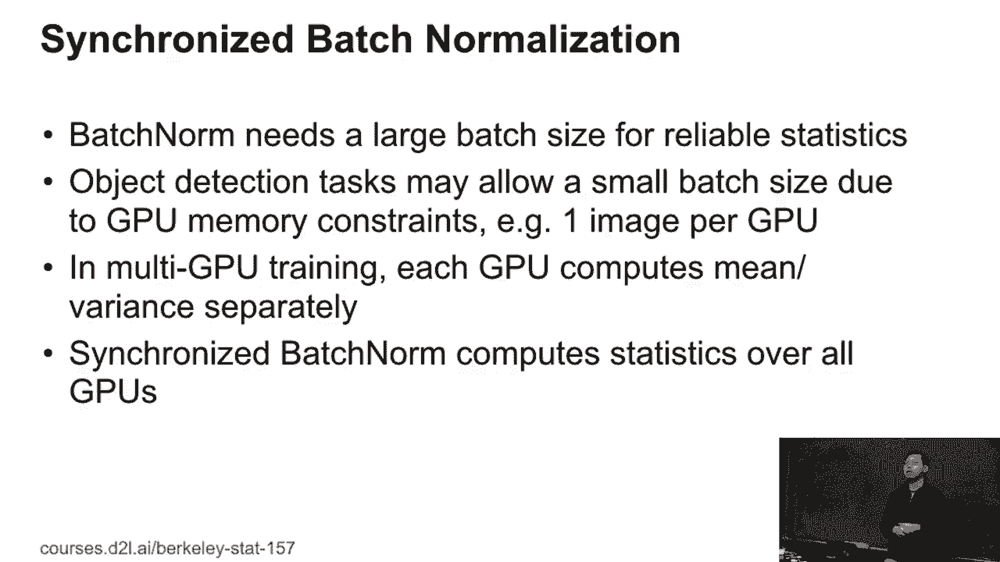
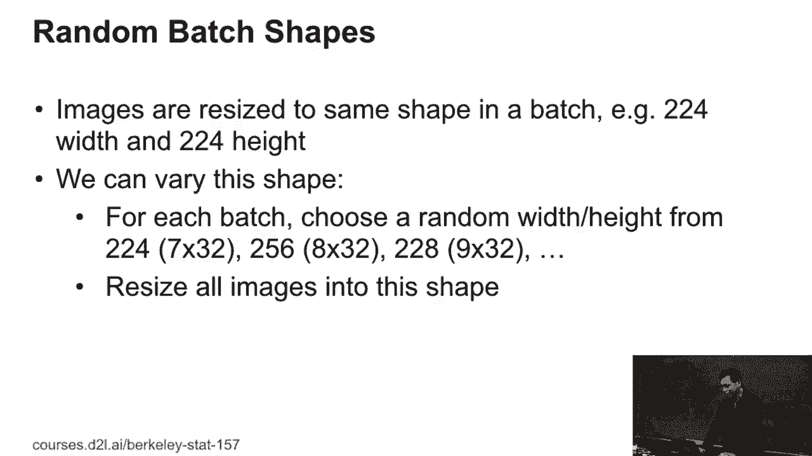

# P91：91. L16_6 CNN训练的技巧集 - Python小能 - BV1CB4y1U7P6

到目前为止，我们讨论了基本的思路，如何获取一个网络，如何用常规方式训练网络。但如果你只是逐步跟着做，你会发现，你永远无法复现论文中的状态或结果。所以如果你阅读论文，会发现里面提到了一些小细节。实际上，这些小细节非常重要。

例如，这是我刚刚开启的一个模型库。

让我在这里打开这个模型库。

这是我们拥有的模型库。

它仍然像轴一样，包括吞吐量、智慧轴，非常偏向分类。所以你可以看到每一项，比如让我看看这个库。好吧，好吧。所以这是剩下的部分。让我挑一个小一点的。这个不是 100，让我选一个典型的。小于 50。这个是我们典型的模型。所以你可以看到，这里有条形图。实际上。

这是论文中的准确率报告。好吧。那么，加入一堆技巧之后，你可以大幅提高准确率。所以，加入一堆技巧后，你可以将准确率从接近 75 提升到 77、78。让我看看准确的数字。是 77。从 75 提高到 77，提升了 2%。这意味着我们的论文在 CVPR 中，如果我们改进了网络。

我们将按此方式进行。所以还有很多其他东西，比如，这是一个 ResNet，我们两个，好吧。这个是 ResNet，我们需要 B，像我们需要 C，我们需要这个 DarkNet，这不是 ResNet。我们需要 B，但我们希望 B 更高。它的精度达到了 79% 左右。所以基线模型。我们有接近 76 种，75 以上的报告页面。所以很多技巧是很关键的。实际上。

这个技巧非常小，几乎不会增加任何开销。但它实际上大大提高了准确率。所以我们会有很多，简要介绍一些。类似的东西对于 MobileNet 也有，比如，MobileNet 提升了很多，MobileNet。另一个 MobileNet，也有很大提升。类似的东西，我们也有用于检测，比如 ULA v3。

论文中的原始内容，ULA v3 类似于我们拥有的 SSC。所以这是论文中的 ULA v3 报告。几乎只是稍微提高了 SSD，好吧，他们在论文中写了这一点。但是实际上，应用了一堆技巧之后，你可以大大提高准确率。这就是我们。我喜欢这里的技巧。所以好吧。

所以在这里我们简要地说一些技巧，但你可以看到，像每年总会有新的技巧出现，如果你读论文，会看到很多小的空间技巧。是的，我的设置，实验设置。即便有些东西仅在代码中出现，你也需要去读源代码。

并找到所有的技巧，那里甚至有提到。类似的事情适用于 ULA v3。

所以我们可以简单地说一些技巧。我认为这些非常有用。第一个叫做 mix up。这是一个相当奇怪的数据增强方法。每次我选择两个样本。我查看 J 类样本。然后我可以从 0 到 1 中随机采样一些数值。然后我做的是……

我将这两个样本示例混合在一起，得到新的示例。所谓的 X 就是我们在这里做的，编号为 XI，加上 1 减去编号为 XJ 的次数。这是两个示例的线性组合。标签也做类似的线性组合。所以我们得到一个新的示例，叫做 X 和 Y，用于训练。

我们只训练这些混合后的示例。我们可以忽略原始示例。所以我们训练的是新的示例。你可以看到，好的，给定一个时钟，给定一个类别。那么，这是图像。对于标签，我们有独热编码，值为 0，0，0，然后是 1。对第一个示例也做类似的处理。

我们选择一个等于 0.1 的数值，然后得到新的图像。几乎和时钟差不多，但稍微有点不同，比如你可以看到这个小小的眼镜。标签是 0.1，表示第一个眼镜的标签，0.1 也表示时钟的标签。好的，这真的很奇怪。

你甚至得到了很多图像，但它们不是人类可读的。

对于目标检测也是类似的，你可以将所有这些图像放在一起。然后将边界框一起放在一起。唯一的不同是，目标检测对于形状非常敏感。你需要保持输入形状不变。即使你有不同的比例，也需要保持几何形状的完整性。

这样比例就不会被搞乱了。所以这是为船只做的两个边界框（bond box），一个是为停车标志做的，合起来我们得到三个边界框。好的，这就是一个小技巧。第二个技巧叫做标签平滑（label smoothing）。

所以我们知道我们也使用了独热编码（one-hotting coating）来表示标签。这里，Y 就是一个一维向量，表示我们拥有的类别数量。如果 YI 属于类别 I，Y 等于 1，其他所有位置的值都是 0。这就是标签的独热编码。但我们知道我们是在进行近似。

所有这些独热编码都使用了 softmax。Softmax 很难接近 0 或 1。无论是输入趋近于无穷大，还是所有值为零，你都会得到 0 或 1。但实际上，你无法得到逻辑数字。所以很难接近 0 或 1。平滑标签给你一个类似的效果。

我在这里选了一个 epsilon。例如，我选择 epsilon 等于 0.1。然后如果是类别，我使用 1 减去 epsilon。其他类别，我只是将 epsilon 除以 n 加 1，然后再减去 1。所以仍然是，我可以将它们加在一起得到 1。转向概率。但这不仅仅是 2 变为 1。它是一个更平滑的版本。

如果它只是epsilon等于0.1，那么它对于两个类别来说是零点一，对于负类来说是小于0.1的数字。我们有这个数字时，我们可以让softmax更容易尝试。这是一个相当标准的技巧，不仅仅用于校准，也可以用于像我不知道的其他地方。好的。

所以标签平滑。

其他技巧比如，嗯，我们提到过，如果你使用多GPU训练，你可能想尝试一个非常大的批量大小。因为这有助于性能。但如果你在开始时使用一个大的学习率，所有这些权重在初始化时都是随机的，如果你使用大的学习率，你会在这里遇到数值问题。

所以在这种情况下，我们不能使用较大的学习率，但我们希望使用较大的学习率来加速收敛。那么我们能做什么呢？我们把学习率调高。那么我们该怎么做呢？

我们在开始时选择较小的学习率，然后逐渐增加到我们原本设定的学习率。例如，假设我们将0.1作为初始学习率，但开始时较大。我们可以在前五个epoch中进行一次映射。在前五个epoch中，我从分子为零开始。在五个epoch结束时。

我们想要将学习率增加到0.1。在这期间，我只是线性地增加它，直到最后达到0.1。所以这里的想法是，我想在开始时使用一个非常小的学习率，这样当我训练网络时，它能接近最终值，表面会更平滑，然后我可以稍微增加学习率。

所以在五个epoch后，我可以使用线性学习率。

另一个技巧是关于线性学习率的。我通常会这样做。因为我们使用随机梯度下降，我们没有覆盖理论。但你想让它收敛，就需要减少学习率。在CIFAR-10的作业中，你已经看到你需要在最后减少学习率。这是ResNet的典型做法。

我们在这里做的事情是，我们选择线性学习率，初始错误率为0.1，然后在第30个epoch时降低10倍。接着在第60个epoch时再降低10倍。在第90个epoch时再次降低。好的，这是我们通常的做法。但接下来我们需要选择，好的。这个30，这个10倍的30、60、90，所有这些都需要有相应的参数。

你需要为你的算法做选择。如果我不想选择，我能做什么？我可以使用余弦函数。所以假设大写T是我们有的总迭代次数，总批次数。然后在某个特定的迭代T时，我们可以使用余弦函数来衰减1。从前两项来看，较大的一个是零。

一开始是1，右端是相当小的。你可以看到，蓝线是原始的曲线。它首先从0开始，这就是一张图，然后增加到0.4左右，像这里，0点4，大概经过五个epoch。然后再运行大约25个epoch。

在第4、10次迭代时减少了10倍，并在第60和第90次迭代时再次减少。但红色曲线依然保持一个上升趋势，但在后期我可以平滑地下降。我们可以看到，衰减变得更加平滑，首先，衰减的过程更加平滑，其次，开始时的衰减幅度更大。所以在开始时保持较大的衰减幅度，而在后期几乎降至一半。

所以你可以认为，这个过程开始时比较恒定，在开始时非常缓慢，然后在中间呈线性增长，最后在末端逐渐减缓，呈现出我们常见的余弦函数形状。但这里的主要好处是，你不需要使用变量来拥有参数，只需要一个余弦函数。

你没有任何东西可以选择。它可以让你的生活更简单，但实际上能大大改善效果。好了，还有一些其他的内容。

同步批量归一化。所以我们知道，在批量归一化中，我们需要计算均值和方差，例如，跨越整个批次。例如，当批次大小等于32时，我们可以使用32个样本来计算均值和方差。没问题，这在批次大小足够大的时候很好用。但如果批次大小等于1呢？

我无法计算方差，它总是0。如果批次大小等于2，或者像4那样，太小无法计算可靠的均值和方差。这是一个大问题。对于图像分类来说没有问题，但对于目标检测来说这是一个大问题。对于目标检测，你需要生成许多锚框，这需要更多内存。例如，在这里的第一类中。

即使每个GPU有16GB内存，但你只能在每个GPU上运行一张图片。因为你有很多锚框，它们都消耗内存。那么，问题来了。因为我们每个GPU上只有一张图片，而在多GPU训练中使用批量长。所以我们做的是在每个GPU内部分别计算均值和方差。

因为如果GPU只有单张图片，我就无法计算方差。那么想一下批量长的情况，这意味着在多GPU训练中，我会跨越所有这些GPU来计算均值和方差。所以如果我有8个GPU，每个GPU上有一张图片，那么我将计算均值和方差。

对于我们拥有的多个图片，这意味着我们需要在计算时将所有方差传递到各个GPU之间。这可能会导致计算变慢，因为你需要付出同步的代价，但至少你获得了稳定的批量长。不会出现发散的情况。好了，这就是单一化批量归一化。

这些是常用于检测和分割的技术。我们可能不会做分割，但你可以读一下这本书。它们有两个分割顶点或者层级信息。

好吧，最后一个，我不，嗯，最后一个就是了。最后一个是每次。因为输入图像不能有不同的形状。我们想要，我们展示的是个别模拟。我们总是将其调整为相同的形状。所以这里是20乘以24的宽度和20乘以24的高度。而且，对于图像分类，通常没问题。因为物体很大。

始终是在一张图片中，但对于物体检测，物体可能很大，也可能很小。如果你总是给你像这样的尺寸，它可能不够好，因为有时候图片很大，有时候图片很小，你不想固定尺寸。随机批次大小形状意味着每个批次。

我首先随机选择一个高度和宽度，然后将所有图片调整为这个值。所以，在这里，举个例子，我们可以随机选择224这样的值，比如7乘以32，和256，8乘以32。还有一个像这样的，数字是错的，但它是9乘以32。所以，大家有没有想过为什么我们总不是32的倍数？我们总是不会有32的倍数的原因是。

因为对于ResNet，我们知道我们有五个阶段。我们也有五个阶段。每个阶段都有宽度和深度。所以，每个阶段我们做一次半尺寸调整。这意味着总的来说，我们在宽度和高度上减少了32倍。所以，如果选择的数字是这个数字的倍数，直到最后。

我们不会遇到太多对齐问题。所以，物体检测也类似。因为它们使用与图像分类相同的基础网络。而且，它们不会总是像这样，在最后将尺寸减少32来得到特征图。所以，这就是为什么我们总是按这个数字渲染这些选择的数字。然后。

如果我选择一个随机数，我从这里随机选择一个，然后将所有图片调整为这个形状。所以，这意味着对于每个批次，我总是尝试不同尺寸的图像。好吧，好吧，这是我们最后一个问题了。但你知道，下次如果你读这篇文章。

你看不到很多其他技巧。所以，很多，也许有几十个或20个技巧分布在各个地方。所以，这里我们展示了一些小的结果。

比如，事情是如何与其他事情相关的。首先，这是图像分类。我们选择了已经修改过的ResNet。在epsilon中，我们使用了MobileNet。我们在epsilon中谈过，但没有谈到MobileNet。Efficient是一个基线。我们总是改进论文中的结果。然后。

添加余弦衰减，就像这个最上面准确的，或者是 ImageNet。添加余弦衰减会给你带来，像对于 ResNet，提升了 0.75% 的准确率。再添加标签平滑 0.04。然后混合，实际上也带来了很多改进，0.84，3-4 之间的 ResNet。总的来说，这就是为什么我们能将基线从 77% 提升到 79%。同样，对于接收部分，我们也能得到。

也取得了很多改进。对于接收部分，V3，余弦衰减有了很大提升。对于移动网络，我也发现余弦衰减有了很大改善。这里有一个有趣的地方，你可以把所有技巧叠加在一起。你可以一个接一个地叠加，甚至可能叠加多个。在这里我们有三个，你还可以再叠加一个，像是七个，或许你可以先提升它。

另外，对于你来说，V3，这里的 MAP 是边界框，像我们得到的准确度。基线在这里。基线是 80。如果我们去掉所有的数据增强，那么我们会得到很多，准确度会大幅下降。然后我们看一下同步批量归一化，提升了 0.56，再随机化训练形状，提升了 0.04，余弦线性衰减，0.4 一直保持，MAP 始终保持不变。

还有标签平滑 0.4 和混合，重新给了很多改进，1.5 在这里。总的来说，我们可以为 U-LOV3 提供 3.4。好吧，这就是为什么你能看到从原始论文到我们得到的最新结果有一个巨大提升。

好的，这基本上是一堆训练技巧。通常我们不会谈论这些，就像你永远不知道它们为什么有效或者无效一样。而且其他的没有变化，但我们还是找到了些东西。

放手吧，unif 只对我们所有这些应用有效。但下次你可以阅读论文，再看看其他人的源码。你要注意这些更多的技巧。即便是那些微小的东西，也能带来很多提升。好了，有什么问题吗？

