# P92：92. L16_7 SSD在Python中 - Python小能 - BV1CB4y1U7P6

所以我们将深入探讨如何实现SSD。你知道，它很相似。但更快。

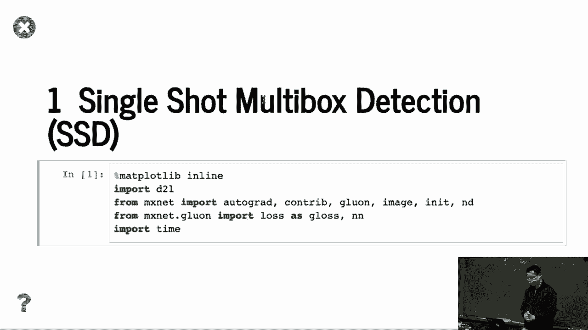

做类别预测。所以这里，假设我们给定了一个特征图，存在多个锚框。我们给定了这个锚框的数量，然后给定类别的数量。所以对于每个锚框，我们将预测类别的数量加上一个类别。这个加一表示背景。这意味着不属于任何类别。

那么在这里，我们对卷积核做了什么？输出通道。我们有多个锚框，乘以类别数加一。好的。所以这是因为对于每个锚框，我们将生成——我们需要生成类别数加一的预测。这是类别预测。

那么为什么我们选择卷积2D呢？因为我们选择的核大小为3，步长为1。然后我们知道输出形状将与输入形状相同。这意味着特征图中的每个像素，我们都可以在输出中得到一个对应的像素。额外的，对于每个输出，我们有多个锚框，乘以类别数加一的通道数。所以每个输出。

我们预测锚框，以ad的像素为中心。因为我们有多个锚框和很多类别，所以我们需要这么多通道。这和我们之前有点不同。之前我们只需要预测整个图像。所以输出通道，像我们在网络中做的那样。

就是我们做平均池化，将其转换为单个特征图。并且通道数等于类别数。但是这里，我们不做平均池化。因为我们需要为每个像素进行预测。好的，这里有什么问题吗？好的。这就是改变的概念。如何预测这么多不同种类的输出。

类似的事情，对于bond——好的，让我们做一个基本检查。所以我们有一个叫做forward的函数。给定输入x，给定网络，我们首先初始化它。然后给定x，我就返回输出。所以如果输入像是2乘8乘20乘20，批次大小8是通道数，输入通道。20乘20是特征图的高度。

如果我要预测5个锚框和10个类别，那么输出应该是。批次大小不变。特征图的高度，特征图的宽度也不变。我们只改变输出通道。所以55等于锚框数乘以10加1。好的，这些都是预测结果。

给定每个示例，我们可以在这里生成很多预测。有什么问题吗？很好。类似的情况，对于另一个问题，我们可以生成，不管我们有什么输入通道。然后我们总是生成，3乘以11等于33，10乘以10。这就是输入特征图。

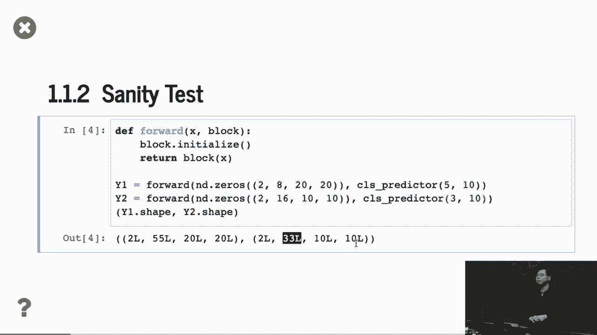

另一件事是我们想将所有的预测结果进行拼接。

对于多尺度，因为我们为每个尺度输出。每个尺度有不同的特征图。我们想把它们拼接在一起并输入到损失函数中。所以在这里我们做的是，转置输出通道的数量到一个损失通道或损失形状维度。然后这是高度，这是宽度。然后我们将其展平。

这意味着我们将其转置为 2D 矩阵。然后我们会对不同的尺度进行拼接。我们将在第一维度上进行拼接，即不是批量大小维度。所以这里的目标，y1，我们可以这样理解。

如果你假设 y1，这是第一个尺度，y2，我们有宽度和高度。然后我们想把它们拼接在一起。也就是说，我们把它做成一个矩阵，并放入通道数。也就是通道。它是类别的数量。我们将它们放入一个损失通道并展平成 2D 矩阵。

然后你给出一个 2D 矩阵。列数相当多。好的。这就是我们如何将不同尺度的输出放在一起。类似地，边界框预测是怎么做的？

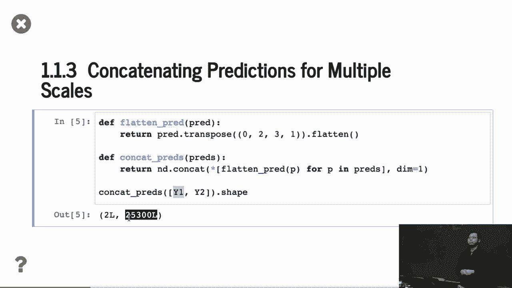

我们知道边界框只有四个数字。所以我们只需要知道锚框的数量。然后输出通道数将是每个锚框预测四个值。这就是锚框。我们可以定义锚框。然后类似地，我们有 kimos 等于 3，paddy 等于 1，这样我们就能理解输出，作为输入。好的。

所以现在我们知道如何做预测误差。

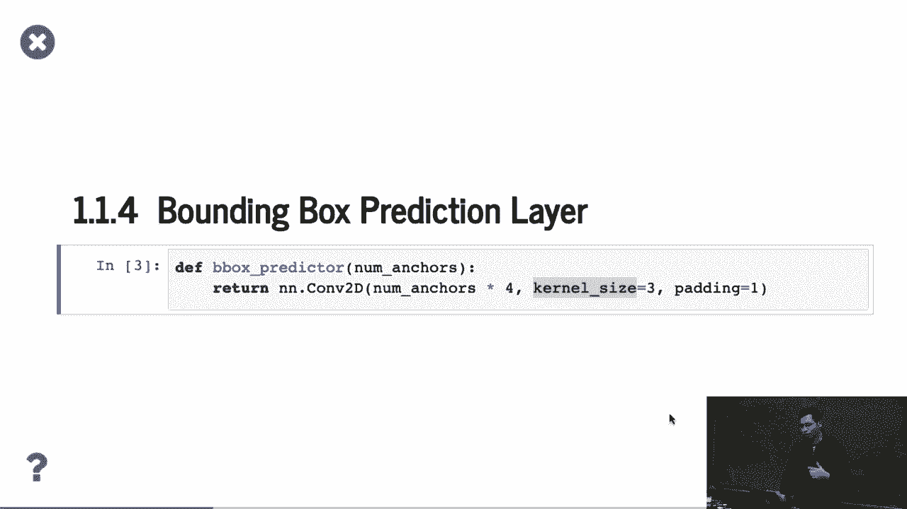

还有我们提到过的，我们已经做了示例框，它是高度和宽度的一半。所以这里非常简单，你可以看到。假设这是输入的通道数。我们在这里做什么？我们加入了两个块。第一个是 conv2D，kernel 等于 2，3，paddy 等于 2，1。基本上，我们没有改变——哦。

对不起。通道数是输出通道数，而不是输入通道数。我们不关心输入通道数。所以首先，我们使用 conv2D 映射到输出通道。这里我们没有改变高度和宽度。并且像正常一样加入，我们在其中有一个 rest。然后我们在这里加入一个批量处理。批量处理后，我们做一个 rel。

这是我们在 rest net 中的典型块。然后我们添加两个这样的块来获取如何进行特征指令。最后，我们做最大池化。所以 strad 等于 2，这意味着我们可以将高度和宽度减半。所以这是完成的示例块。比如说，给定一个输入，我们有 20 x 20 并输入到完成的示例块中。

输出通道为 10。我们得到——我们没有改变批量大小。是 2。我们改变了形状。我们把通道数改为 10。然后，最重要的是，我们将 20 除以 2，变成 10。好了，这是完成的示例块。好了，最后，我们需要一个基础网络走法。

通常我们会选择 ResNet 或者之前我们知道的任何一个。而且，我们还可以——用于微调。我们可以使用预训练网络。但这里，仅仅因为我们将使用一个非常简单的数据集。我们在这里做的，就是将一堆完成的样本块连接在一起。我们首先使用一个完成的样本块，得到16个通道。

然后减少高度和宽度，并将输出通道数加倍。再加倍一次。基础的三个完成样本通道，作为基础网络。好了，这就是完整的小案例。所以给定——如果输入大小为两批，RGB三通道，256x256。那么这个。就是将高度和宽度减少4倍，再减少8倍。还会将通道数改变为64。

所以那是我们拥有的基础网络。基本上，我们已经实现了基础网络、完成的样本块和类别预测以及类的预测。

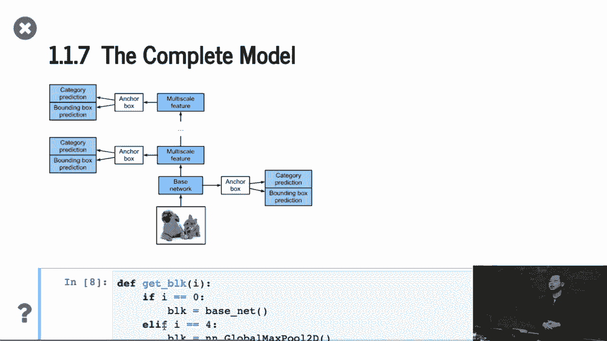

所以现在我们差不多准备好了，要获取一个块。

给定这个块，我们这里有五个块。Stear 到这里的块一基础网络。而中间三个是完成的样本块。

最后一个我们实际上已经做了——抱歉，第一个是基础网络。

对于一、二、三，我们使用完成的样本块。最后一个，我们只是做一个全局最大池化。将特征的形状压缩为1x1，无论它有多大。好了。

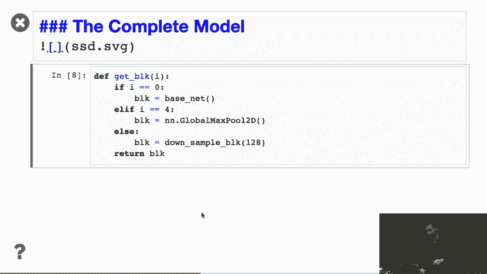

所以这是——我们有五个阶段的网络。所以这里还有一件事。

给定一个块，如何运行前向函数？这与之前我们做分类时的稍有不同。所以假设这个块是模型。然后我们有如何选择尺寸，意味着锚框的不同尺寸，这是一个列表。比例——我们将要选择的锚框比例列表。

还有一个类预测器，边框框预测器。所以首先我们做的是，在这里将输入适配到一个块中，得到一个特征图，这就是为什么。然后我们知道之前展示过这个函数，比如给定不同的形状，不同的尺寸，给定比例，返回一堆锚框。所以对于这个块，给定输入形状。

给定尺寸列表、比例列表，我们将为这个块生成锚框。这个块的输出。然后我们将y的输出适配到类别预测中，再将y的输出适配到边框预测中。然后输出，我们将得到四个结果。所以这里是特征图y，它将作为下一个块的输入。

而这个特征图的锚框，也有类的预测和每个像素的边框预测。好的，所以我们有四个输出。之前的分类，我们只有一个。但是因为现在有点复杂，我们这里有四个。我们来做一下合理性检查。

我们给出了不同的大小，因为我们有五个阶段。这个星号表示基础网络。这个是三层下采样网络。这是最后的平均池化。我们选择不同的大小。嗯，这是相当随机的数字。你可以看到我们从 20% 开始——嗯，这很随机。所以我们从 20% 开始。锚框将是原始特征图的 20%。

我们覆盖了 20% 的区域。接下来我们改变为 0.37。好吧，基本上我们就像这里做的那样。好的，我们在这里做什么？我们选择最后一个。最后一层，我们覆盖了一个大物体，覆盖了原始输入的 80%。然后我们线性地找到这个 0.37，0.94。就像 0.37 减去 0.2 等于 0.17。类似地。

这等于 0.17 等于 0.054。基本上，线性尺度从第一个 0.2 到最后一个 0.88。好的，那么第二个形状怎么样？

第二个形状实际上是 0.2 乘以 0.37 的平方根。它有点在中间。类似地，这有点像这个家伙乘以这个家伙的平方根。可以看见之间。所以对于比率，首先我们使用一个平方比率。然后我们选择 2。即一边是另一边的两倍大。我们选择另一个，0.5。

对于每个尺度，我们只选择相同的比率。所以这里的想法是，对于底层，我们使用一种小的锚框，试图捕捉小的框。对于最后一个，我们在这里使用较大的锚框。那么对于每个尺度，锚框的数量将是 2 加上 3 减去 1，即 4。对于每个像素。

我们将生成四个锚框。好的，这里有问题吗？好的。然后我们有整个模型。

我们称它为 tiny SSD，因为它实际上不是 SSD。因为最好的是这些相当小的。所以它可以让它复杂，不会太多。这里的事情，由于初始化。我们有类别的数量。然后我们有五个块。我们使用 Python 的集合属性，因为我们不会有一个自我块下划线 0 意味着获取第一个块。

各种类型。所以这就是我们不希望只有这个列表的方式。对于每个块，我们获取基础块网络，得到一个预测器，得到一个边框预测器。边框预测器，预测器。所以我们有五个阶段。实际上我们有 15 种不同的块。

然后在第四个函数中，首先，我们有每个块。

每一层，我们不能给你锚点，类别预测，边界框预测。那么我们在这里做什么？对于每个阶段，我们输入x并得到块。获取块。获取大小。获取比率。获取类别预测器。获取边界框预测器。输入到我们之前定义的块前向函数中。然后我们得到x锚点，类别预测。

以及边界框。

预测。到最后——嗯，让我——，到最后，我们在这里做。我们将每一层的所有输出拼接在一起。所以到最后，我们把所有的东西拼接起来。我们拼接锚点。我们拼接交叉预测，也拼接边界框预测。所以这里。reshape意味着对于交叉预测，我们希望有各种——。

这是类别数加1，这就是类别预测。我们不太关心这个，因为我们可以运行softmax层。对于边界框，我们这里不做任何改变。所以小型SSD，给定输入，我们给你所有这些锚框。我们有交叉预测和边界框预测。三件事。好的。

libia的完整性检查在这里是libia复杂的。

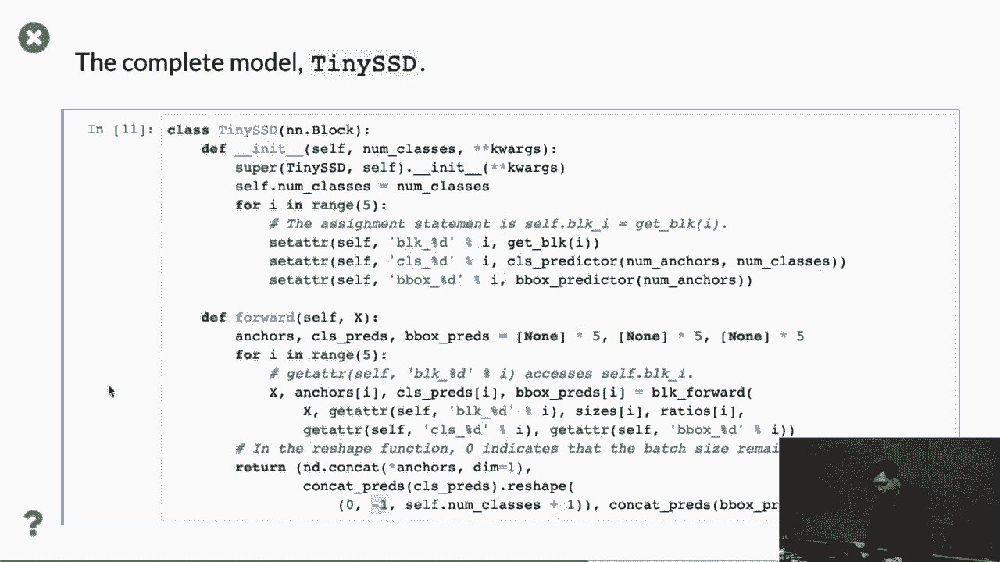

对不起。[无法听清]。

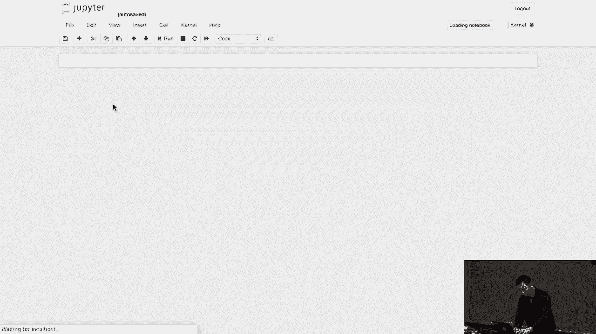

所以我创建了网络。类别数等于1。我们需要展示它适配到网络中，批次大小为32。RGB通道为3。输入是256，两个256。所以然后给定x，我们有锚点数量和类别预测，边界框预测。

所以我们知道基础网络会把宽度和高度除以8，得到32。然后我们输入另一个下采样块，再输入一个，再输入一个。最后，我们得到平均池化。所以这是每个尺度的特征图大小。每个像素有四个锚点，因为我们选择了两种大小和三种比率。

我们得到四个锚点。所以总的来说，我们有4,444个锚点。

总的来说，我们可以生成。所以你可以看到输出形状，锚点的数量。因为锚点在所有这些批次中是共享的。所以无论批次大小是多少，它始终为1。然后我们拥有的这个锚点数量，每个锚框，可以通过四个数字来表示。所以这里是四。类别数，批次大小和锚点数。

这两个，因为我们有单一类别，但加上一个背景类别，我们这里有两个类别。类似地，边界框预测，我们只是拼接成2D形状，因为拼接。也就是说，这是一个4,000个数字，乘以4。它给出这里稍大的数字。所以你知道这个形状。你也可以看到，即使是小型SSD。

我们在这里生成了大量的锚框。它需要大量的计算开销。所以现在我们已经定义了整个网络。

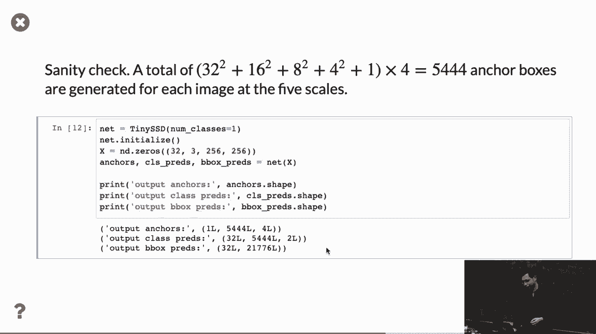

接下来是数据读取的部分，我们已经——在上节课中谈过——我们有一个小型 Picacho 数据集。给定图像，我们把 3D Picacho 放在各个位置，从而获得数据集。因此，这里我们注意到 Picacho 数据集。我们选择批量大小为 32，并且需要尝试使用 GPU 和我们的小型磁盘模型。

我们用这里的 x 来初始化它。我们选择非线性函数为 0.2。权重衰减设为较小的值。好的，这就是设置。

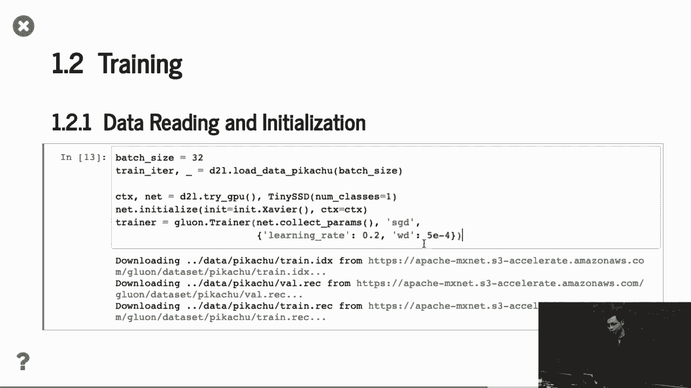

另一个要点是损失函数。我们这里有两种损失。第一个是 softmax 交叉熵损失，这是用于成本预测的。所以就没有其他了。另一个是边界框，我们使用 L1 损失，就是预测的边界框减去真实框，使用的是 L1 范数。我们不使用 L2 的原因是因为这样会导致很差的预测结果。

如果距离边界框非常远，我们就不希望惩罚太多。因此，这里，损失函数包含了很多内容。这是成本预测与成本标签之间的损失。所以损失函数——我们只需将成本预测与损失标签结合起来，形成成本损失。在这里，使用 softmax 损失。另一部分是边界框预测。

边界框标签。这里是掩码。我们之前谈过掩码。如果锚框没有找到与之关联的真实边界框，我们可以将其掩码为 0。所以对于每个锚框，如果我们找到与之关联的边界框，我们就将掩码设为 1。所以在这里，损失函数只考虑。

我们希望惩罚那些实际上映射到边界框的锚框预测。因此，如果我们没有找到任何关联，可能是背景，那么我们就不希望惩罚这个预测。但我们仍然需要惩罚损失，因为我们有一个背景类别。在这里，我们首先得到预测。

通过乘以掩码，得到所有这些锚框，我们有边界框，同时标签也会作用于掩码并计算 L1 损失。所以这是预测损失。我们返回并为简化起见，我们只加上成本预测损失和边界框预测损失。通常，你可能在这里有一个权重。你可能——这里。

为了简化起见，我们只是均等地加起来。好的，这是评估矩阵。对于类 1，类很简单，我们只需等于我们拥有的标签数量。这是我们获得的长精度。对于这里的边界框，这是我们拥有的标签。这是预测结果。我们只需减去它。我测试掩码。我们只关心有物体的边界框锚点。

然后只是取绝对值并将其相加，作为标量。这基本上是我们得到的 L1 损失。所以我们称之为边界框矩阵。然后我们有所有的内容。

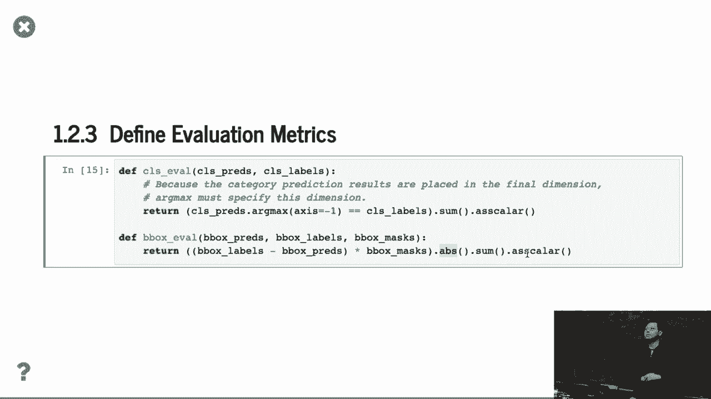

这是最后一个训练脚本。有点长，但彼此之间非常相似。所以我们初始化一些东西，比如准确率——嗯，最小值——边界框，求和。边界框，误差，以及我们将重置的迭代器。所以我们有我们输入的x和y。唯一的不同之处在于这里。

所以给定网络，我们可以像以前一样正常输出。然后给定我们有的锚点，和给定标签y，我们将进行目标处理。我们将锚框映射到边界框。我们在上次讲座中讲过这个。所以接下来我们会返回边界框标签，和我们有的掩膜，那些就是我们有的标签。然后一旦匹配完成，我们就。

将所有数据输入以计算损失。所以这是一个折叠函数。折叠函数中，给定x，你生成锚框，类别预测器，边界框预测器，锚框映射到边界框，生成标签，最后计算损失。所以就是这样。所以这就是为什么我们称之为单次检测。我们把所有的东西都一起处理。在这里的主程序。

你首先预测锚框，然后在这里做预测。对于这里，我们只是同时生成，导致了一个短的过程。然后我们进行——，有损失。我们计算梯度。然后评估准确率，评估边界框，然后。

几乎所有内容都相似。以及打印结果。

所以让我们看看。运行过程可能会有点慢。

我可以展示我们有的训练日志。相当小。

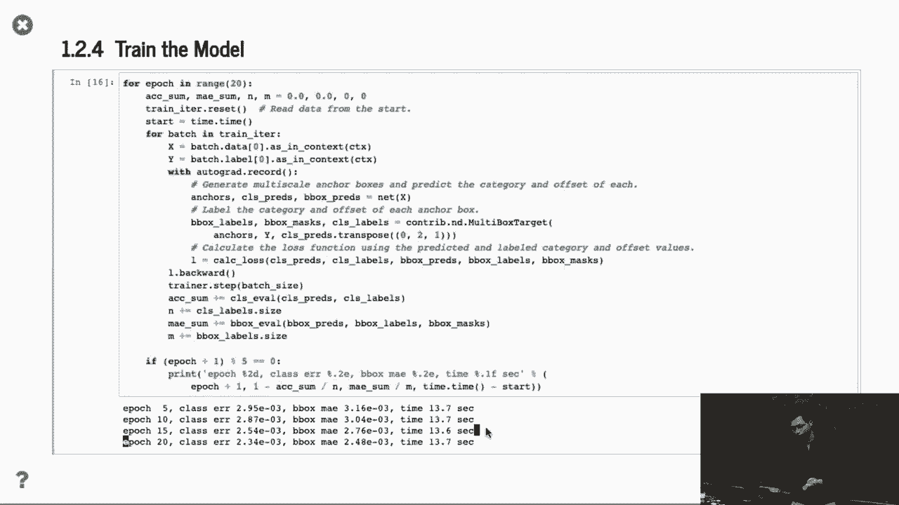

我们来做——让我来——。

你可以在这里看到日志。嗯，我们只有两个类别，这还挺简单的。而边界框，你可以看到它稍微减小了一些。因为这里有一个小的应用，比较简单训练。但再说一次，仍然是每五个人，甚至是微小的类别，跑在GPU上大概需要20到30秒。所以一般来说，目标检测比。

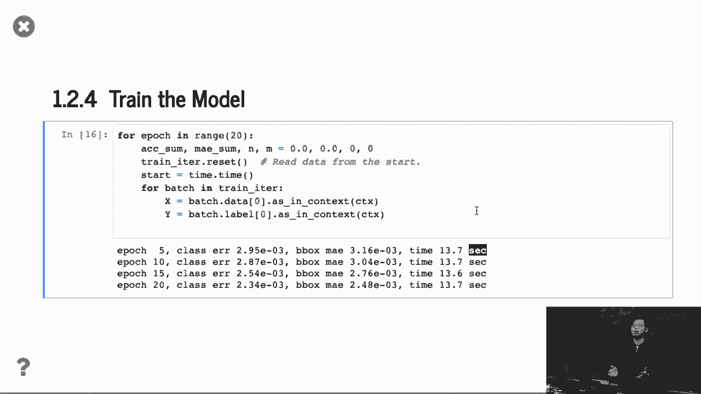

图像分类。最后，当我们训练好网络后，我们想要做。

预测。给定输入x，仍然我们将其输入到网络中。我们有锚框，我们有类别预测，运行边界框预测。然后我们对类别预测运行softmax，得到所有我们有的类别。另一个我们提到的事情是我们想要运行——我们有很多重叠。

锚框预测，我们只是想去除重复项。这叫做NMS。所以最后，如果它是负一，意味着我们认为它是重复的，我们就把它移除。这样返回的就是我们最终得到的框。它们相当直观。然后我们读取图像，并进行调整，因为输入是200x5，第6，200x5。

第6步是将RGB通道放到最后一层。我们会把RGB通道放到第一维度。

然后是预测，最后我们可以显示出来。我们之前也提到过。给定阈值，即如果置信度值大于阈值，则打印。如果置信度分数太小，我可以忽略它并不打印。所以我们在这里做的就是……

每次我们得到一个分数，如果分数大于或小于阈值，它就可以继续。否则，你可以在这里打印捆绑框。

所以最后你可以看到，好吧，最终。

你可以看到，给定一张合成图像，你可以看到周围有一堆物体，至少你能看到所有的捆绑框都正确。所以宽度较大的框被预测出来。通常，你可以调整阈值。如果你降低阈值，你会得到更多的捆绑框；如果你提高阈值，你会得到更小的捆绑框。

所以你可以看到它并不是很有信心0.3，第二，3，7和0，5，4。按照正常方式，我们只选择0.5，0.5。这个正常方式选择了拉伸阈值。所以这就是物体检测的全部内容。比图像分类要复杂一些，因为每次你执行前向传播，你都会得到多个输出。并且……

输出，你需要做很多清理工作，才能展示结果。到目前为止有问题吗？

有问题吗？这是一个非常一般性的问题。为什么我们用不同的数字来表示找到的框？比如说，是否是——你想要获得一个置信度的百分比，然后……为什么会有一个y？所以记住，我们有两个输出。一个是捆绑框的偏移量，即位置，另一个是类别预测。

所以这里，即使我们想要单一类别，因为这里还有一个类别叫做背景。所以这个调用意味着我预测这个捆绑框。我首先预测这个捆绑框，然后我认为你有37%的概率包含了大文化内容。

背景的置信度为63%。这就是置信度分数。这个框包含了这些物体。这就是我们总是有——的原因。

比如，我可以在开始时给你展示幻灯片。你展示这一张。你有这些数字。这是一个人，99%。那个人就像一辆车。你总是有一个数字。但这个更有信心。你几乎可以达到99%。对于我们来说，我们有一个小的SSD，然后我们可以做一项普通的工作。好的。还有其他问题吗？[BLANK_AUDIO]。
