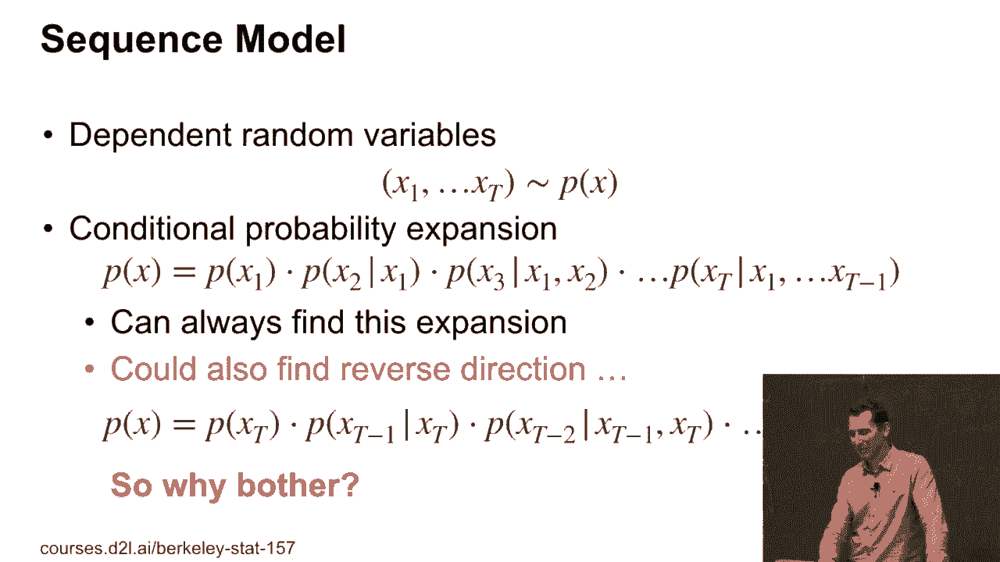
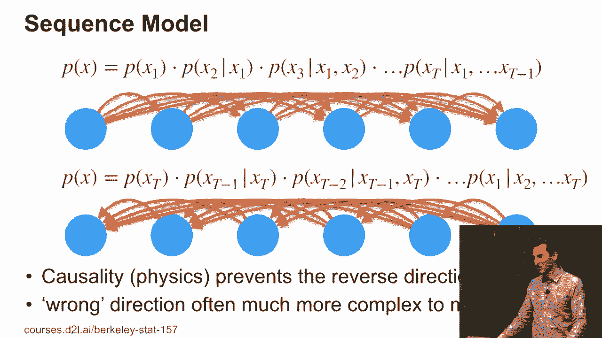
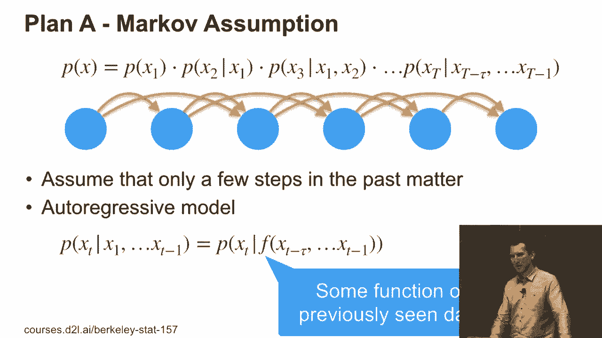
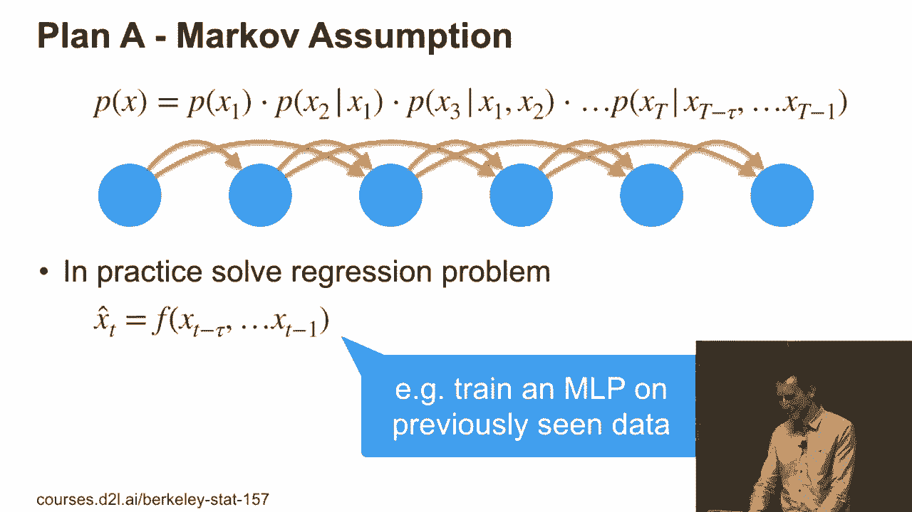
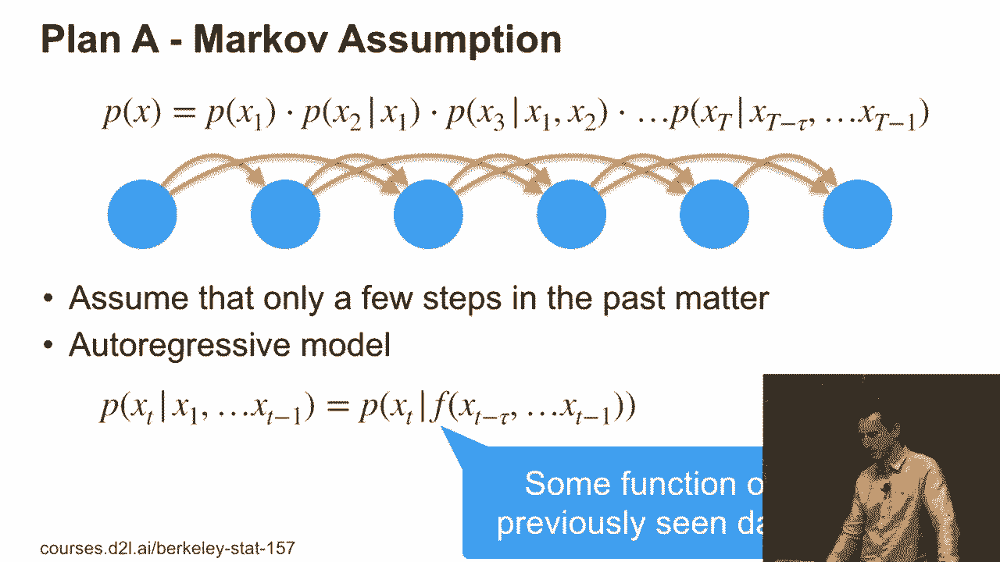
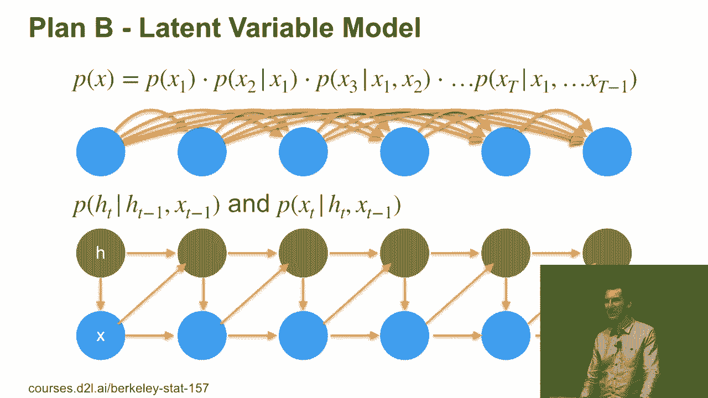
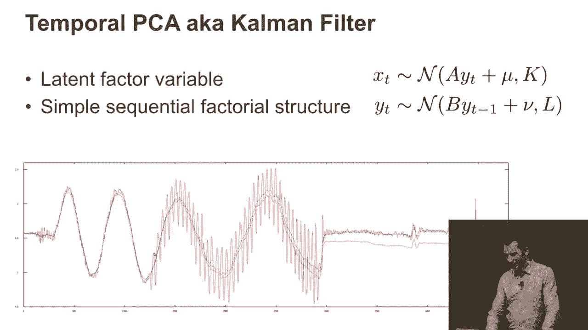
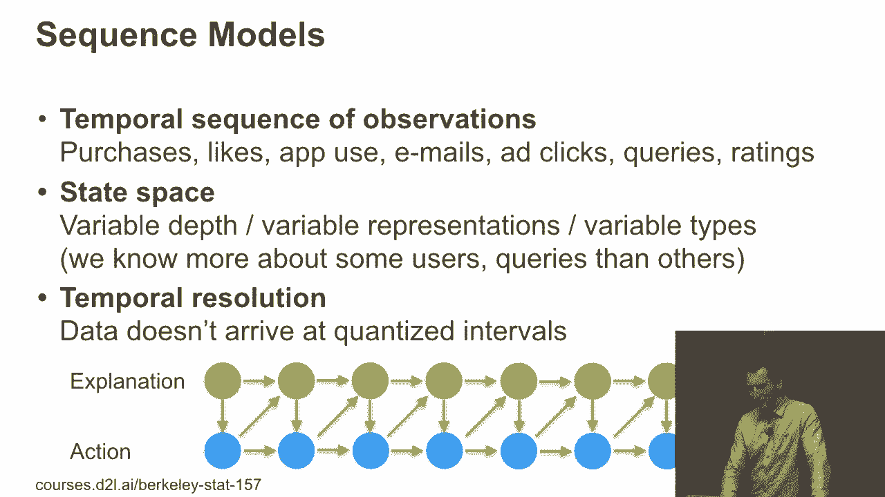

# P94：94. L18_2 Sequence Models - Python小能 - BV1CB4y1U7P6

 Sequence models。 Okay， so， with so far we just saw， yeah， the data isn't the ID。

 So let's actually see how we can model this。 So if I have some dependent random variables。 x1 through xt， right？ I mean in arbitrary order， whatever， you know， they're drawn from some p of x。 And just by writing out conditional probabilities， I can write p of x as p of x1。 time p of x2 given x1， times p of x3 given x1 and 2， up to p of xt given x1 through xt minus 1。

 And that， I can do no matter whether I have a time series or not， right？

 I could also even do that in the reverse direction， right？

 So just to find out that you can come up with very absurd models。 And it's still technically correct， it's just that those models are very absurd。 So， you know。 why bother？ Any ideas why you would want to bother？ Well， so let's just write this out again。

 So in one case all the arrows go to the right， in the other case all the arrows go to the left。 And causality， in other words， reality usually prevents the reverse direction。 So the future doesn't affect the present or the past。 I mean， unless you watch sci-fi movies。 where they travel back from the future。 And that's why we're not going to see time travel。

 But anyway， so one way usually to find out which way time goes is。 you try to model the data with both models， and， you try to see which one fits better。 which one leads to a much more complex explanation。 And you can actually mathematically prove under a reasonable range of circumstances。

 that the wrong direction of causality leads to the more complex model。 So there's a lot of nice work by Bernard Cholkopf and Dominic Yansing in this direction。 So they've wrote a book on that。 Read that if you're interested in this work。

 Okay， so how do we deal with this？ I mean， after all， this is a deep learning class， right？

 So one thing we could do is we could have some more to regressive model。 So because after all。 we're after some term p of x t given x1 through x t minus 1。 I could just say， well。 that's p of x t and， then given some function of all the past data。 So far， this is perfectly okay。 because I haven't actually specified how smart。

 this function f should be。 Okay， this is a little bit where the problem lies。 That if I have this function to capture everything， then well。 it gets really hard to compute and everything。 And we'll look at a couple of ways how to fix it。 So plan A is I use the Markov assumption。 And the Markov assumption just means that if I have this chain。

 then the dependency only can look back so far， namely， tall steps。 Can somebody tell me what tall is in the graph above？ Okay。 Who votes for one？

 Who votes for tall equals one in the graph above？ Who votes for two in the graph？ Okay。 Okay。 who votes for three？ Okay， who votes for zero？ Okay。 so half of the audience doesn't have a strong opinion。 The two's had it， right？

 So the dependency here is two steps。 So basically， the observations two steps into the past。 they affect what happens next。 And in that case， you can write out some water-aggressive model。 P of x t given x one up to t minus one is f of x t minus tau up to x t minus one。 And this is a perfectly reasonable model。 If tall is long enough if I have a lot of data and all of that。

 But there are plenty of cases where this actually can fail。

 But let's see what we can do。 So you could basically solve a regression problem。 Like x hat is some function f of x t minus tau up to x t minus one。 And then I regress。 Any questions about that？ This is a very simple approach， right？ So I can just take the past data。 I perform the regression。 And if that's all that there is to it。

 we can now all go home and relax and， say， well， yeah， we can do time series models。 And the obvious thing is， yeah， there is more to it， but we'll start with that。 Right。

 Plan B。 And this is something that has been popular for a long time。 It is a late and variable model。 So instead of saying， well， I'm going to truncate that history。 I'm going to kind of carry that history around by assuming that there's some hidden state age。 And this hidden state gets updated based on the past observation and the past hidden state。

 And the new observation depends on the current hidden state and the x t's。 The green dots are the hidden state and the blue ones are the observations。 And so now you could easily see， at least， you know。 can convince yourself that if h t is essentially a function of h t minus one， right。

 that's what we have and the new observation。 Then， you know。 if my hidden state was really powerful and could store a lot of， things。 that's exactly the same thing as having a function of all the data from start to finish。 It's just a really weird way of writing it down。 Okay。 So this is a subtle difference， right？

 So in one option， if we have a Markov model， we just have some function that depends on past observations。 So everything's observed and we can basically form some training data and we solve it。

 Or we assume that there's some hidden state。 Okay。 Let me give you an example of such a hidden state model。 Actually。 your brain is currently solving one of those， at least I hope it does。 Namely。 there's a hidden state。 What Alex is thinking when he speaks and let's assume that I think before I speak。

 right？ Now， what your brain is doing， it's solving the inverse problem。 You know。 sound comes out of my mouth， goes into your ears and now， based on the observation。 you're trying to infer what the hidden state is of what I might have tried to say when， you know。 that noise came out of my mouth。 So this is where your brain is now solving the inverse problem to my problem of generating。

 making noise from thought and you're making thought from noise。 And when you ask a question。 it goes the other way around。 Okay。 Any questions here？ So this seems like a。 quite a subtle distinction。 And， but it leads to very different algorithms as we will see in a moment。 But I wanted to， you know， get that out of the way right now because later on。

 we'll encounter a lot of models which do either plan A or plan B。 And mostly plan B actually。 So the late in the model is pretty much what we'll entertain ourselves with for。 the next three lectures。 So I want to make sure everybody is kind of cool with why we're doing this。 Okay。

 So yeah， if basically I had some function f of x1 through xt minus one， right？

 So this is the function that we wanted， which can be written as some function f of ht minus one and xt minus one。 In that case， you know， this is， you know， completely analogous。 And there are distributions for which such a form exists。 So the。 in an alternate universe where spectral methods would be the new exciting thing。

 And at some point that wasn't clear。 You could actually prove that certain embeddings are all that you need to deal with certain such models。 Okay。 But that alternate universe doesn't exist where deep learning land。

 Okay。 So you may have heard of some of those things before。 And I just want to give you a little bit of a context such that when somebody comes to you and says。 well， we don't use deep networks because we use blah， like， you know， H of M's or。 common filters or topic models over time or whatever。

 That at least you know how what they're telling you fits in with what you're doing。 And that what you're doing is just as principled as all the other things。 So that's the soon we have some， you know， temporal sequence of observations like。 purchases likes or app use or emails or at clicks or queries or ratings。 Right， so any of this。

 Then one thing that I could do is I could just endow this hidden state with some meaning。 Right。 so I could have clusters。 People have done that for search where they would break down search into three。 different types。 So there is the navigational or the informational or there's a third type that I've。 now forgot， but basically you can already see from that that this is very。

 tenuous and then they would have humans hand label things and model transitions and， so on。 And yeah， let's put this with a company that did this， didn't do very well on search。 Yeah。 but basically you could try to model this way you know。 whether you're within the same search session and a lot of other features。

 You could assume that you know there are topics of interest for a user over time。 And we did this at some point。 It worked quite well for computational advertising。 This was at a time when deep learning wasn't quite so popular yet。 This was around 2011， 2012。 And you'd see how the network then for instance learns that you know there's。

 you know sports or education or health and other things and finance。 And you can really tell you can see stories like this this guy who's into sports。 but then he realized it doesn't have money then he starts looking for jobs。 So you can see those topics interact with each other quite nicely。 And yeah。

 you can tell a nice story。 And if you want to have simple interpretable models。 it's not a bad place to start。 Or then we can look at something which is essentially 1960s technology。 namely the common filter。 And probably by now still a lot of control theory lectures will teach you。 the common filter。 And if you're tracking a plane on radar。

 well they probably use something like this， right？ These are cool things， right？

 And again they basically assume that there's some latent state like where the plane is。 And then what you observe is where the radar ping shows up。

 So for instance in computational biology， you can go over a DNA sequence and you have those introns and。 exons which is like the start part of a function call。 So if you think about transcription like a function call。 then you need to have some way a start and an end of that function call。 And you can model that。

 And yeah， don't be scared about the math， we're not going to do this。

 But you could do that with deep learning now。 You can probably still do a startup if you tell UVC。 I'm doing deep learning for Compile。 Okay， don't tell them that I said that。 You can do temporal PCA， which is common filters。 Basically you have some latent factor model。 right， latent variables which are drawn from some normal distribution。

 And then you have some simple sequential factorial structure。 So you basically have some observations and， then you basically transform the data based on those observations。 And yeah， this works nicely and mostly。

 Or basically any other thing。 So this begs the big question。 given that people have done this for decades。

 what am I doing here？ Why am I trying to talk into something new？ And the big question is really。 should we actually believe all those parametric models？

 Which is a bit of a rhetorical question because if I say yes， then I could go home now， right？

 And actually they're not really true， right？ They're just very convenient assumptions that scientists have made。 to deal with small amounts of data。 Or to force certain structures that they thought should exist。 For instance， for speech recognition it's a perfectly reasonable assumption to make。 that what comes out of people's mouth isn't givirish but words， right？

 And so therefore you have discrete terms。 Yeah， so but then there are more。

 elegant ways of dealing with this。 So what you basically want is you want to have some richer representation。 You want to be able to deal with， for instance， the fact that people do things， at random times。 not necessarily at quantized every 15 minutes。 And yeah， we're going to have fun with this。

