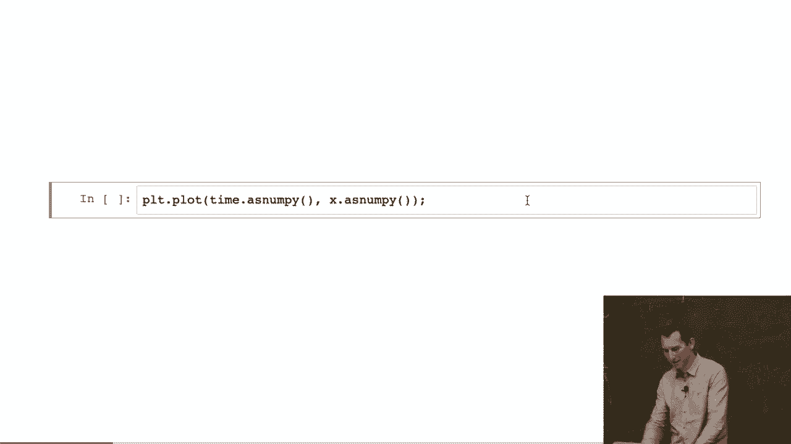
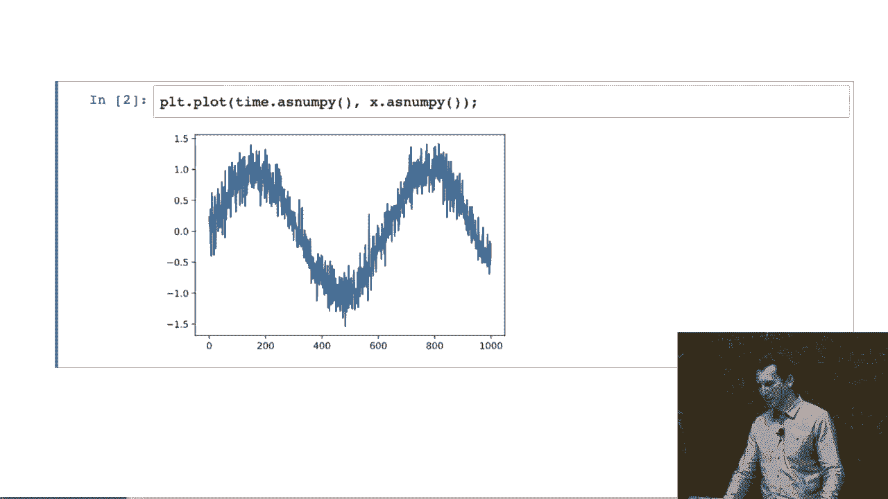
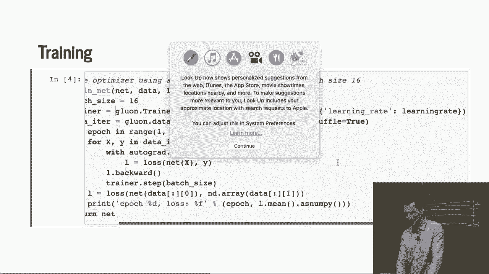
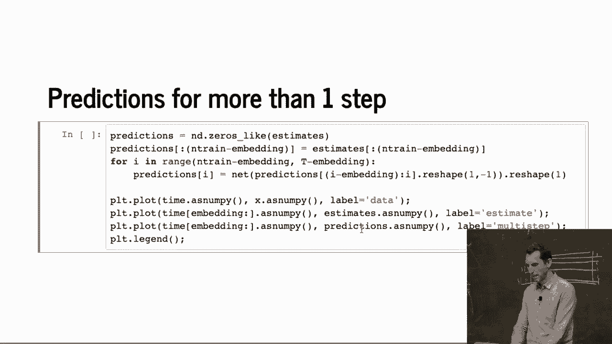
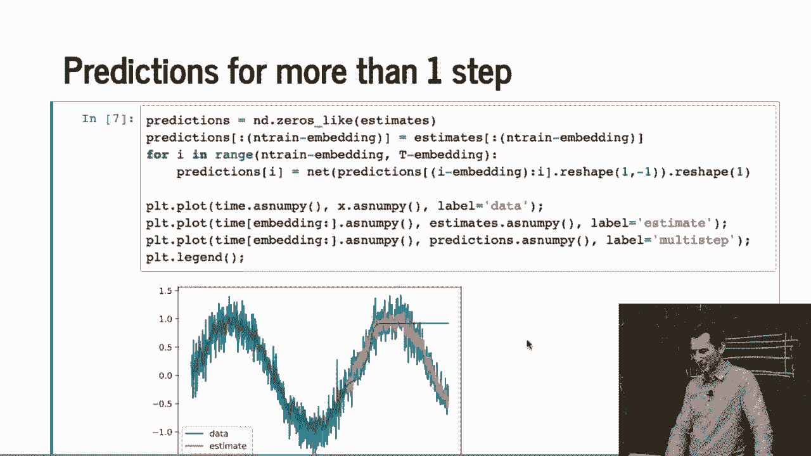
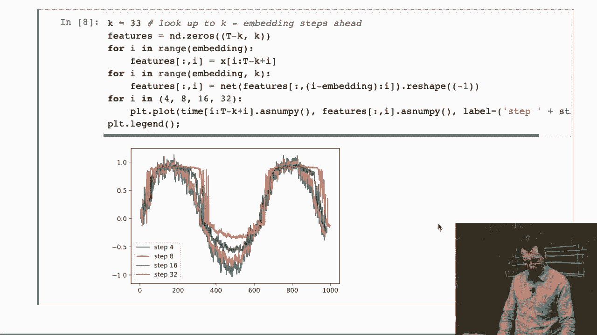

# P95：95. L18_3 马尔科夫假设与自回归模型 - Python小能 - BV1CB4y1U7P6

让我们从简单的事情开始，也就是马尔科夫假设。

所以记住在马尔科夫假设中，关键思想是我们有，x ˆ t是x t减去tau的某个函数，之后是x t减去1。然后你可以直接去训练一个回归模型，使用它来预测下一步，好的，那么让我们看看它在实践中的运作。好的，我们来看看。我将生成一些数据。

让我快速运行一下这个。嗯，我通常的导入，虚拟的，对吧？

这只是为了确保每一件事都是，妥善处理的。我将选择一个四维嵌入，所以tau等于四，我将看一下之前的观测值，计划生成一千个点，总共，嗯。均匀分布的。数据将是相当无聊的，简单来说，它只是。

将是加上一些噪声的正弦曲线。好了，所以这很无聊。让我们实际看看这看起来是什么样子，因为那样更容易理解。

然后只是看看代码。嗯，这是一条正弦曲线。这是一条非常嘈杂的正弦曲线。好了，没什么特别的。你可能会轻易假设，你可以，嗯，回归到，那个。其实并不那么简单，因为加了很多噪声。对吧。所以如果你只有四个相邻的点，你可能无法很好地预测。但是。

好吧，反正我们来看一下。

所以我首先需要做的是，实际上生成数据集，并且，嗯，定义一个模型。所以我首先生成数据集。然后，我将使用，嗯，如果我有四维的嵌入，并且有一千个观测值，那么，你知道，既然我现在有了，向量，长度是五。

所以我基本上需要做一个小的对象，对吧。t减去嵌入，然后还有嵌入维度。对，因为我有四个维度乘以，嗯，那个长度。然后，我做的就是将这些值分配到特征向量中。我唯一做得稍微更方便一点的是，我并不是一次性地分配它，嗯。

一次设置一个。但是如果你仔细想一想，对吧，看看，这是我的向量。你知道，这是嵌入的维度一、二、三、四。我将取这个向量。然后，我将把它平移一个位置。我将把它平移两个位置。再平移一次。对，哎呀。好了，我将把它平移，嗯，一、二、三、四。这样做的过程当然。

我在这里挑选的任何切片都有完全相同的数据，知道吧，每个数据点在时间上都相对平移了一步。这就快得多了，因为现在我的四重循环只遍历四个条目，而不是一千个。虽然数据集很小，这不重要，但还是有点差别。而标签只是，嗯，

那个嵌入。现在，训练数据集是前600个观测数据。所以现在我有了训练数据集和测试数据集，我就执行你应该执行的操作。我只需调用数据集构造器，并称其为数组数据集。我选择了，知道的，第一个。

用于训练的观测数据。我将把剩下的用作测试数据。好吧。然后，好的。我将定义一个非常无聊的深度网络。我将从你知道的输入开始。它们的维度是什么，映射到十个隐藏层的维度。再加一个十个隐藏层的层，使用ReLU。然后输出一个，因为我们要做回归。然后我选择了saviour初始化。

所以这就是你能想象的最无聊的事情。最后我需要做的就是定义一个损失函数。所以我选择了L2损失。这基本上是最先进的技术。你知道的，在我们介绍多层感知器的第一次讲座时，这一切对你来说应该一点也不令人惊讶。到目前为止有任何问题吗？好的。

大家都明白了吗？

很好。所以，好的，这是训练器。再次，非常简单。迷你批量大小是16。为什么是16？

因为这是一个不错的数字。它是2的4次方。如果我想的话，也可以选择32。好吧。我选择了，你知道的，训练器。我选了Adam。为什么？因为Adam真是太棒了。

我可能可以选择其他五个求解器，结果也不会有太大区别。

但我需要选择一个求解器。我选择了迭代器，针对你知道的训练数据。然后我就执行训练，你知道的，使用数据。进行很多次的循环。我选择了，你知道的，数据中的xy对。计算，知道吧。打开autograd。计算损失。计算梯度。然后我执行更新。

最后，在我计算损失时，好吧，每一个循环结束后。我打印出那个损失。好吧。L.Dop均值。这给我了平均损失。作为numpizers我可以打印出来。最后，当我完成时，我返回网络。好的。你们有什么想让我再讲解一下的吗？好的。不要害羞。好的，太好了。

然后让我们开始训练吧，对吧？

我们可以做到的。那真是很快。而且效果相当不错，我们得到了大约2.8%的误差。对吧？好的。嗯，这是一个回归问题。所以这是回归损失。嗯，就是这样。基本上我可以在进行四次迭代后停下，反正没关系。好吧。那么现在来到了关键时刻。我们来看看这个怎么表现。

好的。那么蓝色曲线是你知道的，数据。而橙色曲线是估计值。我觉得这个效果不错，对吧？对。所以看起来我们已经解决了这个问题，对吧？

你知道，完美的误差，对吧？它把东西重建得很不错。所以现在我们都可以回家了。好吧。有没有人看到我刚才做的事情中不那么聪明的地方？

这个曲线，或者说这种方法，确实存在一些问题。有谁能猜到这里到底有什么问题吗？好吧。那么问题是测试时会发生什么？

那么我们有正确的数据吗？你完全在正确的轨道上。问题是，在测试时，我们是否拥有所有过去的观测值，对吧？答案是没有，显然我们没有，对吧？所以你完全说对了。这正是问题所在。我们现在假装在测试时仍然拥有这些数据。

过去的观测值，然后我们只需要预测下一天的情况。所以如果这是任务的话，我们会做得非常好。那么我们接下来应该做什么呢？有什么建议吗？

你可以做什么？你基本上可以拿一个观测值，你知道的，预测下一个未知的日子。然后用这个预测结果，加上第一个未知日的数据，预测第二个未知日，然后第三个，继续进行下去，对吧？

好的。我们来看看结果如何。这正是我在这里做的事情。所以预测，对吧？

所以在前几个步骤中，我们做的是相同的事情。然后你基本上可以在第i步做预测。你可以把到目前为止的所有预测结果输入网络，进行填充。好吧。

让我们看看结果如何。对吧？这基本上就是这段代码所做的事情。结果非常错误。绿色曲线是预测值，基本上我所做的事情是，在第600步之后，我们不再有任何数据，大约在这个位置。然后继续让你进行预测。你可以看到，预测很快就会收敛到一个……

常数函数并且停止做任何有意义的事情。然而，这个模型非常愚蠢。对吧？换句话说，如果我想预测多个步骤以后的情况，这种自回归模型，往往会出现严重问题。好吧。你可能会想，嗯，好吧。这种情况很明显，大家都知道的。嗯，实际上……

如果你和客户交流，并且你和他们讨论时间序列预测，有时你需要指出这一点，对吧？这非常非常容易让你自己陷入困境。所以，确保如果你在处理时间序列数据，并且你想要对整个序列进行预测时，是否真的去做了这些呢？好吧。

这是一个非常容易犯的错误。

好的。那我们来看看这实际上效果如何。我在这里做的事情基本上和之前一样，只是我查看了，四步、八步、十六步和三十二步的预测结果。

这里的图表展示了当我有，嗯，四步、八步、十六步和三十二步时，你知道，预测误差会发生什么。你可以看到，模型在四步到八步时表现不错，接着在十六步和三十二步时就变得非常无效。对吧？抱歉，换句话说，这个模型对于非常短期的预测非常有用。

但是对于长期预测，我不想把任何资金投入进去。好的。那么这就是自回归模型的故事。到目前为止有什么问题吗？对吧？好的。那么重点是什么呢？

