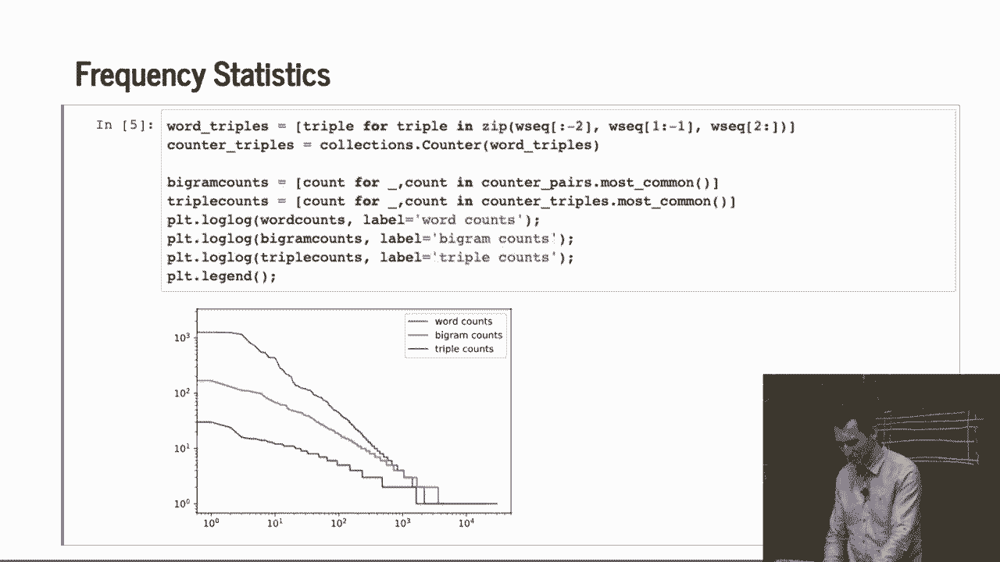

# P96：96. L18_4 语言建模基础 - Python小能 - BV1CB4y1U7P6

到目前为止，我们主要看的是带有数字的序列数据。现在我们要看的是带有字符的序列数据，因为这是一个非常、非常常见的应用，并且它需要一点特殊的处理。所以我们必须看看，你知道，如何实际处理这些数据。

如何加载它，如何将其映射到具体的事物上。所以这是需要完成的一些工作。然后，你知道，tokens 不是实际的值，并且领域是可数的有限的。至少在假设下，你知道，你有一个有限的词汇宇宙。这个并不一定成立。例如，英语语言不断吸收新的单词。

因为，人们创造单词，或者人们从其他语言中引入单词，等等。所以总是会有新的东西。如果我这样做，仍然可以，你知道，尝试建模这些东西。所以，例如，如果我有，你知道，“statistics is fun”这个 token 序列。我可以通过 p of statistics 乘以 p of is，给定 statistics，乘以 p of fun 来建模它。

给定统计数据是，p of，你知道，冒号给定统计数据是有趣的。对吧？然后，如果我想，要获得一些有意义的东西，我可以建模，你知道。p hat of 是给定统计数据。我只是计算，你知道，我看到“statistics is”多少次，然后除以我看到“statistics”多少次。这给我一个粗略的估计。

好吗？所以从统计学的标准来看，这非常，非常粗糙。同样的，如果我有长的 n-grams，我可以做的是，我基本上是，首先，我可能无论如何都需要做平滑。所以我们在做朴素贝叶斯时已经看到了这一点，对吧？

所以当我们做我们的朴素贝叶斯分类器时，我们添加了伪计数。你需要为单词概率做这件事。所以你可能会有一些额外的概率质量 epsilon 预留出来。然后你只需要将其均匀地分配到所有类别上。所以 p hat of w 可能是该单词出现的次数，加上一些 epsilon，除以 m，其中 m 是。

你知道，你的总词汇大小，除以 n 加上 epsilon 1。然后我可以处理 p of w prime，给定 w，并且我做一个回退平滑器，来处理，像单例一样的东西，并且对于，像三元组，我做一个回退到二元组。这是一个变通方法。我写的有几件事情并不完全正确。

但是精神仍然存在。所以如果你想知道如何正确地做这件事，你应该去上 Tom Griffiths 或者 Mike Jordan 的课。如果他们教基础的非参数统计课程，或者 Jim Miffitman 教一门课程，那么这将是一个非常棒的课程。

所以我们不会详细讨论这个，但这就是精神所在。在经典统计学中，你会如何建模 n-grams。所以你基本上是先取计数，然后使用某种回退平滑技术。你可以看到，一旦我有了大量的词汇，这种方法就不太管用了。

一旦我有了更长的序列，因为大多数计数都会是空的。所以为了简化故事，实际上我们来看一下这个在实践中是如何工作的。为了让事情更具具体性，我们将使用一个小的数据集。

我们要使用时间机器。我们做的第一件事就是加载它。所以我要打开一个文件，从文件中读取一些行。这就是我从古腾堡计划下载的时间机器。然后是原始数据集。我所做的就是将它拆分成单独的标记。然后我将所有的内容都转化为...

嗯，基本上就像是，嗯，你知道，字母。我把所有的标点符号和其他东西都丢掉了。所以如果我看一下，你知道，前几行，然后我可以，你知道，第一行。比如说，时间查看它会方便地提到他。当时他正向我们阐述一种记录类型的事务，他的灰色眼睛闪闪发光，等等。好的。

所以这就是时间旅行的开始。这就像是 Python 101，基本上是第一学期，对吧？

或者如果你之前学过 Python，你可能会感到无聊。所以现在我要做的是计算单词的数量。我要使用一个简单的集合，也就是计数器。我将遍历数据集中的每个标记。所以 `for string in raw data set for token in string`，对吧？这就是双重循环。在 Python 中你可以这么优雅地写出来。这简直是在 Python 中耍酷。而它会，然后你知道，计算所有这些东西。这就是人们喜欢 Python 的原因，对吧？

因为很多复杂的代码已经被别人写好了，你只需要调用它。然后我只需要查找 `counter of traveler`。这会给我计数结果。计数器甚至有一个函数叫做 `most common`。所以前 10 个最常见的，首先是 time traveler 这个词，`traveler` 出现了 61 次。

如果我查看最常见的 10 个单词，结果完全没有什么意外。嗯，单词 the、an、i、and、of、a、two、was、in、that 和 my 都非常频繁地出现。这是完全可以预期的，因为这些是英语中常见的单词。它们是最常用的词汇之一。有人知道这些单词通常怎么称呼吗？

它们有一个非常特定的名字。它们叫做停用词。是的，非常好。所以，是的。过去在自然语言处理（NLP）中，人们通常会把这些停用词扔掉，因为它们出现得太频繁了。但现在情况不同了。现在人们会保留它们，因为他们实际上没有像你知道的那样的工具。

转换器或者 LSTM 之类的东西来直接处理它们。所以，不再丢弃停用词，但要意识到它们的存在。好了，那我们来看一下频率图是怎么走的。接下来，我要做的是绘制单词的顺序与它的出现次数之间的关系。

有人能猜出这条曲线会是什么样子吗？提示，我在画的是对数对数图。这应该是一个巨大的提示，告诉你预期会是什么样子。有什么想法吗？好吧，谁听说过SIP定律？

**幂律**。是的，这就是我们得到的结果。如果你仔细想想，它其实是非常美妙的。这几乎是一条直线。我的意思是，除了这里的最常见单词。所以，出现次数的对数与位置的对数呈直线关系。即使是这里的最不常见单词，只有单一出现次数的位置也是如此。

你知道的，教科书中的质量。好吧，这是SIP定律。它的意思是X的计数与X加C的负α次方成正比。所以，基本上，我有一个偏移量，并且有一个负α。 当然，如果我对两边取对数，我就得到对数的X加C乘以α加上一些常数。好吧。

几乎总是，当你有大的离散集合时，是否会有某种**幂律**？

基本上假设你默认有这些条件。并且，充分利用这些条件。如果没有，你的代码会很慢，模型也会出错，类似的事情会发生。真正要利用它。如果在你的领域里还没有人做过这件事，你可以写一篇论文，这会是一篇论文。所以，举个例子，在系统中，对吧，假如你构建一个推荐系统，它会……

发现实际上有少数几部电影非常受欢迎，而大多数电影都非常不受欢迎，有些人会给很多电影评分，而大多数人则不会给很多电影评分。如果你利用这一点，你可以构建一个比没有利用这一点的实现要快得多的版本，并且你可以写一篇关于它的论文。

它是快速而高效的，所有东西都变得更快，对吧？无论如何，让我们看看这是否同样适用于配对。所以，再次提醒，这非常Pythonic。基本上，我生成了一个单词序列，然后通过将W序列中的单词与前后一个词配对，生成了这些配对。

对吧？我基本上是在取两个数组。你知道，这又是同样的技巧，现在`zip`会……你知道，取第一个或第二个，生成那些配对。无论如何，如果我们这么做，比如书的开始，时间和时间机器。然后是机器由H和Hg等组成，就是这样。最常见的单词是……

嗯，不出意外，主要是停用词的组合。唯一的例外是时间，因为可能是时间机器，对吧？它出现了102次。所以，基于此，有几点可以得出。正如你所见，用几行代码就能得到相当有意义的文本统计。所以，如果我能做到，你们肯定也能做到。而且，知道……

这很快捷，可能在你做其他事情之前先浏览一下数据是个好主意。嗯，嗯，屏幕不应该被锁住。好的，没问题。现在，我们可以做的是，我们还可以查看三元组，也可以查看你知道的，单元词、二元词组和三元词组。然后我们来绘制它们。所以，结果是，你知道，非常漂亮。

Zipf 定律适用于单元词、二元词组和三元词组。你可能想在模型中某种程度上利用这一点。好了，到目前为止有任何问题吗？

这就像是非常基础的文本处理和分析，试图让你了解这些算法在实践中的运作方式。好的。那么，十，接下来我们做什么。

