# P99：99. L19_2 Python中的递归神经网络 - Python小能 - BV1CB4y1U7P6

[无法听清]。

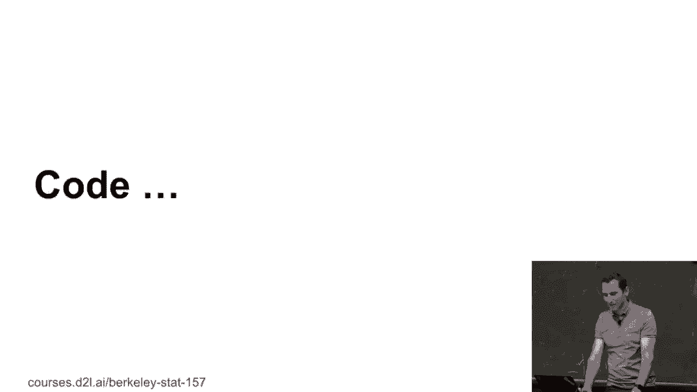

所以——，[旁白]。

好的。

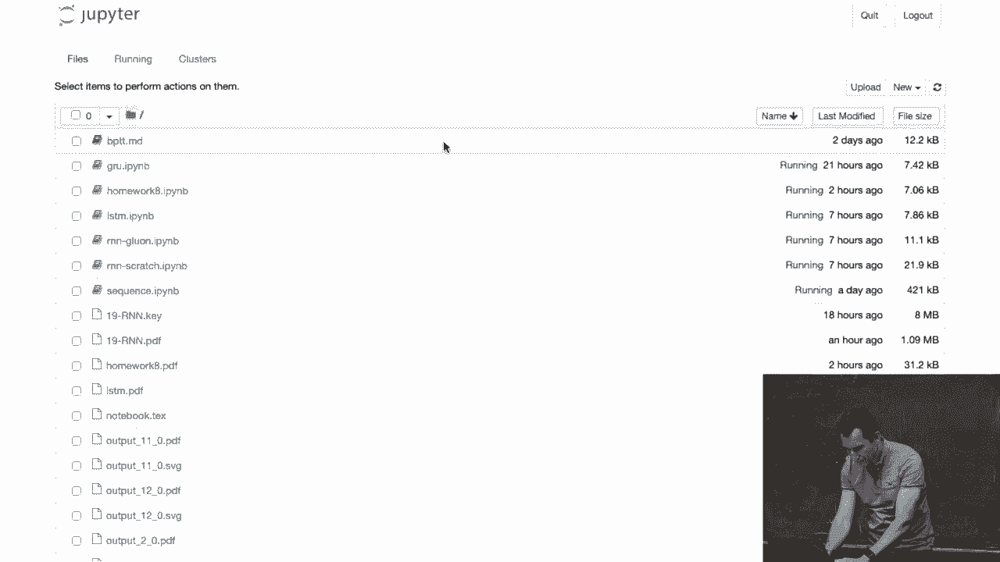

所以现在就是——好的，录制了吗？是的。好的。所以现在其实只是通过一个非常，嗯，非常简单的例子。首先我们需要做的事情是加载数据集。所以我们正在加载时间机器。然后——，[旁白]，好吧。好了。我们已经加载了整个时间机器。好吧。所以我正在导入，你知道的。

通常的便利库，自动微分，损失函数等等。这将加载时间机器数据集。稍后我们会详细看看。

好的。所以我要做的第一件事是使用独热编码。所以，记住我做的就是按字符级别划分。时间机器的每个字符都是它自己的标记。如果我用英语的话，这其实不太聪明。

有人能告诉我一个这种编码非常适合的语言吗？伙计们，你们真的应该知道。是的，中文会非常适合。日语也非常适合。韩语，没那么适合。对吧？

因为它们在某个时候抛弃了汉字。所以它对于一个符号数量非平凡且非常独特的语言会非常有效。但是，好的。由于我不想处理很多复杂的预处理等等。

我只会在这里使用独热编码。所以，词汇表大小，我认为大约是43。所以如果我有以下数组，你知道的，2/2/30。那么，好的，43。

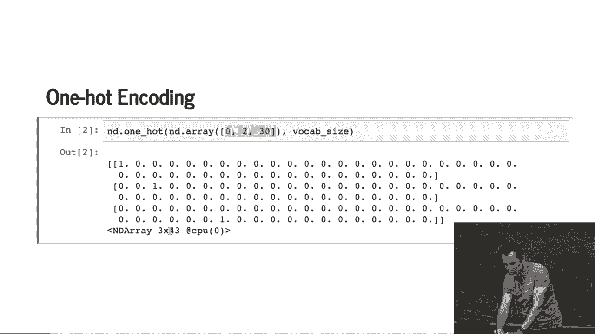

所以你可以看到这是我得到的三个字符。

所以第一个字符被编码成这样。第二个字符被编码成这样，对吧？

所以这是位置二。嗯，实际上是第三个位置，这就是为什么是二。零位置在那。对于第三个，好的，那应该是位置31，可能是这个。对，所以这是，我的意思，这是一种非常低效的编码方式，但，好的，得从某个地方开始。好的，继续吧。

现在，如果我想将整个小批量编码为独热编码数据，那么我会这么做。对，所以我需要定义一个到独热编码的映射。它的作用基本上是对小批量中的所有x进行处理，将其转换为这个独热编码。对，所以如果我，现在假设我的小批量，你知道的。是2/5。那么我有这些作为我的输入，那么我们就实际看一下。

你知道的，看看它们有多大。所以，它是5，2/43个对象。43是词汇表大小，2是因为正好是小批量大小中的两个。

我有五个这样的单元。当然，并不是所有的单元都会在这里展示。所以如果你把视图缩小，哎呀。

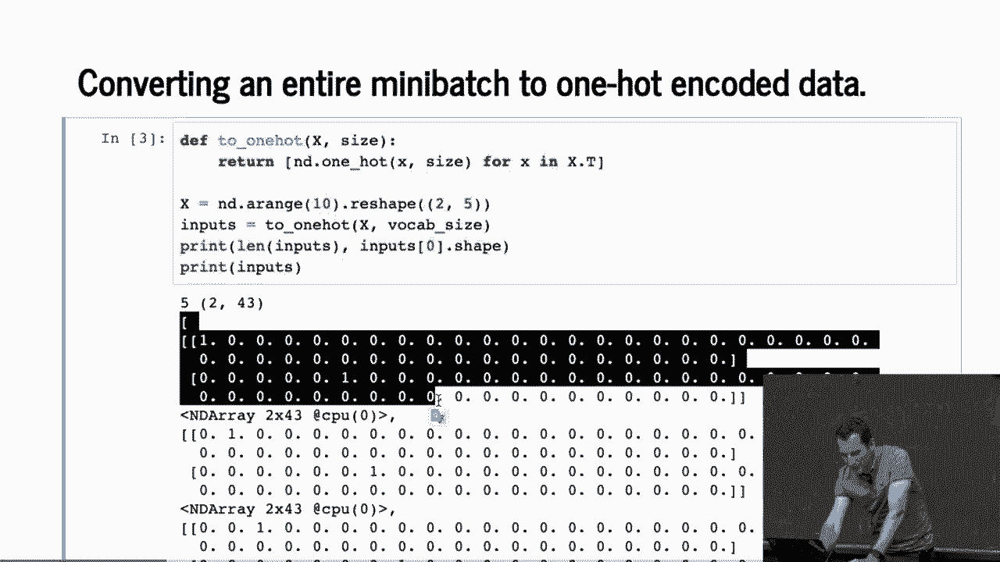

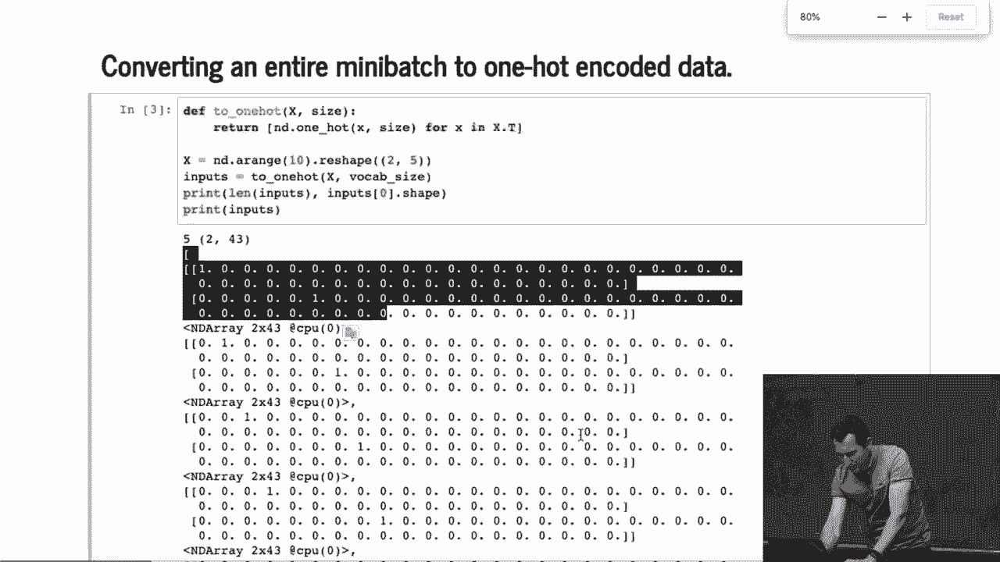

如果你把视图缩小，你就能看到其余的。1，2，3，4，5，对吧？是的，嗯，这只是，嗯，文本的第一部分。好的，到目前为止有任何问题吗？

很好。现在，如果我想，嗯，你知道，构建，嗯，一个模型。首先我必须做的事情是初始化参数。好的。那么我们实际设置一些参数。第一件事是输入的数量。嗯，那就是词汇表的大小。好的，因为我们使用的是独热编码。所以如果我有，你知道的。

43个符号，那么我需要，从，嗯，E0到E42的标准向量。然后我假设我有512个隐藏单元。好的？

这是隐藏状态的维度数量。输出的数量。因为我再次生成字符，结果，嗯，依然是43。最后一件事是我想知道是否有GPU，嗯，好的，在这种情况下，嗯，很明显我没有。我可以直接打印出来。然后，嗯。

所以你可以看到它正在CPU上运行。现在我需要定义所有的参数。所以记住之前我们有这个模型，其中基本上有一个，嗯，线性模型，用于隐藏层的隐藏数据和观察数据。这些参数。所以其中一个会给我一个正态分布的初始化，对吧？让我们获取参数。然后，嗯。

偏置就设置为零。对于输出层，我只需要一个权重矩阵和一个偏置。然后最后一件事是我需要附加梯度。所以这些就是这里的参数。然后，对于我在参数字典中所有的参数，对不起，是参数列表。我需要附加梯度。然后你返回这些梯度。

所以这是相当标准的，除了现在参数有些奇怪的名字。到目前为止有任何问题吗？

这实际上只是设置我们将要使用的变量。用于我们的隐藏单元递归神经网络。好的。

很好。那么接下来让我们来看一下RNN本身。第一件事是我需要初始化我的状态。所以记住，如果你有这个RNN，你知道，它是从某个初始状态开始的。然后它会不断更新，并且移动到某个地方。为了让我的工作更轻松，我这里就直接把我的初始隐藏状态设置为全零。

我可能会决定为我的初始隐藏状态选择其他的全零状态。然后我可能把它做成另一个参数，并学习它。所以那可能不是一个糟糕的主意。但是，好吧，这里我没有这么做。你可能会好奇，为什么我实际上返回的是一个只有一个元素的列表，对吧？

所以有人知道为什么我会做这么奇怪的事情吗？是的？

>> 因为如果你转一个列表，你可以加入任何东西或者元素。 >> 我可以加入更多元素。这个主意很好。所以我可能有一些模型，它们的隐藏状态大小是可变的。这个主意其实很不错，可能值得通过论文进一步探索。实际上这个主意真的很不错。另一种方式是你...我们之所以这样做，是因为我们想要相同的调用。

这个签名也适用于具有多个隐藏状态的模型。所以稍后当我们做长短期记忆（LSTM）时，我们会看到会有一个隐藏状态，它由一个不可从其他地方读取的记忆单元和一个实际的隐藏状态组成，后者可以用于生成输出。

所以在这种情况下，你将返回两个对象。好吗？

然后接下来我们实际上需要定义我们的 RNN 单元。所以这个 RNN 单元接受输入、状态和参数，并对它们做一些有趣的事情。特别是它输出的内容是，对，相应的输出和隐藏状态，它是如何变化的。那么让我们来过一遍。首先，我只是提取这些参数。

所以没有什么魔法发生。我只是拿出了我们之前的参数，并把它们提取出来，对吧？

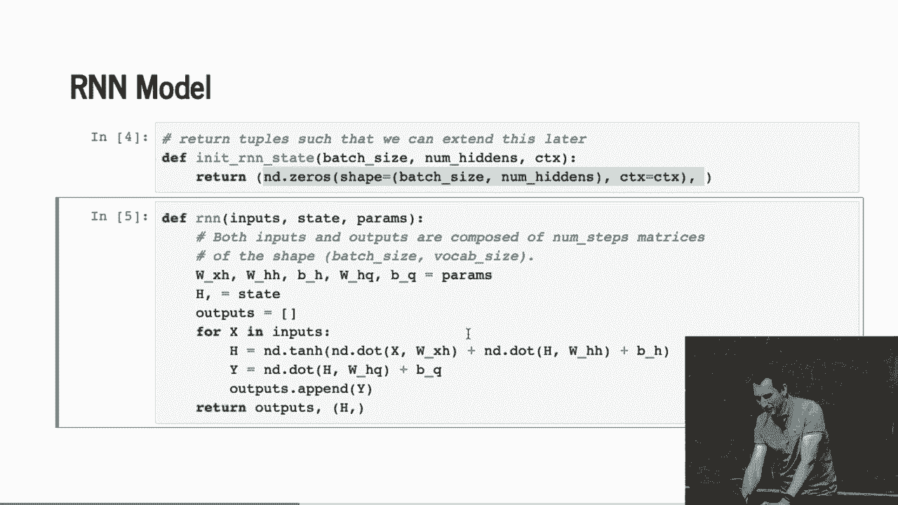

所以在这里我们初始化了所有这些参数，WXH，WH，BH，WH，Q，BQ，对吧？

现在我所做的就是再次从这个参数向量中提取它们。这在 Python 中非常优雅，否则这可能需要五行代码。然后在这里，我从状态中提取隐藏变量，对吧？所以我写了 H，因为我基本上只提取第一个元素，其余的我不关心。

输出一开始是空的，因为我还没有任何输出。然后我做的是遍历我的小批量。所以对于输入中的所有 X，这是我的隐藏状态的实际数学公式，对于我的 RNN 单元，对吧？

所以这只是使用了这个例子中的 Tange。我本可以选择其他函数，但 Tange 是一个很好的选择，因为它可以将值保持在某个范围内，防止它们发散，这样训练就不会变得非常困难。然后 Y 就是，您知道的，隐藏状态与一些参数加上偏置的内积。

它只是一个线性函数。最后，我只是把 Y 添加到输出列表中，仅此而已。然后我继续遍历输入数据，生成一个输出数据的列表，最后，在处理完整个序列后，我返回新的隐藏状态，然后返回输出序列。好吗？

到目前为止有什么问题吗？我知道这有点抽象，但重点是，这是你知道，隐藏单元如何工作的核心。一旦你理解了这一点，你就可以，正如我们将看到的，你基本上可以设计，更复杂的单元。好，明白了。

所以现在我们有了这一切，让我们看看这是否有效。是的，而且我可能没有定义X。

好的，让我看看。

我生成了数据吗？

让我看看。

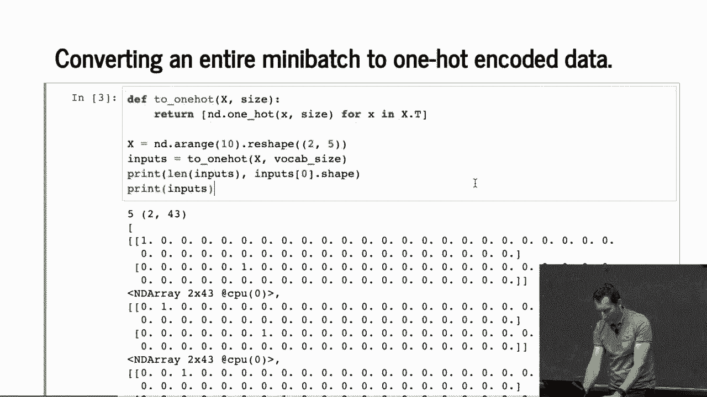

让我看看。它不仅仅是正常工作的。

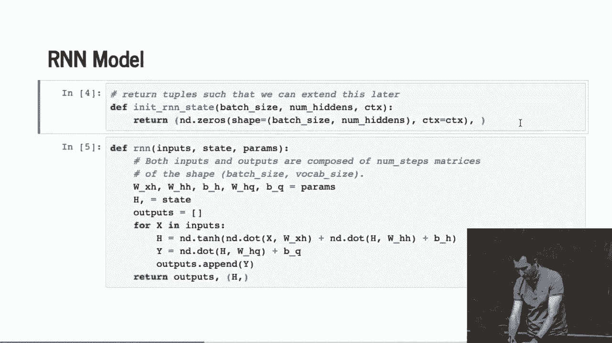

好的，现在有效了。所以，不太确定之前发生了什么。数据应该仍然存在。但无论如何，我所做的是获得一个初始状态，这取决于你知道，X的输入形状，隐藏单元的数量，以及设备上下文。然后我对X的输入进行编码。你知道，我得到我的参数。

现在我做的是在所有输入上运行RNN，使用初始状态和参数，然后得到一些新的状态。所以之后，你可以比较输入和输出之间发生了什么。毫不意外，至少如果代码正确的话，在这种情况下看起来是正确的。

输入的数量和输出的数量是相同的。这是你预期的结果。好吧，这就是这里的五个。输入和输出的形状也是相同的。虽然不一定非得如此，但因为我们是这样设计的，所以它们基本上具有相同的输出维度。最后是状态。

旧状态和新状态看起来一样。好吧，问题是，为什么我写了状态零？

那么，为什么我要拍摄状态的第一张图片？好吧，有什么想法吗？或者说，如果我选择其他东西，会发生什么呢？好吧，我们快速看一下如果你打印状态会发生什么。好的，所以新的状态是一个2×512的向量。

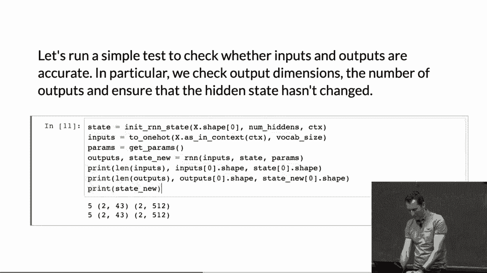

所以记住，我们有512个隐藏单元，为什么现在有2倍512呢？有什么想法吗？好吧，谁认为是迷你批次大小？好吧，好的，我看到两只手举起来了。谁认为这是隐藏状态的维度，总共是2×512？好吧，谁认为是其他原因？好的，现在手的数量似乎和房间里的人数不完全吻合。

好吧，实际上，它是迷你批次大小，2。512是隐藏单元的数量。但由于我在迷你批次中的每个序列，您知道，这些序列可以是非常不同的，需要它们自己的状态序列，或者它们自己的状态，所以我需要为迷你批次中的每个观察都携带一个状态。好吧。

所以接下来，我需要的最后一个东西是需要，你知道，一个预测函数。那就是预测RNN。嗯，它实际上接受很多参数。它接受一个字符串前缀。它应该生成的字符数。你知道，RNN本身，参数数量。是的，我们需要这些，你可能也会在作业中用到类似的东西。

对吧？所以，注意这个点是个好主意，因为你会在作业中发现它非常有用。无论如何，你需要一个初始的RNN状态。隐藏单元的数量，词汇表大小，设备上下文。然后是从字符到索引以及反向的映射。好的。所以我们在预测函数中做的第一件事是，嗯，我们初始化状态。对吧？所以。

然后，嗯，我们输出，你知道，我们基本上是继续输出。所以在我们的例子中，输出的前几个字符，基本上就是零的前缀。现在，我们所做的是遍历整个序列。它由多个字符和前缀的长度减去一组成。减去一是因为我只是将前缀的第一个字符复制到输出。我去做。

好的，将其编码为独热编码，然后，嗯，输出的末尾就是下一个符号，用来预测下一个符号。所以，我在RNN中向前迈了一步。好的。然后，嗯，我需要决定是否已经看过这些字符，对吧？如果是的话，我只需要将它们从输入复制到输出，对吧？如果没见过的话。

然后我执行最大似然解码。所以我基本上选择最有可能的一个字符。最后，因为我有一个列表，嗯，我只是将它们连接起来，中间不加分隔符。所以就是这样。然后我对所有输出项执行从索引ID到字符的解码。好的。

这就是预测RNN的工作原理。好的，到目前为止有问题吗？这个过程相当复杂。大家都明白了吗？好。好。

让我们看看它在实践中是如何工作的。如果我从“traveler”开始。因为现在我的权重使得我的参数都是混乱的，它只会生成一些垃圾字符序列。对吧。可以预料到，因为里面没有任何有用的信息。好的。但至少，你知道。

它生成一个字符串。那么接下来我们需要担心的是梯度裁剪。梯度裁剪，好的。有人知道为什么我需要梯度裁剪吗？我们以前做过这个，对吧？我们看过整体梯度。为什么我需要梯度裁剪？好的。正是如此。如果我的梯度过大，如果我进行优化，对吧，让我们在这里画一下情况。

我坐在这里。我的梯度非常大。那么它可能会将我送到，你知道，基本上。你知道，某个地方。最好的情况是，它会正好看到这个最优解。最坏的情况是，它会像这样走。它会只是，你知道，振荡并变大，把我带到很远。

离我想要的位置还远。一个方便的梯度裁剪方法是，我只需将其乘以一个值，这个值要么是 1，要么是θ除以梯度的长度。如果我有这个，那么，基本上我知道梯度的最大长度将是θ。如果第一个项生效并且长度是 g，第二项则。

触发并且长度是θ，对吧？那么我们来看看你是如何计算它的。嗯，你基本上，知道吧，创建一个数组。现在，这个还是有点傻，因为你基本上是创建了一个零维数组标量。现在，对于参数列表中的所有参数，去添加平方范数，换句话说，对这个范数进行平方。然后最终。

取平方根并将其转换回标量。如果这个范数大于θ，那么就重新缩放它。否则不做任何操作。测试上面的这个方程，进行编码。

好的。接下来是训练循环。

这个有点复杂。我们实际上直接做一下。

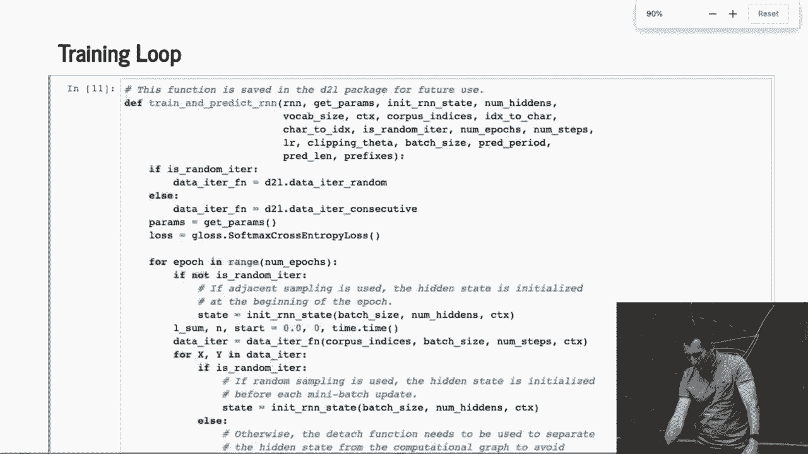

在 Jupyter 中。因为，是的，这有点长。

不幸的是，我们必须通过这个。

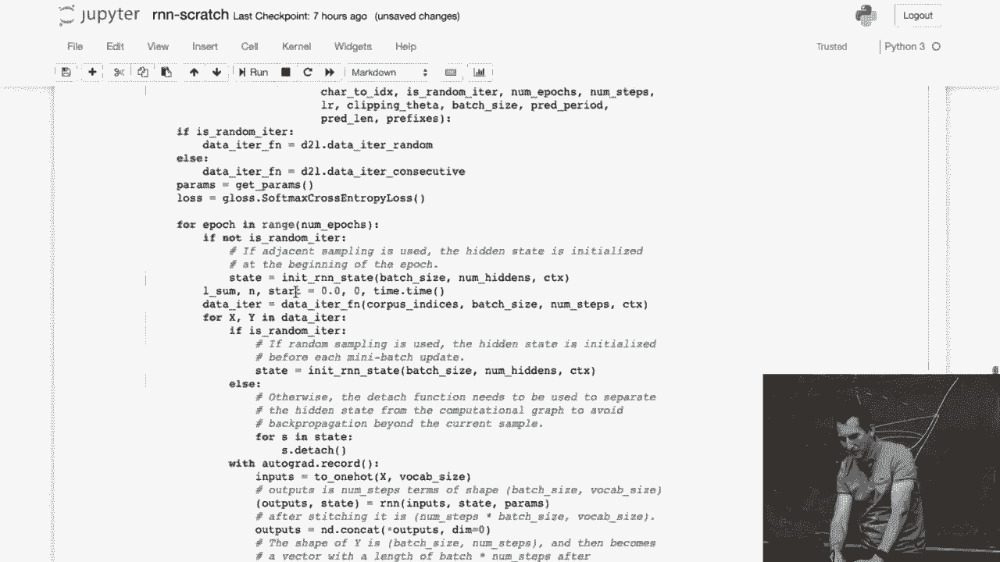

你知道，在公共场合读代码挺尴尬的。

但是这个函数会被调用很多次。好的。所以训练预测 RNN 需要很多参数，我们会在进行时逐个处理。

第一步是它作为一个参数，决定我们是否通过数据进行随机迭代。所以，它是随机迭代。如果是，那么，嗯，调用随机迭代器，否则调用连续迭代器。所以，基本上就是直接的。好，参数，在调用获取参数的例程时。

这是适当实现的。现在我们关心的是，作为损失函数，就是下一个字符的对数似然性。嗯，这就是我们的自我最大化交叉熵损失。好的。

好的，那么，我们来看一下训练循环本身。首先是非常常见的。嗯，按照你有多少个纪元就遍历数据多少次。好了。如果我们有一个随机迭代器，那么，我们就初始化状态为零。否则，嗯，你知道的，所以，你需要像这样初始化它。好吧。所以，基本上就是——好的。

实际上——这没有意义。如果是随机迭代器的话，应该是这样。好的。接下来我们需要完成一些实用函数。哦，对了，因为如果——哦，抱歉。问题是这样的。如果不是随机迭代器。那么你在每个纪元的开始时初始化它。对吧？如果是随机迭代器的话。

然后，初始值是在每个迷你批次的开始时设置的。好的。这就是我们在这里做区分的原因。因为在这里，我们只是迭代数据。就像在之前的设置中一样，数据会在此之前准备好。

好的。所以，如果这是一个随机迭代器，我们需要在每个迷你批次的开始时清除所有参数。如果不是，我们需要确保我们的反向传播不会信任两个迷你批次之间的边界。对吧？不幸的是，除非我们告诉 gluon 不这么做，否则它实际上会一直将梯度传递到整个链条中。对吧？所以。

这就是为什么我们需要将它们断开。我稍后会详细讲解这一点，所以不用担心。那么，接下来我们进入反向传播的核心部分。通过 `autograph.record`，我们对输入进行编码，运行我们的 RNN 来处理输入的状态和参数，然后得到输出。对吧？就这样。然后我们基本上计算输出和我们预期结果之间的损失。

真的应该看到了。所以，这和我们在任何分类、回归场景中做的非常相似，只不过现在我们处理的是序列。好吧。那么，接下来是反向传播。我对梯度进行了裁剪，然后运行 STD。就是这样。对吧。那么，最后我需要做的事情是，我需要记录一下我做得有多好。所以。

换句话说，如果你知道它是预测期数的倍数，我就去打印困惑度（perplexity）。我将解释困惑度是什么。也就是说，我正在做的是——最后我做的事情是，我让 RNN 实际预测下一个几个字符。

好的。所以，这有点复杂。

现在我可以直接训练这个了。

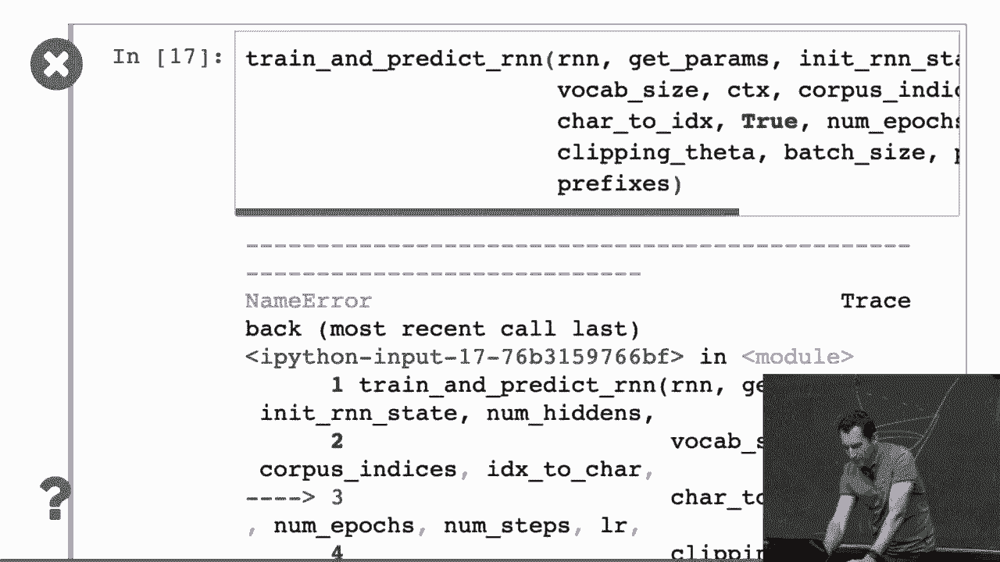

这很奇怪，因为它实际上应该正常运行。

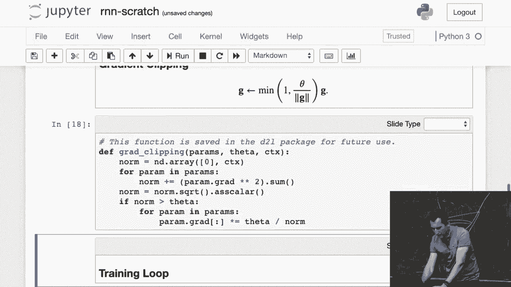

哦，对了。我们需要做的最后一件事是设置一些参数。

也就是说，你知道我们遍历数据的次数。

然后它应该就能运行了。只是需要一点时间。不过，好的，在我们做这个的同时，快速消化一下这些内容。

参数。我不确定是否已经设置。

好的。

好的，就这样。这只是设置所有参数——500个周期，64步。下一个字符预测，最小批量大小为32，学习率为100。所以这非常激进。我将梯度裁剪到不超过0.01。所以我有一个很大的学习率，但我会裁剪梯度，以防止它变得过大。

总的来说，学习率乘以裁剪值大约是1。然后在最后，我让它预测了一些东西。我想开始一个旅行和时间旅行的任务。好吧。所以现在我们看到的是，最开始模型并没有做出什么特别智能的东西。对吧？它只是生成了这些东西，这些东西。这些是最常见的单词。

其实并不令人惊讶。随着困惑度的下降，它开始生成的文本看起来不那么混乱，你可以认为它不是完全愚蠢的。好吧。如果你再等一会儿，你会看到它会变得越来越好。好吧。

我们稍后会回到这个话题，但现在，每个周期大约需要半分钟时间。

这有点无聊。不过我接下来会展示一下，如果你使用顺序采样，会发生什么。诀窍是，顺序采样使用的算法是完全相同的，只是数据的准备方式不同，我在每一步之间不重置隐藏状态。结果是，它的表现更好。你知道的。

你可以看到，到了第450或500个周期，它实际上能生成一些文本，至少对于几个字符来说，可以欺骗一个人。所以从某种意义上说，它通过了图灵测试，至少对前十个字符来说，对吧？

我认为这实际上是一种更有趣的图灵测试方式。不是看你能不能欺骗一个人，而是看你能欺骗一个人多久，对吧？

通过这种方式，你能更好地衡量你离目标有多近。好吧。例如，如果你有一个电话应答系统，它只与人类互动一分钟，那么它只需要在一分钟内欺骗一个人就可以逃脱。好吧。无论如何，诀窍是顺序采样比随机采样效果要好得多。

让我们看看现在的情况。所以在第350个周期，它的困惑度是1.53。

在358周期时，它的困惑度是1.25。有人知道为什么顺序采样表现更好吗？

好的。让我们先画个图。假设这是我的序列。其实我有几个序列，因为我有一个**迷你批次**。可能这是一个大小为三的迷你批次。好了。所以在顺序采样中，我会将其切分为，嗯，大小为的迷你批次。基本上，谢谢。就是这样，我有。

你知道，这里有三个。其实让我再分解一下。所以我有六个，这样我们就不会混淆迷你批次大小和段数。如果我是。假设在这里我做了一个预测，然后，我得到了一个状态，这里是一些隐藏状态。然后在这里，这些隐藏状态在过渡时是一样的。

而如果我做随机采样，我会选择另一个，迷你，嗯，另一个段，可能是在这里。因此，结果是，这些状态，嗯，应该不会是一样的。实际上，我几乎会将其初始化为零或默认的其他值。这就是为什么随机采样效果不太好，我们看到它忘记了状态的所有上下文。

好的。这是我们简单的RNN。

好的，到目前为止有问题吗？是的，你可以看到它不如之前那么好。它下降到1.37的位置。

我们现在的困惑度是1.17。如果你再训练长一点，它会变得，嗯，那基本上就是停滞了。好了。有问题吗？是吗？ >> 所以在1.6的边缘困惑度最低。 >> 是的。 >> 是的，那么为什么困惑度又上升了？我们之前看过这个现象吗？

如果你继续训练，某个时刻，情况可能会变得更糟。好吧。可能有两件事导致了这个，对吧？记住，这是训练集的困惑度。对吧？如果是测试集的困惑度，我会说那是过拟合。事实上，作业的一部分是要处理过拟合。那么为什么困惑度会。

即使在训练过程中，困惑度也会再次上升吗？毕竟，我们是想要最小化目标函数。对吧？为什么它变得更糟？有什么想法吗？嘿，大家，下次我带些咖啡来，好吗？

好的，有没有什么想法为什么训练误差可能会增加？嗯，记得学习率的事。对吧，我曾说过，如果你选择一个非常激进的学习率，它可能会发散，对吧？

这正是这里发生的情况。所以在下一步学习时，困惑度可能会再次下降，并且可能会稍微振荡。但那只是因为我的学习率可能选得太积极了。是的？

那么为什么你在T12s训练框架网络的重构中提供了学习率？

所以我可以做的是使用一个学习率调度器。是的，事实上，对于任何生产级的实现，你都会有一个学习率调度器。所以我们将在目标识别的背景下稍微谈谈这个，可能还会谈到余弦调度和其他一些内容。

当我们深入讨论优化时，我们会更多地谈论这些内容。所以这也让我把很多优化数学推迟到了后面，因为现在你可以先把它当作一个简单的工具来用。我们稍后会解析这个工具里面到底有什么。[BLANK_AUDIO]

