# P99：99. L19_2 Recurrent Neural Networks in Python - Python小能 - BV1CB4y1U7P6

 [INAUDIBLE]。

 So--， [SIDE CONVERSATION]。

 OK。

 So this is--， OK， is it recording？ Yeah。 OK。 So this is really just right now going through a very。 very， simple example。 And the first thing we need to do is we need to load the， data set。 So we're loading the time machine。 And--， [SIDE CONVERSATION]， All right。 So--， there we go。 This is the entire time machine loaded。 All right。 So I'm importing， you know。

 the usual convenience libraries， autograd， loss， and so on。 And this loads the time machine data set。 We'll look at that in a little detail later。

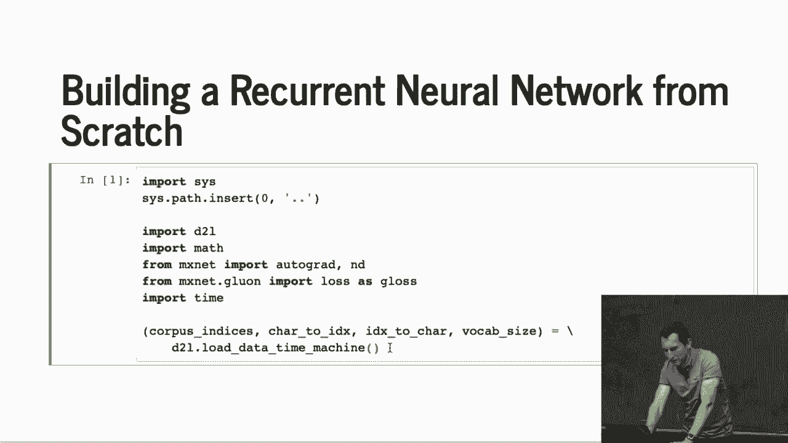

 OK。 And so the first thing I'm going to do is I'm going to use a， one-hot encoding。 So， I mean。 remember what I did is I split things up on a， pro-character basis。 So every character of the time machine is its own token。 That's not so particularly intelligent if I use English。

 Can somebody tell me a language where this would be a great idea？ Guys， you really should know that。 Yes， Chinese would work really well。 Japanese would work really well。 Korean， not so much。 Right？

 Because they ditched the Chinese characters at some point。 So it would work really well for a language where you have a。 nontrivial number of symbols that are quite distinctive。 But， OK。 so since I don't want to have to deal with a lot of， complicated pre-processing and so on。

 I'm just going to use， one-hot encoding here。 And so， vocabulary size， I think it's around 43。 And so if I have the following array， you know， of， you know， 2/2/30。 So then， OK， so 43。

 So you can see that these are the three characters that I get。

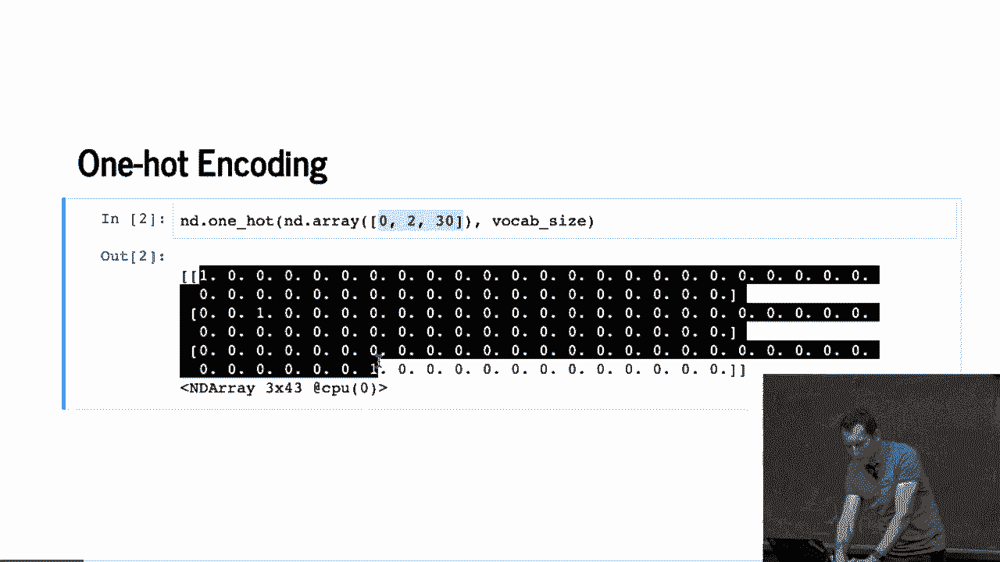

 So the first character is encoded as such。 The second character is encoded as such， right？

 So that's position two。 And， well， actually the third position， that's why it's two。 Zero position is there。 And for the third one， OK， that would be position， yeah， 31 here， probably。 Right， so this is， I mean， a hideously inefficient encoding， but， OK， you need to start somewhere。 OK， let's move on。

 Now， if I want to encode an entire mini batch to one-hot encoded， data， then here's what I would do。 Right， so I need to define a mapping to one-hot。 And what it does is basically for all x's in the mini batch。 it converts it into this one-hot encoding。 Right， so if I， let's now assume my mini batch， you know。 it's so， you know， 2/5。 And I have， you know， these as my inputs， then let's actually， look at。

 you know， how large they are。 So it's， you know， 5， 2/43 objects。 43 because， well。 that's the vocabulary size， 2 because， that's exactly the two here from the， you know。 mini batch size。

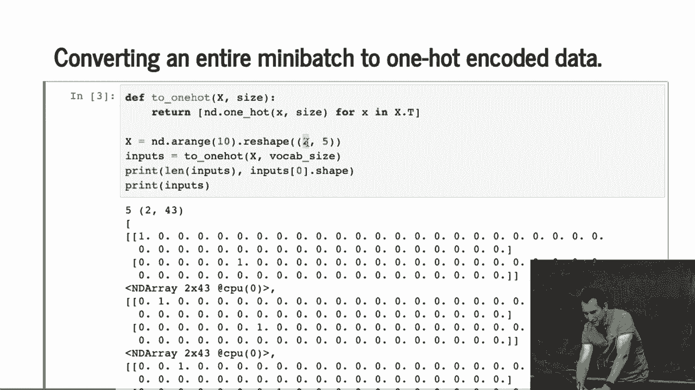

 I have five of those guys。 Of course， not all of them plot here。 So if you were to zoom out， oops。

 If you were to zoom out， then you'd see the rest。 1， 2， 3， 4， 5， right？ Yep， and， well， that's just。 you know， the first part of the text。 Okay， any questions so far？

 Good。 Now， if I want to， you know， build， you know， a model。 the first thing I have to do is I have to initialize the parameters。 Okay。 So let's actually set a couple of parameters。 First thing is the number of inputs。 Well。 that's the vocabulary size。 Okay， because we have the one-hot encoding。 So if I have， you know。

 43 symbols， then I need， you know， canonical vectors from， you know， E0 to E42。 Then I'm assuming that I have 512 hidden units。 All right？

 That's the number of dimensions for the hidden state。 The number of outputs。 since I'm producing characters again， is again， you know， 43。 And the last thing is I want to find out whether I have a GPU， and， okay， in this case， well。 clearly I don't have one。 I could just print that。 And then， yeah。

 So you can see it's running on the CPU。 Now I need to define all the parameters。 So remember before that we had this model where we basically had a， you know。 linear model in hidden and observed data for the hidden layer。 These parameters。 and so one just gives me a normal distributed， initialization， right？ Let's get params。 And， well。

 the bias is just set to zero。 For the output layer， I just need one-weight matrix and one bias。 And then the last thing is I need to attach gradients。 So these are the parameters here。 And then for all the parameters that I have in my parameter dictionary， sorry， parameter list。 I need to attach gradients。 And then you return the gradients。

 So this is fairly standard except that now the parameters have funny names。 Any questions so far？

 This is really just setting up the variables that we are going to use for。 our hidden unit recurrent neural network。 Okay。

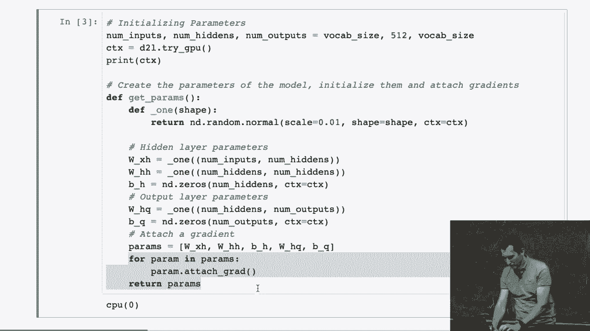

 Good。 So then let's get to the RNN itself。 First thing is I need to initialize my state。 So remember if you have this RNN， you know， it starts from some initial state。 And then it keeps on updating things and it moves somewhere。 And I'm going to make my life easy here。 I'm just going to use as my initial hidden state all zeros。

 I might decide to pick something else in all zeros for my initial hidden state。 So I could then maybe make that another parameter and then learn that。 So that might not be such a terrible idea。 But okay， here I don't。 Now you might wonder why on earth I'm actually returning a list with only one， element， right？

 So somebody have an idea why on earth I'm doing something as weird as that。 Yes？

 >> Because if you turn a list and you can add in everything or elements。 >> I could add more elements。 That's a good idea。 So I might have some models which have a hidden state that has variable size。 It's actually a really nice idea。 It's probably worth while exploring through paper。 It's actually a really nice idea。 The alternative is you and the reason why we do it here is because we want the same call。

 signature to work also for models that have more than one hidden state。 So later on when we'll do long short term memory， we'll see that we'll have a hidden。 state which has a consists of a memory cell that is not readable from the rest of the。 world and then the actual hidden state that is accessible for the purpose of， generating the output。

 So in that case you just have two objects that you're going to return。 Okay？

 And then the next thing is we actually need to define our RNN cell。 And so this RNN cell takes inputs， state and parameters， and does something， interesting with them。 In particular what it outputs is， well， the corresponding outputs and the hidden， state。 how it changed。 So let's actually go over that。 So the first thing is I just pull out the parameters。

 So nothing really magic happened。 I'm just taking the parameters that we had previously and I pull them out。 right？

 So here we initialize all those parameters， WXH， WH， BH， WH， Q， BQ。 Right？

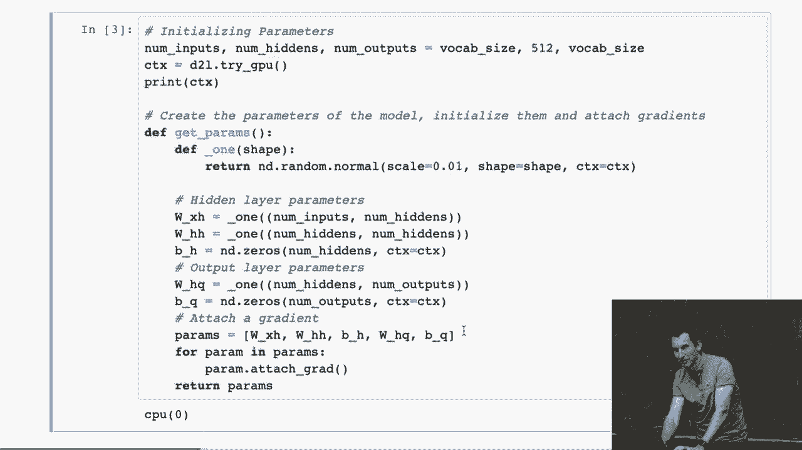

 And now all I'm doing is I'm just pulling them out of this parameter vector again。 That's really elegant in Python otherwise this might be five lines of code。 And then here I'm pulling the hidden variables out of the state。 Right？ So that's why I'm writing H。 because I'm basically just pulling the first element， out and I don't care about the rest。

 The outputs initially are just empty because I don't have any yet。 And then what I do is I go over my mini batch。 So for all the X's in the inputs。 here's the actual math for my hidden， for my RNN cell， right？

 So this is just using in this case Tange。 I could have picked some other function。 but Tange is a good thing， because it will keep the values within some range and prevent them from diverging。 which would make training really hard。 And then Y is just， you know。 an inner product between the hidden state and some， parameters plus bias。

 It's just some linear function。 And now in the end I just append Y to that list of outputs and that's it。 And so I just keep on iterating over the input data， produce a list of output， data。 and then in the end， while I return， you know， the new hidden state。 that I get after ingesting the entire sequence and I return the sequence of outputs。 Okay。

 Any questions so far？ I know this is a little bit abstract。 but the point is that this is really the， guts of， you know， how your hidden units work。 Once you understand this， you can， you know， as we'll see， you can basically， design。 considering more complex units。 Okay。 Good。

 And so now that we have all of this， let's see whether that actually works。 So， yes。 and I probably didn't define X。

 Okay， let me see。

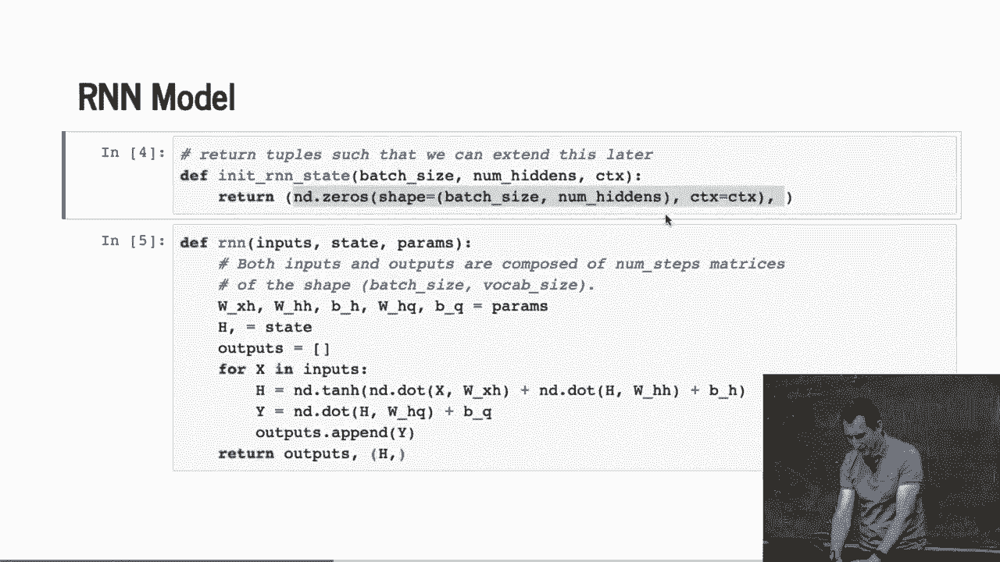

 Did I generate the data？

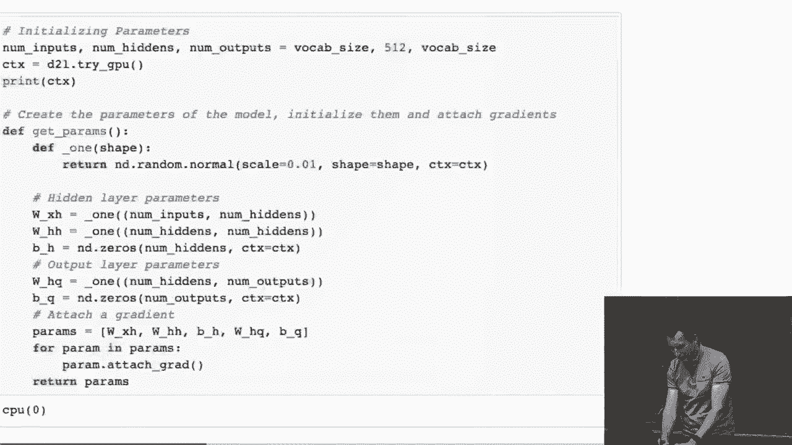

 Let me see。

 Let me see。 It's not just work fine。

 Okay， now it works。 So， not quite sure what happened before。 It's the data should still persist。 But in any case， what I'm doing is I'm getting， you know， an initial state， and that depends on。 you know， the input shape for the X's， number of hidden units， and device context。 Then I'm encoding my inputs for X。 You know， I get my parameters。

 And now what I'm doing is I'm running the RNN on all the inputs， the initial state。 and the parameters， and I get some new state out of it。 And so after that。 you can just compare what happened between inputs and outputs。 And very unsurprisingly。 at least if the code is correct， in this case it looks like it is。

 number of inputs and number of outputs is the same。 That's what you would expect。 All right。 that's this five here。 The number， the shape of the inputs and outputs is also the same。 It doesn't have to be that way， but that's what happens because we engineered it that way。 That we have basically the same number of output dimensions。 And then lastly， the state。

 the old and the new state look the same。 Okay。 Question， why did I write state zero？

 So why did I take the first picture of the state？ Okay。 Any ideas？ Or rather。 what would happen if I picked something else？ Okay， well。 let's have a quick look at what happens if you print state。 Okay。 So state new is this vector of two by 512。

 So remember we had 512 hidden units， but why do we have two times 512 now？ Any ideas？ Okay。 Well。 who thinks it's the mini bash size？ Okay， well， okay， so I'm seeing two hands go up。 Who thinks it's the dimensionality of the hidden state overall， two by 512？ Okay。 Who thinks it's something else？ Okay， so right now the number of hands doesn't quite add up to the number of people in the room。

 So， okay。 So it's actually， it's the mini bash size， the two。 The 512 is the number of hidden units。 But since every sequence in my mini batch， you know， that can be very different sequences。 needs its own state sequence， you know， or its own state， that's why I need to carry one。 for every observation in the mini batch around with me。 Okay。

 And so then， the last thing I need is I need， you know， some prediction function。 So predict RNN。 Well， it takes actually a lot of arguments into this。 It takes some string prefix。 number of characters that it should generate。 The， you know， the RNN itself， number of parameters。 And yeah， we need that and you will probably need that also for your homework。 Stuff like this。

 right？ So， it's a good idea to pay attention because you will find it very useful in homework。 Anyway， you need an initial RNN state。 Number of hidden units， vocabulary size， device context。 and then the mappings from， character to index and back。 Okay。 So the first thing we do in the predict function is， well， we neutralize the state。 Right？ So。

 and then， well， we output， you know， we basically precede the output。 So the output in our cases。 you know， the first few characters， that's basically， prefix of zero。 And now， what we do is。 we go over that entire sequence。 That's made a number of characters plus the length of the prefix minus one。 Minus one because I just copied， you know， the first character of the prefix into， output。 I go and。

 well， encode to one-hot encoding the， well， the end of the output because that's。 the next symbol to use to predict the next one。 So， I take one step forward in the RNN。 Okay。 And then， well， I need to decide if I actually， if I've already seen the， characters， right。 then all I do is I just copy them from the input to the， output， right？ If I've not seen them。

 then I perform a maximum likelihood decoding。 So I pick basically the one character that's the most likely。 And then， in the end， because I have a list， well， I just join it and with no。 separating character in between。 So that's this thing here。 And I perform a decoding from index ID to characters here for all the items in the， output。 Okay。

 That's really what predict RNN does。 Okay。 Any questions so far？ This is quite complex。 Everybody's cool with that？ Good。 Good。

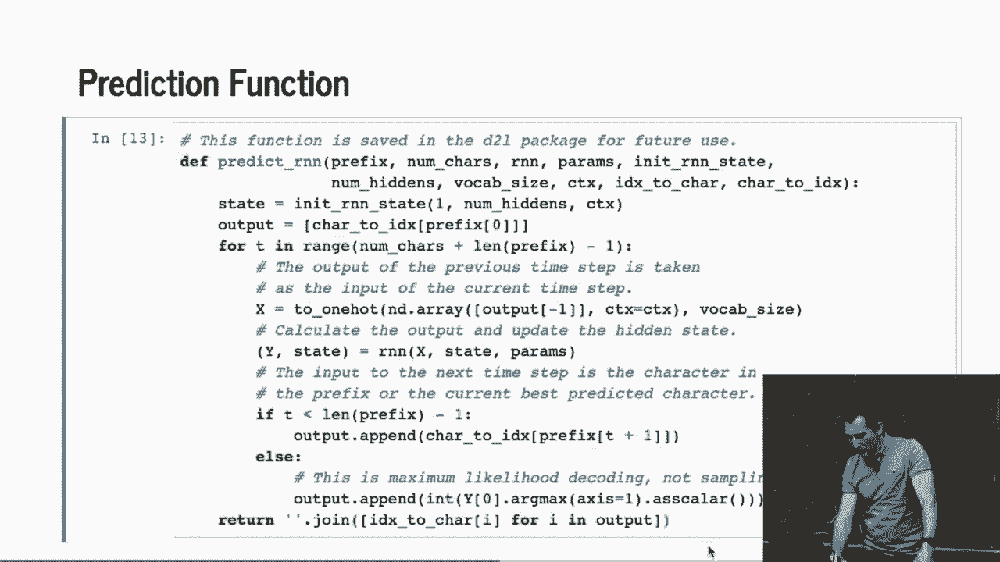

 Let's see how it works in practice。 And if I started with traveler。 because right now my weight makes us my， parameters are all garbled。 it just produces some garbage sequence of， characters。 Right。 That's to be expected because there's nothing useful in there。 Okay。 But at least， you know。

 it produces a string。 So the next thing that we need to worry about is gradient clipping。 So gradient clipping， okay。 Does somebody know why I need gradient clipping？ We did this before。 right？ And we looked at overall gradients。 Why do I need gradient clipping？ Okay。 Exactly。 So if my gradient is too large， if I optimize， right， so let's draw the， situation here。

 I'm sitting here。 My gradient is really large。 Then it might send me， you know， essentially。 you know， somewhere over， here。 And it might， you know。 in the best case it'll see exactly like so to the， optimum。 In the worst case， it'll go like so。 It'll just， you know， oscillate and get bigger and just take me really。

 far away from where I would have wanted to be。 And one convenient way of gradient clipping is I just multiply it with。 something that's either just one or one or theta over the length of the， gradient。 If I have that。 then， well， basically I know that the largest， length of the gradient is going to be theta。 If the first term kicks in and the length is g， if the second term。

 kicks in and the length is theta， right？ So let's have a look at how you go and compute it。 Well。 you basically， you know， create an array。 And right now this is still a little bit silly because you basically。 create a zero-dimensional array scalar。 And now for all the parameters in the parameter list。 go and add the， square norm， so the square to that norm。 And then in the end。

 take a square root and convert it back to， scalar。 Now if this norm is longer than theta。 then go and rescale it。 And otherwise do nothing。 Test this equation up there， encode。

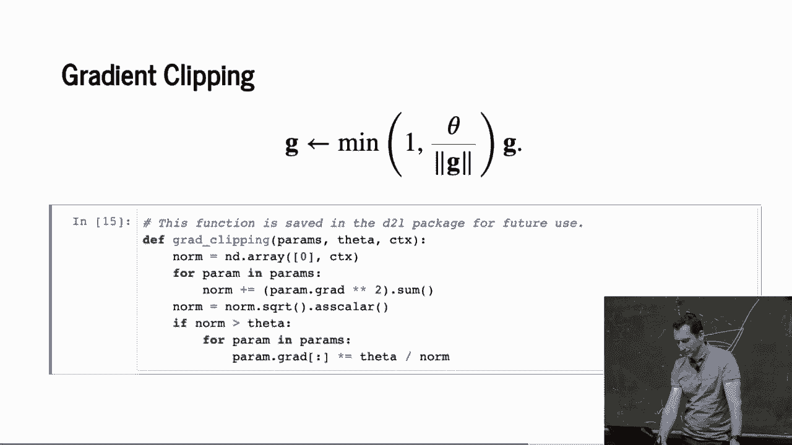

 Okay。 Now comes the training loop。

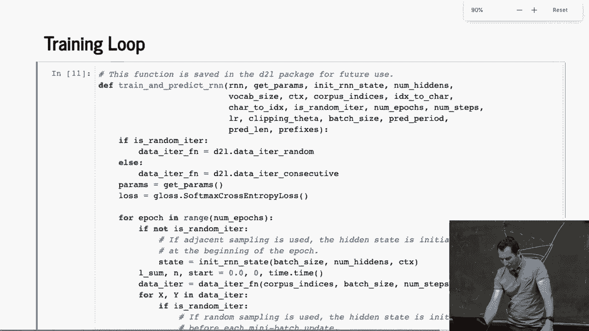

 And this one is a little bit complex。 Let's actually do this directly。

 In Jupyter。 Because， yeah， this is a little bit long。

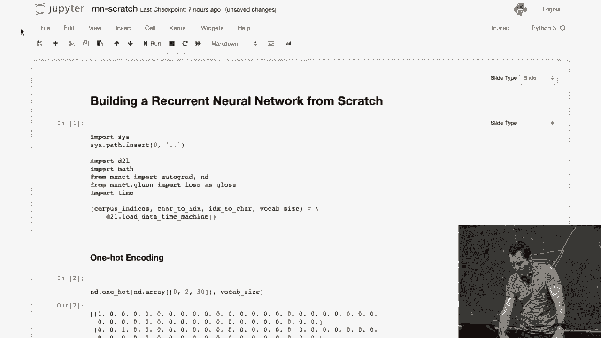

 Unfortunately we'll have to get through that。

 You know， reading code in public is awkward。

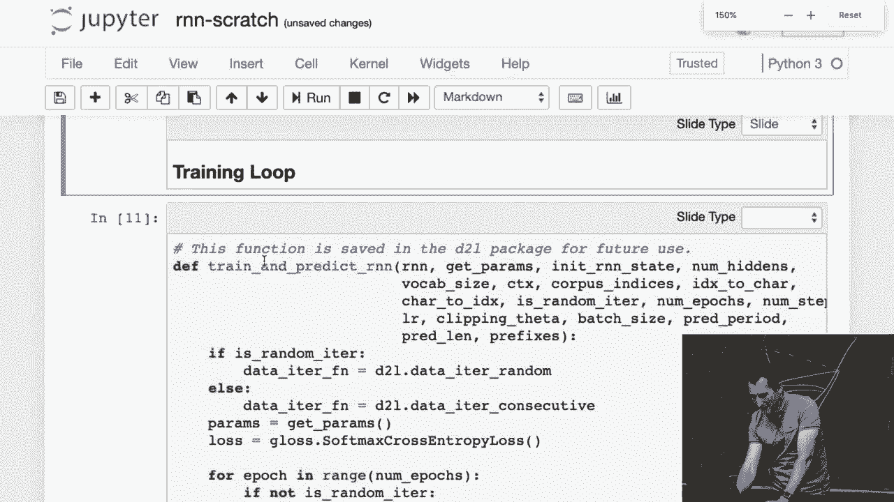

 But this function will see many， many times over。 Okay。 so the training predict RNN takes a lot of arguments， we'll get to them as we go through。

 The first thing is it takes as one of the arguments whether we iterate。 randomly through the data or not。 So， it's random iter。 If it is， then， well。 invoke the random iterator， otherwise invoke the consecutive， iterator。 So。 let's kind of straightforward。 All right。 Params， while it invokes the get parameters routine。

 which is appropriately， implemented。 And right now we just care about， you know。 as the loss function， the log， likelihood of， you know， for the next character respectively。 So。 that's our self-max cross entropy loss。 Okay。

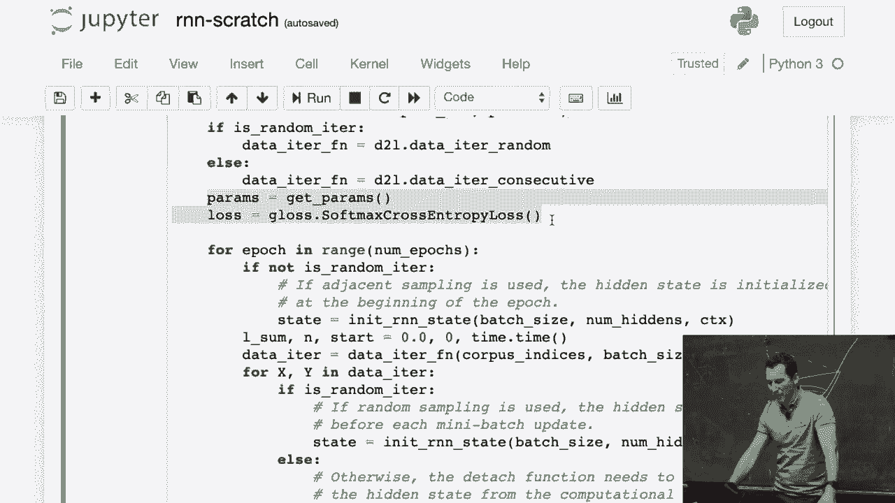

 Okay， so then， let's look at the training loop itself。 So， the first thing is very common。 Well。 just go with the data as many times as you have epochs。 All right。 Now。 if we have a random iterator， then， well， we just initialize the state with， zero。 Otherwise。 you know， so， you need to initialize it like so。 All right。 So， it's basically just --， Okay。

 actually -- that doesn't make sense。 It should be actually if it's random iterator。 Okay。 Let's see。 Next thing is we need to just get some utility functions done。 Oh， yeah， because if it's -- oh。 sorry。 So， here's the thing。 If it's random -- if it's not random iterator。 then you initialize it at the， beginning of each epoch。 Right？ If it's a random iterator。

 then the initial light is at the beginning of， every mini batch。 Okay。 That's why we have this distinction here。 Because here， we just iterate over the data iterate。 That's just set up before that， whatever comes above。

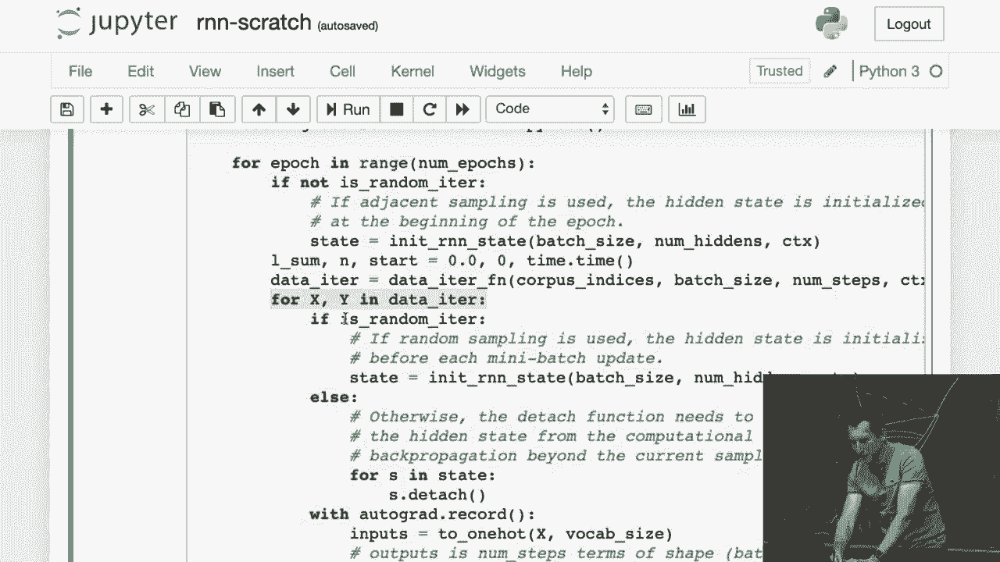

 Okay。 So， if it's a random iterator， nuke all the parameters at the beginning of the， mini batch。 If not， we want to make sure that our backprop doesn't trust the。 boundaries between two mini batches。 Right？ And unfortunately， unless we tell gluon not to do this。 it will， actually just keep on pushing the gradients all the way through that， chain。 Right？ So。

 that's why we need to detach them。 And I'm going to talk about that in a fair amount of more detail later。 on。 So， don't worry。 So， then we get to the actual heart of the backprop part。 So， with autograph。record。 So， we encode the inputs。 We run our RNN for the input state and parameters。 We get the outputs。 Right？ There we go。 And then we basically compute the loss between the outputs and what we。

 really should have seen。 So， this is very much the same as we would have in any classification。 regression scenario just that now we have a sequence。 Okay。 So， then comes the backprop。 I clip the gradients。 And then run STD。 And that's about it。 Right。 So。 now the last thing that I need is I need to actually log a little bit， how well I'm doing。 So。

 in other words， if， you know， it's， you know， number of prediction， periods and multiple of that。 I go and， you know， print out the， perplexity。 And I'm going to explain what perplexity is。 Namely。 what I'm doing is I'm -- and the last thing that I do is I。 have the RNA and actually predict the next few characters。

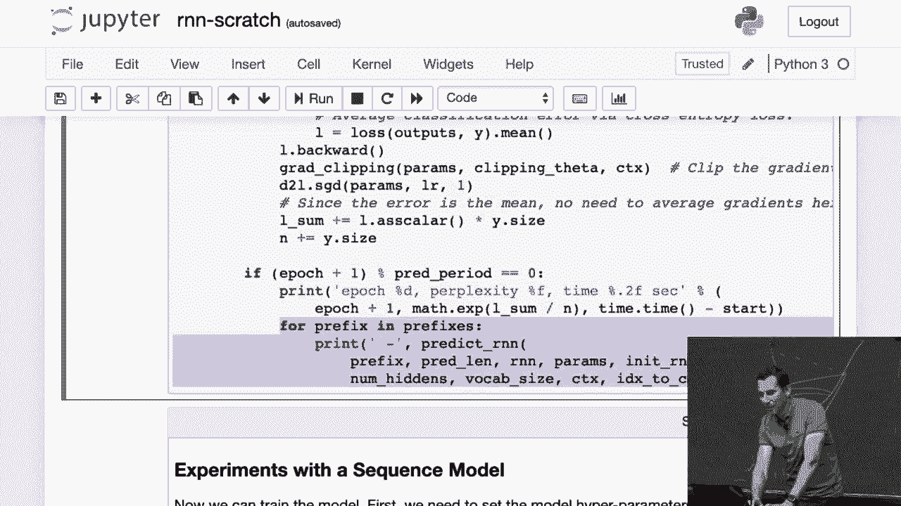

 Okay。 So， this is kind of complex。

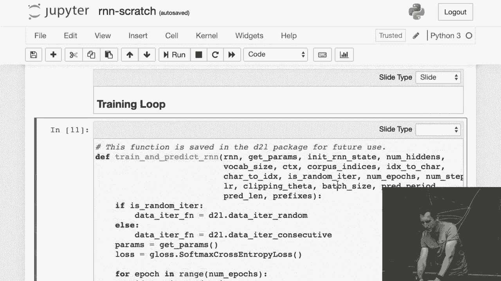

 And now I can just train this。

 And this is odd because it should actually run just fine。

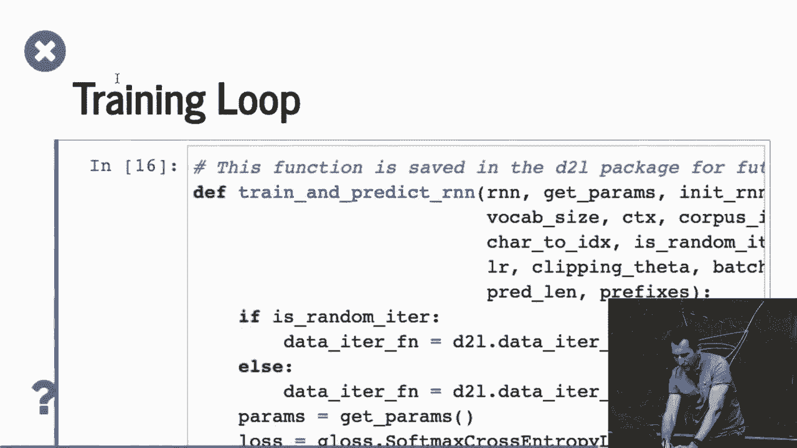

 And -- oh， yeah。 Last thing we need is we need to set some parameters。

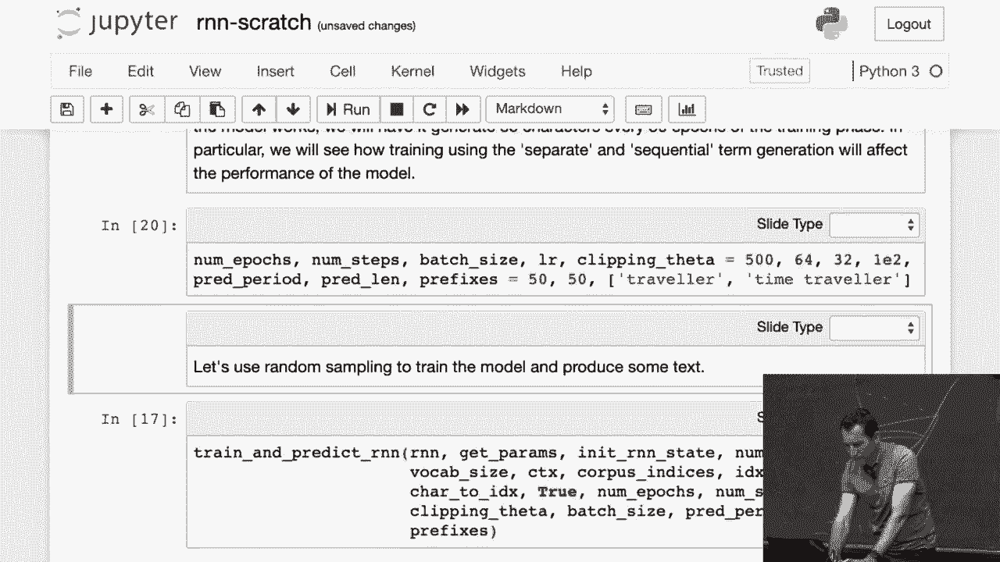

 Namely， you know how many times we go over the data。

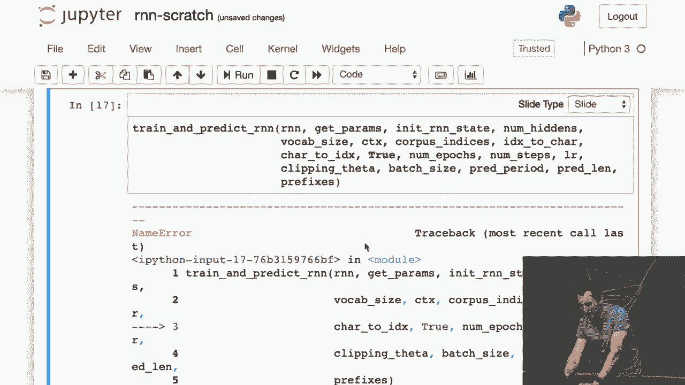

 And then it should just run。 It just takes a while。 But， okay， while we do this。 let's just quickly digest some。

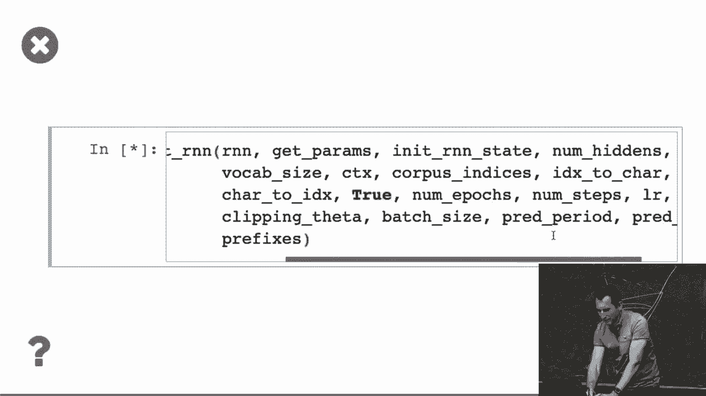

 parameters。 I don't know whether that's there。

 Okay。

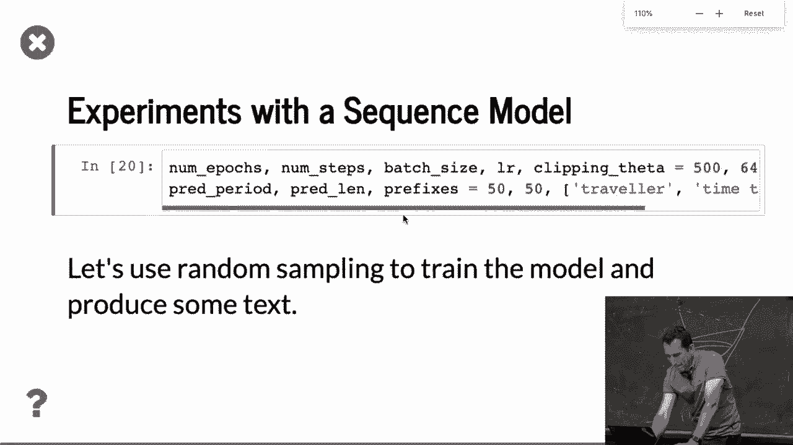

 Yeah， so there you go。 So this is just setting all the parameters -- 500 epochs， 64， steps。 next character prediction， mini batch size is 32， learning rate is 100。 So that's very aggressive。 And I clip， you know， the gradient to be no more than， you know， 0。01。 So I have a large learning rate， but I clip my gradient to prevent， it from going to a batch。

 Overall， learning rate times clipping is， you know， in the， order of 1。 And then in the end。 I have it， you know， predict a few things。 And I wanted to start a travel and time travel。 Okay。 so now what we can see is initially the model doesn't， really do anything particularly intelligent。 right？ So it just produces this and this and this。 And these are， you know， the most common words。

 So it's not very surprising。 As the perplexity decreases， it starts producing text that looks。 a little bit less， you know， garbled and， you know， you could。 think of this as being not totally stupid。 Okay。 And if you were to wait for a little bit longer。 you would， see that this， you know， keeps on getting better。 Okay。

 So we are going to get back to this in a while， but right now， this takes about， you know。 half a minute for every epoch， so。

 it's a little bit boring。 What I'm going to do though is I'm going to show you what。 happens if you use sequential sampling。 And the giveaway is that for sequential sampling， so it's。 exactly the same algorithm， but just different preparation of， the data。 where I don't reset the hidden state between steps。 Well， it works better。 And， you know。

 you can see that by， you know， epoch 450 or 500， it actually produces something that， you know。 at least for a， few characters could fool a human。 So in a way it passes the Turing test for the first ten， characters， right？

 Which I think is actually a much more interesting way of， doing the Turing test。 Not can you fool a human or not， but how long can you fool a， human， right？

 This way you get a much better measure of， you know， how close， you are。 All right。 So for instance。 if you have a phon answering system that only， interacts with a human for one minute。 then it only needs to， fool a human for more than one minute to get away。 All right。 In any case。 the giveaway is that sequential sampling works， a lot better than， you know， random sampling。

 Let's see where we are。 So epoch 350， it gets a perplexity of 1。53。

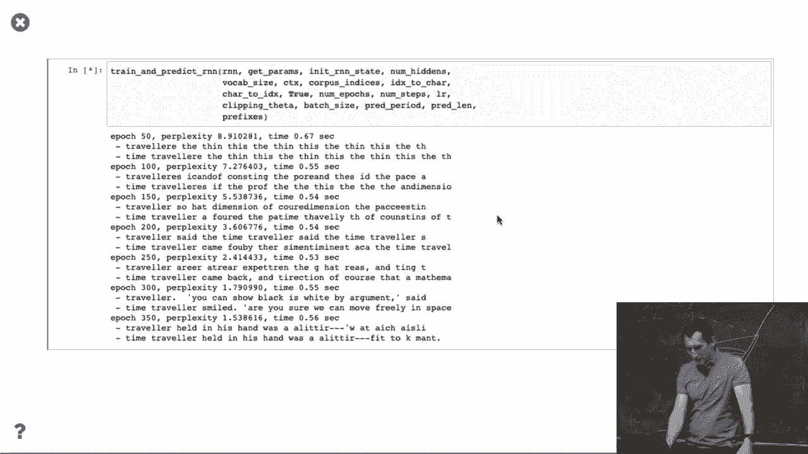

 Here at 358 it has a perplexity of 1。25。 Does somebody have an idea why sequential sampling works better？

 Okay。 Let's just draw the picture for a moment。 So in sequential sampling， or random sampling。 what I do is， see if this is my sequence。 No， actually I've got a couple of sequences because I have a。 mini batch。 Maybe it's a mini batch of size three。 All right。 So in sequential sampling。 I chop it up into， you know， mini batches of the size。 So I have basically， thanks。 So I have。

 you know， three of those here。 Actually， let me break it down a little bit more。 So I have six of them so we don't confuse mini batch size and， number of segments。 And so if I'm。 let's say here and I make some prediction and I， get some state here， some hidden state here。 then here these， hidden states are the same at the transition。

 Whereas if I were to do random sampling， I would pick another， mini， you know。 another segment that's maybe here。 And as a result， the states， well， wouldn't be the same。 As a matter of fact， I pretty much would initialize it as zero or， something else by default。 That's why random sampling doesn't work so well， we see， that forgets all the context of the state。

 Okay。 And this is our simple RNN。

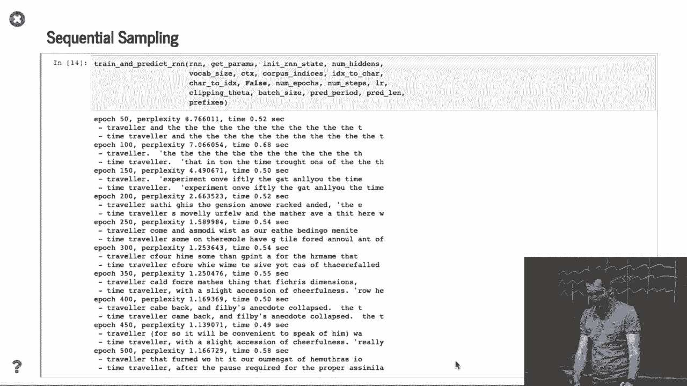

 Okay。 Any questions so far？ Yeah， and you can see it's not as nice。 It gets down to a place of 1。37。

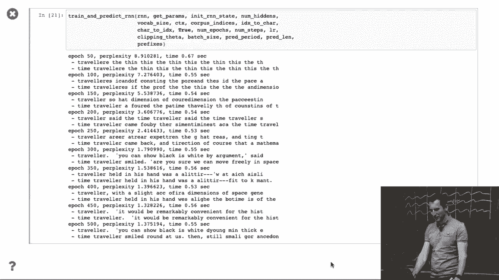

 And here we are down at 1。17。 If you were to train it a little bit longer， it would get， well。 that's pretty much great stalls。 Okay。 Any questions？ Yes？ >> So percussive is lowest on edge 1。6。 >> Yeah。 >> Yeah， so why did the perplexity go back up again？ Did we see this thing before？

 Where if you keep on training and at some point things get worse。 Okay。 so there could be two things that caused this， right？ Remember， this is training set perplexity。 right？ If it was tested perplexity， I would say that's overfitting。 As a matter of fact。 part of the homework is going to be to deal with overfitting。 So why would the perplexity。

 even during training， go back up again？ After all， we're trying to minimize the objective function。 right？ Why does it get worse？ Any ideas？ Hey， guys， next time I'll bring some coffee along， right？

 Okay， so any ideas why the training error might increase？ Well， remember the learning rate thing。 right， where I said， well， if you pick a very aggressive learning rate， it might diverge， right？

 That's exactly what's happening here。 So probably at the next step to learn， you know。 the perplexity will go down again， and it might oscillate a little bit。 But that's just that my learning rate was probably chosen a little bit enthusiastically。 Yes？

 So why did you provide a learning rate to the refactor in the T12s training framework network？

 So what I could do is I could have a learning rate scheduler。 Yes， and as a matter of fact。 for any production quality implementation， you would have a learning rate scheduler。 So we'll talk a little bit about that in the context of object recognition。 where he probably talked a bit about cosine schedules and other things。

 We'll talk more about those things when we get to the optimization in more detail。 So that's made me defer a lot of the optimization math until later。 because right now you can just use it as a hammer。 And we'll unpack what exactly is inside that tool。 We'll be later on。 [BLANK_AUDIO]。

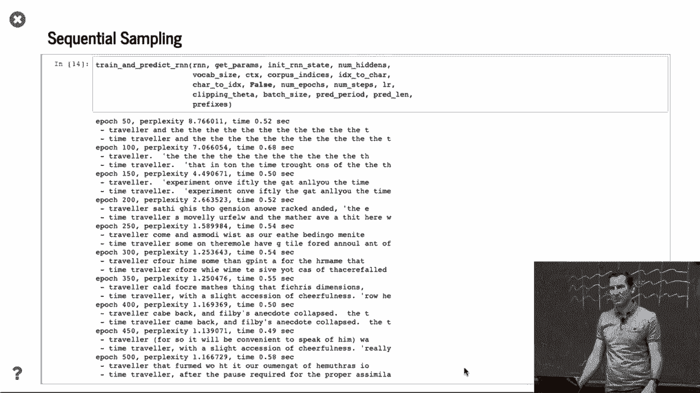