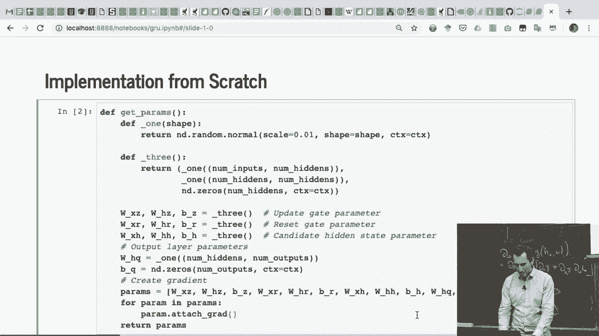
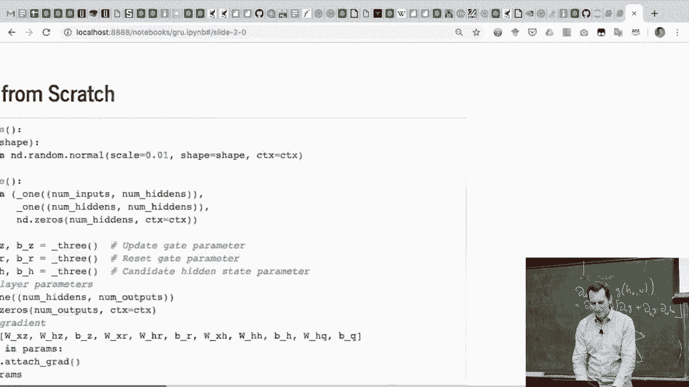
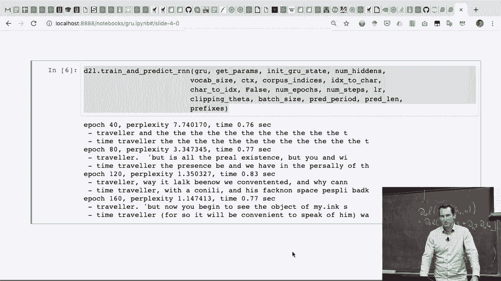
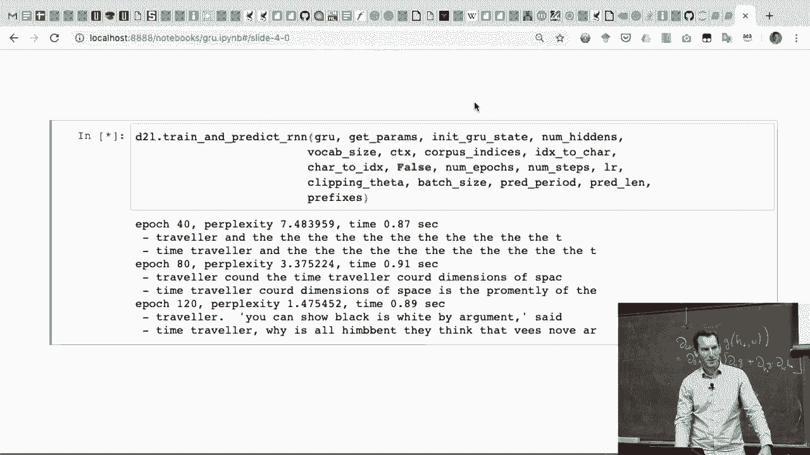
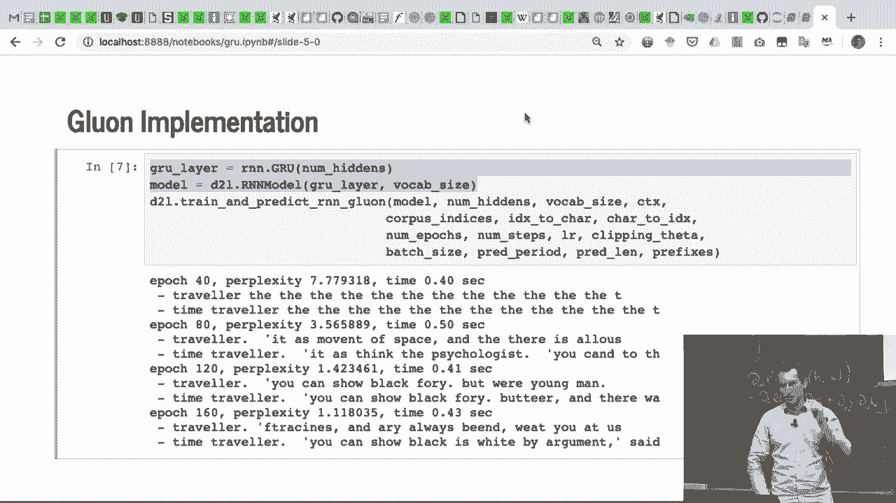

# P104：104. L19_7 Gated Recurrent Unit in Python - Python小能 - BV1CB4y1U7P6

 Okay。 So this is the famous GRU of， well， Joel， but annoying others。 Well。

 we start off by doing the thing that we've always done before already。 We go and well。

 just load the data。 Okay。 Good。 So that's easy。 You've seen those lines of code so many times。

 I probably don't need to discuss it in a lot of details。

 The only thing is number of hidden units here we set it to 256。 All right。

 This is basically exactly the same thing as what we had last time。

 And now the next thing is we need to implement a way how to compute the parameters。

 So the first thing we have to help the functions。 So this is like before except that before we only had a Gaussian initialization of our。

 weight matrix。 Now we have one for the inputs， one for the hiddens and。

 well then zero initialization for the bias。

 And we basically need that for three different parameter types。 Right。

 So we need that for the update and the reset gate。 And also for the candidate hidden state。 Right。

 These are exactly the three components that we discussed before。 And so what I do is I， and then。

 okay， we also have the output。 Sure。 And also have some weight matrix and bias， okay， fine。

 So I just initialize those and here's my parameter vector。

 So this is all that I need for the parameters。 Then what I do is I just go over all the parameters and。

 make them all learnable。 In other words， I attach the gradient to all of them。 Okay。

 Any questions so far？ Good。 So this is like totally straightforward， just a bit tedious。

 The next thing is I go and define the model。 Okay， so I first neutralize the state。

 That's always a good thing。 Basically batch size hidden state in units and context。

 And now the next thing is I actually need to define the GRU。 Okay， it takes as input， inputs。

 the state and the parameters。 So this is exactly like our RNN cell before。 So。

 and this is on purpose that the call signature is the same because， if it's the same。

 then we can hopefully use the same optimizer code for it。

 So first thing we do is we go and unpack all the parameters。 Okay， easy to do in Python， right？

 Then we get the hidden state and well， the reason why we write h comma is because state could actually be a list of state。

 variables and so， well， since we ingest a list， we need to be able to pull out the first element from the list。

 I could have also written state of zero。 That would have extracted it the same way。 Our outputs。

 so far we don't have any yet， right？ So we just initialize them as zero， as empty。

 And then we go and iterate over the inputs。 So this is very much straightforward， namely。

 here's our， well， reset and well， update gate。 So we just compute a sigmoid on X and H being the inputs and。

 then we have biases and the corresponding weight vectors。 Okay？

 Then we need to compute our candidate hidden state。

 And so that's just the tangent of what we have before。 So this is basically。

 so that's what I would have wanted。 And then here's reset times what you will get from the， well。

 if you didn't incorporate the previous state。 So reset gate times what we have here with the matrix times vector。

 What I could have done， strictly speaking， I could have done this before the multiplication with H and。

 then tried to be clever， but actually computationally it makes no difference。 Okay。

 And then in the end， while I get my hidden state， Z times H plus Y minus Z times H tilde。 Actually。

 apologies before it does make a difference without pulling it in or not。

 That would be a different variant of an LSTM or a GRU。 Maybe it works better。

 So get this and then I just produce my output and they attach to that。 Then in the end。

 they return the new hidden state， H and the outputs。

 So this is almost verbatim from what I showed you before in math。 It's pre-human readable。

 Any questions？ Okay， this is like totally vanilla。 Okay， right， so now we train the model。

 And the first thing we need to do is we need to set a few parameters。 So number of epochs， 160。

 number of steps， 35， batch sizes， 32。 Then learning rate and clipping， 100 and 0。01 respectively。

 That highly learning rate simply because we are normalized by sequence length。

 And then we basically make that model predict。 So now what I'll do is I'll show you right away what happens if you run it。

 So it takes a while， takes about three quarters of a second for one epoch。

 So that's maybe a few minutes until it's done。 You basically call exactly the same training predict function that we defined on Tuesday。

 So this is basically like the fit function in Keras。

 Just for sequence models it needs a little bit more parameterization。

 And so you can see perplexity is decreasing and， it starts by producing garbage and then it produces something a little bit less。

 garbage and as it keeps on going it gets better。 So in your homework you're going to do that with Shakespeare。

 Okay， I could have also picked the Linux source code。 Right。

 there's a very nice blog post by Andre Carpati about doing this。

 And then looking at where it's neurons do and it's a gorgeous piece of visualization。

 The guy's really amazingly good at teaching this stuff。 Yeah， if you have time， read his blog post。

 Okay， and that's basically what happens if you train with a GRU。 Okay， any questions so far？

 Actually let me just start this， maybe we'll see something happening。

 Yes？ >> [INAUDIBLE]， >> Okay， if we want to add more depth， what you would do is。

 you would basically take the output of the first sequence。

 make that the input of the second sequence and the third and， the fourth and the fifth and so on。

 And we'll get to that on Tuesday， I guess。 Maybe we'll get to cover it a little bit by the end of this class already。

 >> [INAUDIBLE]， >> You could， yes， typically that would be。

 unless you force the parameters to be tied， which may not be such a great idea。

 So typically you have different weight matrices。 You may even have different dimensionality except that if you want to have residual。

 connections then you need to match dimensionality unless you have a transition layer in between。

 So depending on how we go， maybe we'll see how to engineer those things in a lot of detail。

 But anyway， so you've now seen that while we were talking it did the first 48 bucks。

 So it's not super fast。 So remember it's 0。8， 0。9 seconds。

 maybe something else is running on my laptop right now。

 If I wanted to do this in Glue on， I would have to code up a lot less。 Here's what you code up。

 You basically just define the GRU layer。 So you define an RNN cell using GRUs with number of hidden units。

 And then you feed that directly into the RNN model that we defined before。

 So that was the reason why the RNN model was maybe a little bit more complex than it should have been otherwise。

 Because it took as its argument at its heart that recursive structure and everything else that it just did。

 it was just instrumentation to feed the data and then pull the results out。

 And what you see is that well， this is a little bit faster。

 Right， so it takes 0。4 seconds versus 0。8 or 0。9。

 And that's on my laptop。 If you go to a GPU， that difference is bigger still。 Okay。

 any questions so far？ Yep。 >> So the automation that it takes for something like language models。

 you said， releasing was like， I think vectorizing the words and then possibly invent them。

 >> I guess how you choose how you invent words， because it seems like words aren't things that you need to be fully represented by vectors。

 >> Okay， so the question is， what's a good word embedding and how would you choose it and why？

 So first of all， this is something that's been very hotly researched over the past few years。

 And we'll actually cover embedding strategies， for instance， Word2Vec。

 fast text and then maybe sequence， byte pairing， coding， and so on。 As we progress。

 probably we'll do some of that on Tuesday。 The short version is， yes。

 you're not going to be able to capture a lot of， the uniqueness of the word in the context unless you take the context。

 So for instance， take the word bank， right？ So this could be， well， a river bank。

 Could be the place where I take my money to。 It could be that this is a train banking， right？

 And you could be depositing， you could be sitting on a bank， on a bank， at the bank。

 of the three rivers bank branch。 Okay， so now we have all the four meanings in one sentence。

 And most NLP tools will fail miserably， right？ So that's why， yes。

 you will not be able to do this by just mapping some word into some vector。

 People have tried that and it's tricky。 What works better is if you use the words and。

 then some of their context around them。 So you basically use， so say。

 the words in the company that they keep。 This can help you， for instance。

 because otherwise you might， okay， let's say I give you the following sequence。 You know， Ford。

 Lincoln， okay， how do you continue it？ And you could continue it as， well， maybe Clinton。

 maybe Kennedy， or you could continue it with Toyota and Honda， right？ Well， because， well。

 it's the first two apples， presidents and cars， right？ Well。

 maybe for good reason because they wanted to have the， well， at least in the case of Lincoln。

 they wanted to have the good name。 The case of Ford， well。

 that just so happened to be that Ford is not such an uncommon name。

 But he also would have the same thing with Cougar and Jaguar and a few others。

 So animal names are also popular。 So that is something you can disambiguate very nicely from context。

 but， not so easily just if I give you one word at a time。

 Quite popular pitfall if you learn a foreign language and。

 you need that word translated and you open the dictionary and。

 there are like five possible words in the other language。 And then you go like， my God。

 which one should you pick and， almost certainly gonna pick the wrong one。

 Because you'll pick something that has different， different corresponding word in the other language。

 So that's it。 This is GRUs will， okay。

 >> [INAUDIBLE]， >> Yes， so that's the， that's something that we will do a little bit later today。

 Some slides say in bi-directional STMs for instance。 Okay， yes？ >> [INAUDIBLE]， >> So yes。

 you can learn this matrix。 As a matter of fact， that's what is being done。

 So the embedding matrix is being learned。 Usually in conjunction with any convolutions or other sequence models。

 maybe an LSTM or maybe a transformer。 You almost by default would do joint training of larger systems as。

 large as you can afford it。 Often you pre-train on very large corpora。

 That's what gets us to GPT and part and related models。

 We'll go into this in a lot more depth as we go along。 These are very， very。

 very good questions that you guys are asking。 It's very good。 We'll get to them one at a time。

 Okay。 [BLANK_AUDIO]。