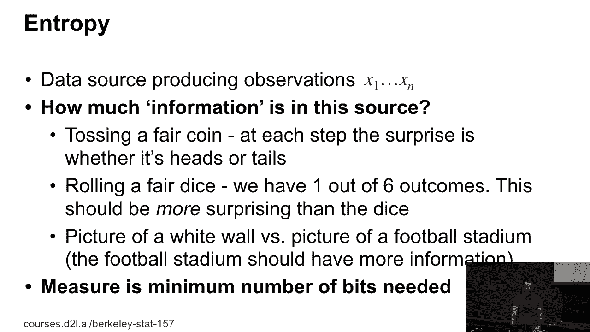
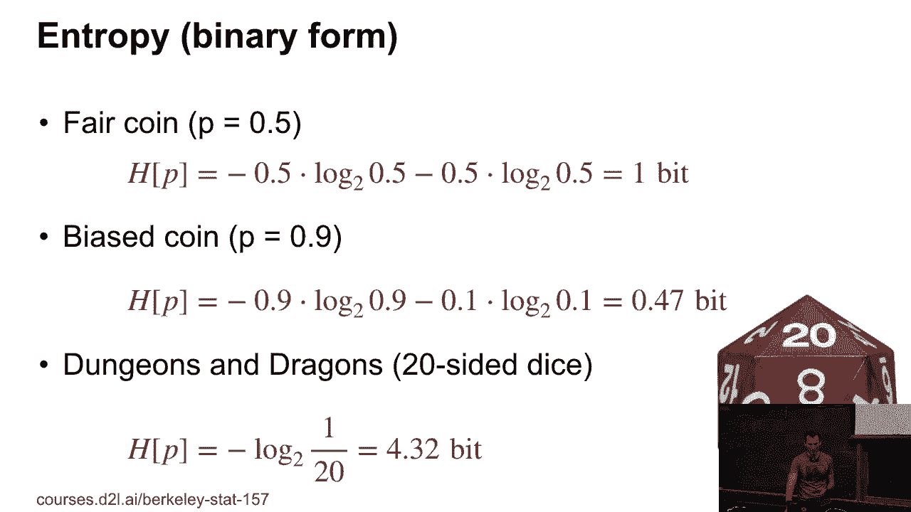
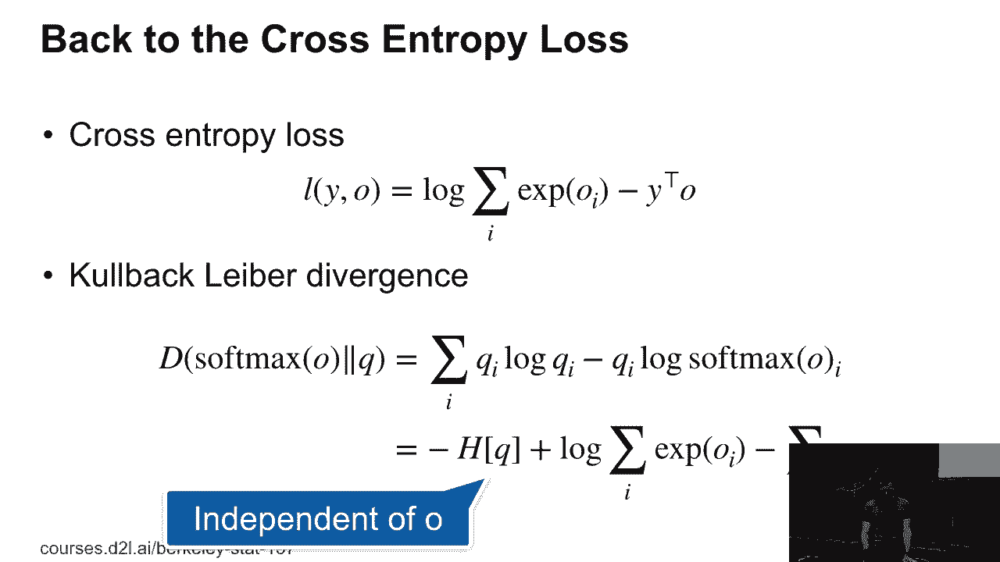

# 【AI 】伯克利深度学习Deep Learning UC Berkeley STAT-李沐 & Alex - P23：23. L5_7 Information Theory Recap - Python小能 - BV1CB4y1U7P6

 So here's a little bit of a background and recap of the information theory part that we didn't quite get covered on Tuesday。

 And I got a few questions about the craft inequality and why it's needed。

 So let's briefly review this。 So remember the entropy is given by the negative log of， well， pj。

 the expectation of that。 So it's， and this is a measure for the number of bits or the amount of information。

 you know， the number of symbols that I need in order to store and transmit that data。

 Now the Shannon limit coding theorem tells us that the lower bound on the number of bits is the entropy of the distribution divided by log base two。

 So that by log two。 Furthermore， the entropy is concave since p log p is convex。

 And what that means is that the entropy of the mixture of two distributions is always greater and equal than the mixture of the entropy。

 In other words， if I take two data sources and mix them up。

 then the uncertainty can only increase relative to what I would have gotten if I hadn't mixed it up。

 Which， I guess， is kind of what you would expect。 Okay。

 So then we reviewed the entropy of a couple of simple things like coins and。

 if you play Dungeons and Dragons。

 And then we got to the craft inequality。 So the first thing to just briefly review is a prefix code。

 Well， a prefix code is something where if I read things often at some point I can easily determine。

 okay， that's the end of the code because nothing else could have started with that set of code words。

 So the left hand side， we have something that's decidedly not a prefix code。 On the right hand side。

 it's a prefix code so that's much easier to decode as well。 So A maps into zero。

 B maps into one zero and so on and so on。 So basically prefixes cannot be individual code words。

 Okay。 And then there's the craft inequality。 And so the inequality said that basically if I have an encoding where the length of each string L of X satisfies that the sum over two to the minus L of X is less equal than one。

 then， so first of all， every prefix code satisfies this。 Secondly。

 if I have a length distribution of that type， then I can find a prefix code for it。 Okay。

 And that proof， so here's a slightly more illustrated version of how you would do it。

 For the forward part， you need to look at the probability that you actually do get the collision。

 And in this case， I just created a random string。 It's， you know， one， one， zero， that， that， that。

 that。 And you can see， okay， collides with C。 And you can see that the probability of that string being a collision is one-eighth。

 Doesn't matter how long the overall string is that I'm trying to collide it with because I'm just looking at prefix collisions。

 For a string that starts with zero， while okay， the probability that it'll collide with an arbitrary string is one-half。

 And so， if， since I know that the overall probability of collision is， you know。

 less equal than one， therefore， I get the craft inequality for prefixes。 And then。

 to prove the backwards part， suppose that I have a length set of basically one string of length one。

 one of length two， one of length three， one of length five。 And， okay。

 I just picked the numbers from the left because， well， I'm being lazy。 And you can easily see that。

 that satisfies the craft inequality。 But now if I wanted to actually generate， you know。

 a prefix code based on that， well， what you do is you pick the smallest of those numbers first。

 or if， you know， there might be multiple of them。 Obviously， if I had one-one。

 it wouldn't work because I've just used up all my probabilities。 But， okay， so I pick one。

 so I use the code， let's say zero for it。 And then I use the prefix one for the rest。

 And so now I subtract one from all the other numbers， right？ So my two， three， five turns into one。

 two， four。 And then I go and pick again one， so I use the zero for it， so I get now， you know。

 the code word one， zero。 I use the prefix one for the rest， the remaining set is now one， three。

 because two， four get shifted。 And so at every step， I， you know。

 pull some of my symbols off the list。 And so at some point， I run out of symbols。

 And at no point would the residual probability ever have increased beyond what I would have had before。

 Okay， that's why it works。 Okay， so then the reason off for actually having this craft inequality is to show that if I pick a prefix code based on minus log base two of p of x。

 that first of all I can actually engineer such a code。

 That's basically the reason why I need that craft inequality。

 So I need it for the constructive proof。 So first of all， picking links， you know。

 the next largest integer to minus log base two of p of x is a sensible idea because if I sum over two to the minus。

 seal of minus log base two of p of x， right？ That's of course less equal than skipping， you know。

 the seal operator， right？ Because then the number gets larger。 Well。

 the number gets smaller and that overall it gets larger。 Okay。

 so I have two to the log base two of p of x， which is nothing else than p of x， which is one。

 So therefore， I know that the craft inequality holds， so therefore。

 by the construction that we saw before， we actually engineered ourselves a code。

 Now that's optimal within one bit because at most I waste one bit between log base two of p of x and the next largest integer。

 And I can turn this into something that wastes only one over k bit by going to k two。

 The optimality proof goes through the k-led divergence and it's omitted here but we'll just do it on the very next slide pretty much。

 Because we need to have the k-led divergence anyway。

 Okay， so the cool back-lively divergence is a way of measuring the distance between two distributions。

 And sometimes people think of this cool back-lively divergence as something very， very magical and。

 you know， very hard to understand what's really going on。 And if you think about it。

 it's actually some very， very tangible quantity。 So let's。

 as for the moment we pretend that we know that the optimal code uses log p。

 when it uses entropy minibits， right？ Or， that's actually， but， you know， entropy of a log two。

 right？ So then I could ask， you know， if I pick a code based on the wrong distribution。

 how many bits would I use in expectation then， right？

 And I can therefore measure the distance between the true distribution and the wrong distribution by just taking the difference between optimal bits and the bits with the wrong code。

 Right， so intuitively that feels like the right thing to do。 Now。

 the wrong number of bits would be if I were to use minus log q of x， you know， it， you know。

 symbols to store some x。 Whereas， you know， the correct thing would be minus log p of x。

 So I just take the expectation of that， so d p of x of minus log q of x minus minus log p of x。

 which is just a really complicated right way of saying log p of a q。 And if you。

 if you've done major theory， you will be horrified by me being so cavalier here。

 You would actually want to have the rather nicotin derivative， so you would have something like dp。

 dq， but I'm not going to worry about those niceties here。 And after all， this is an undergrad class。

 and this is about probably about as theoretical as we want to be here anyway。 So what we want to do。

 though， is we want to prove that this KL divergence。

 because Koolback Live List kind of hard to pronounce， so everybody says KL divergence。

 that is actually well behaved。 The thing to check is that the divergence between p and p vanishes。

 Well， that's easy， because it's just log p over p， which is log of 1， which is 0。

 So in expectation it's 0。 Quick question。 Why am I calling it the divergence and not the distance？

 Yes？ It's not symmetric。 Yes， it's not symmetric。 So can you tell me why it's not symmetric？

 I think if you're talking about p and keeping the expression position， it gives you a different--。

 Exactly。 Yeah。 Exactly。 So because I have the integral with regard to p。 So if you think about it。

 one-- so the divergence between p and q is the number of extra bits that I have to pay to encode data drawn from p with a code from q。

 The other way is the number of extra bits that I need to do need to pay a fan code that I draw from q with a code from p。

 And those two things need not necessarily be the same。 Now， the next thing， though。

 is we need to show-- or we want to show that this KL divergence is non-negative。

 Because if I show that it's non-negative and it only vanishes for p equals q， then I'm home。

 This then I know that this is actually a meaningful measure。 And furthermore。

 if this is the difference between the inefficient and the efficient bits。

 then I know that while Shannon's coding theorem holds， right。

 that's the channel limit because I just proved that any other code will be less efficient than the one that I would have picked this way。

 So what I'm basically doing is-- so this is the last line on this slide。

 So I have dp of x log of q over p。 Now， the logarithm is a concave function。 So therefore。

 if I pull it out--， Right。 --let me get some chalk。 And the negative logarithm， mind you， is。

 of course， a convex function。 So if I have a convex function， then I have the expectation between。

 let's say， those two points。 And we know that for a convex function。

 the line between two points is above the epigraph of that function。 In other words。

 the average of the values is greater than the value of the average。 OK。

 This is also called the instance inequality。 And that's exactly the inequality that I'm invoking here in order to pull the logout。

 And so I now get greater equal to minus log of the integral dp of x over-- of q of x over p。

 So the p cancel out， and then I have the log of 1， right， which is 0。

 And that's just how I prove this。 So it's very straightforward convex t。 Even though， you know。

 the implications are quite deep， the math is actually fairly elementary。 OK。

 So now we did all this algebra， but what for？

 Let's go back to the cross entropy loss。 So remember， the cross entropy loss was between， let's say。

 y and o， where the y's now might actually be a probability distribution。 Is the log of， you know。

 sum over e to the oi minus y transpose o。 OK。 Now。

 if I compute the KL divergence between softmax of o， which is basically what I'm estimating， and。

 well， q， which is the truth， then I get， you know。

 just sum over qi log qi minus qi log softmax of oi。 Now， I plug in the definition of the softmax。

 which is nothing else than， you know， log sum over i e to the oi。 And so now。

 by just straightforward algebra， I get exactly the cross entropy loss out of it。

 except that I also have this entropy term of q sitting around with me。

 But since that doesn't actually depend on o， I can drop it。

 So that's how we get to the cross entropy loss from the KL divergence。

 So when people try to intimidate you by telling you that they're doing maximum entropy methods。

 or they're using information theoretical approaches。

 most of the times they're just adding or removing their constant， in order to intimidate people。

 So don't let them do that to you。

 OK。 And now this just barely scratches the tip of the surface of the iceberg。 Yeah。

 there's a lot more information theory。 This is an awesome book。 I mean， it's old by now。

 So I remember this was an old book when I did my PhD。 And it's still an awesome book even now。

 Cover in Thomas。 If you search for it， you can maybe find some versions also online。

 There's an information theory course that's pretty decent。 So it has some slides on entropy。

 And then there's the book by the late David Mackay。 It's a very nice book。

 Probably a little bit more detailed than what you need。

 but if you want to dive into information theory， and how this all relates to machine learning。

 this is a good place。 And then there are a whole lot of papers by Martin Wainwright and Mike Jordan。

 They're both faculty in the CST department。 And they've published extensively on exponential families and other things。

 It's very nice to work there。 OK。 And that concludes our discussion of information theory。

 So I hope I didn't scare you too much of that so far。

