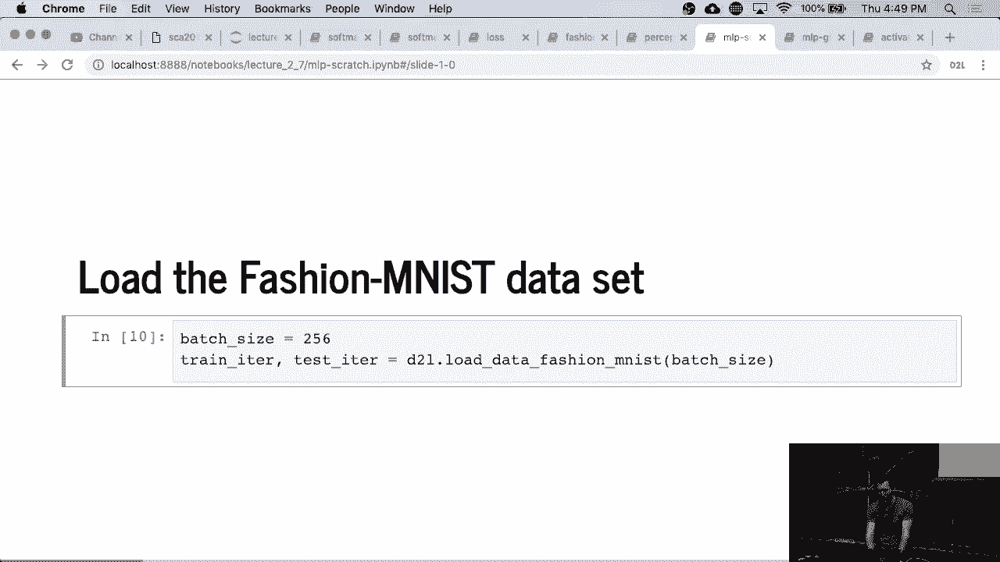
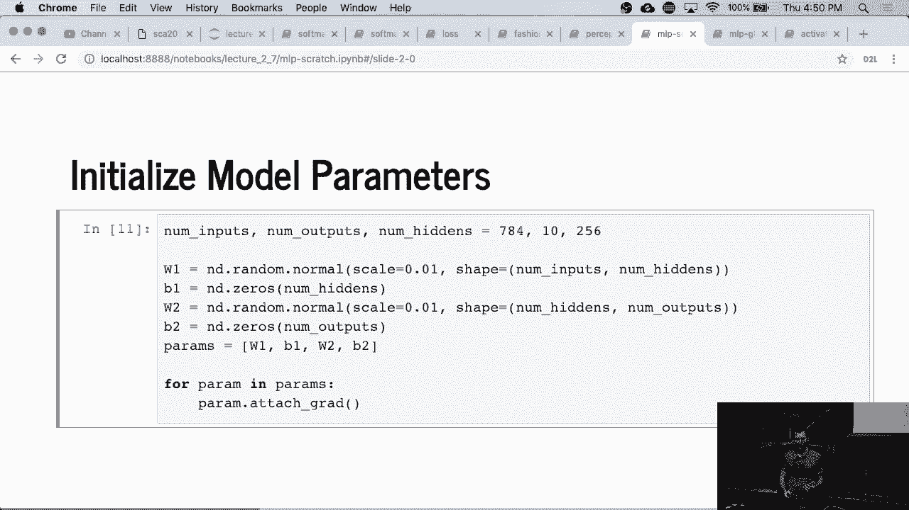
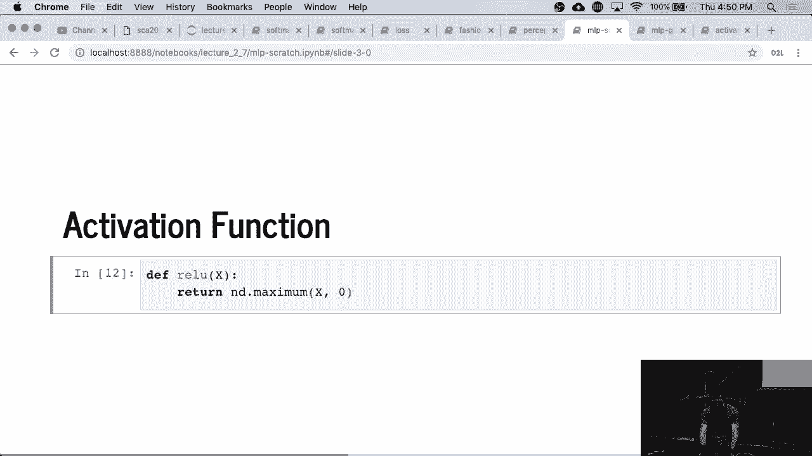
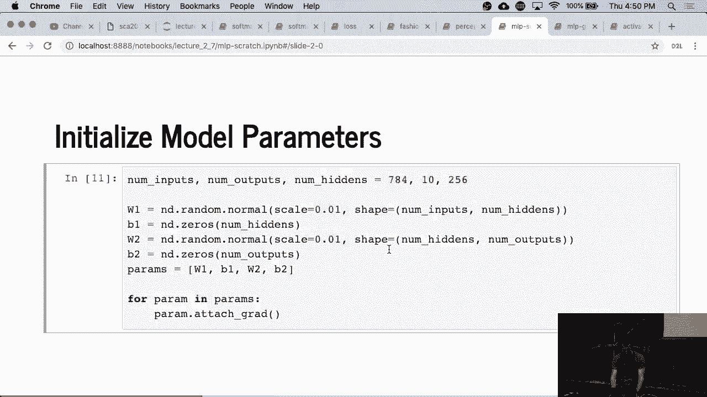
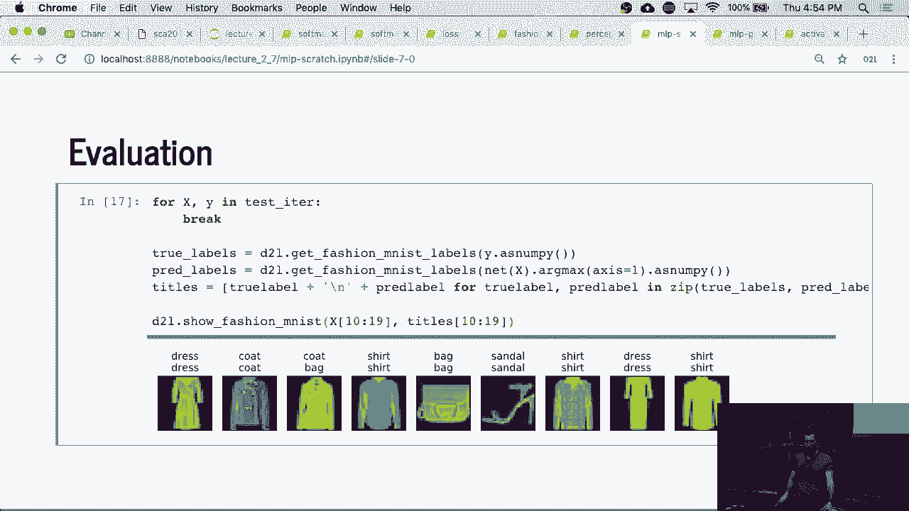
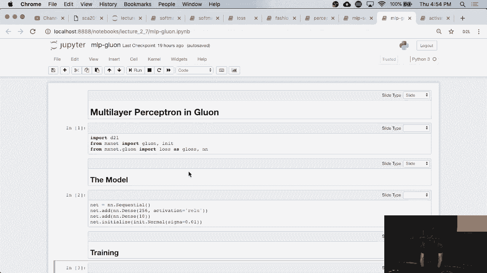
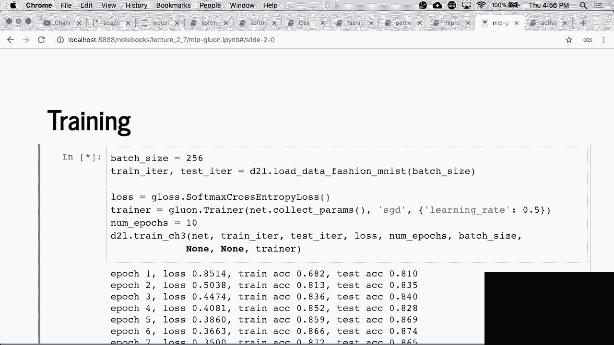
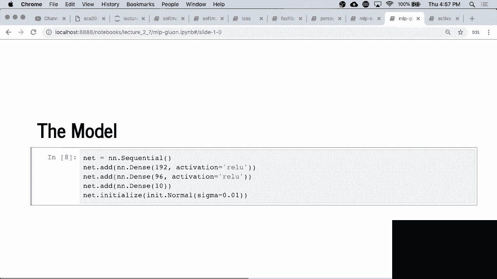
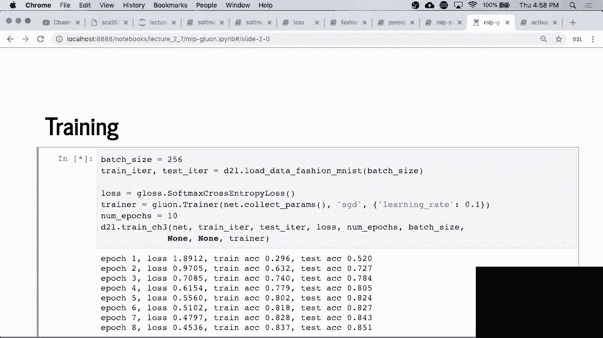

# P28：28. L6_3 Multilayer Perceptron in Python - Python小能 - BV1CB4y1U7P6

 So let's implement an MLP from scratch。 So I'm going to just do the usual thing。 I， you know。

 import nd array。

 And I load the fresh nomeness dataset。 So this is exactly the same code as before。

 So this should be utterly boring。 Now the more interesting thing is， i go and initialize the。

 Model parameter。 So this is for a deep network with one hidden layer。 And in that hidden layer。

 i'm assuming that i have 256， Hidden units。 So the first weight matrix is going to be inputs times。

 Hidden units。 The second one is Hidden units times outputs， right？

 Because i need to change the dimensionality appropriately。

 So my biases are correspondingly number of hidden units in， Number of outputs。 So in other words。

 my parameter vector is just one array， Containing w1， w2， and b2。

 So now all i'm doing is iterate through all those parameters and。

 Attach the gradients to each of them。 Because we want to learn them。

 So then i need to invent my value。 So this just does nothing else than just returns the max。

 Between zero and x。 And by virtue of broadcast， it will always return an object of。

 The same structure as before。 Okay。 Just do that。

 Did i -- yeah， i did initialize this。

 Okay， good。 My model is very simple。 I first flatten out x because initially that's a 28 by 28。

 Pixel's image。 So i need to turn this into a single vector。 So i can reshape this。

 It's actually also called flattened but reshaped this， You know， just the more general thing。

 And so then h is just a value。 That's the hidden units。

 So i'm going to use a value of inner product between x and， W plus bias。

 And then i return d inner product between h and w2 and the bias。

 So it's exactly the same thing as what we had before for， you， Know。

 our simple softmax linear regression model。 Except that now we have a hidden unit。 Oops。

 And i -- yeah， around this。 The only thing where i'm going to cheat is i'm going to use the。

 built-in softmax loss and that has to do with the micro， Stability。

 Otherwise the code would just be a little bit tedious。 Okay。

 But that's exactly the same losses before。 And the training routine。

 the training code is actually the， Same code as what we saw before。

 So it's just that i'm now providing it with a different， Network。 Same loss function actually。

 Ten iterations。 And that's about it。 And different set of parameters。

 So the only thing that's changed between using glue on or doing。

 Things from scratch is really just in one case。 I implemented the network architecture from scratch in the。

 Other case。 I'm just using something that's very pretty fine。 Okay。

 And if you remember the loss that we have before， now it's， A little bit better， right？

 So we are at 。88。 Yes。

 That's about where we got to。 So that's an improvement due to a better architecture。

 Now if i played around with the architecture a bit more and， A number of iterations。

 i could probably get something better。

 And then if i look at things， so this is exactly what you。

 Have before， well， it's really hard to tell from this picture。

 Whether it actually works better or not because we got maybe， You know。

 a 3-4% improvement and we're only showing ten， Observations but， yeah， okay。

 It's making slightly different mistakes now。 So let's say， i want to show this。

 Okay。 Different things and， yeah， it will mistake kelts for bags now but， That's maybe progress。

 Okay。 Any questions about how to build an mlp from scratch here？ Okay。

 Cool。 Then let's move on to the --， [BLANK_AUDIO]。

 [BLANK_AUDIO]， [BLANK_AUDIO]， [BLANK_AUDIO]， [BLANK_AUDIO]， [BLANK_AUDIO]， [BLANK_AUDIO]。

 [BLANK_AUDIO]， [BLANK_AUDIO]， [BLANK_AUDIO]， [BLANK_AUDIO]， [BLANK_AUDIO]， [BLANK_AUDIO]。

 [BLANK_AUDIO]， [BLANK_AUDIO]。

 [BLANK_AUDIO]， [BLANK_AUDIO]。

 [BLANK_AUDIO]， [BLANK_AUDIO]， [BLANK_AUDIO]， [BLANK_AUDIO]。

 [BLANK_AUDIO]， [BLANK_AUDIO]， [BLANK_AUDIO]。

 [BLANK_AUDIO]， [BLANK_AUDIO]， [BLANK_AUDIO]， [BLANK_AUDIO]， [BLANK_AUDIO]。

