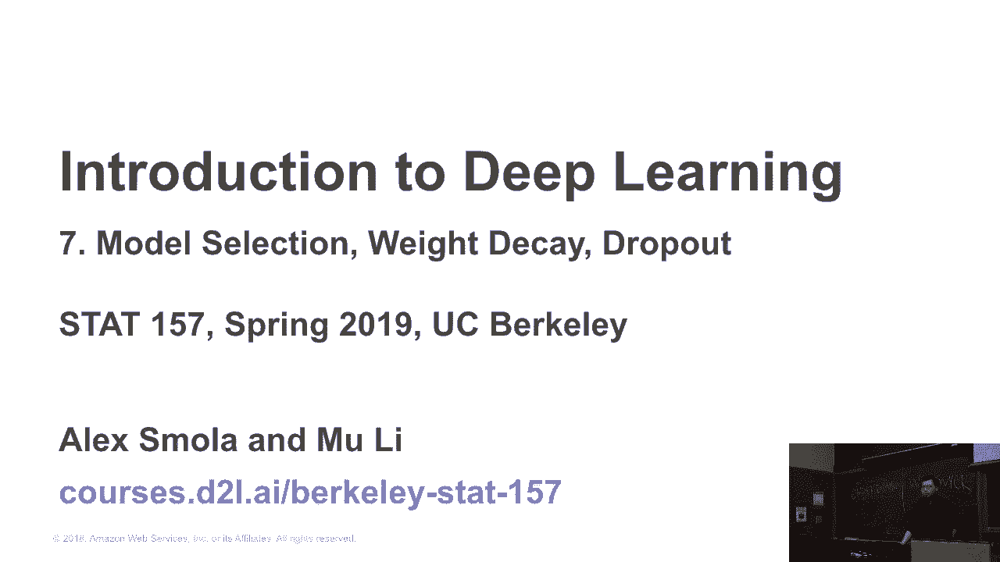
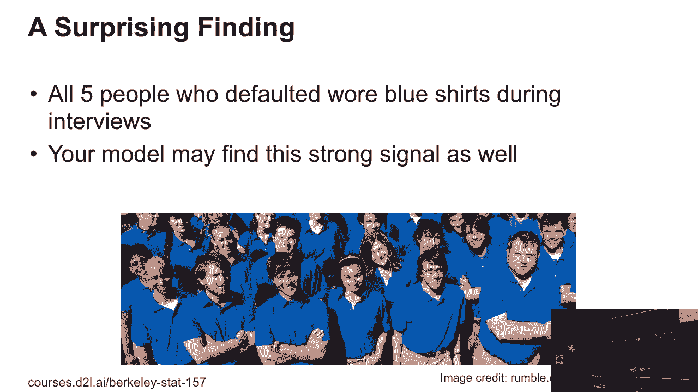
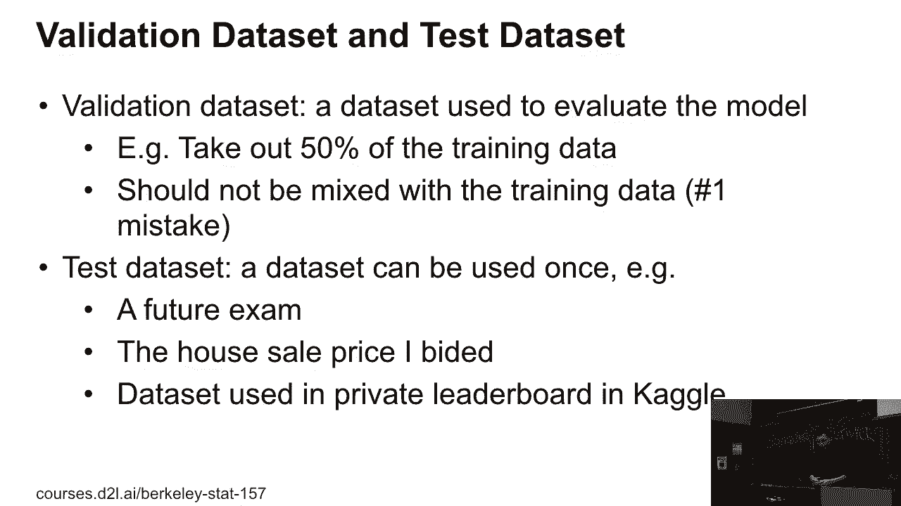
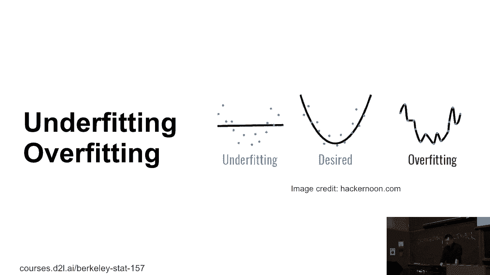
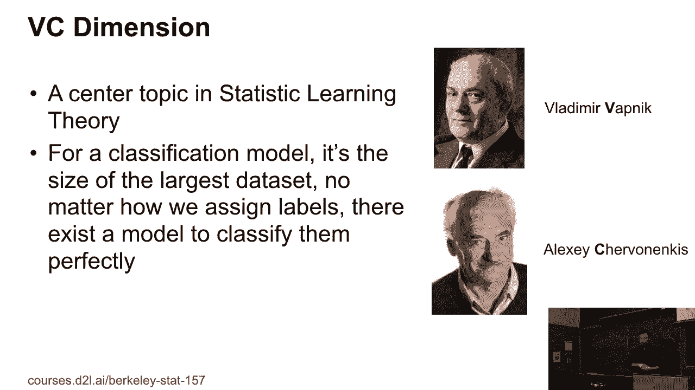

# P29：29. L7_1 Model Evaluation, Overfitting and Underfitting - Python小能 - BV1CB4y1U7P6

 Today we're going to talk about model selection and two recognizations。

 So let's start with the homework four。 Actually， this will be very interesting homework。

 You're going to do a Kaggle competition to predict the house sale price。

 So we had talked about the house sale price for several times。 Now。

 your job here is to submit a homework to the Kaggle。 So we're going to provide you a baseline model。

 So we have all the how to download dataset， how to build a baseline model， how to submit。

 we already have it。 But this one only gives a very basic model。 You probably can rank at 1。

000 at the Kaggle。 Now your job is to try your best。 Half a year ago we started this same thing。

 And ten students on the class actually ranked on the top ten in Kaggle。

 But now it's a little bit harder because half a year passed。 There's not maybe 2。

000 people have been participated on Kaggle。 So you may be unlikely you can get in the top three in a week。

 but you can try your best。 So we're going to recommend you to work with the team。

 Especially your project team。 So you can work with your team and get familiar with your teammates。

 So also we're going to give 500 ADOP credits to the top three person or team。

 who actually ranked on the top three amount of the submissions you have。

 So this $500 is going to benefit you for your projects you can use to try and even fancy models。

 So that's homework four。 In Thursday we're going to go through the notebooks we're going to use。

 But we recommend you to start earlier because Kaggle have never had future accounts。

 You can only start maybe five times per day。 And you have a lot of idea to try。

 Then it take maybe if you're going to spend maybe five hours on that。

 I recommend you to spend one hour per day instead of the five hour at the end of the day。 Okay。

 so that's homework four。

 So we're going to talk about model evaluations today。 So let's consider another example。

 We don't have a cover competition for this one but this motivating example。

 That is a nander that hires you to investigate who will repay their knowns。

 So you are given 100 applicants。 You get the whole information for each applicant。

 You get the whole profiles， bank statement and interview videos。 And then a month of 100 applicants。

 five guys defaulted within three years。 Your job is to predict in the future who cannot default on the loan。

 Then you look into the data and you surprise and you find all these five guys who defaulted。

 were a bluster during their interviews。 That's a pretty strong signal because here nobody actually blurshed。

 So which means that average people wear brushes pretty low maybe but here we have 100%。

 It maybe means something。 It means like particularly people prefer to wear brushes and they may be preferred default。

 But you never know。 You may be a coincidence， maybe some meaningful things。

 Given you can find this information， you can build model。

 The model may be able to find this strong signal as well。

 Then your model may be likely to put this signal as the strongest signal you have。

 While the brochures during the interview， then your model immediately tell you， okay， this。

 guy cannot default。 So what's wrong here？ Who knows what's wrong here？ Okay。 Not well。

 could be another question， another answer。 Okay， the one problem here is that we only have five guys who defaulted。

 If we can have 10，000 applicants and 100 people defaulted， maybe the chance that everyone wear。

 blurshers is like his lower。 Okay， so hope this motivation example cannot tell you that a lot of things matters for you。

 to build good models on your application。

 So let's first talk about model evaluation。

 So far， we only talk about how to compute the arrow on the training dataset。

 The training dataset is a data you can use to train your model to get the model parameters。

 In practice， we only care about the generalization arrow， which is the model arrow on the new。

 coming data you never see before。 So let's take an example here。

 Assume we're going to practice for future exam。 For example， we don't have final exam。

 but you can maintain exam to based on the path， exams on the previous years。

 Do you wear on the path exams we call the training arrow？

 It doesn't guarantee that you get a good score on the future exam。 For example。

 there's a student who get zero arrows on the path exams by memorizing all， these answers。

 Another good student is trying to understand the solutions for the reasons behind the solutions。

 He maybe didn't get the zero arrows， but this guy maybe did a better job on the future exams。

 So we can extend this one to the homeworks。 For example。

 we already released the two homework solutions。 Then you can prepare the homework for homework three or homework four we talked about today。

 by all the homework two solutions。 What could be wrong here？ Who knows？

 The question like why we prepare for the first two homework， sorry， the question like we。

 prepare the homework three or four based on the homework for one or two。 What could be problem here？

 The problem here is because homework one and two cover different topic。

 If you do a good job on homework one and three and two， you maybe understand the topic and。

 for homework one is too well， but not necessary to understand homework three and four。

 But exam is different here。 The exam we covered the whole class。

 This year and the next year we assume this area doesn't change too much。

 The exam we covered is similar topic。 That's why we can prepare future exams based on past exams but it's hard to prepare homework。

 based on past the homework。

 We care about the generalization error。 We need to prepare how to evaluate。

 Usually one thing we're going to do is we have validation data set。

 That is a data set used to evaluate this model which is not part of the training data。

 This data set we're not used to update your model。

 For example here we can take half of the training data as the validation data set and then train。

 the model on the rest half of the data。 The number one common mistake machine practice made is mix up the training data and the validation。

 data set。 Let me give a real example here。 A few years ago we have a team trying to train how to classify images。

 The first data set they tried is to classify image net。

 Image net have a million images about thousands of objects。 They train the model on image net。

 Then they want to evaluate how this model works。 What this team did is they asked a different guy trying to give you all the same data。

 I give you all the labels we have。 Now your job is to take this label as the cat， dog。

 search at Google， grab the images from， Google and use this new data set to validate this model。

 What could be wrong here？ Anybody have ideas？ We train on image net and search on Google and grab images to validate the model you have。

 The problem is like image net， on the original image net they search the queries or Google。

 and get a bunch of images and label it。 If another guy trying to search a thin thing。

 say the queries at Google， you may get the same， images。 It's maybe part of the training already。

 Diting cancel cleanse。 We succeed because we compare to Google。

 compare to other sources on our own validation data， set。 Our services give the highest score。

 If we really try to actually not so good。 The different could be very tiny so you need to be very careful about training and validation。

 data set。 Especially if you do research， you find， oh， I get the much higher accuracy compared to。

 the previous works， then you can think about that 95% of good results is due to bugs。

 You need to firstly care about what data set you are using for validation。

 You didn't mix up the training and validation data set。

 Validation data set is going to evaluate the model。

 You can pick up the models based on validation data set。 You can try different learning rate。

 you can try a different model architecture and then。

 based on the validation errors you pick up the model。

 Then there's another data set we call the test data set。

 So this data set is similar to validation data set。 You can evaluate on your model accuracy。

 But you can only use the one。 For example， you only get a score for an exam by the first time you take it。

 Next time you take it， you maybe you didn't count。 If you're going to build a house。

 the final house sale price is going to be evaluated your， strategy。

 You don't have the second chance。 If you have been to have a competition before。

 you know that there's a public leaderboard。 Every time some of the results。

 you can't get the immediate feedback for the score you have。

 But there's a private leaderboard which is close to the end of the competition。

 So people are going to evaluate their performance based on private leaderboards。

 So it can be only used once after competition is done。

 So test data set is a closer to the generalization error。 Because you only try the ones。

 For validation data set， usually the accuracy will be higher because you choose a model based。

 on the validation data set。 You pick up models， pre-fruze this data。 But in practice。

 we don't actually use test data for only user ones。 So in practice， we talk about， okay。

 this model has test accuracy for what usually means， validation data set。 So during this class。

 we're going to use test data。 Test accuracy actually means validation data。

 So a strictly speaking test data set can be the score only for you to go to competition or。

 final exam。 That's the test error。

 Okay， so one usual problem here is that we don't have sufficient data。

 Because the validation data set is the leader labels。 In practical。

 we just put a part of the training data for validation purpose。

 Then if we use half the data for validation， we can use half data to train the model。

 If the data is small， then we can talk about why it is a problem。

 You don't have sufficient data to train a model。 A common practice you can use is K for cross validation。

 That is the key thing you're going to use for your homework。 So the work that's following。

 Given that training data， examples have labels。 We partition into K part。 And then we repeat again。

 for every time， from one to K， every time we pick up the case part， as the validation data set。

 And the rest of the K minus one part as the training data set。

 We train the model on the training data set and get the validation accuracy on the validation data。

 We repeat by K times。 And we put average validation error on this K times。

 So this one is a key for cross validation accuracy or cross validation error。

 So if you choose a logic K， which means the data we're going to use for training is pretty large。

 For example， we choose 100 K equals to 100， so we use 99% of data for training。

 That's good for your model。 But the problem here is that you need to repeat the experiments by 100 times。

 That could be very expensive。 In practice， we should choose K equal to 5 or 10。

 If the model is simple， we can choose a larger， maybe 20， 50。 But if the data。

 if the algorithm is pretty complex， we can use a little bit of small K here。 Okay。

 any questions here？ Good。 So this one， we will have implementation for K-fort validation on the homework 4。

 We're going to talk about it on Thursday。 We know how to evaluate how models we're going to talk about two abnormal cases for training。

 It's once called overfitting， once called underfitting。

 There's a two common problem with model training。

 In general speaking， there are two things matters。 One is the data complexity。

 one is the model capacity。 So we can now dive into detail later。

 but let's give you an overview idea of how to do this。 So how to do this， how to do this。

 how to do this， how to do this， how to do this。 So when data is simple， and you have a small model。

 because the model is going to feed the data， if the model capacity is lower and data is simple。

 everything works well。 Similar thing for if data is complex。

 we can use a complex model to feed this data。 The problem here is that if the data is complex。

 the model is simple， the data cannot， the model cannot learn the data too much， it's underfitting。

 If you have simple data， but it's complex models， then the model can remember all the data points。

 it's called overfitting。

 So formally speaking， the model capacity is the ability of the model to feed your data set。

 to feed your functions， to feed the distributions。 So if you have no capacity models。

 it's hard to feed this training data set。 For example， we have a bunch of dog here。

 but we choose a linear model， this is a single line。

 it's hard to let's line to feed this curved dog。 High capacity models can memorize the whole training data set。

 For example， if you use a high order curve to feed this dog， we can get zero arrows here。

 but it's overfitting。 You know that while this curve is too large， it's too complex。

 So this is a famous figure for how model capacity affects all this training arrow， or training loss。

 or generalization loss。 So the x axis is the model capacity， or the model complexity。

 The y is a loss。 You start with the left， which is you have low capacity models。

 Both training loss or training arrow， and the generalization loss， generalization arrow。

 could be very high。 So we call underfitting。 When we increase the model complexities。

 we see that training loss decreases with the model capacities。 So that's given the same data set。

 we use complex models， then it's easy to feed the training data set。 But the generalization loss。

 this is the thing we are interested， may decrease at the beginning。

 but then may increase at the end。 The gap between generalization loss and the training loss is called overfitting。

 So when the model is more complex， the gap is larger。 So it's more， I intend to be overfitting。

 The optimal point is that you pick up the model， which has the lowest generalization loss。

 So usually it's on the middle。 You cannot be the model too simple。

 You cannot be the model too complex。 Any questions so far？ Question？ [ Inaudible ]。

 The difference between training and evaluation， I mean。

 training is that the training error is the loss you compute on the training data set。

 The validation error is the error computed on the validation data set。

 which is not used by in the training group。 Any other questions？ Question？ [ Inaudible ]。

 So why overfitting？ For example， in the first example， you see the who cannot default， well。

 blue shirt。 So you get 100% of you find out default people， but that's signal is too strong。

 Which means overfitting， if you have models have very complex。

 you cannot try to fit the whole training data。 You fit the noises。

 So because the data have a lot of noise， you fit all this noise。 Then fitting the noise。

 which means you have a different noise， you cannot fit all this different noise。

 Then you can the generalization error actually increases。 Any other questions？ Question？

 [ Inaudible ]， That good question cannot cover in a few minutes。 Any other questions？ Okay。

 so then the key thing here， how to estimate model capacity？ It's pretty hard problem。

 We have a whole field to do that thing。 So firstly。

 it's pretty hard to compare capacities between different algorithms。

 You may have about three algorithms， decision trees， random forests。

 or you may be using edge booster before。 Then compare tree， compressive with new analysis。

 this is focused on this class， it's pretty hard。 Because their assumptions differently is hard to compare different algorithms。

 So given the algorithm family， for example， all these perceptions。

 we can't compare the complexities。 There's two main factors matter。

 One is how many parameters we have on the model？ We have two examples here。

 The top one is the linear perception or linear regression。 Assume the data have D dimensions。

 the weight have D elements。 With a bias， we have D plus one elements on the parameters。

 The bottom one is the two layer perception。 You have input dimension D， the hindrance size is M。

 and output the number of classes K。 Then in the first layer you have D plus one times M elements on the parameters。

 In the second layer we have M plus one times K elements on the second layer。

 So you know that in the second model you have much more priming than the first one。

 which means the multi-layer perception is you should have high complexities。

 comparing to linear regression。 So the second one is how you are now the value be peak for the models。

 For example during training， I can say that this model is going to pick up the parameters only from the range between minus one and plus one。

 So this model we have low capacities compared to the same model。

 but we can pick up values from any number or any real numbers。

 So we can dive deep into the second one later。 The first one is actually the whole thing for this class。

 We can talk about different new and structured architectures。 Actually different new architectures。

 how to balance the model complexities of convolutional neural networks or LSTMs。

 We can now dive deep into the first category letter。

 So there's a field called a statistical learning theory。

 which is the theoretical area to understand this problem。

 For this topic we actually have a four credit class to cover it。

 We can only dive a little bit onto the static learning theory。 So in this theory。

 one central topic is to estimate the model capacity。 To estimate the model capacity。

 there's a thing called the VC dimension。 It's not a venture capital。

 like a virtual VC from two scientists guys。 So the VC dimension is to estimate the model capacities that has a general form。

 but now we only talk about simplified version。 That is we can talk about classification model。

 For classification model， the VC dimension is the largest dataset we can have。

 So no matter how we assign labels to this dataset。

 we can always find a model to classify this dataset perfectly。

 So this is the largest dataset this model can memorize all this data point。

 Let's look at the concrete example。 So consider 2D perception。 We know that VC dimension 3。

 which means for any three point， no matter how we give labels to this point。

 we can always find a 2D perception， which is a line， to classify the dataset correctly。

 So but it's not four because we show that if it's an axial problem。

 a single line is not good enough。 You have a curve or a multi-layer perception to classify it。

 So which means the VC dimension for 2D perception is 3。 So for 2D perception。

 which you have two dimensional inputs， which means you have two elements on the weight。

 and with the bias， then the number of parameters is actually 3。 So in general。

 if you have perception， we have N parameters， which is the input is minus 1 dimension。

 and with the bias， the VC dimension is M， which means the more features you have。

 the more complex model you are building。 We can extend this one into multi-layer perceptions as well with some assumptions。

 So we assume what the activation functions we have。 But in general。

 you can see that it's M plus log 2 M， it's the number of parameters。 In general。

 the more parameters you put on the model， the higher capacity the model you have。 OK？

 So the VC dimension actually provides you some theory inside why a model works。

 So we can bond the gap between the training error and the generalization error by the VC dimension。

 So it's pretty useful。 But the problem here is that it actually will never talk about VC dimension and deep learning for two reasons。

 The first one， this body to lose is harder to give you any insight why it works or not。 Secondly。

 it's pretty difficult to estimate the VC dimension for deep neural networks。

 It only talks about perceptions， but if you're going to extend to convolutional networks。

 it's pretty hard。 So the same idea is like there are a lot of tools on statistical learning theory。

 but it's pretty hard to apply into deep learning。 So deep learning theory is pretty behind all this model development。

 So that's why the theory guys actually work pretty hard to catch up all this theory stuff。

 So in this class， we probably will not dive into the data analysis theory here。

 The last one， we talked about model capacity。 We also have data complexities。 So it's pretty。

 a lot of factors matters for the data complexities。 For example， in the top one。

 since that data set we used on the notebook， the bottom one is the image net。

 It has minutes for images。 So you can see that image net is more complex compared to the synthetic data set we have。

 So a lot of things matter to the data complexities。 For example， how many examples you have？

 The more example you have， likely you have more complex data set。 So for deep learning。

 the preferred data set usually is between 100，000 to 1 minute。 If it's too low。

 you cannot construct very deep neural。 It's too high， well， then you can do a lot of complex models。

 but the complexity could be very high。 Then for each example。

 you can have about how many elements or how many features we have。 For image。

 you can have one minute elements in the image。 For ads， for a lot of things。

 you can have billions of features。 Also， we care about structure in the data。

 So we have time structures， we have space structures。 For example， consider about a social network。

 It's more complex because we have interaction between people。

 It's more complex compared to you don't have interaction between people。 So for videos。

 for other things you have time series there。 For stocks， you also have time series。

 I have time information there。 So you also make your data set more complicated。 Also。

 we talk about the diversity， which means how many different objects or different concepts in the data set。

 ImageNet have 1，000 objects。 You have another C file and you have 10 objects。

 So imageNet is more complex。 Also， within each category， height example works。 So you see。

 if you take a picture of a dog， every dog looks similar， then the diversity is low。

 If you take a dog and you have a lot of colors， a lot of species， then the complexity is high。

 Any questions so far？ [BLANK_AUDIO]。

