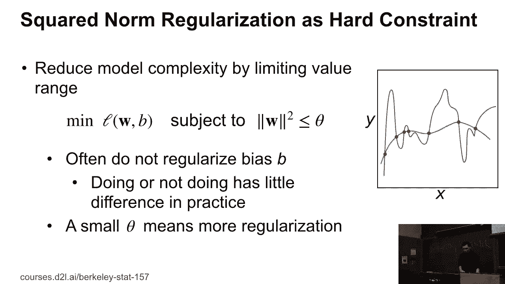
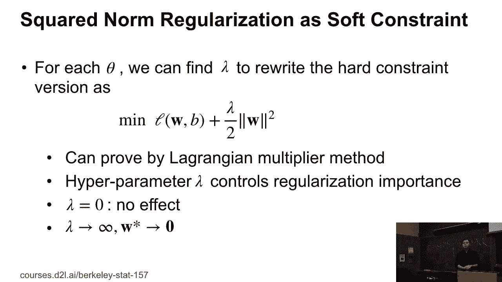
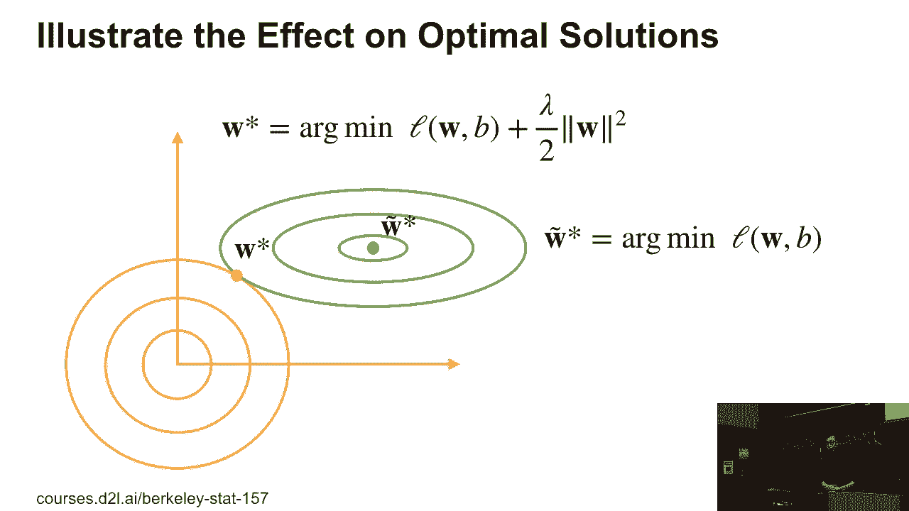

# 【AI 】伯克利深度学习Deep Learning UC Berkeley STAT-李沐 & Alex - P30：30. L7_2 Squared L2 Regularization - Python小能 - BV1CB4y1U7P6

 OK。

 Then in the heart constraint version， it's pretty hard to optimize。

 So we usually use a soft constraint version， which， means for each is theta， we actually。

 can find the number the--。

 according number the-- so that we can rewrite the heart， constraint version as the following。

 So we minimize the loss of a w and b and plus lambda 2， divided by 2 and square root of l2 and w。

 So this turns out to be l2 regularizations or square， l2 regularizations。

 You can prove by Lagrange multiplier， that these two form equivalent to each other。

 So lambda here is hyperparameter。 If we choose to 0， there were no effects on the motor capacity。

 If we choose a larger one， for example。

 if we choose infinity， then we force all the w to be 0。 Any questions so far？

 Then we can visualize how it works。

 The green circles is the loss function， and the optimal point is t or w star。

 So we can solve it by minimizing the loss function， over the training data and weight。

 Then if we plus the regularization term here， is the origin curves。

 So if we close to the original point， the small value， get， if we find a weight。

 then you have a larger value。 So then the optimal position is between the original x。

 and y equal to 0 and also between the optimal， on the original loss。 Because of the l2 long。

 we drive the t or the w star， toward the original point。 So if we have a larger number。

 this force is bigger。 If we have a small number， then we actually define the positions。

 close by to the t or the w star。 Questions so far？

 Good。 So why it's called weight decay？ It's-- machine only is called a t-regularization。

 So for weight decay， because let's compute the gradients。 Complete gradients。

 loss plus regularization， it's a plus。 We can just rewrite the loss of the--。

 the gradient of the loss plus lambda times w。 Use SGT， we know that every time we。

 update w t minus 1 by w t minus eta， this is a linear rate times the gradients。

 And we do the de-ubit transformation。 We know that the first one is 1 minus eta times w times w t。

 And minus the original gradient of the loss function。 So usually， we choose a very small number。

 that is like 1， 1 e minus 3， or 1 e minus 6。 And the linear rate usually is small number less than 1。

 And 1 minus eta times--， number that is pretty is small than 1。

 So which means every time we multiply the original， the previous point w t by small number。

 and the minus the original gradient we have， then we call it decay the weight。

 So people in the neural network community call this one， is so called weight decay。 Actually。

 it's just the L2 regularizations we have。 [BLANK_AUDIO]。

