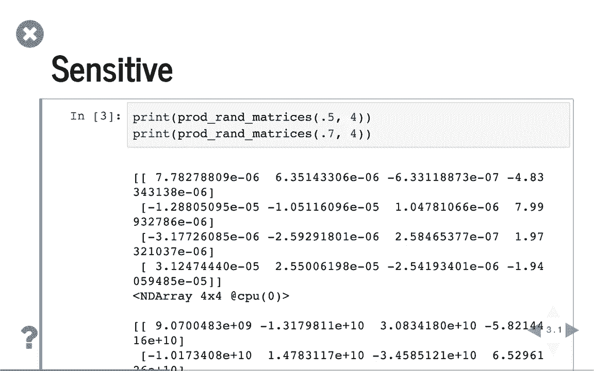
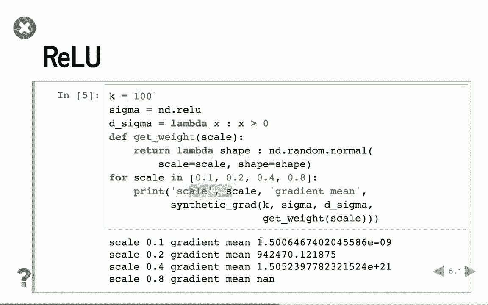
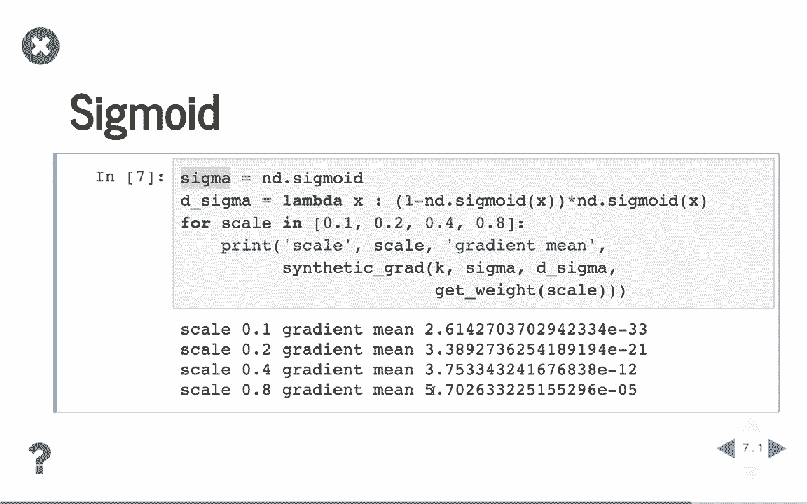

# P36：36. L8_4 Numerical Stability Notebook - Python小能 - BV1CB4y1U7P6

 So far， we talked about multiple methods to make the numerical stability。

 Now let's look at some results to verify these methods。

 We first import HAMP's net and other libraries to prod figures。

 The first experiments we're going to do here， we're going to generate a bunch of random matrices and do the multiplication。

 So here we define a function called prod random matrices with two arguments。

 The first one is called scale， which is controls the variance of the random matrices and then K is the shape。

 So now we first generate a Y which is the input， the identity matrix。

 then we do 100 multiplications。 Every time we generate random matrix using a normal distribution。

 and the shape is K by K and the variance is by scale。

 And we do multiplication between W and Y and we save the result to Y。

 We returns Y then this is 100 random matrices multiplication。 Now let's try some， see some results。

 First we're using scale equal to 0。5 and it's a 4。4 matrix。 Then we choose a scale equal to 0。7。

 You can see that even that scale is pretty close to each other。 The first result is pre。

 all have small values。 It's all equal to 1 E minus 6。

 But the second matrix， let me do， and then have very large numbers。

 It's close to 1 E plus 10。 Which shows if we do a bunch of matrix-matrim multiplication。

 then it's the values， the output is very sensitive to the variance。

 So we need to choose them carefully。

 Then we define function to compute the synthetic gradients of MLP。 So the input is K。

 again this is the shape， and sigma is activation function。 This sigma is sigma prime。

 This is a gradient function of the activation function。 Then get weight。

 which means how to get the initial， how to get the initialised weight matrix。

 This is a function handle。 Because this pretty random。

 we can repeat by 10 times and compute the average。 In each repeat， we first generate random x。

 which have the shape， it's a K by 1 vector。 And h， this output is currently all 1 and y。

 again that's the result， is identity matrix。 Assume that this MLP has 50 layers。 For each layer。

 we first get the initialised weight by coin。 Then we do the input function handle。

 Then we do w tends h to get input of the activation function。

 Then we fit into the gradient function of sigma。 And times again with wt by chain rule。

 And again by the input， by the y， so we can compute the gradients of this output。

 This layer's output。 Then we update w， we update h。

 which is the fourth function to fit into the next layer。

 So we repeat by 50 times and at the end for the output， this is the y， this is the gradients。

 we compute the pursuit min and to report the results。 Finally。

 by we average the results by over those 10 repeats。

 Now let's fit with definitions。 We first choose the layers， the size is 100。

 which means the output size is 100。 Then the activation function we use is RELU。

 We just are using the RELU for the undi namespace to get that gradient function。

 just lump the function， if x larger than 0， it returns 1， otherwise it's 0。

 The weight initialisation we are using is configurable。

 It's actually using a normal distribution with zero min。 And by given the variance。

 we have a config letter and the shape is actually the shape with k by k。

 Next we try different scales， which is difference variance。 From 0。1 to 0。2 to 0。4 to 0。

8 and we can print the variance and the gradients means by calling the synthetic gradient function we defined before。

 We can see the result。 You can see that using a little bit more scale。

 the gradient min is pretty small。

 It's 1 u minus 9 and for 0。2 it's reasonable。

 It's a reasonable value。 But if we double the scale again， it's pretty large gradients。

 It's 1 to e minus 20 and if we choose another again， then we get the bottom number。 In this case。

 only 0。2 is a reasonable value。 We cannot be too small。 We cannot be too large。

 If we change to x-vere， let you define the scale equals to using uniform distribution。

 We can get the scale equals to 6 over the input is k。 The opposite is both k。 It's a simple case。

 Both input and output have the same shape and then compute the square root。 Then x-vere。

 just it computed even the scale， which is the lower threshold and the highest threshold of the uniform distribution。

 We can compute again here。 It's not perfect。 It's 1 e minus 9。

 but given this pretty small applications， you practice sometimes it's better。 But again。

 at the least， it gives you a reasonable range。

 As consists of sigmoid， we know that sigmoid causes gradient vanishing。

 We first define the sigmoid function from the undine space， the sigmoid。

 and the gradient of the sigmoid function， we know that it's 1 minus the value of sigmoid times the value of sigmoid。

 Similarly， we choose scale from 0。1 to 0。8 and compute average of the gradients。

 Now you can see that it's different to the value that no matter how we choose from 0。1 to 0。8。

 all these values are pretty small。 It's 1 e minus 33 and even a very large scale。

 we still get 5 e minus 5。 So before using Ralu， it's easier to get a gradient exploding using sigmoid。

 it's actually getting gradient vanishing here。

 We mentioned that we can fix the sigmoid by scale。 So here we define activation function。

 which is 4 times sigmoid， minus 2。 Then the gradient function of sigma again is with just a scale。

 Now to do that again， we can see that while using scale 0。1。

 the gradient means actually very reasonable。 This is a very good value， this is 0。01。

 And double again， it's not going to be too big and 0。4 or 0。8 are a reasonable value。 Even 0。

8 is a little bit larger， but it looks fine for the first few iterations。

 So which shows that if we fix， if we rescale sigmoid。

 we can actually make the gradients much more stabilized。 [BLANK_AUDIO]。

