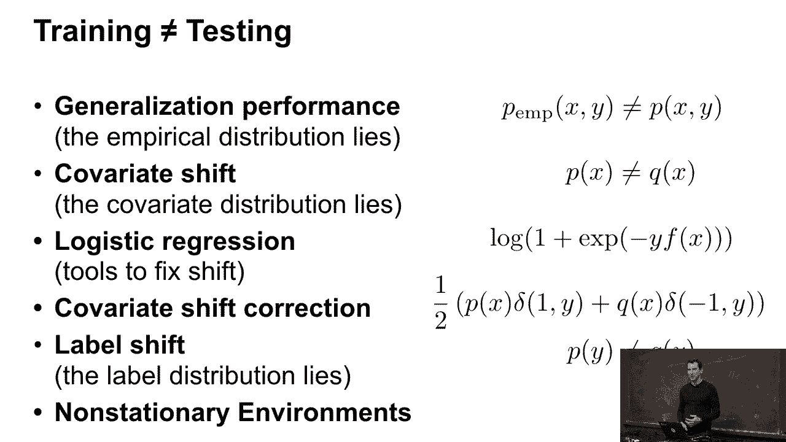
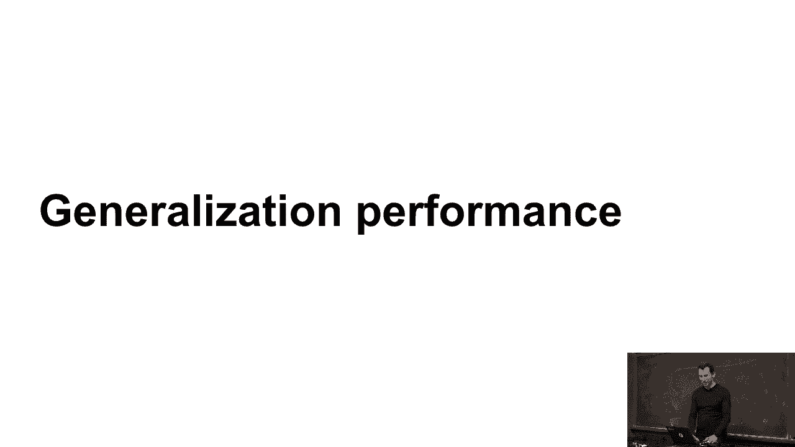
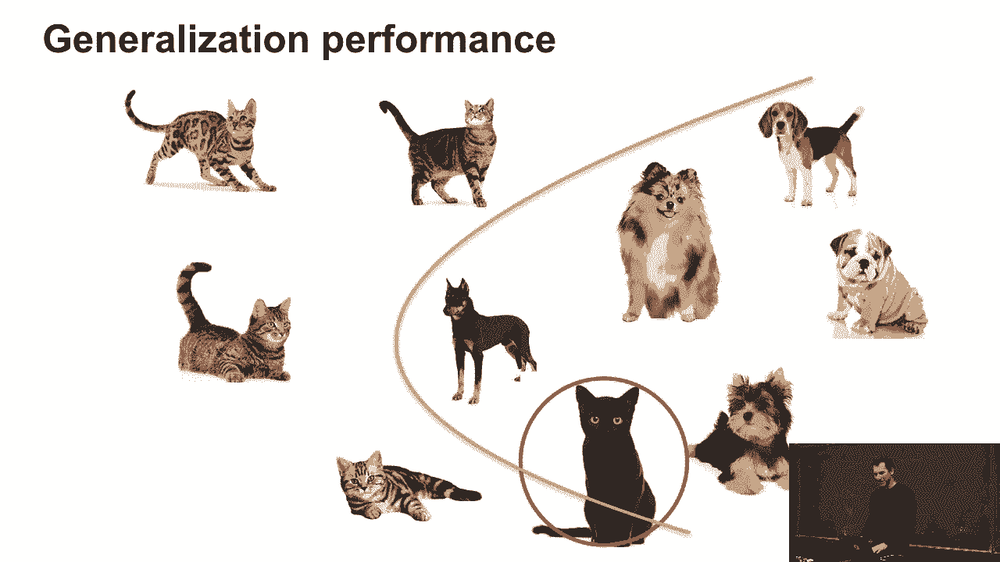
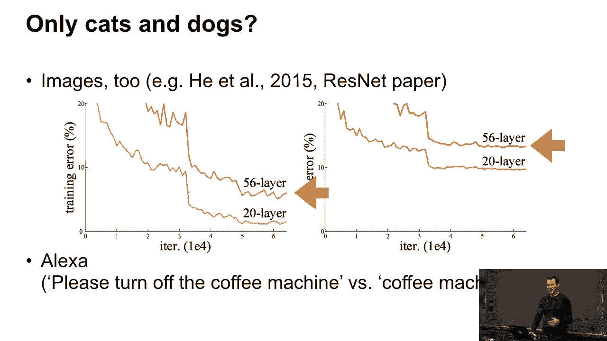
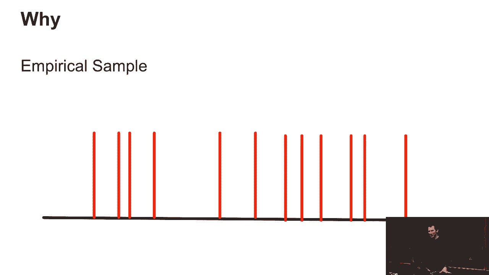
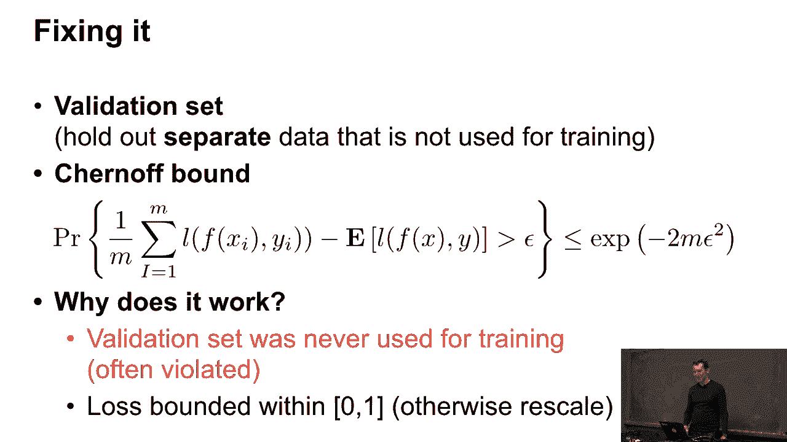

# 【AI 】伯克利深度学习Deep Learning UC Berkeley STAT-李沐 & Alex - P39：39. L9_1 Empirical and Expected Risk - Python小能 - BV1CB4y1U7P6

 Today we'll be talking about covariate shift and the environment。

 And this is going to be a reasonably theory heavy lecture。

 The notebooks for that are left as homework。 Literally。 But the homework's not very hard。

 If you look at what we've done so far， this is actually a， simplified case of what we had so far。

 OK， so what I'm going to talk about today is mostly about。

 when things between training and test time are different。

 And you've already encountered some of those in terms of。

 generalization performance and overfitting， namely the fact， that the empirical distribution lies。

 The empirical distribution isn't really what you're going， to see later on。

 Think of the empirical distribution as more， in Alex teaching a class and handing out homework。

 The true test distribution is， well， the midterm exam， right？

 And we'll try to keep that deviation as small as， possible。 But for obvious reasons。

 you may not always be able to do that。 Then you might have covariate shift， which means that the。

 covariate distribution lies。 In other words， what I'm seeing at training time looks。

 different from what I'm seeing at test time。 There will be the equivalent of more in Alex writing the。

 homework for the regular time， and then the TAs writing the， exam。

 And you could expect that the latter is different。

 Then I'll give you some ideas of how to fix this through， logistic regression， for instance。

 And I'll talk about covariate shift correction。 And then I'll talk about label shift。

 which is actually， a special case of covariate shift， as it turns out at least， in many cases。

 And in the end， we'll talk about non-stational， environments。

 This is sort of the things that we're going through today。

 It's going to be not that deep in terms of math。 I mean， there's going to be some math in it。

 but it's not， going to be that deep。 But it's actually important in terms of concepts， because it。

 will address a lot of issues that you will encounter if you。

 are trying to use machine learning and practice later on。

 I can pretty much guarantee you that you're going to。

 encounter one of those issues。 So with that， let's talk about generalization performance。

 So it's well known， right？ So let's say we want to classify cats and dogs， and we。

 build our classifier。 Great。 Along comes a new dog， and well， OK， that doberman doesn't。

 do so well here。 So we need to adjust our hypothesis。 OK， so now， from solved again， until well。

 along comes a cat， and a cat doesn't do so well。 So you can see where this is going。 Basically。

 just because you're doing well on your training， set。

 you don't really have much of a guarantee that you'll， do well on your test set。

 So now， of course， this isn't just cats and dogs。 There's some screenshot from the ResNet paper from 2015 by。

 here at all。 And essentially， if you look at the training and test errors。

 on the left-hand side is the training error， on the right-hand， side is the test error。

 And this is for a 20-layer and a 56-layer-deep network。 In both cases。

 training errors tend to be lower than the test， errors。

 especially for more complex networks and more， complicated problems， you're going to see that a lot。

 You might not see that that much on very simple problems。

 because you're not going to have a lot of overfitting with your， model。 Class is quite simple。

 So if I have a million observations， 100 dimensions in， a linear model， well。

 I'm not going to see much of it。 But actually， in that case， you have to ask yourself， why am。

 I just using a linear model？ Or why did anybody even bother collecting that much data？

 But you don't just get that for images。 For instance， for Alexa， you might have something like this。

 in the training set。 Please turn off the coffee machine， whereas then when you， ship the thing。

 somebody barks at Alexa coffee machine off。 And then you need to generalize from one to the other。

 And it may or may not work。 So what's really going on？ Well， we have a data distribution。

 p of x and y， and we， have a data set drawn from that distribution。 But at training， of course。

 we only minimize the empirical， risk。 So that's just for the x， y， i pairs。

 And I'll use some regularization to keep things， well-behaved。 But at test time。

 the expected risk matters， or at least， unless you explicitly know what the test questions are。

 And in this case， for instance， Wapnik coined the term， "transduction。"。

 It's like me handing out the midterm exam questions， without the answers before the exam。

 You would probably do a lot better if you got those。 But in general， well， you don't know this。

 So let's just assume that we actually care about the， expected risk。

 And so if this is my data distribution， it's a density， of course。

 then I might have these as the empirical samples。 Now， and it's actually a rather nice one in--。

 I mean， I cheat it， so you can clearly see this is way。

 too regularly spaced for actually being drawn from this。 But for the sake of a diagram。

 it does the trick。 But actually， you only have this。

 So now you don't know what the intensity really look like。

 And then， well， how do you fix this？ Well， one way to fix it is you hold out a separate validation。

 set， and then you can invoke something like a chain of bound。

 Who's heard of a chain of bound before？ Nice。 You have the audience。 So those of you who haven't。

 afterwards， go to Wikipedia， and look at that entry。 But here's really what it does。

 It tells you that the empirical average doesn't deviate too。

 much from the expectation with high probability。 And in this case。

 if I have a loss that's bounded between 0， and 1。 And so what's important is that these are random variables。

 that are well behaved。 So in this case， bounded between 0 and 1。 Then the empirical average。

 1 over m， somewhere i equals 1 to m， L of f of x， i， y， and so on。

 doesn't deviate much from the expectation， but doesn't deviate by more than epsilon。

 with probability， less equal than e to the minus 2m epsilon squared。 So this is pretty awesome。

 right？ I mean， this is a bound which， if I give you twice as much data。

 it drives the probability down very quickly。 It gets you the original probability squared。

 So if let's say， before that it was 0。1， then if I give you twice as much data。

 then now I get the probability of 0。01。 That's a very fast rate of convergence。

 But there's one very unpleasant part in this equation， namely the epsilon squared。

 Because that means if I want to get my accuracy， let's say， epsilon from 0。1 to 0。01， right？

 So that's like a 10-fold improvement in accuracy。 I need a 100-fold increase in the amount of data to do well。

 So that is something you usually can't do。 Nonetheless， in machine learning， usually by now。

 on large data sets， we have actually data sets for the validation， set that are kind of large-ish。

 right？ So you might have easily 10，000 observations。 So m being 10，000 means you can probably。

 pick an epsilon that's like 10 to the minus 2， maybe 10， to the minus 3。

 And you'll still get something OK， ish out of it。 Turns out you can actually get much tighter bounds。

 if that loss is well-behaved。 For instance， if you're mostly doing well。

 then rather than a chain of bounds， you might want to use something like a Bernstein inequality。

 There's a lot of really good work。 Take one of Peter Bartlett's classes。

 if you're interested in that， or Martin Wainwright's classes。

 There's a lot of concentration of major classes。 That's probably a little bit graduate level。

 And you can have a lot of fun with this。 But the reason why this works is because we never。

 use this validation set for training。 Unfortunately， quite often people violate this。

 Let's say we have the ImageNet contest， right？ ImageNet contest has some few million observations。

 images for training， and then it has the test images。 And people improve their models step by step。

 in order to do well on that validation set。 But now you're doing basically multiple testing。

 So if that guarantee before that held with 1% failure， and I test five times。

 then all of a sudden my failure rate， goes up to 5%， right？ So you need to pay a penalty for this。

 This is one of the reasons why benchmark data sets stay around， for a very long time。

 People end up overfitting to that benchmark data set， as opposed to actually learning things。

 This is why by now， if somebody tells you， you should use their new algorithm because that's really。

 well on MNIST， you should run。 Anyway， so how can we fix this in practice a little bit？

 Well， I could， for instance， just add a little bit of noise， to that data。

 So I iterate around a little bit。 And then I'm not using just the observations。

 but something a little bit similar。 I can do that by either forcing my function。

 that computes things on the starter to be very smooth， such that small changes don't matter。

 or it just applies small changes。 The latter is what leads us to things。

 like training with input noise and dropout regularization。

 The former gives you regularization theory。 And quite unsurprisingly， those two things。

 are actually closely connected。 For instance， there's a very nice paper from 1995， by Chris Bishop。

 And it says， well， training with input noise， is equivalent to ticking off regularization， which。

 just connects those two things。 And the entire paper proves exactly that title。

 So this is one of those few papers， where you read the title and that's enough， right？ But actually。

 you should look at the proof。

 It's a very simple and elegant proof。 So let's--。