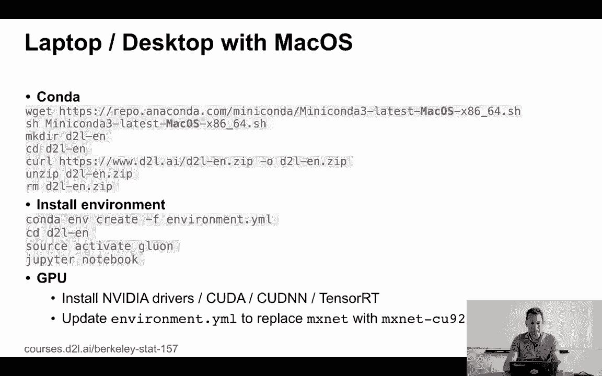
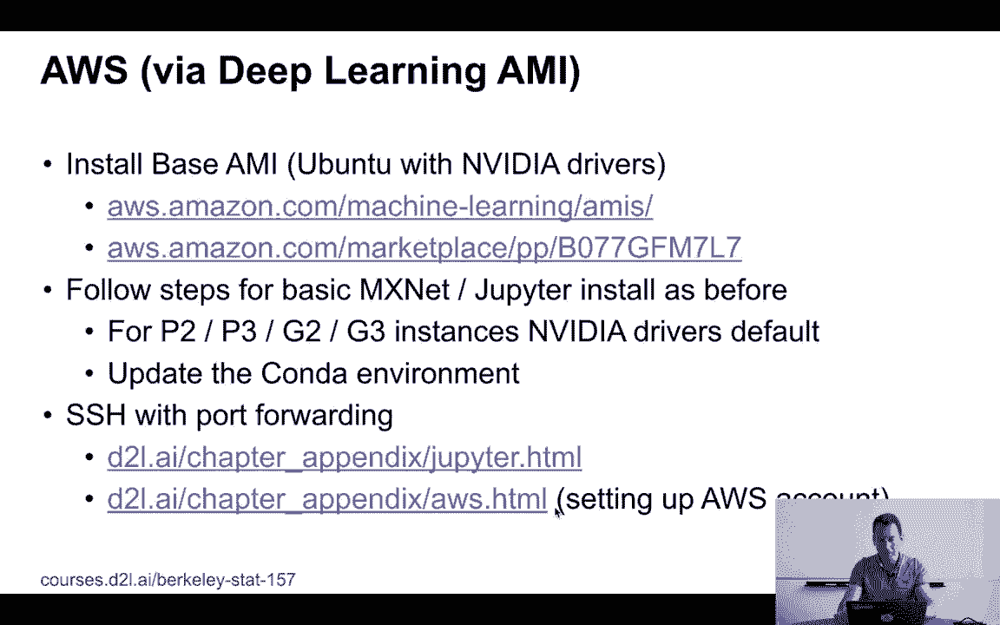

# P3：3. L1_3 Software - Python小能 - BV1CB4y1U7P6

 Now， this is a class on deep learning， both theory and practice。

 In order to get the practical aspects done， well， we'll need to talk about software， how。

 you install things， how to get help， and basically where you can run things。 So let's get started。

 The tools that we are going to use are Python， and well， in reality， really everybody's using。

 Python in one way or another for machine learning and data science。

 We're going to use Conda as a package manager for simplicity。

 There are a lot more detailed instructions in the installation chapter on d2l。ai。

 So this is really just an overview。 Now， within Python， we are going to use notebooks。

 and that means Jupyter。 That's just so much easier to keep track of all your experiments。

 And if you just write maybe 100， 200 lines of code， Jupyter is a perfectly good tool。

 for building such things。 Now if you have larger software projects and you try to do it all in Jupyter。

 well， that， leads to a little bit of spaghetti code。 But for the purpose of this course。

 this is more than plenty。 So if you have really long， large software projects。

 maybe then for your course project， you probably want to do some experiments in Jupyter and then actually put things into。

 proper libraries。 If you want to enjoy all the notebooks that I'm going through in the same slide form as。

 what I'm doing in this lecture， you'll need to install RISE through Conda。 Otherwise。

 you don't really need it。 You can just look through the notebooks as they are。

 And last but not least， well， you need a deep learning framework。

 The one that we picked for this course is MXNet-Glue on。

 The reason for that is because it's very scalable and easy to use and has a nice imperative。

 interface。 It works nicely on a wide variety of hardware and scales well。

 If you have another deep learning framework， you're still going to be able to benefit from。

 all the theory and all the models。 But if you want to walk along and actually try out some of the codes。

 you'll need to install， MXNet。

 Now， how do you do that？ Well， if you have a generic cloud machine with Linux or if you have a Linux laptop or。

 desktop， it's fairly straightforward， you pull the latest mini-conder installer from， a Conda。

 You get the latest version of our book from d2l-en。zip。 You unzip that。 And within that。

 you'll find an environment which includes all the relevant packages。

 And then all that's required is just you create this environment with Conda。

 So it's very straightforward。 Conda。n。create -f as in file name environment。yml and you're done。

 And then you just activate Glue on。 That's the environment that we're providing。

 So source activate Glue on， trip to notebook and you're done。 Now if you're not GPU， well。

 you'll need to install the NVIDIA drivers， CUDA， CUDA-en。n。 Maybe TensorRT。 Well。

 NVIDIA has their own way of doing things and you'll need to follow the instructions。

 on their website。 This will probably take you a little bit longer than the actual MXNet installation。

 One important thing is you need to update the environment variable， environment。yml， to。

 replace MXNet with MXNet-cu92， for instance for CUDA 9。2 or any other CUDA version that。

 you might have at the time when you're watching this video。

 That's just to make sure that you're actually able to use the GPU on your device。

 Now if you don't have Linux but a Mac， instructions are almost the same。

 The only difference is that you replace Linux by Mac OS。 So if you compare this。

 it's only really one word that changes。 Now if you have a Windows box， it's a little bit different。

 You need to download an exit file。 So it's Windows x8664 exit。

 And the other thing is that the CondaActivation command looks a little bit different。

 You just say activate Lorne。 Before that you needed to type in source， activate Lorne。

 here it's just activate Lorne。 That's really the entire difference between Windows。

 Mac OS and Linux。

 Now if you don't want to go through all the pain of installing the NVIDIA drivers because。

 that can take some time and if you've never done it before， you'll probably need to sign。

 up for a developer account and all of that。 You can just do that directly in AWS。

 So what you might want to do is you start with the base AMI for deep learning。

 So if you follow the top link， you'll find all the relevant pieces。 Some machine learning AMIs。

 The current latest one is this one here but if you watch it later， probably this will have。

 been superseded by a more recent one with more recent NVIDIA drivers and all of that。

 So therefore go there， look for the base AMI。 You then follow the steps for basic MXNet 2。

0 to install as before and obviously for P2P3， G2， G3 or any other GPU instances that you may find。

 you need the appropriate NVIDIA drivers， you update the Conda environment and you're done。

 Now this will allow you to run MXNet on a machine in the cloud but obviously if you want。

 to use Jupyter， there's a tiny little problem， right？

 Because Jupyter sets up a web server on the machine on which it's running and you want。

 to avoid two things， namely you want to avoid making that web server world accessible because。

 otherwise some random guy could just connect to this machine that you just launched and。

 run whatever they want on this machine they could root it probably。

 So it's very much in your interest not to just make this machine world accessible。

 Instead of that what you do is you use SSH secure shell for port forwarding and what it。

 does is it basically intercepts the port that the web server opens on this remote cloud machine。

 and routes any requests to and from this port through the SSH tunnel to your local machine。

 right fakes this port being there。 That's really just essential information you know signaling conduit and then you can locally。

 far up your web browser on the port where you usually would expect Jupyter and run it。

 We'll actually see that live in action in the next few lectures when we need GPUs for。

 now look at the Jupyter instructions and go through the details there of how to do it。

 Obviously you need to set up an AWS account so in the lecture 2 we will cover that in a。

 bit more detail on how to launch machine instances and all of that but you can also just go to。

 the website on the books so the look in the appendix for AWS and we'll walk you through。

 details of how to do all of this。 So if you need AWS credit for the class email us and we will send you with an appropriate。

 credit code。 Now if you want to use Colab， well you can do that so you go to colab。research。google。

com， make sure you activate the GPU supported run time so you need to select the appropriate。

 run time and then before you actually want to run MXNet you need to add those two lines。

 namely pip install MXNet-cu92 and pip install d2l to your config and then you're up and running。

 on colab。 Now colabs nice in the far as it gives you free as in sponsored by Google access to GPU。

 machines at least as long as Google decides to sponsor that。

 The downside is after some inactivity that machine is torn down so you can just come。

 back after dinner and expect all the things to be there you need to check point and other。

 things your notebooks are still some will survive but the variables on the local machine。

 will not。 So you get somebody loose some。 [BLANK_AUDIO]。

