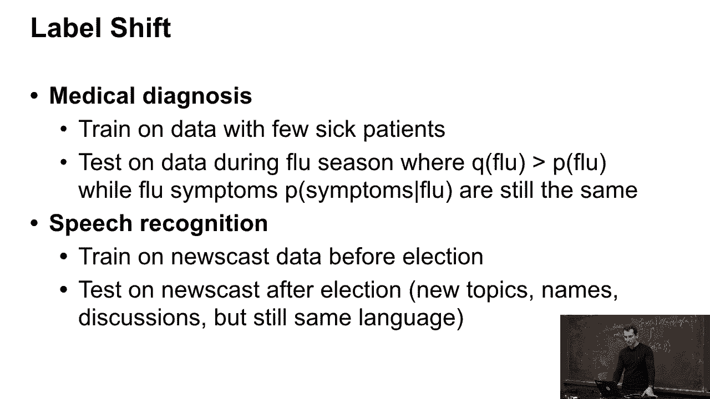
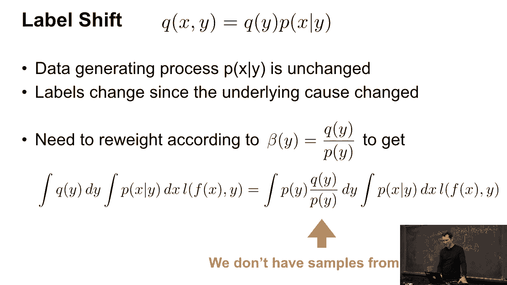
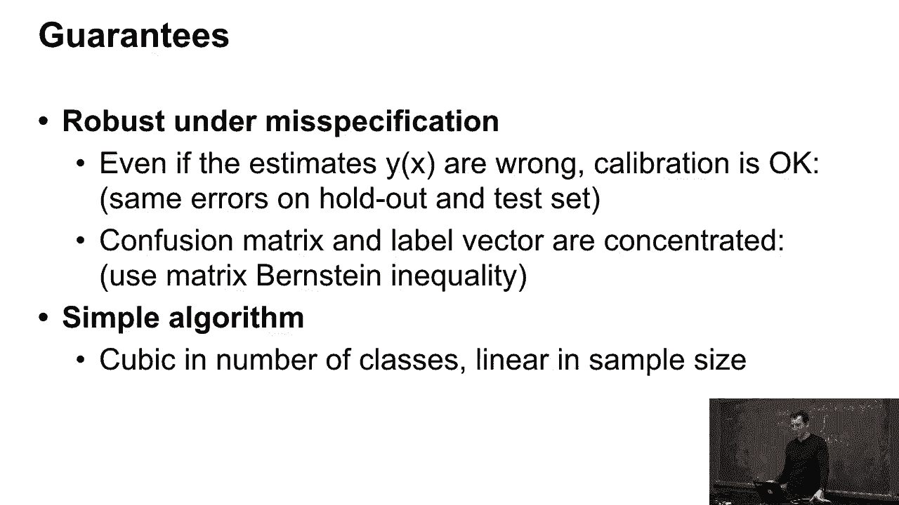
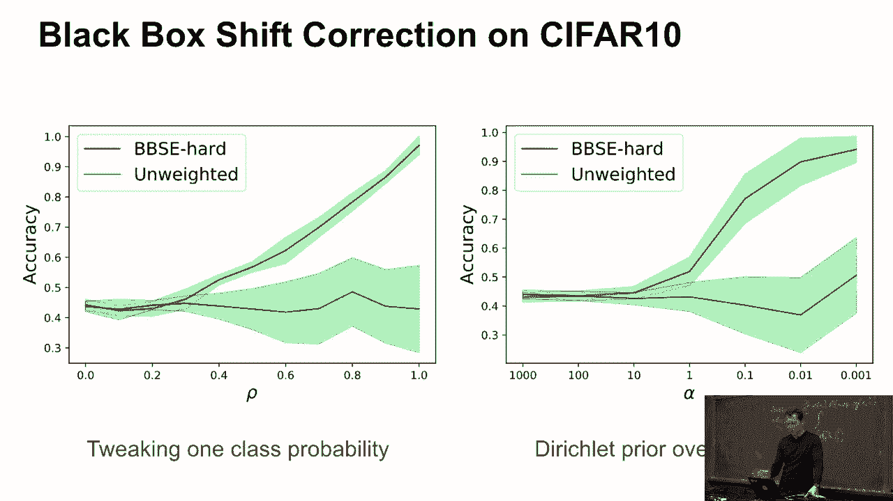
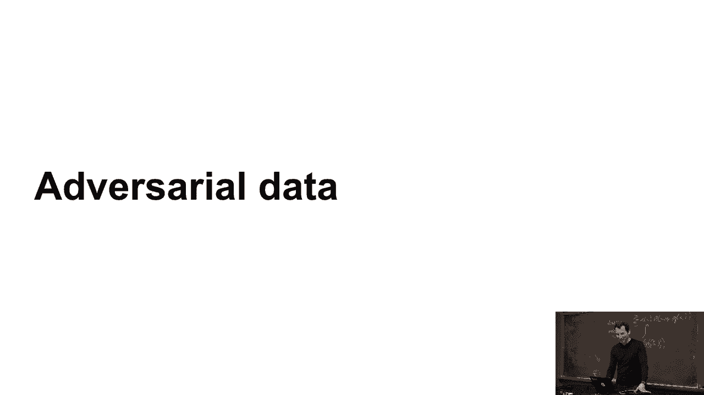

# 【AI 】伯克利深度学习Deep Learning UC Berkeley STAT-李沐 & Alex - P44：44. L9_6 Label Shift - Python小能 - BV1CB4y1U7P6

 Good。

 So then let's look at label shift。 Label shift is kind of a simplified case of this。

 So let's say this is our training set。

 And our test set looks like so。 So it turns out that we have a lot more。

 cast in our test set than in our training set。 So this is a bit different from just simple covariate shift。

 And it's something that's actually rather more common。

 So why would you ever do this？

 Well， let's say I use some medical diagnostic tool， and I train it on a few sick patients。

 Let's say I have maybe 50/50 sick and healthy patients。 And then I deploy this in a practice。

 Let's say I have a breast cancer test， and 50/50 split for training， and deploy it in practice。

 And it turns out that fortunately breast cancer， is a lot more rare than what I would have actually imagined。

 So very few people are actually really sick。 And then you need to intuitively， as you can see。

 down weight things such that that is corrected for。

 Or I test on that at during flu season where flu is a lot more， common。

 and then my test should take care of this。 Or， for instance， for speech recognition。

 this is a very common thing。 So let's say I build a speech recognizer。

 And then I build this maybe before an election， and then I have an election。 All of a sudden。

 there are new names， new topics， and discussions。 They still speak the same language。

 but all of a sudden they speak about walls， rather than health care。

 And people have weird names and weird hair。 And so your speech recognizer-- well， OK。

 forget the hair， but for the rest。 It may not work so well anymore， because you now。

 have a different distribution over what gets translated。

 Or you have some movie star with a weird name， where all of a sudden gets popular。

 So then your speech recognizer needs to adjust to this。 Otherwise， you're just consistently。

 going to get this wrong。 And so if you look at what's going on in the math。

 you have a slightly different setting。 So rather than assuming that p of y given x is the same。

 you now assume that p of x given y is the same， but that rather than p of y， you have q of y。

 So stuff like that can， for instance， happen， if you assume that y is actually causal for x。

 So if the flu causes the symptoms， rather than the symptoms causing the flu。

 and then if all of a sudden you have more flu， well then that happens。

 So now you need to reweight things， according to the ratio of the labels。 Before that。

 for covariative correction， we were kind of quite lucky， right？ I mean。

 we actually have the data sets around。 But you don't really have the test labels around anymore。

 So that's pretty inconvenient。 So what you could do is you want to estimate--。

 you want to measure in how well the estimates do on the test set。

 And it turns out that all you need， is just to assume that your error confusion matrix remains。

 unchanged。 This is a slightly advanced topic。 I mean， you can read the corresponding paper for that。

 But the algebra behind this is actually fairly simple。

 You go and look at the error confusion matrix。 And you look at basically what the predictions on the training。

 set are。 You look at the corresponding label predictions on the test set。

 These are not the true labels， but they are the predictions。 Now if let's say on the training set。

 I predict 10% people with flu and 90% healthy。 And on the test set。

 I predict 40% with flu and 60% healthy。 I can infer from that that probably something must have happened。

 Now if I use my error confusion matrix， then I have to assume that it's invertible。

 That's basically， if I have to flu， what， are the chances that I'll say I have to flu or that I'm healthy。

 then you can invert that matrix and work out exactly， what the probabilities are based on that。

 You're essentially in good shape。 So this is really just a quicker side。

 Don't worry about the details there， but this is just for you to let you know that besides covariative。

 there are also other related problems that look and feel very similar， but aren't quite the same。

 Yeah， so of course you taste it and it works and yeah， whatever。

 That's fine。

