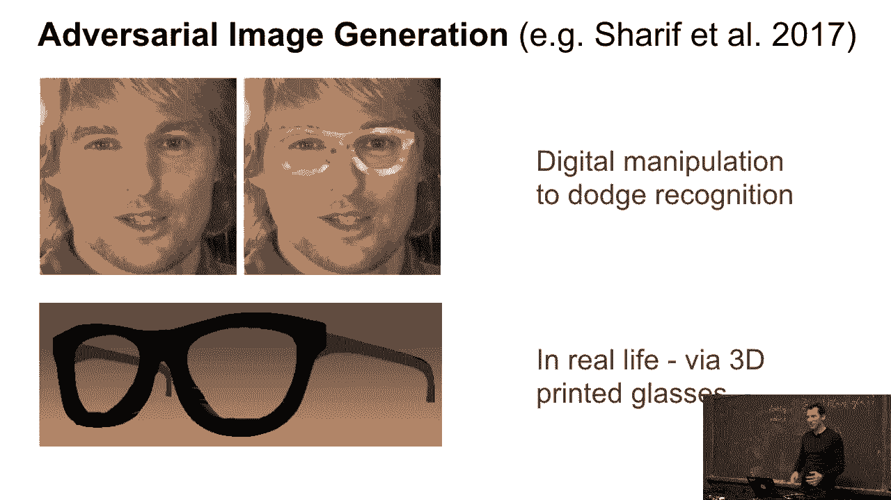
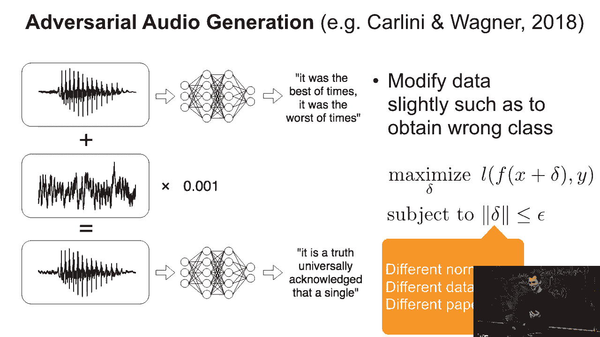

# P45：45. L9_7 Adversarial Data - Python小能 - BV1CB4y1U7P6

 One more topic， adversarial data。

 Looks like we're getting through this quite well。 So let's say we want to do。

 celebrity recognition and yeah， okay， that's Jeff， and the guy to his right down there。 Well。

 that's Andy Jassy， so that's the AWS CEO。 And yes， okay， it does recognize our CEO。

 which is a good thing， right？ So if you're the national inquiry。

 you can use that to find out whether the filter includes a Jeff。 But how could you elude this？

 And so there's this cool paper from 2017， and they then essentially photoshopped on this gentleman。

 who looks a little bit like Austin Powers， some very stylized classes。

 And they actually real 3D printed those classes， which is pretty cool and patterned them accordingly。

 And they were able to fool the face recognizer， right？ And I mean， no， you won't get， you know。

 is fooled by that， right？ I mean， it's still the same guy， but the face recognizer gets fooled。

 right？ And that's of course， you know， terrible or a great thing， depending on how you look at it。

 So what's really going on？ By the way， it's a paper from Berkeley from last year。

 They did the same thing with audio。 They took an audio stream and， you know。

 it's some Dickens novel。 It's just the best of times， the worst of times。

 They had a tiny amount of noise to it， and all of a sudden it starts being the text。

 from the Constitution for the speech recognizer。 And so you first of all。

 one thing you know how on earth， did they do this， because if you play back to a human。

 they won't even know that something is a myth。 Yet the speech recognizer fails quite miserably。

 So what they did is they basically said， well， you know。

 let's try to maximize the loss if I only make a very small。

 perturbation to the data。 And the thing that you should already see from this here is， well。

 I hope nobody ever wears such glasses in reality， because they just look weird。

 So what it means is the face recognizer。

 was never really trained for that kind of strange data。

 So why does it work？ Well， basically， if you think about it like the training。

 and the natural test data they live on， a fairly small subset of possible inputs。

 that you could have。 And the adversarial data is slightly of that support。

 It is of that support in such a way that it still looks， kind of reasonable， but of course。

 if you ask a human， you know， what's this creature to the left in the circle？ I guess half of us。

 if they didn't know any other context， might say， well， that's a doctor that's dressed up。

 like a cat， right？ Or a cat doctor or something like that from a children's story。

 But they might not always say cat， right？ So this is showing unnatural data。

 and therefore not being very surprised that unnatural data， gives you a very unexpected response。

 Well， so this is something that a year or two ago was like， in the news all over。

 like adversarial data generation， will break machine learning and whatever。 Right？

 So it's like as if this had been super new， but actually， it's not right。

 We've been dealing with that problem at least for 20 years。

 At least ever since there was email there has been spam。 Right？ And spammers do nothing else。 Well。

 besides， you know， writing you for 19 scams， about how you， you know。

 want some price from a prince in Nigeria， but to get through the spam defenses。

 they need to modify the payload， namely the email， in such a way that it's still about that prince。

 Nigerian prince who wants to give you his millions， but also to make it look in such a way that。

 you know， the spam filter doesn't recognize that it's about， that prince from Nigeria， right？

 So they would add other words to it。 They might perturb the email， the text in some ways。

 that humans will disregard。 But that， you know， spam filter would pick。 So for instance。

 you could add highly scoring words to them。 You can use sentences。 You can actually say， dear Alex。

 prince such and such， has prequaced you 20 million dollars。 And so the spam filter that then。

 you know， uses the feature that， you know， any email sent to me。

 with dear Alex is probably one from somebody who knows me。 Well， it gets through。

 So adversarial data has been around pretty much as long as， people have used machine learning。

 It's not new。 It's just that if you use that for images。

 it's very flashy and you can write nice blog posts， right？

 So for instance， this is something where people actually， used in variances。 This is from 1995。

 tangent distance。 So this is Patrice， Imar and others， AT&T Labs。

 And they basically for handwritten digit recognition， they looked at different types of invariances。

 In this case， it's not a resale data， but it's actually augmenting a data set。

 And we'll see a lot of this later on when we do image， classification。

 where we'll look at the data loader and， essentially preprocessors where you crop and distort into。

 other things。 And here they use it for digits。 So you can scale a digit so you can make it smaller。

 larger。 You can rotate it。 You can deform the axis。 You can squish it。 You can change the thickness。

 And these are the corresponding vector fields in the middle， of what it really does。

 And then you just look at this tangent plane。 Look at the distance within that tangent plane。

 And if it's close within that plane， then you would say it's still a 5。

 So this is using invariances to help you。

 This has been around for a long time。 Basically， you mentioned it。 Everybody does that。

 In speech recognition， people add background noise。

 They change scenes and other things to make it more resilient， to augment the data。

 document analysis。 You might add or remove some words。 And yeah， for instance。

 the virtual support vector machines， Bernard Shilkoff used it because he didn't have enough。

 memory in his computer。 So this was a specific funky way of how to augment the。

 data set there。 Okay， what's the math behind it？ There's this one little loss function that kind of covers all of those。

 Basically， what you do is you have a loss， which is， you know， the function is invoked on data。

 plus some perturbation delta。 And you pay a penalty for that perturbation。 And so now。

 rather than incurring the loss on just x and y， you incur the loss on the perturbed version of x and y。

 And you're trying to play a game where the adversary is going to try and find。

 the worst perturbation of the data。 And you're trying to find the best function if that still does well under this。

 So this is adversarial data generation 1995。 Yeah。 So this is adversarial data。

 Any questions so far？ Okay， good。

