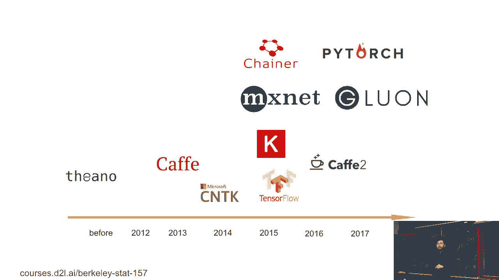
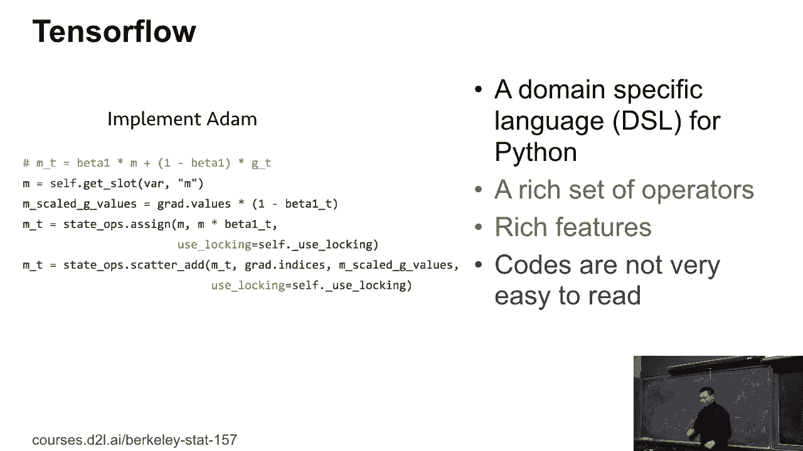
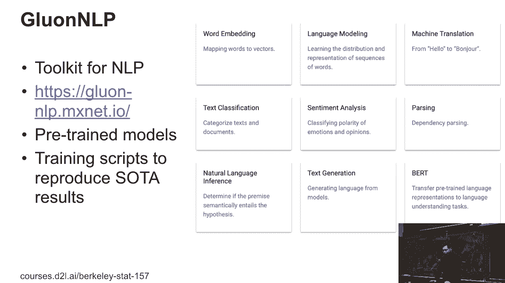

# P48：48. L10_1 Deep Learning Frameworks, Gluon - Python小能 - BV1CB4y1U7P6

 After hardware， we can talk a little bit more about the pre-end frameworks。

 So we know that there's a bunch of frameworks， the x-axis the years。 And so you can see that Ciano。

 Cafe， Cafe is from Berkeley and a lot of new things， especially。

 there's four frameworks at three years ago and the other things。

 So we can briefly introduce like each frameworks， what is the major design decisions and what。

 is the one agent or the one that is just。

 The first one is Cafe。 Cafe is made from Berkeley。

 It's the most popular different framework for computer vision about four years ago。

 So the program interface is that you give me a protocol above。

 You can write a text and describe the layer。 And for example。

 this is the part of the RESTNet 1011 network， how to define the layers。 So we have layers。

 we have what is the bottom layer， what is the top layer and the top and， also prime layers here。

 So the one here is that Cafe have really good Cvmore coverage。

 It's a bunch of convolution networks we cannot teach in the next week。 And it's portable。

 which means it's a single binary。 You can grab it and run everywhere。

 But it's not so flexible at that time if you want to do like a Python level interactive。

 program is so hard。 And also this layer， I didn't show the whole thing actually。

 The single definition have four thousand lines for code， which means a four single layer。

 a four single network。 After that， TensorFlow is probably the most popular depraved framework right now。

 It's provide domain-specific language， it's called DSL for Python。

 So TensorFlow is like Python but not Python。 So it has thousands operators。

 So that's actually the one that you have everything you want to use in TensorFlow。

 You also have a lot of features you want to do training， do deployment， do everything you， want。

 But the problem here is that TensorFlow code is a little bit hard to understand。

 If you don't learn that before it's a Python user， if for example you read this code you。

 don't know what this state OPs assignment is actually equal to。

 But it's a little bit hard to understand。 Chaos on the other hand， it's a client。

 It's just the one designed to simplify how to develop things。 For example。

 here's how to use Chaos to define a multi-layer perception。

 It's pretty similar to what we have in Groom before。 Chaos are just a client。

 You can use a different back end。 So for example， you can， indeed， for like original use。

 CML now it's using TensorFlow， you can also use M stand or CNT cache back ends。

 So the one that you care of says like， it's pretty easy to use compared to TensorFlow。

 But it may be slower because you have a little overhead on the front end and then you're。

 trying to a TensorFlow probe while your libia looks a little bit more efficiently at the， end。

 It's less convenient to develop debug because you see the， you see there's a compile step， here。

 The define model you compile is actually called symbolic programming。

 We talked a little bit about before， like it's a little bit harder to get the intermediate。

 result and do interactive things。

 The other one is pretty popular called PyTorch。 It's PyTorch is from PyTorch。

 PyTorch actually grabbed the Tensor interface from Torch and also grabbed a UNL interface。

 from Channel。 So it's purely in Python， so which means it's pretty easy to understand。

 If you're a Python user， you can read PyTorch called easily。

 And because it's so closely integrated with Python， PyTorch will be hard to deploy especially。

 for industrial applications。 Sometimes your application is right in Java while you need to run Python in Java that's。

 pretty powerful。 And if you want to run mobile phones， you're not necessary to have Java。

 which is have a， lot of efficiency issues。 But PyTorch is so easy to use。

 it's getting very popular in the research world。

 So this class is based on M-Snet。 The original M-Snet have a long part like Tensor library。

 which is， you already see that before， it's called ND。 The end of like。

 cares like neural network is a simple network， which means you define network。

 you compile it and fit data in the train。 The original design for M-Snet is for performance。

 We want to get the best performance， so then we sacrifice a little bit of usability。 At that time。

 people don't know， it's still earlier a lot， a small community， everybody's， expert。

 so we don't care about usability at that time。

 After that， the community growth， PyTorch， like 10 times easier to use than TensorFlow， we learned。

 yes， let's have a PyTorch like thing。 So Gluong is actually very similar to China and PyTorch for neural networks。

 So here we define network and then we can do this and normal thing we introduced before。

 So Gluong make much easier and to develop code and debug， which is similar to PyTorch。

 comparing to the symbolic interface， sometimes slower because you lose a little bit performance。

 for the interactive experience using PyTorch。 By most cases。

 you don't care unless you are a several driving car company， you have like。

 a lot of 4K videos and you really care about performance that matters。 But in most cases。

 for homeworks， you don't care about that。 So that's kind of what we have two years ago and what we really learned in the last two。

 years， like we're more and more student come in and engineers come in， the less care about。

 framework。 It's just a tool。

 Framework is a tool that lets you to finish things。 So for example， for researchers。

 they really want to have baseline models。 Already implemented so I can base on the baseline model to just hack it and train my own applications。

 And for engineers， I really care about less grab data， train the model and deploy。

 And that's really care about。 So start from one year ago， we tried to， okay。

 let's have two kids actually focus on applications。 For example， one thing is called Glone CV。

 This is a toolkit for computer vision。 It provides a bunch of image specifications。

 all these popular models here， object detection， somatic segmentation。

 a lot of segmentation also like a phase again， a lot of stuff。

 So it have a bunch of pre-channel models。 You can just grab and use it。

 also have all these training scripts to reproduce the results。

 The reproducing results pretty hard because to make your paper fancy， you need a lot of。

 fancy things but to get the results， you have a lot of tricks。 So for example。

 a lot of famous papers we are also going to teach in the class， claim， that yes。

 let's design a network， I have this story。 And we aren't performing the baseline by 5%。 Oh。

 that's a big thing and people jump in。 Yeah， that's so fancy。 In fact， we look into that。

 look into the implementation。 We find the major trick give you 3% improvement is like for Softmax。

 either you give 0 for， NACTIVE 1 for positive。 But you know that for the Softmax regression to fit 0 otherwise too hard。

 What you can do is you can change the positive number from 0 to 0。9 and change NACTIVE to 0。

 from 0 to 0。1。 It's a cost of soft label and this one give you 3% improvement。 Okay。

 there are a lot of tricks to make things happen。 So this tool is trying to yes。

 let's survey all the tricks and find a prior order trick， to all these models。

 you can actually get a lot of good things from it。 So also there's a bunch of projects like yes。

 how about let's grab a data set to find you， a model for that。 Our feedback is like， yeah。

 it's a homework project because you just grab it and to our， 3。9 code you can just find you。

 That's so easy。 Finally we have LOP， a lot of production models， scripts and do a lot of LOP jobs。

 especially， if you read the news， there's a new algorithm called birds or transformer based on network。

 you're pretty popular and also from opening I called GPT2。 You get a lot of good results。

 It's a big thing for LOPs。 So originally we probably don't teach transformer birds too much but according to the written。

 news we maybe take one to nectar for birds or transformer models。

 The other one you guys have a team to do graph new networks。

 So which means you can take social graph data set， you can take a sound recommendation data， set。

 you can build cantaloung relational new network for that。 DGI is for that。

 It's a relatively new research topic。 Every framework is just a big area。

 It's pretty slow at this time but we are moving very fast on this area。

 So every framework is pretty fast in the past few years。 For example。

 for MSNAT we have more toolkits this year and the other thing we learned is。

 like for the first homework we get feedback。 Yes， it told me ND erased Lumpy like what is actually not compatible。

 For example if you do boe indexing it actually doesn't support that。 So yes。

 we take this feedback and now we can duplicate ND maybe in a year and then you。

 introduce a new package called NP it's 100% non-pack compatible which means we can add。

 in GPU support to Lumpy and also autograph to Lumpy。

 So that's like again if maybe next year we can teach again at Berkeley we can use a， non-pack。

 It's just use non-pack。 The second area we see that yes people care about performance like for CPU and GPU we are。

 able to use in compiler technologies to for the compiler actually we can see the whole network。

 and do the graph the network scale optimizations。 Here on CPU and GPU we can get another 50% performance boost and more importantly more。

 and more deep learning applications going around on H or mobile phones on the ASIC so we hope。

 at the end of this year we'll cover more hardware as well。

 And another question like yes my laptop have GPU why I cannot use my GPU on my laptop。

 Sorry you are not usually smack you don't have a video GPU you maybe have Intel GPUs。

 but now maybe at the end of this year people can run all GPU code on the Intel or MD GPUs。

 So on the rest of it let's give a few tutorials about Groom。

 We already talked about the NDR interface now we talk a little bit more about how to write。

 new networks。 So there's three things here how to create and define new networks and layers and how。

 to initialize and manipulate the parameters。 And the last one because we can start to teach convolutional new networks in next week we。

 probably prefer to use GPUs for multi-layer perceptions the laptop is maybe good enough。

 but for convolutional new networks CPU is too slow。

 [BLANK_AUDIO]。