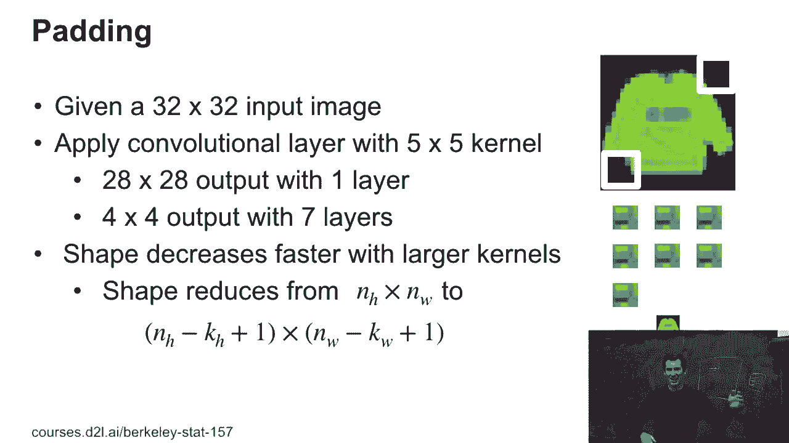
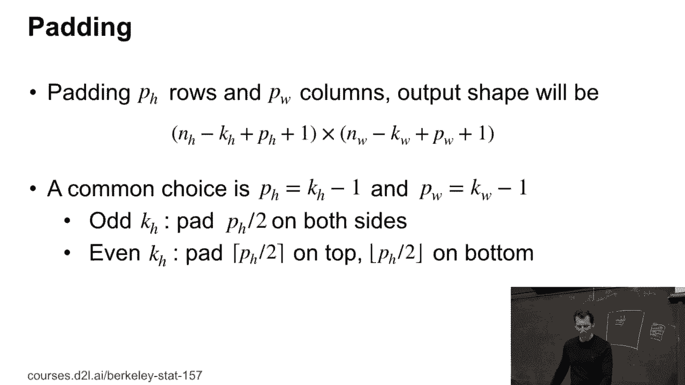
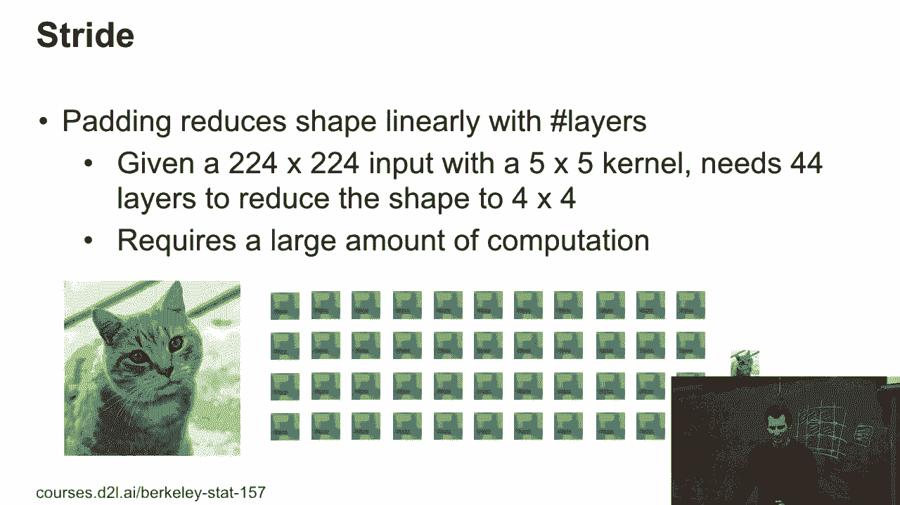

# 【AI 】伯克利深度学习Deep Learning UC Berkeley STAT-李沐 & Alex - P55：55. L11_4 Padding and Stride - Python小能 - BV1CB4y1U7P6

 Okay。 Padding and stride。 So remember， when we do this convolution， right， then， you know。

 our kernel scans over the image。 This is， you know， one of those infamous fashion， MNIST pullovers。

 right， pullovers because the German， data set and the German virtual sweeter is pullover。

 And so they translated it quite literally。 Yeah。 So， anyway， so you have， like。

 a 32 by 32 input image。 And you apply a convolutional with a 5 by 5 kernel。

 And you get a 28 by 28 output after one layer。 And after seven layers， you have a 4 by 4 output。

 And at that point， it's game over。 You can't convolve any further。 You're out of pixels。 So。

 in other words， your image keeps on shrinking with you。

 always in the peeling things away at the fringes。 And if you have a really large image， well。

 you know， you don't really care about maybe one or two pixels， of long friends， but after a while。

 you start running out， of pixels。 And if your convolutional kernel is large， this goes very quickly。

 So if you look at it， we have， you know， image height minus kernel height plus 1。

 Same thing for the width。 So what somebody is supposed to do in order to fix this， well。

 actually very easily， you just add zeros around the image。

 Like so。 And if you do that， you get the same size output as the input。 Just that in this case。

 well， you also sum over some garbage， data， which conveniently happen to be zero， so it's not quite。

 that bad， but， you know， it's one thing that you could do。 So in this case here， in the example。

 well， we actually have， a 3 by 3 image convolved with a 2 by 2 kernel。 And if I did this naively。

 well， I would get a 2 by 2 output。 Remember， that was the 1925， 37， and 43。

 But if I want to possibly even enlarge things， what I can do。

 is I can just pad it with zeros all around。 And then I get larger output。 Now。

 whether that larger output makes any sense， it's a different， question。

 but at least the shapes work out OK。 Any questions so far？ OK。 It's really simple stuff。

 but it can get you if you're not。

 careful。 So a couple of common things is you take square kernels and， then you take odd numbers。

 you basically take the height minus， 1， the floor of the-- well， height minus 1 divided by 2。

 correspondingly the width。 If I have a 3 by 3 kernel， then I pad by 1 pixel left and。

 right and bottom and top。 If I have a 5 by 5 kernel， well， I need two pixels on either。

 side and then things don't change shape。 And this will start to matter as we go and combine different。

 convolutions of the same image together。 So， for instance。

 there's this architecture called Inception。 And for that。

 this is vital because otherwise you won't be， able to， you know， pad things together。

 It just doesn't make any sense in terms of dimensionality。 Any questions？ So， let's go ahead。 So。

 let's go ahead。 So， let's go ahead and put this in。 So， let's go ahead and put this in。 So。

 let's go ahead and put this in。 So， let's go ahead and put this in。 So。

 let's go ahead and put this in。 So， let's go ahead and put this in。 So。

 let's go ahead and put this in。 So， let's go ahead and put this in。 So。

 let's go ahead and put this in。 So， let's go ahead and put this in。 So。

 let's go ahead and put this in。 So， let's go ahead and put this in。 So。

 let's go ahead and put this in。 So， let's go ahead and put this in。 So。

 let's go ahead and put this in。 Well， one reason is that those two-way two convolutions will change the size of the output。

 relative to the input。 Unless you do weird things with a padding。

 we only pad on one side rather than the other。 But that's really weird。 Okay。

 So， now， the next thing that we need is stride。 And so， in some cases。

 we actually want to reduce the mentionality。 What you can do there is you don't really compute all the entries。

 but you leave out， every second or maybe the second and the third or， you know。

 basically you have a stride of K， at which you subsample the matrix。 So。

 if you look at this matrix here， you might subsample only those entries。 Right。 Maybe these as well。

 You leave out everything else。 And this way， you can very quickly reduce the image-nality。

 There are other sometimes more elegant ways of doing that， namely in combination with pooling。

 where you may take the average or the maximum of adjacent pixels。 But at least with strides。

 you can also manipulate the size。 Okay。 Any other questions？ [ Inaudible ]， What they are？ Well。

 these are different filters。 So， as you move over， you get this smaller one。 Okay。

 Let's actually have a look。 Here's what happens。 We have like a stride of two and three。 And， yeah。

 you can see how this goes。 It's fairly straightforward and self-explanatory。

 So， now here's a little bit of slightly more detailed reasoning。 So， if you have， you know。

 certain stride， well， then what you do is， you use the， corresponding， you know。

 output size divided by the stride， and you take the， floor of the corresponding integers。 The floor。

 because， well， if there's not enough space left for another， jump， let's say， you know。

 the next row would be over there。 Well， that just doesn't make it。 So， you always run down。 Okay。

 So， the good thing is that most modern deep running frameworks， by now， actually use。

 automatic size and shape inference so you don't have to。 So。

 this sounds still kind of straightforward， but if you have maybe 50。

 layers and you change one layer， then all those changes will propagate through。

 the subsequent layers。 And so， it becomes ridiculously hard to write some code。 So， in the quote。

 old times when people， for instance， use cafe or whatever， cafe version one。

 then you might have had a situation where you actually would， have had to write some， maybe。

 Python code to generate a cafe definition script to， manipulate the various sizes。 So。

 you would have to write some scripting code to generate code to generate a， deep network。 By now。

 this is all automatic and you don't have to worry about it anymore。 So， last good。

 And that's it for the strides。