# P5：5. L1_5 Linear Algebra in Jupyter - Python小能 - BV1CB4y1U7P6

 Okay， after all this theory， let's actually see how this works in practice。

 Let's have a little bit of fun with linear algebra。 So these are Jupyter Notebooks。

 You can download them and play along exactly in the slide form of it。

 You can just view them as they are as notebooks。 If you want to look at them in slide form。

 you need the reveal plugin。 Anyway， the first thing we need to do is we need to import and de-array。

 Which is the and array data type of MXNet。

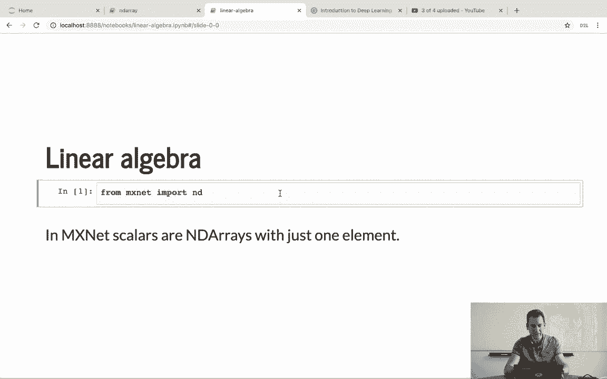

 So from MXNet， import and de- That's all you need。 Okay， so now that we've done this。

 let's actually create some of the most basic arrays。 Namely。

 I could just go and create the array with an entry to an entry 3。 And if I do this。

 I can add them together。 I can multiply them， I can divide them。

 or I can exponentiate them or anything else。 I could subtract them from each other。

 Let's say we do this。 Okay， let's say print X minus Y equals X minus Y。

 And now I get X minus Y and here lo and behold， the result is one。

 So behaves exactly as you would expect it。 I can print them。

 or I can go and convert them into scalers back into Python。 Now， if I do that。

 then I can continue working with them in Python land。 And if you need to do that， that's fine。

 It's just one caveat and that applies to essentially any deep learning framework。

 As soon as you go and convert from the framework to Python or the other direction。

 you need to handle the control to Python at least for some time。 Now。

 Python is particularly bad at multi-threading and multi-tasking。

 The result of that is that the code will anything that you might be doing on。

 maybe one multiple GPUs will come to a grinding halt while Python does its thing。

 And only then can you go back to doing things in parallel in the framework。

 So don't do this thing too often just occasionally。 In other words， if you have a large for looping。

 you do that every for loop in many， many thousands of millions of times。

 You will end up writing very inefficient code。 So don't do it。

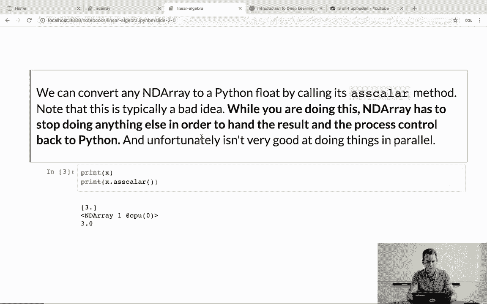

 Now vectors are， as you would expect it， just sequences in this case。 So scalars， so for instance。

 if we want to generate a vector that goes from 1 to 5， 1 to 0 to 4， well， we use a range。

 And I could， for instance， have different step sizes。 All of those can be easily adjusted。

 But in this case here， it's x equals indeed dot a range。 And that's it。

 I can index individual entries like x of 3， and。

 it does exactly what you would expect。 Now， one important thing is that you may want to look at the dimensionality and。

 the shape of a vector。 So the shape of a vector， for instance， is you could have like a matrix。

 maybe a 2 by 3 matrix。 And then the shape of that matrix would be 2 and 3。 But the length。

 or maybe 6 and 1， but the length is just a number of non-zero entries。 So if I call x shape。

 it'll just tell me the shape。 In this case， it's a vector with one dimension and there are five entries here。

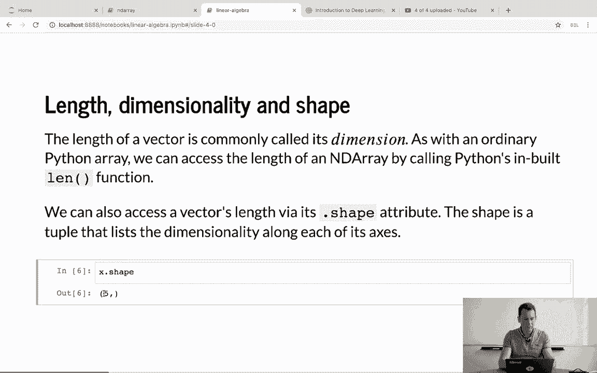

 Now， the other thing is you can go and multiply things。 You can add them together。 And by the way。

 in the future when we talk about arrays versus dimensions。

 we say that the arrays have different dimensions if they have different axis。

 but we just have an in-dimensional vector， then we mean a vector of length in。 And yeah。

 mind you can add things together。 So for instance， we have an array 1， 2， 3， another array 1， 10。

 20， 30。 If I add or multiply them， things work as we would expect it。

 Now matrices are just two-dimensional objects。

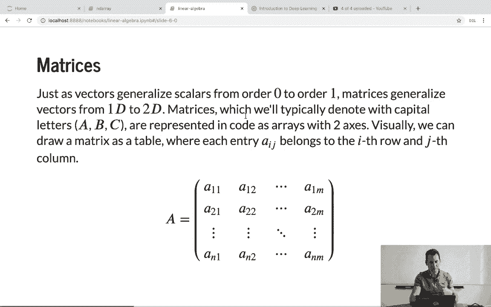

 Okay， so there we have it。 And I can go and create such an object。

 So let's say I maybe create a vector of length 10， or I create a vector of length 20。

 And then we shape it as 2 and 10， and they get that。 Pretty straightforward， right？

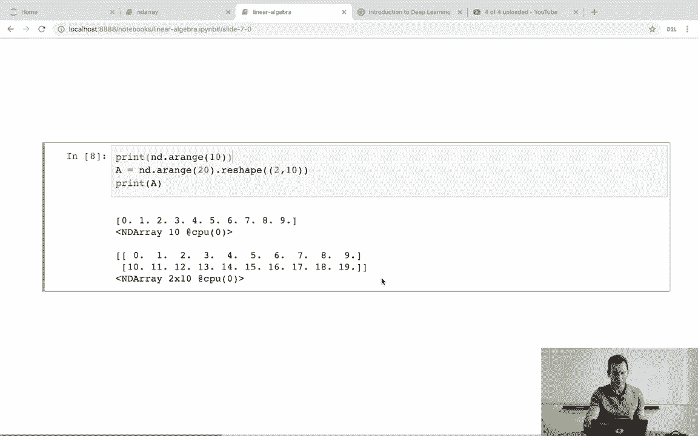

 Now you can look at the transpose of this。 And that's just a。t。 If I had。

 let's say a 10-dimensional just single vector， then it would be just the row。

 column vector appropriately， but otherwise it's just that。 Okay。

 Now tensors， well， we can go to three dimensions。 Let's say we have an object that's of size 2， 3。

 and 4 respectively， 2 times 3 times 4。 So we get 24。 So therefore， if I create 24 ints。

 going from 0 to 23， and arrange them in this way， I get this three-dimensional tensor。

 Now that's not too uncommon。 For instance， I get tensors if I deal with images。

 because in images I have width and height， and unless the image is black and white， I also have RGB。

 so I get three color channels。 Or if you have some fancy satellite。

 you might have multi-spectral sensing， so you might have an entire spectrogram per pixel。

 In this case， I wouldn't have only three dimensions for RGB， but maybe 20， 30， maybe 100。

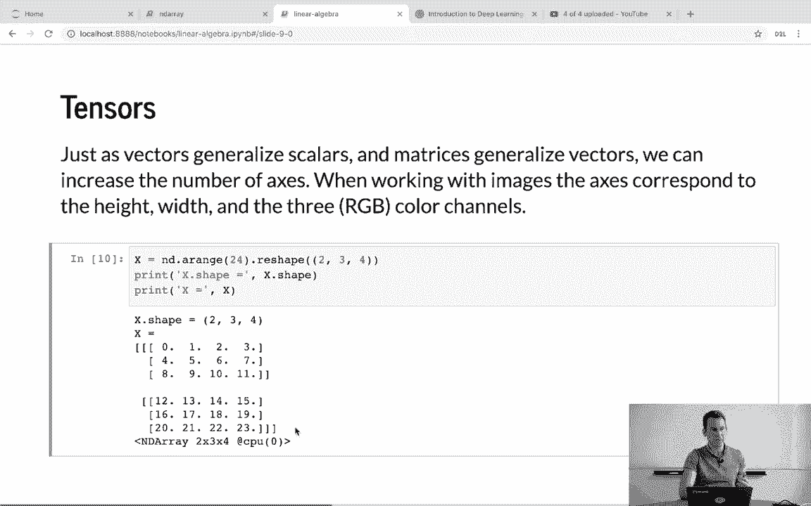

 Now you can do simple things with it， you can create， you know， series of ones， I can add them。

 I can multiply them， mind you， this， so A is a scalar。

 This really just multiplies every entry of A by 1 in the name， and y to 8。 Right？

 So it's quite straightforward and dimensions are all still the same。

 I can sum things， and I can compute。 So for instance， if I have a vector of ones， right。

 x is all one， one， one， one， and very unsurprisingly， if I compute sum of x， I get three。 Now。

 if I had say a two or three-dimensional object， then maybe I might want to sum over only some of the dimensions。

 in which case， let's try that x is in the A range of， okay， let's see， 12。 So if I do this， right。

 so it'll still， you know， give me 66 and just add some。

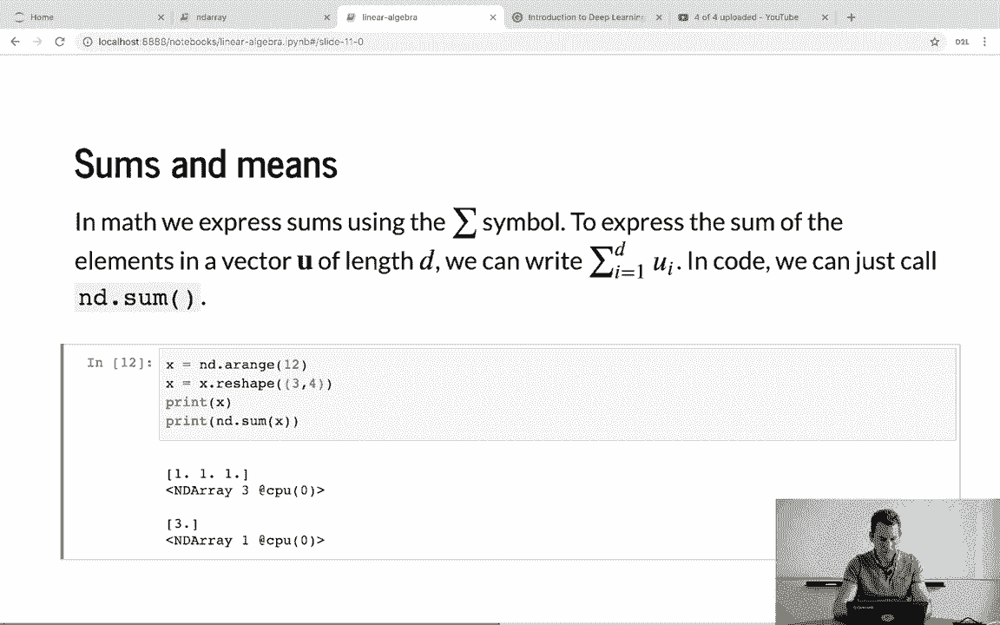

 But now if I wanted to compute a sum along the rows， columns， and see here you would get a row sum。

 Basically that's one means that it keeps， that it sums along dimension one。 If I had zero here。

 well， we'd get that， right？ And so I can define the appropriate sums as I want。

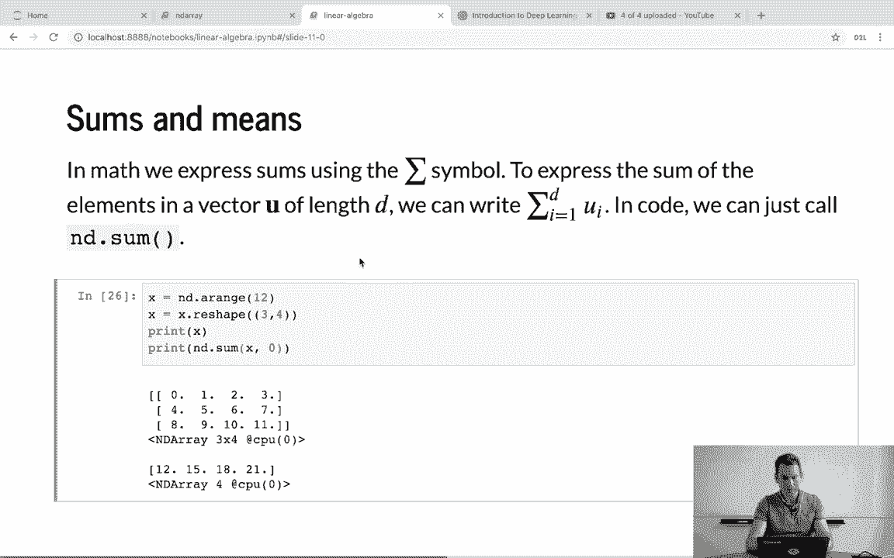

 So this is exactly what we had before。 Now， I can do interesting things like I can compute the mean of。

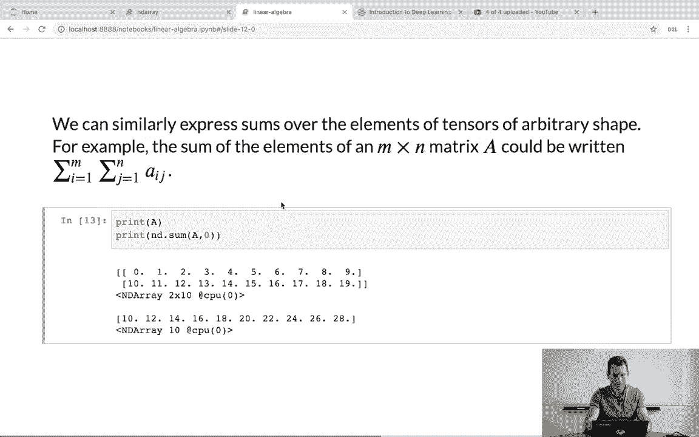

 let's say for instance a matrix and well， the mean is of course just a sum divided by the number of entries。

 And in the mean really doesn't do anything vertically special。

 but behind the scenes it just invokes in the sum and divides by the size。

 But since this is awkward to write all the time， it looks much prettier this way。

 and the array takes care of this for you。

 Now， life wouldn't be complete without dot products。 So if I have， let's say， x and y。

 and I want to compute the inner product， well， I can do that by just invoking nd。dot。

 And this doesn't do anything else but just pointwise multiply in sum。

 So if I wanted to find out how this looks like， I could perform print x times y。

 And I will get the same answer， right？ That's the element wise product between x and yi summed up。

 and I get 10。 This is exactly the same result as in the dot product。

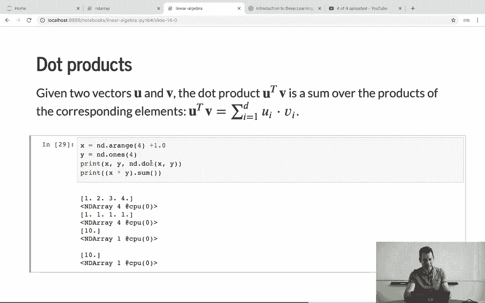

 And that's exactly what's on the slide too。

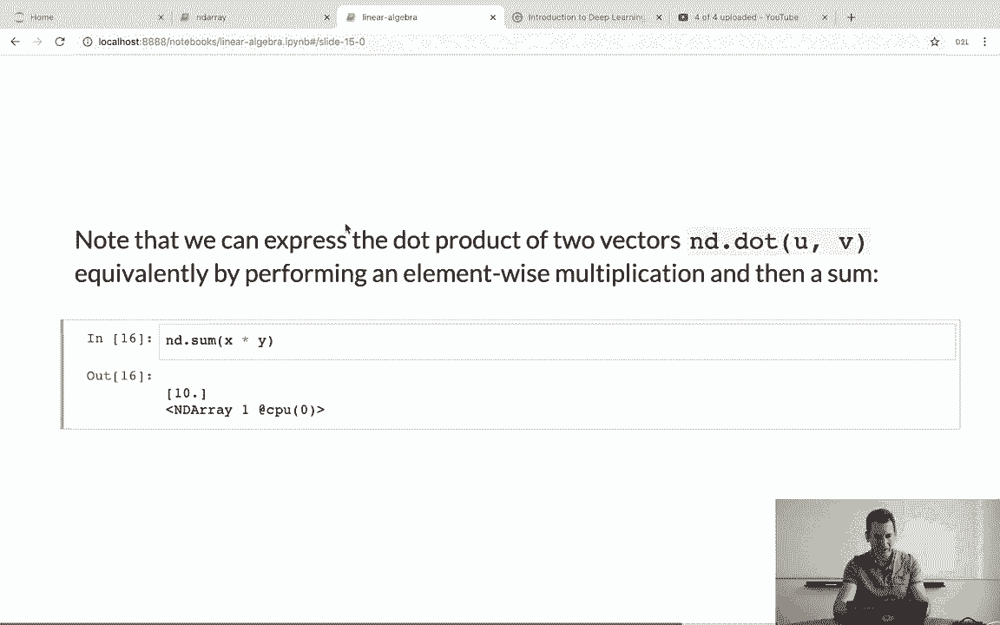

 Now， dot products are just a very simple case。

 Matrix vector product is where things get more exciting。 So if I have matrix vector。

 then that's really just inner， products between the x vector and the corresponding rows of a。

 So if I were to multiply a by x， well， I'd get this。 That's not very surprising because， yeah。 Now。

 an important caveat。 If you're used to MATLAB， you're probably used to thinking that a times x。

 means the matrix vector multiplication of a and x。 This is not the case。

 So what a times x means in MATLAB notation is dot star。 Now you might wonder， you know。

 why does this even， you know， why does this even compute， right？ Because after all。

 a is a 3 by 4 matrix and x is， you know， 4-dimensional vector。

 So how can I even get something meaningful out of it？ Well。

 it's very simple by something called broadcast， where you just repeat。

 the entries of x until you've gone through all the entries of a。 But it's point wise multiplication。

 So be careful of that because this can otherwise give you quite horrible bugs。

 if you're not used to it。 We're sticking to NumPy convention here。

 so it shouldn't be very surprising， if you're used to NumPy。

 But if you're coming straight from MATLAB land， be careful since this is a rich source of bugs for beginners。

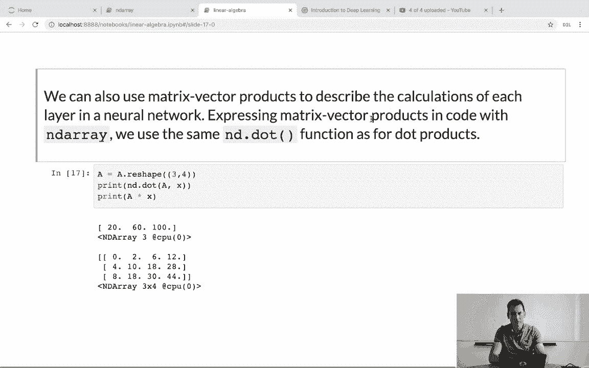

 OK， matrix multiplication。 Well， that's exactly what we had before。

 So now we have two objects。 And so if you think about it。

 that's really just like going through all the， rows of a and the columns of b taking inner products and writing them out in a table。

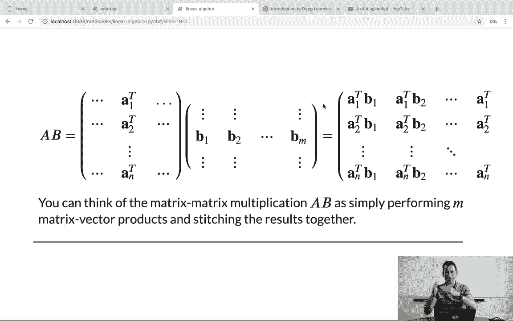

 So there we go。 nd dot between a and b。 Because one was a 3 by 4。 The other one is a 4 by 3 matrix。

 So very unsurprisingly， if I multiply them， I get a 3 by 3 matrix out of it。

 Last thing are norms。 And that's exactly what we discussed before。

 So they need to satisfy training and equality and so on。 And if we want to invoke the L2 norm。

 I just call nd dot norm。

 So nd dot norm of x， there we go。 Now if I want to compute the L1 norm， I could do this。

 I could just invoke nd dot sum， nd dot apps。 Or I could just invoke the norm with a different power。

 That would also work。 So apps is absolute value， as you would have already， suspected。

 and nd dot sum is what we did before。 And this ends our very。

 very brief introduction to linear algebra。 On MXNet， we'll look a lot more at the endear rate。

 data types in the following lecture。 But for now， I hope this gives you a bit of an idea of how to do linear algebra。

 in MXNet， and to see that it's fairly straightforward and not very difficult。 OK。

 thank you very much。

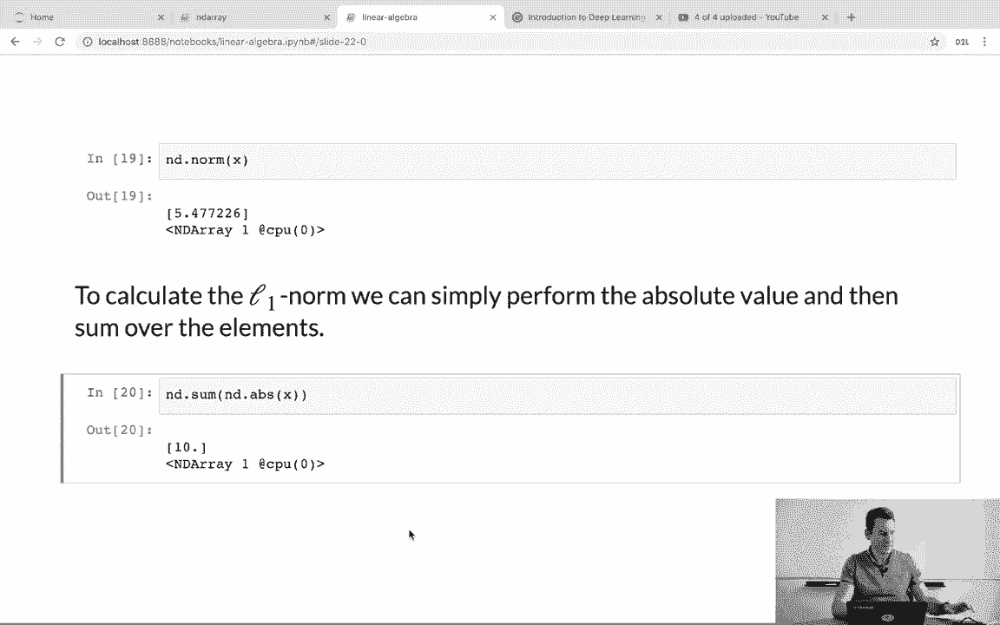