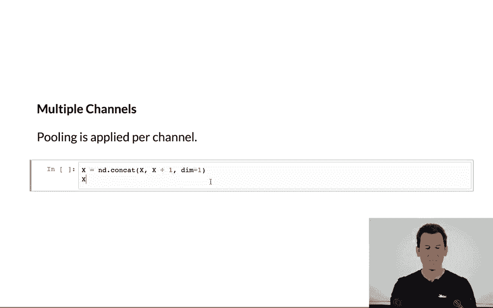

# P60：60. L11_9 Pooling in Python - Python小能 - BV1CB4y1U7P6

 Let's have a look at how pooling works in practice。

 So the first thing we need to do is we need to actually define our pooling function。 It's very easy。

 Okay， we need to import MXNet。 The next thing is we define our pooling function。

 The important argument is the pool size， so I'm going to get the height and the width。

 by querying the pool size。 And I'm going to distinguish between maximum and average pooling。

 Default is a max pooling。 First thing I need to do is I need to allocate some memory。

 That is of the size that I'm going to get by performing pooling over the input X。

 So I need X shape minus pooling height plus one， the same thing for the width。

 So it's exactly the same semantics as what we have for convolutions。

 just that we don't have any parameters。 And then I just iterate over all the pixels in the output。

 So for iron j in the range of Y， I now perform the following operation。

 Yij is the maximum over this patch here。 This patch goes from i to i plus 8 pH and from j to j plus pw。

 And if I were to use mean pooling， well， I'd do this。

 Now this is a very poor implementation of pooling because it completely ignores channels。

 And it also ignores padding and strides。 But since this is just for illustrative purposes。

 I'm going to skip this here。

 So let's have a look at what happens。 So we're going to apply 2x2 max pooling to this matrix which has entry 0 to 8。

 And of course， if I have the first 2x2 block， then well， that's exactly the maximum is 4。

 because it has entry 0， 1， 3 and 4， and so on。 Now if I were to perform average pooling， well。

 let's get something very similar。

 So for this first block here 0， 1， 3 and 4， the sum overall the entry is 8。 8 divided by 4 is 2。

 If I were to take those entries 1， 2， 4 and 5， the sum of those entries is 12， and so I get 3。

 and so on。 So that's good。 Let's have a look at how things progress if we do something a little bit more fancy。

 The next thing is we might want to look at padding and stride。

 So I'm going to create a matrix that's 4x4 with entries ranging from 0 to 15。 Now。

 if I perform max pooling and I use the built-in functioning glue-on。

 then by default if I have a 3x3 pooling， then the stride is also 3。

 so therefore if I apply this 4x4 matrix， there's really only that first 3x3 block that I can grab。

 So the output is going to be 1x1。

 And behold， that's exactly what happens。 Mind you， the entry is 10， because well。

 the largest entry in that first 3x3 block is 10。 Okay。

 Now， let's say I want to actually change this。

 Well， I could for instance have padding of 1 and stride of 2， in which case。

 well because I have 3x3 applied to a 4x4， so that's actually a 6x6。 But then with a stride of 2。

 that gives me a 2x2 matrix as a result。 I could have arbitrary windows with different widths and different heights and different padding and different strides。

 And I'll leave that to anybody to verify in their own piece and quiet that the result would actually be a 3x2 matrix。

 So 3 rows， 2 columns。 And yeah， so I can do that and therefore reshape the result in arbitrary ways。

 Mind you， the number of input and output channels remains unchanged。

 So let's do that。 So I'm going to create a matrix that has， well， 3， well， it has 2 channels。

 Right， so that's basically my 4x4 matrix just that in one case I have the entries going from 0 to 15。

 the next case from 1 to 16。

 Okay， so now if I were to apply pulling again， so padding of 1 strides of 2， 3x3 pulling。

 I still get to output channels。

 And since the second channel has all the entries 1 large as in the first one， well， I get exactly 5。

 7， 13 and 15， and then for the next 1， 6， 8， 14 and 16。 That's exactly what's to be expected。

 So as you can see， pulling is a very easy operation。 It's straightforward to apply。

 And it can be used to manipulate the dimensionality of the images in order to reduce their size as needed。

 This concludes our conversation about convolutional layers。

